# `cleaning.py` flowcharts

- Sequence/exported functions: 7
- Support/helper functions: 6

## Sequence/exported functions

### `clean_portafilter`

Keep approach/mount live, cache only the post-mount motion sequence.

- **Mermaid file:** [../mermaid/cleaning/clean_portafilter.mmd](../mermaid/cleaning/clean_portafilter.mmd)
- **Parameter scenarios observed:** `espresso`, `port`
- **Branch/decision scenarios:**
  - `shot_cfg and shot_cfg.get("angled")`
  - `not ok(run_skill("gotoJ_deg", *CLEANING_POSES['pre_clean_home']))`
  - `not ok(run_skill("approach_machine", "portafilter_cleaner", "hard_brush"))`
  - `not ok(run_skill("gotoJ_deg", *CLEANING_PARAMS['hard_brush_adjust']))`
  - `not ok(run_skill("mount_machine", "portafilter_cleaner", "hard_brush"))`
  - `hard_cached`
  - `not ok(run_skill("approach_machine", "portafilter_cleaner", "soft_brush"))`
  - `not ok(run_skill("mount_machine", "portafilter_cleaner", "soft_brush"))`
  - `soft_cached`
  - `not ok(run_skill("gotoJ_deg", *ESPRESSO_GRINDER_HOME))`
  - `len(hard_cached) != 5`
  - `not ok(run_skill("sync"))`
  - `not ok(run_skill("gotoJ_deg", *hard_cached[0]))`
  - `not ok(run_skill("gotoJ_deg", *hard_cached[1]))`
  - `not ok(run_skill("sync"))`
  - `not ok(run_skill("gotoJ_deg", *hard_cached[2]))`
  - `not ok(run_skill("sync"))`
  - `not ok(run_skill("gotoJ_deg", *hard_cached[3]))`
  - `not ok(run_skill("sync"))`
  - `not ok(run_skill("gotoJ_deg", *hard_cached[4]))`
  - `not ok(run_skill("moveEE_movJ", 0, 0, 50, 0, 0, 0))`
  - `not _capture_and_cache_current_angles(hard_capture)`
  - `not ok(run_skill("moveEE_movJ", 0, 0, -30, -2.5, 0, 0))`
  - `not _capture_and_cache_current_angles(hard_capture)`
  - `not ok(run_skill("moveEE_movJ", -7.5, 7.5, 0, 0, 0, 0))`
  - ... 27 more in source/chart

```mermaid
flowchart TD
  N0(["START clean_portafilter(**params)"])
  N1["Parameter/normalization: espresso_dict = params.get('espresso')"]
  N2["Parameter/normalization: shot_cfg = _normalize_espresso_shot(espresso_dict)"]
  N3{"IF shot_cfg and shot_cfg.get('angled')?"}
  N4(["RETURN angled_clean_portafilter(**params)"])
  N5["Parameter/normalization: port = params.get('port') or (shot_cfg.get('port') if shot_cfg else DEFAULT_PORT)"]
  N6["Nested helper defined: ok()"]
  N7["State/cache: hard_cached = _hard_brush_clean_cache.get(port)"]
  N8["State/cache: soft_cached = _soft_brush_clean_cache.get(port)"]
  N9{"IF not ok(run_skill('gotoJ_deg', *CLEANING_POSES('pre_clean_home')))?"}
  N10(["RETURN _fail()"])
  N11{"IF not ok(run_skill('approach_machine', 'portafilter_cleaner', 'hard_brush'))?"}
  N12(["RETURN _fail()"])
  N13{"IF not ok(run_skill('gotoJ_deg', *CLEANING_PARAMS('hard_brush_adjust')))?"}
  N14(["RETURN _fail()"])
  N15{"IF not ok(run_skill('mount_machine', 'portafilter_cleaner', 'hard_brush'))?"}
  N16(["RETURN _fail()"])
  N17{"IF hard_cached?"}
  N18["Call: _trace_step('CLEANING', f'hard brush cache HIT port=(port) len=(len(hard_cached))')"]
  N19{"IF len(hard_cached) != 5?"}
  N20(["RETURN _fail()"])
  N21{"IF not ok(run_skill('sync'))?"}
  N22(["RETURN _fail()"])
  N23{"IF not ok(run_skill('gotoJ_deg', *hard_cached(0)))?"}
  N24(["RETURN _fail()"])
  N25{"IF not ok(run_skill('gotoJ_deg', *hard_cached(1)))?"}
  N26(["RETURN _fail()"])
  N27{"IF not ok(run_skill('sync'))?"}
  N28(["RETURN _fail()"])
  N29{"IF not ok(run_skill('gotoJ_deg', *hard_cached(2)))?"}
  N30(["RETURN _fail()"])
  N31{"IF not ok(run_skill('sync'))?"}
  N32(["RETURN _fail()"])
  N33{"IF not ok(run_skill('gotoJ_deg', *hard_cached(3)))?"}
  N34(["RETURN _fail()"])
  N35{"IF not ok(run_skill('sync'))?"}
  N36(["RETURN _fail()"])
  N37{"IF not ok(run_skill('gotoJ_deg', *hard_cached(4)))?"}
  N38(["RETURN _fail()"])
  N39["Call: _trace_step('CLEANING', f'hard brush cache MISS port=(port); recording live sequence')"]
  N40{"IF not ok(run_skill('moveEE_movJ', 0, 0, 50, 0, 0, 0))?"}
  N41(["RETURN _fail()"])
  N42{"IF not _capture_and_cache_current_angles(hard_capture)?"}
  N43(["RETURN _fail()"])
  N44{"IF not ok(run_skill('moveEE_movJ', 0, 0, -30, -2.5, 0, 0))?"}
  N45(["RETURN _fail()"])
  N46{"IF not _capture_and_cache_current_angles(hard_capture)?"}
  N47(["RETURN _fail()"])
  N48{"IF not ok(run_skill('moveEE_movJ', -7.5, 7.5, 0, 0, 0, 0))?"}
  N49(["RETURN _fail()"])
  N50{"IF not _capture_and_cache_current_angles(hard_capture)?"}
  N51(["RETURN _fail()"])
  N52{"IF not ok(run_skill('moveEE_movJ', 15.0, -15.0, 0, 0, 0, 0))?"}
  N53(["RETURN _fail()"])
  N54{"IF not _capture_and_cache_current_angles(hard_capture)?"}
  N55(["RETURN _fail()"])
  N56{"IF not ok(run_skill('moveEE_movJ', *CLEANING_PARAMS('retreat_hard')))?"}
  N57(["RETURN _fail()"])
  N58{"IF not _capture_and_cache_current_angles(hard_capture)?"}
  N59(["RETURN _fail()"])
  N60["State/cache: _hard_brush_clean_cache(port) = hard_capture"]
  N61{"IF not ok(run_skill('approach_machine', 'portafilter_cleaner', 'soft_brush'))?"}
  N62(["RETURN _fail()"])
  N63{"IF not ok(run_skill('mount_machine', 'portafilter_cleaner', 'soft_brush'))?"}
  N64(["RETURN _fail()"])
  N65{"IF soft_cached?"}
  N66["Call: _trace_step('CLEANING', f'soft brush cache HIT port=(port) len=(len(soft_cached))')"]
  N67{"IF len(soft_cached) != 6?"}
  N68(["RETURN _fail()"])
  N69{"IF not ok(run_skill('sync'))?"}
  N70(["RETURN _fail()"])
  N71{"IF not ok(run_skill('gotoJ_deg', *soft_cached(0)))?"}
  N72(["RETURN _fail()"])
  N73{"IF not ok(run_skill('gotoJ_deg', *soft_cached(1)))?"}
  N74(["RETURN _fail()"])
  N75{"IF not ok(run_skill('sync'))?"}
  N76(["RETURN _fail()"])
  N77{"IF not ok(run_skill('gotoJ_deg', *soft_cached(2)))?"}
  N78(["RETURN _fail()"])
  N79{"IF not ok(run_skill('sync'))?"}
  N80(["RETURN _fail()"])
  N81{"IF not ok(run_skill('gotoJ_deg', *soft_cached(3)))?"}
  N82(["RETURN _fail()"])
  N83{"IF not ok(run_skill('gotoJ_deg', *soft_cached(4)))?"}
  N84(["RETURN _fail()"])
  N85{"IF not ok(run_skill('gotoJ_deg', *soft_cached(5)))?"}
  N86(["RETURN _fail()"])
  N87["Call: _trace_step('CLEANING', f'soft brush cache MISS port=(port); recording live sequence')"]
  N88{"IF not ok(run_skill('moveEE_movJ', 0, 0, 50, 0, 0, 0))?"}
  N89(["RETURN _fail()"])
  N90["... diagram capped for readability; source has additional low-level steps"]
  N91["... diagram capped for readability; source has additional low-level steps"]
  N92(["END clean_portafilter"])
  N0 --> N1
  N1 --> N2
  N2 --> N3
  N3 -- "yes" --> N4
  N3 --> N5
  N5 --> N6
  N6 --> N7
  N7 --> N8
  N8 --> N9
  N9 -- "yes" --> N10
  N9 --> N11
  N11 -- "yes" --> N12
  N11 --> N13
  N13 -- "yes" --> N14
  N13 --> N15
  N15 -- "yes" --> N16
  N15 --> N17
  N17 -- "yes" --> N18
  N18 --> N19
  N19 -- "yes" --> N20
  N19 --> N21
  N21 -- "yes" --> N22
  N21 --> N23
  N23 -- "yes" --> N24
  N23 --> N25
  N25 -- "yes" --> N26
  N25 --> N27
  N27 -- "yes" --> N28
  N27 --> N29
  N29 -- "yes" --> N30
  N29 --> N31
  N31 -- "yes" --> N32
  N31 --> N33
  N33 -- "yes" --> N34
  N33 --> N35
  N35 -- "yes" --> N36
  N35 --> N37
  N37 -- "yes" --> N38
  N17 -- "no" --> N39
  N39 --> N40
  N40 -- "yes" --> N41
  N40 --> N42
  N42 -- "yes" --> N43
  N42 --> N44
  N44 -- "yes" --> N45
  N44 --> N46
  N46 -- "yes" --> N47
  N46 --> N48
  N48 -- "yes" --> N49
  N48 --> N50
  N50 -- "yes" --> N51
  N50 --> N52
  N52 -- "yes" --> N53
  N52 --> N54
  N54 -- "yes" --> N55
  N54 --> N56
  N56 -- "yes" --> N57
  N56 --> N58
  N58 -- "yes" --> N59
  N58 --> N60
  N37 --> N61
  N60 --> N61
  N61 -- "yes" --> N62
  N61 --> N63
  N63 -- "yes" --> N64
  N63 --> N65
  N65 -- "yes" --> N66
  N66 --> N67
  N67 -- "yes" --> N68
  N67 --> N69
  N69 -- "yes" --> N70
  N69 --> N71
  N71 -- "yes" --> N72
  N71 --> N73
  N73 -- "yes" --> N74
  N73 --> N75
  N75 -- "yes" --> N76
  N75 --> N77
  N77 -- "yes" --> N78
  N77 --> N79
  N79 -- "yes" --> N80
  N79 --> N81
  N81 -- "yes" --> N82
  N81 --> N83
  N83 -- "yes" --> N84
  N83 --> N85
  N85 -- "yes" --> N86
  N65 -- "no" --> N87
  N87 --> N88
  N88 -- "yes" --> N89
  N88 --> N90
  N85 --> N91
  N90 --> N91
  N91 --> N92
```

### `invalidate_cleaning_cache`

- **Mermaid file:** [../mermaid/cleaning/invalidate_cleaning_cache.mmd](../mermaid/cleaning/invalidate_cleaning_cache.mmd)
- **Parameter scenarios observed:** none directly read

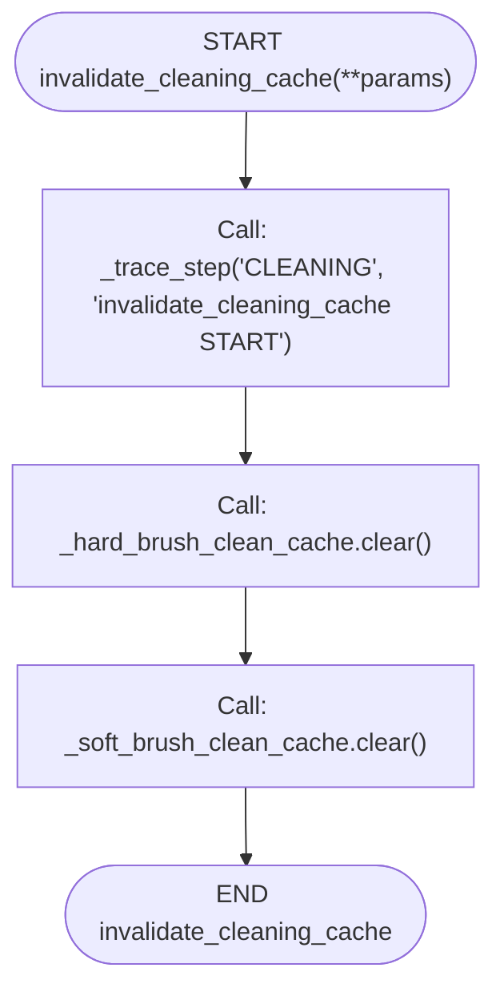

### `angled_clean_portafilter`

Keep approach/mount live, cache only the post-mount motion sequence.

- **Mermaid file:** [../mermaid/cleaning/angled_clean_portafilter.mmd](../mermaid/cleaning/angled_clean_portafilter.mmd)
- **Parameter scenarios observed:** `espresso`, `port`
- **Branch/decision scenarios:**
  - `not ok(run_skill("gotoJ_deg", *CLEANING_POSES['pre_clean_home']))`
  - `not ok(run_skill("approach_machine", "portafilter_cleaner", "angled_hard_brush"))`
  - `not ok(run_skill("gotoJ_deg", *CLEANING_PARAMS['hard_brush_adjust']))`
  - `not ok(run_skill("mount_machine", "portafilter_cleaner", "angled_hard_brush"))`
  - `hard_cached`
  - `not ok(run_skill("approach_machine", "portafilter_cleaner", "angled_soft_brush"))`
  - `not ok(run_skill("mount_machine", "portafilter_cleaner", "angled_soft_brush"))`
  - `soft_cached`
  - `not ok(run_skill("gotoJ_deg", *ESPRESSO_GRINDER_HOME))`
  - `len(hard_cached) != 4`
  - `not ok(run_skill("sync"))`
  - `not ok(run_skill("gotoJ_deg", *hard_cached[0]))`
  - `not ok(run_skill("gotoJ_deg", *hard_cached[1]))`
  - `not ok(run_skill("gotoJ_deg", *hard_cached[2]))`
  - `not ok(run_skill("sync"))`
  - `not ok(run_skill("gotoJ_deg", *hard_cached[3]))`
  - `not ok(run_skill("moveEE_movJ", 0, 0, 50, 0, 0, 0))`
  - `not angled_cleaning_capture_current_angles(hard_capture)`
  - `not ok(run_skill("moveEE_movJ", 0, 0, -37.5, -2.5, 0, 0))`
  - `not angled_cleaning_capture_current_angles(hard_capture)`
  - `not ok(run_skill("moveEE_movJ", 0, 0, -7.5, 0, 0, 0))`
  - `not angled_cleaning_capture_current_angles(hard_capture)`
  - `not ok(run_skill("moveEE_movJ", *CLEANING_PARAMS['retreat_hard']))`
  - `not angled_cleaning_capture_current_angles(hard_capture)`
  - `len(soft_cached) != 4`
  - ... 14 more in source/chart

```mermaid
flowchart TD
  N0(["START angled_clean_portafilter(**params)"])
  N1["Parameter/normalization: espresso_dict = params.get('espresso')"]
  N2["Parameter/normalization: shot_cfg = angled__normalize_espresso_shot(espresso_dict)"]
  N3["Parameter/normalization: port = params.get('port') or (shot_cfg.get('port') if shot_cfg else DEFAULT_PORT)"]
  N4["Nested helper defined: ok()"]
  N5["State/cache: hard_cached = angled__hard_brush_clean_cache.get(port)"]
  N6["State/cache: soft_cached = angled__soft_brush_clean_cache.get(port)"]
  N7{"IF not ok(run_skill('gotoJ_deg', *CLEANING_POSES('pre_clean_home')))?"}
  N8(["RETURN _fail()"])
  N9{"IF not ok(run_skill('approach_machine', 'portafilter_cleaner', 'angled_hard_brush'))?"}
  N10(["RETURN _fail()"])
  N11{"IF not ok(run_skill('gotoJ_deg', *CLEANING_PARAMS('hard_brush_adjust')))?"}
  N12(["RETURN _fail()"])
  N13{"IF not ok(run_skill('mount_machine', 'portafilter_cleaner', 'angled_hard_brush'))?"}
  N14(["RETURN _fail()"])
  N15{"IF hard_cached?"}
  N16["Call: _trace_step('CLEANING', f'hard brush cache HIT port=(port) len=(len(hard_cached))')"]
  N17{"IF len(hard_cached) != 4?"}
  N18(["RETURN _fail()"])
  N19{"IF not ok(run_skill('sync'))?"}
  N20(["RETURN _fail()"])
  N21{"IF not ok(run_skill('gotoJ_deg', *hard_cached(0)))?"}
  N22(["RETURN _fail()"])
  N23{"IF not ok(run_skill('gotoJ_deg', *hard_cached(1)))?"}
  N24(["RETURN _fail()"])
  N25{"IF not ok(run_skill('gotoJ_deg', *hard_cached(2)))?"}
  N26(["RETURN _fail()"])
  N27{"IF not ok(run_skill('sync'))?"}
  N28(["RETURN _fail()"])
  N29{"IF not ok(run_skill('gotoJ_deg', *hard_cached(3)))?"}
  N30(["RETURN _fail()"])
  N31["Call: _trace_step('CLEANING', f'hard brush cache MISS port=(port); recording live sequence')"]
  N32{"IF not ok(run_skill('moveEE_movJ', 0, 0, 50, 0, 0, 0))?"}
  N33(["RETURN _fail()"])
  N34{"IF not angled_cleaning_capture_current_angles(hard_capture)?"}
  N35(["RETURN _fail()"])
  N36{"IF not ok(run_skill('moveEE_movJ', 0, 0, -37.5, -2.5, 0, 0))?"}
  N37(["RETURN _fail()"])
  N38{"IF not angled_cleaning_capture_current_angles(hard_capture)?"}
  N39(["RETURN _fail()"])
  N40{"IF not ok(run_skill('moveEE_movJ', 0, 0, -7.5, 0, 0, 0))?"}
  N41(["RETURN _fail()"])
  N42{"IF not angled_cleaning_capture_current_angles(hard_capture)?"}
  N43(["RETURN _fail()"])
  N44{"IF not ok(run_skill('moveEE_movJ', *CLEANING_PARAMS('retreat_hard')))?"}
  N45(["RETURN _fail()"])
  N46{"IF not angled_cleaning_capture_current_angles(hard_capture)?"}
  N47(["RETURN _fail()"])
  N48["State/cache: angled__hard_brush_clean_cache(port) = hard_capture"]
  N49{"IF not ok(run_skill('approach_machine', 'portafilter_cleaner', 'angled_soft_brush'))?"}
  N50(["RETURN _fail()"])
  N51{"IF not ok(run_skill('mount_machine', 'portafilter_cleaner', 'angled_soft_brush'))?"}
  N52(["RETURN _fail()"])
  N53{"IF soft_cached?"}
  N54["Call: _trace_step('CLEANING', f'soft brush cache HIT port=(port) len=(len(soft_cached))')"]
  N55{"IF len(soft_cached) != 4?"}
  N56(["RETURN _fail()"])
  N57{"IF not ok(run_skill('sync'))?"}
  N58(["RETURN _fail()"])
  N59{"IF not ok(run_skill('gotoJ_deg', *soft_cached(0)))?"}
  N60(["RETURN _fail()"])
  N61{"IF not ok(run_skill('gotoJ_deg', *soft_cached(1)))?"}
  N62(["RETURN _fail()"])
  N63{"IF not ok(run_skill('gotoJ_deg', *soft_cached(2)))?"}
  N64(["RETURN _fail()"])
  N65{"IF not ok(run_skill('sync'))?"}
  N66(["RETURN _fail()"])
  N67{"IF not ok(run_skill('gotoJ_deg', *soft_cached(3)))?"}
  N68(["RETURN _fail()"])
  N69["Call: _trace_step('CLEANING', f'soft brush cache MISS port=(port); recording live sequence')"]
  N70{"IF not ok(run_skill('moveEE_movJ', 0, 0, 50, 0, 0, 0))?"}
  N71(["RETURN _fail()"])
  N72{"IF not angled_cleaning_capture_current_angles(soft_capture)?"}
  N73(["RETURN _fail()"])
  N74{"IF not ok(run_skill('moveEE_movJ', 0, 0, -37.5, -2.5, 0, 0))?"}
  N75(["RETURN _fail()"])
  N76{"IF not angled_cleaning_capture_current_angles(soft_capture)?"}
  N77(["RETURN _fail()"])
  N78{"IF not ok(run_skill('moveEE_movJ', 0, 0, -7.5, 0, 0, 0))?"}
  N79(["RETURN _fail()"])
  N80{"IF not angled_cleaning_capture_current_angles(soft_capture)?"}
  N81(["RETURN _fail()"])
  N82{"IF not ok(run_skill('moveEE_movJ', *CLEANING_PARAMS('retreat_soft')))?"}
  N83(["RETURN _fail()"])
  N84{"IF not angled_cleaning_capture_current_angles(soft_capture)?"}
  N85(["RETURN _fail()"])
  N86["State/cache: angled__soft_brush_clean_cache(port) = soft_capture"]
  N87{"IF not ok(run_skill('gotoJ_deg', *ESPRESSO_GRINDER_HOME))?"}
  N88(["RETURN _fail()"])
  N89(["RETURN True"])
  N90(["END angled_clean_portafilter"])
  N0 --> N1
  N1 --> N2
  N2 --> N3
  N3 --> N4
  N4 --> N5
  N5 --> N6
  N6 --> N7
  N7 -- "yes" --> N8
  N7 --> N9
  N9 -- "yes" --> N10
  N9 --> N11
  N11 -- "yes" --> N12
  N11 --> N13
  N13 -- "yes" --> N14
  N13 --> N15
  N15 -- "yes" --> N16
  N16 --> N17
  N17 -- "yes" --> N18
  N17 --> N19
  N19 -- "yes" --> N20
  N19 --> N21
  N21 -- "yes" --> N22
  N21 --> N23
  N23 -- "yes" --> N24
  N23 --> N25
  N25 -- "yes" --> N26
  N25 --> N27
  N27 -- "yes" --> N28
  N27 --> N29
  N29 -- "yes" --> N30
  N15 -- "no" --> N31
  N31 --> N32
  N32 -- "yes" --> N33
  N32 --> N34
  N34 -- "yes" --> N35
  N34 --> N36
  N36 -- "yes" --> N37
  N36 --> N38
  N38 -- "yes" --> N39
  N38 --> N40
  N40 -- "yes" --> N41
  N40 --> N42
  N42 -- "yes" --> N43
  N42 --> N44
  N44 -- "yes" --> N45
  N44 --> N46
  N46 -- "yes" --> N47
  N46 --> N48
  N29 --> N49
  N48 --> N49
  N49 -- "yes" --> N50
  N49 --> N51
  N51 -- "yes" --> N52
  N51 --> N53
  N53 -- "yes" --> N54
  N54 --> N55
  N55 -- "yes" --> N56
  N55 --> N57
  N57 -- "yes" --> N58
  N57 --> N59
  N59 -- "yes" --> N60
  N59 --> N61
  N61 -- "yes" --> N62
  N61 --> N63
  N63 -- "yes" --> N64
  N63 --> N65
  N65 -- "yes" --> N66
  N65 --> N67
  N67 -- "yes" --> N68
  N53 -- "no" --> N69
  N69 --> N70
  N70 -- "yes" --> N71
  N70 --> N72
  N72 -- "yes" --> N73
  N72 --> N74
  N74 -- "yes" --> N75
  N74 --> N76
  N76 -- "yes" --> N77
  N76 --> N78
  N78 -- "yes" --> N79
  N78 --> N80
  N80 -- "yes" --> N81
  N80 --> N82
  N82 -- "yes" --> N83
  N82 --> N84
  N84 -- "yes" --> N85
  N84 --> N86
  N67 --> N87
  N86 --> N87
  N87 -- "yes" --> N88
  N87 --> N89
  N0 --> N90
```

### `angled_invalidate_cleaning_cache`

- **Mermaid file:** [../mermaid/cleaning/angled_invalidate_cleaning_cache.mmd](../mermaid/cleaning/angled_invalidate_cleaning_cache.mmd)
- **Parameter scenarios observed:** none directly read

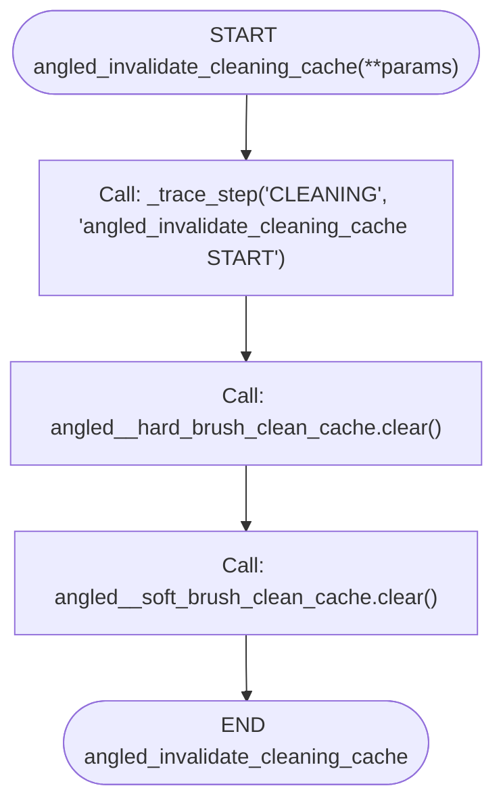

### `clean_portafilter_single`

- **Mermaid file:** [../mermaid/cleaning/clean_portafilter_single.mmd](../mermaid/cleaning/clean_portafilter_single.mmd)
- **Parameter scenarios observed:** none directly read

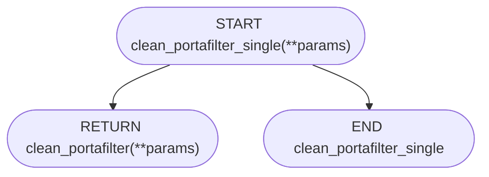

### `angled_clean_portafilter_single`

- **Mermaid file:** [../mermaid/cleaning/angled_clean_portafilter_single.mmd](../mermaid/cleaning/angled_clean_portafilter_single.mmd)
- **Parameter scenarios observed:** none directly read

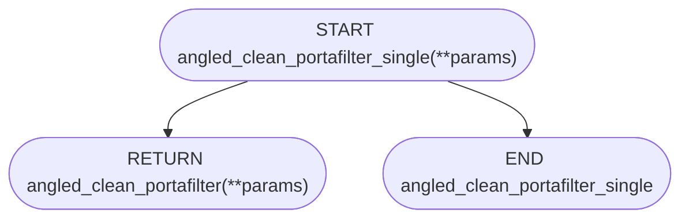

### `angled_clean_portafilter_double`

- **Mermaid file:** [../mermaid/cleaning/angled_clean_portafilter_double.mmd](../mermaid/cleaning/angled_clean_portafilter_double.mmd)
- **Parameter scenarios observed:** none directly read

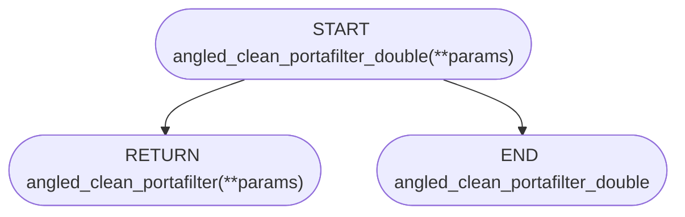

## Support/helper functions

### `run_skill`

Trace wrapper around manipulate_node.run_skill.

- **Mermaid file:** [../mermaid/cleaning/run_skill.mmd](../mermaid/cleaning/run_skill.mmd)
- **Parameter scenarios observed:** none directly read

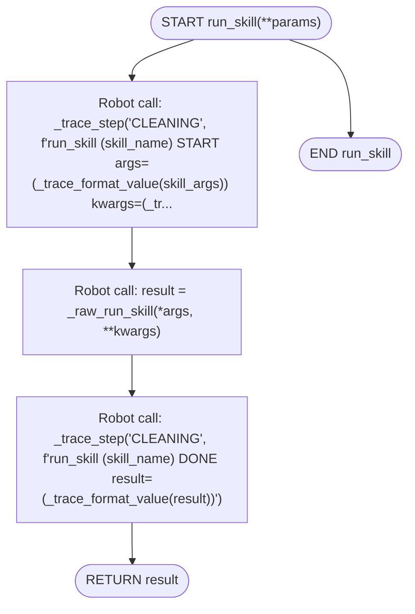

### `_is_valid_angles`

- **Mermaid file:** [../mermaid/cleaning/_is_valid_angles.mmd](../mermaid/cleaning/_is_valid_angles.mmd)
- **Parameter scenarios observed:** none directly read

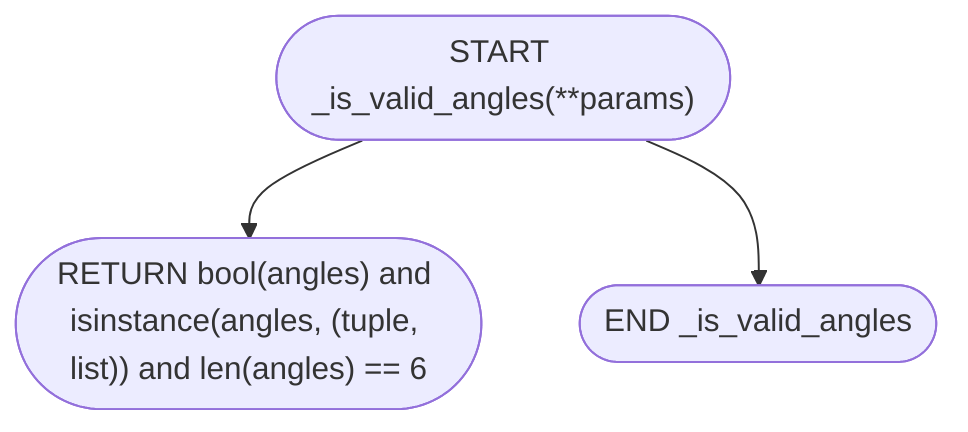

### `_capture_and_cache_current_angles`

- **Mermaid file:** [../mermaid/cleaning/_capture_and_cache_current_angles.mmd](../mermaid/cleaning/_capture_and_cache_current_angles.mmd)
- **Parameter scenarios observed:** none directly read
- **Branch/decision scenarios:**
  - `not _is_valid_angles(angles)`

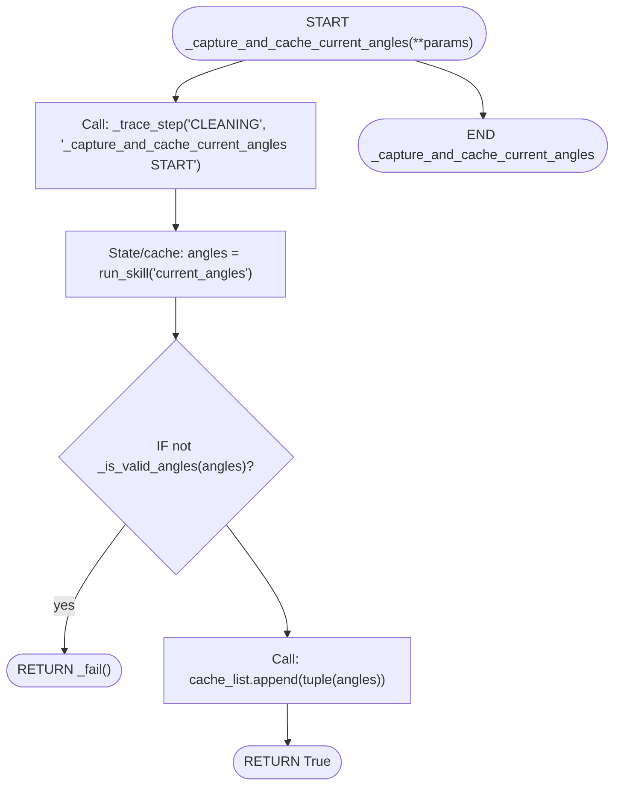

### `clean_portafilter_double`

- **Mermaid file:** [../mermaid/cleaning/clean_portafilter_double.mmd](../mermaid/cleaning/clean_portafilter_double.mmd)
- **Parameter scenarios observed:** none directly read

### `angled_cleaning_is_valid_angles`

- **Mermaid file:** [../mermaid/cleaning/angled_cleaning_is_valid_angles.mmd](../mermaid/cleaning/angled_cleaning_is_valid_angles.mmd)
- **Parameter scenarios observed:** none directly read

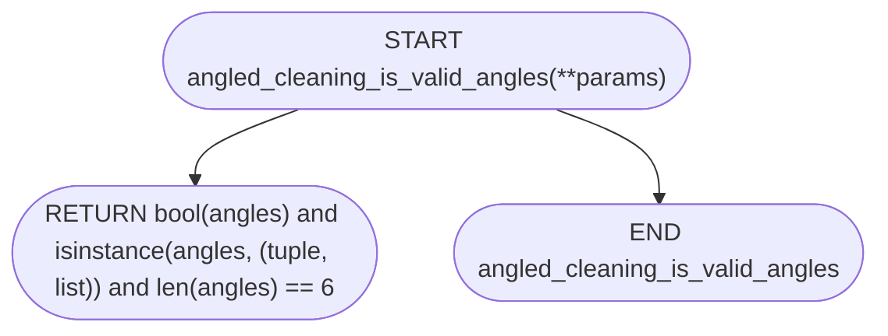

### `angled_cleaning_capture_current_angles`

- **Mermaid file:** [../mermaid/cleaning/angled_cleaning_capture_current_angles.mmd](../mermaid/cleaning/angled_cleaning_capture_current_angles.mmd)
- **Parameter scenarios observed:** none directly read
- **Branch/decision scenarios:**
  - `not angled_cleaning_is_valid_angles(angles)`

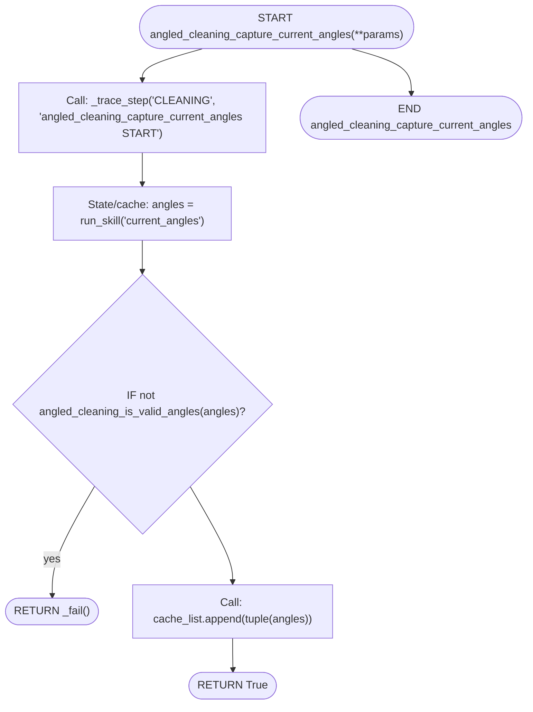
