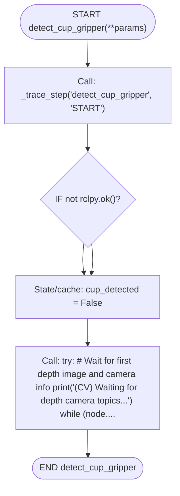

# `computer_vision.py` flowcharts

- Sequence/exported functions: 1
- Support/helper functions: 0

## Sequence/exported functions

### `detect_cup_gripper`

- **Mermaid file:** [../mermaid/computer_vision/detect_cup_gripper.mmd](../mermaid/computer_vision/detect_cup_gripper.mmd)
- **Parameter scenarios observed:** none directly read
- **Branch/decision scenarios:**
  - `not rclpy.ok()`
  - `node.latest_depth_image is None`
  - `not node.depth_info_received`
  - `node.latest_depth_image is None`
  - `not isinstance(depth_image, np.ndarray)`
  - `len(depth_data_raw.shape) > 2`
  - `total_roi_pixels > 0`
  - `depth_data_filtered[center_y, center_x] > INVALID_DEPTH_THRESHOLD_MM`
  - `current_time - last_print_time >= PRINT_INTERVAL`
  - `percentage_invalid >= CUP_DETECTION_INVALID_PERCENTAGE_THRESHOLD`

