# `espresso.py` flowcharts

- Sequence/exported functions: 47
- Support/helper functions: 25

## Sequence/exported functions

### `unmount`

- **Mermaid file:** [../mermaid/espresso/unmount.mmd](../mermaid/espresso/unmount.mmd)
- **Parameter scenarios observed:** `espresso`, `port`
- **Branch/decision scenarios:**
  - `shot_cfg and shot_cfg.get("angled")`
  - `not port`
  - `not port_params`
  - `not ok(_trace_run_skill("unmount", "gotoJ_deg", *port_params['home']))`
  - `port in ('port_1', 'port_3')`
  - `_is_valid_angles(cached_grab_joints)`
  - `not ok(_trace_run_skill("unmount", "enforce_rxry"))`
  - `not ok(_trace_run_skill("unmount", "sync"))`
  - `cached_port_angle`
  - `cached`
  - `not ok(_trace_run_skill("unmount", "gotoJ_deg", *port_params['move_back']))`
  - `port in ('port_2', 'port_3')`
  - `not _run_cached_machine_approach( f"unmount:{port}:approach:{port_params['portafilter_number']}", "three_group_espresso", port_params['portafilter_number'], )`
  - `not ok(_trace_run_skill("unmount", "gotoJ_deg", *cached_grab_joints))`
  - `not ok(_trace_run_skill("unmount", "sync"))`
  - `not ok(_trace_run_skill("unmount", "set_gripper_position", 255, 255, 255))`
  - `not gripped`
  - `not gripped`
  - `not gripped`
  - `not gripped`
  - `not ok(_trace_run_skill("unmount", "release_tension"))`
  - `not ok(_trace_run_skill("unmount", "sync"))`
  - `not ok(_trace_run_skill("unmount", "enforce_rxry"))`
  - `not ok(_trace_run_skill("unmount", "sync"))`
  - `not ok(pose_z) or not isinstance(pose_z, (tuple, list)) or len(pose_z) < 3`
  - ... 35 more in source/chart

```mermaid
flowchart TD
  N0(["START unmount(**params)"])
  N1["Nested helper defined: ok()"]
  N2["Parameter/normalization: espresso_dict = params.get('espresso')"]
  N3["Parameter/normalization: shot_cfg = _normalize_espresso_shot(espresso_dict)"]
  N4{"IF shot_cfg and shot_cfg.get('angled')?"}
  N5(["RETURN angled_unmount(**params)"])
  N6["Parameter/normalization: port = params.get('port') or (shot_cfg.get('port') if shot_cfg else 'port_1')"]
  N7{"IF not port?"}
  N8(["RETURN _fail()"])
  N9{"IF not port_params?"}
  N10(["RETURN _fail()"])
  N11{"IF not ok(_trace_run_skill('unmount', 'gotoJ_deg', *port_params('home')))?"}
  N12(["RETURN _fail()"])
  N13{"IF port in ('port_1', 'port_3')?"}
  N14{"IF not _run_cached_machine_approach( f'unmount:(port):approach:(port_params('portafilter_number'))', 'three_group_esp..."}
  N15(["RETURN _fail()"])
  N16["State/cache: grab_cache_key = f'unmount:post_grab:(port)'"]
  N17["State/cache: cached_grab_joints = _unmount_post_grab_joints_cache.get(grab_cache_key)"]
  N18{"IF _is_valid_angles(cached_grab_joints)?"}
  N19{"IF not ok(_trace_run_skill('unmount', 'gotoJ_deg', *cached_grab_joints))?"}
  N20(["RETURN _fail()"])
  N21{"IF not ok(_trace_run_skill('unmount', 'sync'))?"}
  N22(["RETURN _fail()"])
  N23{"IF not ok(_trace_run_skill('unmount', 'set_gripper_position', 255, 255, 255))?"}
  N24(["RETURN _fail()"])
  N25["Nested helper defined: _close_and_verify_grip()"]
  N26["Nested helper defined: _grab_then_close()"]
  N27["State/cache: gripped, pos = _grab_then_close()"]
  N28{"IF not gripped?"}
  N29["Call: _gripper_log.warning( f'(PORTAFILTER-GRIP) attempt 1 pos=(pos) ' f'(want in ((_PORTAFILTER_GRIP_POS_MIN), (_POR..."]
  N30{"IF not ok(_trace_run_skill('unmount', 'moveEE_movJ', 0, 0, -2.5, 0, 0, 0))?"}
  N31(["RETURN _fail()"])
  N32["State/cache: gripped, pos = _close_and_verify_grip()"]
  N33{"IF not gripped?"}
  N34["Call: _gripper_log.warning( f'(PORTAFILTER-GRIP) attempt 2 pos=(pos) ' f'(want in ((_PORTAFILTER_GRIP_POS_MIN), (_POR..."]
  N35{"IF not ok(_trace_run_skill('unmount', 'moveEE_movJ', 0, 0, 5, 0, 0, 0))?"}
  N36(["RETURN _fail()"])
  N37["State/cache: gripped, pos = _close_and_verify_grip()"]
  N38{"IF not gripped?"}
  N39["Call: _gripper_log.warning( f'(PORTAFILTER-GRIP) attempt 3 pos=(pos) ' f'(want in ((_PORTAFILTER_GRIP_POS_MIN), (_POR..."]
  N40{"IF not ok(_trace_run_skill('unmount', 'set_gripper_position', 255, 0, 255))?"}
  N41(["RETURN _fail()"])
  N42{"IF port in ('port_1', 'port_3')?"}
  N43{"IF not _run_cached_machine_approach( f'unmount:(port):approach:(port_params('portafilter_number'))', 'three_group_esp..."}
  N44(["RETURN _fail()"])
  N45["State/cache: gripped, pos = _grab_then_close()"]
  N46{"IF not gripped?"}
  N47(["RETURN _fail()"])
  N48{"IF not ok(_trace_run_skill('unmount', 'release_tension'))?"}
  N49(["RETURN _fail()"])
  N50{"IF not ok(_trace_run_skill('unmount', 'sync'))?"}
  N51(["RETURN _fail()"])
  N52{"IF not ok(_trace_run_skill('unmount', 'enforce_rxry'))?"}
  N53(["RETURN _fail()"])
  N54{"IF not ok(_trace_run_skill('unmount', 'sync'))?"}
  N55(["RETURN _fail()"])
  N56["State/cache: pose_z = _trace_run_skill('unmount', 'current_pose')"]
  N57{"IF not ok(pose_z) or not isinstance(pose_z, (tuple, list)) or len(pose_z) < 3?"}
  N58(["RETURN _fail()"])
  N59{"IF not (z_lo <= z_mm <= z_hi)?"}
  N60{"IF not ok(_trace_run_skill('unmount', 'set_gripper_position', 25, 100, 25))?"}
  N61(["RETURN _fail()"])
  N62{"IF not ok(_trace_run_skill('unmount', 'moveEE_movJ', -0.25, 0, dz, 0, 0, 0))?"}
  N63(["RETURN _fail()"])
  N64{"IF not ok(_trace_run_skill('unmount', 'set_gripper_position', 255, 255, 255))?"}
  N65(["RETURN _fail()"])
  N66{"IF not ok(_trace_run_skill('unmount', 'sync'))?"}
  N67(["RETURN _fail()"])
  N68{"IF not ok(_trace_run_skill('unmount', 'release_tension'))?"}
  N69(["RETURN _fail()"])
  N70{"IF not ok(_trace_run_skill('unmount', 'sync'))?"}
  N71(["RETURN _fail()"])
  N72["State/cache: angles = _trace_run_skill('unmount', 'current_angles')"]
  N73{"IF not ok(angles) or not _is_valid_angles(angles)?"}
  N74(["RETURN _fail()"])
  N75["State/cache: _unmount_post_grab_joints_cache(grab_cache_key) = tuple(angles)"]
  N76{"IF not ok(_trace_run_skill('unmount', 'sync'))?"}
  N77(["RETURN _fail()"])
  N78{"IF not ok(_trace_run_skill('unmount', 'enforce_rxry'))?"}
  N79(["RETURN _fail()"])
  N80{"IF not ok(_trace_run_skill('unmount', 'sync'))?"}
  N81(["RETURN _fail()"])
  N82["State/cache: cached_port_angle = _port_angle_cache.get(port)"]
  N83{"IF cached_port_angle?"}
  N84{"IF arc_cmd is None?"}
  N85(["RETURN _fail()"])
  N86{"IF not ok(_trace_run_skill('unmount', 'move_portafilter_arc_movJ', arc_cmd))?"}
  N87(["RETURN _fail()"])
  N88["State/cache: pose_before_arc = _trace_run_skill('unmount', 'current_pose')"]
  N89{"IF not ok(pose_before_arc) or not isinstance(pose_before_arc, (tuple, list)) or len(pose_before_arc) < 6?"}
  N90["... diagram capped for readability; source has additional low-level steps"]
  N91["... diagram capped for readability; source has additional low-level steps"]
  N92["... diagram capped for readability; source has additional low-level steps"]
  N93(["END unmount"])
  N0 --> N1
  N1 --> N2
  N2 --> N3
  N3 --> N4
  N4 -- "yes" --> N5
  N4 --> N6
  N6 --> N7
  N7 -- "yes" --> N8
  N7 --> N9
  N9 -- "yes" --> N10
  N9 --> N11
  N11 -- "yes" --> N12
  N11 --> N13
  N13 -- "yes" --> N14
  N14 -- "yes" --> N15
  N14 --> N16
  N13 --> N16
  N16 --> N17
  N17 --> N18
  N18 -- "yes" --> N19
  N19 -- "yes" --> N20
  N19 --> N21
  N21 -- "yes" --> N22
  N21 --> N23
  N23 -- "yes" --> N24
  N18 -- "no" --> N25
  N25 --> N26
  N26 --> N27
  N27 --> N28
  N28 -- "yes" --> N29
  N29 --> N30
  N30 -- "yes" --> N31
  N30 --> N32
  N32 --> N33
  N28 --> N33
  N33 -- "yes" --> N34
  N34 --> N35
  N35 -- "yes" --> N36
  N35 --> N37
  N37 --> N38
  N33 --> N38
  N38 -- "yes" --> N39
  N39 --> N40
  N40 -- "yes" --> N41
  N40 --> N42
  N42 -- "yes" --> N43
  N43 -- "yes" --> N44
  N43 --> N45
  N42 --> N45
  N45 --> N46
  N38 --> N46
  N46 -- "yes" --> N47
  N46 --> N48
  N48 -- "yes" --> N49
  N48 --> N50
  N50 -- "yes" --> N51
  N50 --> N52
  N52 -- "yes" --> N53
  N52 --> N54
  N54 -- "yes" --> N55
  N54 --> N56
  N56 --> N57
  N57 -- "yes" --> N58
  N57 --> N59
  N59 -- "yes" --> N60
  N60 -- "yes" --> N61
  N60 --> N62
  N62 -- "yes" --> N63
  N62 --> N64
  N64 -- "yes" --> N65
  N64 --> N66
  N66 -- "yes" --> N67
  N66 --> N68
  N68 -- "yes" --> N69
  N68 --> N70
  N70 -- "yes" --> N71
  N70 --> N72
  N59 --> N72
  N72 --> N73
  N73 -- "yes" --> N74
  N73 --> N75
  N75 --> N76
  N76 -- "yes" --> N77
  N23 --> N78
  N76 --> N78
  N78 -- "yes" --> N79
  N78 --> N80
  N80 -- "yes" --> N81
  N80 --> N82
  N82 --> N83
  N83 -- "yes" --> N84
  N84 -- "yes" --> N85
  N84 --> N86
  N86 -- "yes" --> N87
  N83 -- "no" --> N88
  N88 --> N89
  N89 -- "yes" --> N90
  N90 --> N91
  N89 --> N91
  N86 --> N92
  N91 --> N92
  N92 --> N93
```

### `grinder`

- **Mermaid file:** [../mermaid/espresso/grinder.mmd](../mermaid/espresso/grinder.mmd)
- **Parameter scenarios observed:** `espresso`, `port`, `portafilter_tool`, `positioning_time`
- **Branch/decision scenarios:**
  - `shot_cfg and shot_cfg.get("angled")`
  - `positioning_time is None`
  - `not port or portafilter_tool not in ("single_portafilter", "double_portafilter")`
  - `port == "port_1"`
  - `not _run_cached_machine_approach( f"grinder:{port}:approach:grinder", "espresso_grinder", "grinder", )`
  - `_is_valid_angles(cached_grinder_mount_pose)`
  - `not _run_cached_machine_approach( f"grinder:{port}:approach:tamper", "espresso_grinder", "tamper", )`
  - `not ok(_trace_run_skill("grinder", "sync"))`
  - `not _run_cached_machine_mount( f"grinder:{port}:mount:grinder:final", "espresso_grinder", "grinder", )`
  - `not _run_cached_machine_mount( f"grinder:{port}:mount:tamper", "espresso_grinder", "tamper", )`
  - `not ok(_trace_run_skill("grinder", "sync"))`
  - `not ok(_trace_run_skill("grinder", "set_gripper_position", 255, 0, 255))`
  - `_is_valid_angles(cached_tool_pick_pose)`
  - `not ok(_trace_run_skill("grinder", "gotoJ_deg", *ESPRESSO_GRINDER_HOME))`
  - `not ok(_trace_run_skill("grinder", "gotoJ_deg", *ESPRESSO_GRINDER_HOME))`
  - `not ok(_trace_run_skill("grinder", "gotoJ_deg", *cached_grinder_mount_pose))`
  - `not _run_cached_machine_mount( f"grinder:{port}:mount:grinder", "espresso_grinder", "grinder", )`
  - `not _is_valid_angles(grinder_mount_pose)`
  - `not ok(_trace_run_skill("grinder", "gotoJ_deg", *cached_tool_pick_pose))`
  - `not ok(_trace_run_skill("grinder", "moveEE_movJ", -50, 50, 50, 15, 0, 0))`
  - `not _is_valid_angles(tool_pick_pose)`

```mermaid
flowchart TD
  N0(["START grinder(**params)"])
  N1["Nested helper defined: ok()"]
  N2["Parameter/normalization: espresso_dict = params.get('espresso')"]
  N3["Parameter/normalization: shot_cfg = _normalize_espresso_shot(espresso_dict)"]
  N4{"IF shot_cfg and shot_cfg.get('angled')?"}
  N5(["RETURN angled_grinder(**params)"])
  N6["Parameter/normalization: port = params.get('port') or (shot_cfg.get('port') if shot_cfg else 'port_1')"]
  N7["Parameter/normalization: positioning_time = params.get('positioning_time')"]
  N8{"IF positioning_time is None?"}
  N9["Parameter/normalization: portafilter_tool = ( params.get('portafilter_tool') or (shot_cfg.get('portafilter_tool') if ..."]
  N10{"IF not port or portafilter_tool not in ('single_portafilter', 'double_portafilter')?"}
  N11(["RETURN _fail()"])
  N12{"IF port == 'port_1'?"}
  N13{"IF not ok(_trace_run_skill('grinder', 'gotoJ_deg', *ESPRESSO_GRINDER_HOME))?"}
  N14(["RETURN _fail()"])
  N15{"IF not _run_cached_machine_approach( f'grinder:(port):approach:grinder', 'espresso_grinder', 'grinder', )?"}
  N16(["RETURN _fail()"])
  N17["State/cache: grinder_cache_key = f'(port)_grinder_post_mount'"]
  N18["State/cache: cached_grinder_mount_pose = _grinder_post_mount_cache.get(grinder_cache_key)"]
  N19{"IF _is_valid_angles(cached_grinder_mount_pose)?"}
  N20{"IF not ok(_trace_run_skill('grinder', 'gotoJ_deg', *cached_grinder_mount_pose))?"}
  N21(["RETURN _fail()"])
  N22{"IF not _run_cached_machine_mount( f'grinder:(port):mount:grinder', 'espresso_grinder', 'grinder', )?"}
  N23(["RETURN _fail()"])
  N24["State/cache: grinder_mount_pose = _trace_run_skill('grinder', 'current_angles')"]
  N25{"IF not _is_valid_angles(grinder_mount_pose)?"}
  N26(["RETURN _fail()"])
  N27["State/cache: _grinder_post_mount_cache(grinder_cache_key) = tuple(grinder_mount_pose)"]
  N28{"IF not _run_cached_machine_approach( f'grinder:(port):approach:tamper', 'espresso_grinder', 'tamper', )?"}
  N29(["RETURN _fail()"])
  N30{"IF not ok(_trace_run_skill('grinder', 'sync'))?"}
  N31(["RETURN _fail()"])
  N32["Call: time.sleep(positioning_time)"]
  N33{"IF not _run_cached_machine_mount( f'grinder:(port):mount:grinder:final', 'espresso_grinder', 'grinder', )?"}
  N34(["RETURN _fail()"])
  N35{"IF not _run_cached_machine_mount( f'grinder:(port):mount:tamper', 'espresso_grinder', 'tamper', )?"}
  N36(["RETURN _fail()"])
  N37{"IF not ok(_trace_run_skill('grinder', 'sync'))?"}
  N38(["RETURN _fail()"])
  N39{"IF not ok(_trace_run_skill('grinder', 'set_gripper_position', 255, 0, 255))?"}
  N40(["RETURN _fail()"])
  N41["State/cache: cached_tool_pick_pose = _tool_pick_pose_cache.get(portafilter_tool)"]
  N42{"IF _is_valid_angles(cached_tool_pick_pose)?"}
  N43{"IF not ok(_trace_run_skill('grinder', 'gotoJ_deg', *cached_tool_pick_pose))?"}
  N44(["RETURN _fail()"])
  N45{"IF not ok(_trace_run_skill('grinder', 'moveEE_movJ', -50, 50, 50, 15, 0, 0))?"}
  N46(["RETURN _fail()"])
  N47["State/cache: tool_pick_pose = _trace_run_skill('grinder', 'current_angles')"]
  N48{"IF not _is_valid_angles(tool_pick_pose)?"}
  N49(["RETURN _fail()"])
  N50["State/cache: _tool_pick_pose_cache(portafilter_tool) = tuple(tool_pick_pose)"]
  N51{"IF not ok(_trace_run_skill('grinder', 'gotoJ_deg', *ESPRESSO_GRINDER_HOME))?"}
  N52(["RETURN _fail()"])
  N53(["RETURN True"])
  N54(["END grinder"])
  N0 --> N1
  N1 --> N2
  N2 --> N3
  N3 --> N4
  N4 -- "yes" --> N5
  N4 --> N6
  N6 --> N7
  N7 --> N8
  N8 --> N9
  N8 --> N9
  N9 --> N10
  N10 -- "yes" --> N11
  N10 --> N12
  N12 -- "yes" --> N13
  N13 -- "yes" --> N14
  N13 --> N15
  N12 --> N15
  N15 -- "yes" --> N16
  N15 --> N17
  N17 --> N18
  N18 --> N19
  N19 -- "yes" --> N20
  N20 -- "yes" --> N21
  N19 -- "no" --> N22
  N22 -- "yes" --> N23
  N22 --> N24
  N24 --> N25
  N25 -- "yes" --> N26
  N25 --> N27
  N20 --> N28
  N27 --> N28
  N28 -- "yes" --> N29
  N28 --> N30
  N30 -- "yes" --> N31
  N30 --> N32
  N32 --> N33
  N33 -- "yes" --> N34
  N33 --> N35
  N35 -- "yes" --> N36
  N35 --> N37
  N37 -- "yes" --> N38
  N37 --> N39
  N39 -- "yes" --> N40
  N39 --> N41
  N41 --> N42
  N42 -- "yes" --> N43
  N43 -- "yes" --> N44
  N42 -- "no" --> N45
  N45 -- "yes" --> N46
  N45 --> N47
  N47 --> N48
  N48 -- "yes" --> N49
  N48 --> N50
  N43 --> N51
  N50 --> N51
  N51 -- "yes" --> N52
  N51 --> N53
  N0 --> N54
```

### `mount`

- **Mermaid file:** [../mermaid/espresso/mount.mmd](../mermaid/espresso/mount.mmd)
- **Parameter scenarios observed:** `espresso`, `port`
- **Branch/decision scenarios:**
  - `shot_cfg and shot_cfg.get("angled")`
  - `not port`
  - `not port_params`
  - `port in ('port_2', 'port_3')`
  - `not ok(_trace_run_skill("mount", "gotoJ_deg", *port_params['move_back']))`
  - `runtime_cached`
  - `not _is_valid_angles(below_pose)`
  - `not ok(_trace_run_skill("mount", "gotoJ_deg", *below_pose))`
  - `not _is_valid_angles(mount_pose)`
  - `not ok(_trace_run_skill("mount", "gotoJ_deg", *mount_pose))`
  - `not ok(_trace_run_skill("mount", "moveEE_movJ", *_portafilter_clear_up_offset(port)))`
  - `not ok(_trace_run_skill("mount", "enforce_rxry"))`
  - `not ok(_trace_run_skill("mount", "sync"))`
  - `arc_delta_mount is None`
  - `not ok(_trace_run_skill("mount", "move_portafilter_arc_movJ", arc_delta_mount))`
  - `not ok(_trace_run_skill("mount", "sync"))`
  - `not ok(_trace_run_skill("mount", "release_tension"))`
  - `not _open_gripper_with_verify()`
  - `not cup_detected`
  - `not ok(_trace_run_skill("mount", "sync"))`
  - `port in ('port_1', 'port_3')`
  - `not ok(_trace_run_skill("mount", "gotoJ_deg", *port_params['home']))`
  - `not ok(_trace_run_skill("mount", "gotoJ_deg", *ESPRESSO_GRINDER_PARAMS['nav1']))`
  - `not _run_cached_machine_approach( f"mount:{port}:approach:{port_params['portafilter_number']}", "three_group_espresso", port_params['portafilter_number'], )`

```mermaid
flowchart TD
  N0(["START mount(**params)"])
  N1["Nested helper defined: ok()"]
  N2["Parameter/normalization: espresso_dict = params.get('espresso')"]
  N3["Parameter/normalization: shot_cfg = _normalize_espresso_shot(espresso_dict)"]
  N4{"IF shot_cfg and shot_cfg.get('angled')?"}
  N5(["RETURN angled_mount(**params)"])
  N6["Parameter/normalization: port = params.get('port') or (shot_cfg.get('port') if shot_cfg else 'port_1')"]
  N7{"IF not port?"}
  N8(["RETURN _fail()"])
  N9{"IF not port_params?"}
  N10(["RETURN _fail()"])
  N11{"IF port in ('port_2', 'port_3')?"}
  N12{"IF not ok(_trace_run_skill('mount', 'gotoJ_deg', *ESPRESSO_GRINDER_PARAMS('nav1')))?"}
  N13(["RETURN _fail()"])
  N14{"IF not ok(_trace_run_skill('mount', 'gotoJ_deg', *port_params('move_back')))?"}
  N15(["RETURN _fail()"])
  N16["State/cache: runtime_cached = _mount_runtime_cache.get(port)"]
  N17{"IF runtime_cached?"}
  N18["State/cache: below_pose = runtime_cached.get('below')"]
  N19["State/cache: mount_pose = runtime_cached.get('mount')"]
  N20{"IF not _is_valid_angles(below_pose)?"}
  N21(["RETURN _fail()"])
  N22{"IF not ok(_trace_run_skill('mount', 'gotoJ_deg', *below_pose))?"}
  N23(["RETURN _fail()"])
  N24{"IF not _is_valid_angles(mount_pose)?"}
  N25(["RETURN _fail()"])
  N26{"IF not ok(_trace_run_skill('mount', 'gotoJ_deg', *mount_pose))?"}
  N27(["RETURN _fail()"])
  N28{"IF not ok(_trace_run_skill('mount', 'moveEE_movJ', *_portafilter_clear_up_offset(port)))?"}
  N29(["RETURN _fail()"])
  N30{"IF not ok(_trace_run_skill('mount', 'enforce_rxry'))?"}
  N31(["RETURN _fail()"])
  N32{"IF not ok(_trace_run_skill('mount', 'sync'))?"}
  N33(["RETURN _fail()"])
  N34["Call: arc_delta_mount = _portafilter_mount_arc_cmd_by_port.get(str(port))"]
  N35{"IF arc_delta_mount is None?"}
  N36(["RETURN _fail()"])
  N37{"IF not ok(_trace_run_skill('mount', 'move_portafilter_arc_movJ', arc_delta_mount))?"}
  N38(["RETURN _fail()"])
  N39{"IF not ok(_trace_run_skill('mount', 'sync'))?"}
  N40(["RETURN _fail()"])
  N41{"IF not ok(_trace_run_skill('mount', 'release_tension'))?"}
  N42(["RETURN _fail()"])
  N43{"IF not _open_gripper_with_verify()?"}
  N44(["RETURN _fail()"])
  N45["State/cache: cup_detected = detect_cup_gripper()"]
  N46{"IF not cup_detected?"}
  N47(["RETURN _fail()"])
  N48{"IF not ok(_trace_run_skill('mount', 'sync'))?"}
  N49(["RETURN _fail()"])
  N50{"IF port in ('port_1', 'port_3')?"}
  N51{"IF not _run_cached_machine_approach( f'mount:(port):approach:(port_params('portafilter_number'))', 'three_group_espre..."}
  N52(["RETURN _fail()"])
  N53{"IF not ok(_trace_run_skill('mount', 'gotoJ_deg', *port_params('home')))?"}
  N54(["RETURN _fail()"])
  N55(["RETURN True"])
  N56(["END mount"])
  N0 --> N1
  N1 --> N2
  N2 --> N3
  N3 --> N4
  N4 -- "yes" --> N5
  N4 --> N6
  N6 --> N7
  N7 -- "yes" --> N8
  N7 --> N9
  N9 -- "yes" --> N10
  N9 --> N11
  N11 -- "yes" --> N12
  N12 -- "yes" --> N13
  N12 --> N14
  N11 --> N14
  N14 -- "yes" --> N15
  N14 --> N16
  N16 --> N17
  N17 -- "yes" --> N18
  N18 --> N19
  N19 --> N20
  N17 --> N20
  N20 -- "yes" --> N21
  N20 --> N22
  N22 -- "yes" --> N23
  N22 --> N24
  N24 -- "yes" --> N25
  N24 --> N26
  N26 -- "yes" --> N27
  N26 --> N28
  N28 -- "yes" --> N29
  N28 --> N30
  N30 -- "yes" --> N31
  N30 --> N32
  N32 -- "yes" --> N33
  N32 --> N34
  N34 --> N35
  N35 -- "yes" --> N36
  N35 --> N37
  N37 -- "yes" --> N38
  N37 --> N39
  N39 -- "yes" --> N40
  N39 --> N41
  N41 -- "yes" --> N42
  N41 --> N43
  N43 -- "yes" --> N44
  N43 --> N45
  N45 --> N46
  N46 -- "yes" --> N47
  N46 --> N48
  N48 -- "yes" --> N49
  N48 --> N50
  N50 -- "yes" --> N51
  N51 -- "yes" --> N52
  N51 --> N53
  N50 --> N53
  N53 -- "yes" --> N54
  N53 --> N55
  N0 --> N56
```

### `grab_espresso_pitcher`

Grab the espresso pitcher and stop right after closing the gripper.

- **Mermaid file:** [../mermaid/espresso/grab_espresso_pitcher.mmd](../mermaid/espresso/grab_espresso_pitcher.mmd)
- **Parameter scenarios observed:** `espresso`, `port`
- **Branch/decision scenarios:**
  - `shot_cfg and shot_cfg.get("angled")`
  - `not port or port not in ('port_1', 'port_2', 'port_3')`
  - `not ok(_trace_run_skill("grab_espresso_pitcher", "gotoJ_deg", *ESPRESSO_HOME))`
  - `_is_valid_angles(pick2)`
  - `port == 'port_1'`
  - `not ok(_trace_run_skill("grab_espresso_pitcher", "gotoJ_deg", *pick2))`
  - `not _run_cached_machine_approach( f"grab_pitcher:{port}:approach:pick_pitcher_2", "three_group_espresso", "pick_pitcher_2", )`
  - `not ok(_trace_run_skill("grab_espresso_pitcher", "sync"))`
  - `_is_valid_angles(pick2_angles)`
  - `cached and cached.get('approach') and cached.get('mount')`
  - `port == 'port_2'`
  - `not ok(_trace_run_skill("grab_espresso_pitcher", "gotoJ_deg", *cached['approach']))`
  - `not ok(_trace_run_skill("grab_espresso_pitcher", "gotoJ_deg", *cached['mount']))`
  - `not ok(_trace_run_skill("grab_espresso_pitcher", "sync"))`
  - `not ok(_trace_run_skill("grab_espresso_pitcher", "set_gripper_position", 255, 115, 255))`
  - `not _run_cached_machine_approach( f"grab_pitcher:{port}:approach:pick_pitcher_1", "three_group_espresso", "pick_pitcher_1", )`
  - `not ok(_trace_run_skill("grab_espresso_pitcher", "sync"))`
  - `_is_valid_angles(approach_angles)`
  - `not _run_cached_machine_mount( f"grab_pitcher:{port}:mount:pick_pitcher_1", "three_group_espresso", "pick_pitcher_1", )`
  - `not ok(_trace_run_skill("grab_espresso_pitcher", "sync"))`
  - `not ok(_trace_run_skill("grab_espresso_pitcher", "set_gripper_position", 255, 115, 255))`
  - `not ok(_trace_run_skill("grab_espresso_pitcher", "release_tension"))`
  - `_is_valid_angles(mount_angles)`
  - `cached and cached.get('mount')`
  - `not ok(_trace_run_skill("grab_espresso_pitcher", "set_gripper_position", 255, 115, 255))`
  - ... 17 more in source/chart

```mermaid
flowchart TD
  N0(["START grab_espresso_pitcher(**params)"])
  N1["Nested helper defined: ok()"]
  N2["Parameter/normalization: espresso_dict = params.get('espresso')"]
  N3["Parameter/normalization: shot_cfg = _normalize_espresso_shot(espresso_dict)"]
  N4{"IF shot_cfg and shot_cfg.get('angled')?"}
  N5(["RETURN angled_grab_espresso_pitcher(**params)"])
  N6["Parameter/normalization: port = params.get('port') or (shot_cfg.get('port') if shot_cfg else 'port_1')"]
  N7{"IF not port or port not in ('port_1', 'port_2', 'port_3')?"}
  N8(["RETURN _fail()"])
  N9{"IF not ok(_trace_run_skill('grab_espresso_pitcher', 'gotoJ_deg', *ESPRESSO_HOME))?"}
  N10(["RETURN _fail()"])
  N11["State/cache: cached = _pitcher_pick_cache.get(port)"]
  N12["State/cache: pick2 = cached.get('pick2_approach') if cached else None"]
  N13{"IF _is_valid_angles(pick2)?"}
  N14{"IF not ok(_trace_run_skill('grab_espresso_pitcher', 'gotoJ_deg', *pick2))?"}
  N15(["RETURN _fail()"])
  N16{"IF not _run_cached_machine_approach( f'grab_pitcher:(port):approach:pick_pitcher_2', 'three_group_espresso', 'pick_pi..."}
  N17(["RETURN _fail()"])
  N18{"IF not ok(_trace_run_skill('grab_espresso_pitcher', 'sync'))?"}
  N19(["RETURN _fail()"])
  N20["State/cache: pick2_angles = _trace_run_skill('grab_espresso_pitcher', 'current_angles')"]
  N21{"IF _is_valid_angles(pick2_angles)?"}
  N22["State/cache: _pitcher_pick_cache.setdefault(port, ())('pick2_approach') = tuple(pick2_angles)"]
  N23["State/cache: cached = _pitcher_pick_cache.get(port)"]
  N24{"IF port == 'port_1'?"}
  N25{"IF cached and cached.get('approach') and cached.get('mount')?"}
  N26{"IF not ok(_trace_run_skill('grab_espresso_pitcher', 'gotoJ_deg', *cached('approach')))?"}
  N27(["RETURN _fail()"])
  N28{"IF not ok(_trace_run_skill('grab_espresso_pitcher', 'gotoJ_deg', *cached('mount')))?"}
  N29(["RETURN _fail()"])
  N30{"IF not ok(_trace_run_skill('grab_espresso_pitcher', 'sync'))?"}
  N31(["RETURN _fail()"])
  N32{"IF not ok(_trace_run_skill('grab_espresso_pitcher', 'set_gripper_position', 255, 115, 255))?"}
  N33(["RETURN _fail()"])
  N34{"IF not _run_cached_machine_approach( f'grab_pitcher:(port):approach:pick_pitcher_1', 'three_group_espresso', 'pick_pi..."}
  N35(["RETURN _fail()"])
  N36{"IF not ok(_trace_run_skill('grab_espresso_pitcher', 'sync'))?"}
  N37(["RETURN _fail()"])
  N38["State/cache: approach_angles = _trace_run_skill('grab_espresso_pitcher', 'current_angles')"]
  N39{"IF _is_valid_angles(approach_angles)?"}
  N40["State/cache: _pitcher_pick_cache.setdefault(port, ())('approach') = tuple(approach_angles)"]
  N41{"IF not _run_cached_machine_mount( f'grab_pitcher:(port):mount:pick_pitcher_1', 'three_group_espresso', 'pick_pitcher_..."}
  N42(["RETURN _fail()"])
  N43{"IF not ok(_trace_run_skill('grab_espresso_pitcher', 'sync'))?"}
  N44(["RETURN _fail()"])
  N45{"IF not ok(_trace_run_skill('grab_espresso_pitcher', 'set_gripper_position', 255, 115, 255))?"}
  N46(["RETURN _fail()"])
  N47{"IF not ok(_trace_run_skill('grab_espresso_pitcher', 'release_tension'))?"}
  N48(["RETURN _fail()"])
  N49["State/cache: mount_angles = _trace_run_skill('grab_espresso_pitcher', 'current_angles')"]
  N50{"IF _is_valid_angles(mount_angles)?"}
  N51["State/cache: _pitcher_pick_cache.setdefault(port, ())('mount') = tuple(mount_angles)"]
  N52{"IF port == 'port_2'?"}
  N53{"IF cached and cached.get('mount')?"}
  N54{"IF not ok(_trace_run_skill('grab_espresso_pitcher', 'gotoJ_deg', *cached('mount')))?"}
  N55(["RETURN _fail()"])
  N56{"IF not ok(_trace_run_skill('grab_espresso_pitcher', 'sync'))?"}
  N57(["RETURN _fail()"])
  N58{"IF not _run_cached_machine_mount( f'grab_pitcher:(port):mount:pick_pitcher_2', 'three_group_espresso', 'pick_pitcher_..."}
  N59(["RETURN _fail()"])
  N60{"IF not ok(_trace_run_skill('grab_espresso_pitcher', 'sync'))?"}
  N61(["RETURN _fail()"])
  N62["State/cache: mount_angles = _trace_run_skill('grab_espresso_pitcher', 'current_angles')"]
  N63{"IF _is_valid_angles(mount_angles)?"}
  N64["State/cache: _pitcher_pick_cache.setdefault(port, ())('mount') = tuple(mount_angles)"]
  N65{"IF not ok(_trace_run_skill('grab_espresso_pitcher', 'set_gripper_position', 255, 115, 255))?"}
  N66(["RETURN _fail()"])
  N67{"IF port == 'port_3'?"}
  N68{"IF cached and cached.get('approach') and cached.get('mount')?"}
  N69{"IF not ok(_trace_run_skill('grab_espresso_pitcher', 'gotoJ_deg', *cached('approach')))?"}
  N70(["RETURN _fail()"])
  N71{"IF not ok(_trace_run_skill('grab_espresso_pitcher', 'gotoJ_deg', *cached('mount')))?"}
  N72(["RETURN _fail()"])
  N73{"IF not ok(_trace_run_skill('grab_espresso_pitcher', 'sync'))?"}
  N74(["RETURN _fail()"])
  N75{"IF not _run_cached_machine_approach( f'grab_pitcher:(port):approach:pick_pitcher_3', 'three_group_espresso', 'pick_pi..."}
  N76(["RETURN _fail()"])
  N77{"IF not ok(_trace_run_skill('grab_espresso_pitcher', 'sync'))?"}
  N78(["RETURN _fail()"])
  N79["State/cache: approach_angles = _trace_run_skill('grab_espresso_pitcher', 'current_angles')"]
  N80{"IF _is_valid_angles(approach_angles)?"}
  N81["State/cache: _pitcher_pick_cache.setdefault(port, ())('approach') = tuple(approach_angles)"]
  N82{"IF not _run_cached_machine_mount( f'grab_pitcher:(port):mount:pick_pitcher_3', 'three_group_espresso', 'pick_pitcher_..."}
  N83(["RETURN _fail()"])
  N84{"IF not ok(_trace_run_skill('grab_espresso_pitcher', 'sync'))?"}
  N85(["RETURN _fail()"])
  N86["State/cache: mount_angles = _trace_run_skill('grab_espresso_pitcher', 'current_angles')"]
  N87{"IF _is_valid_angles(mount_angles)?"}
  N88["State/cache: _pitcher_pick_cache.setdefault(port, ())('mount') = tuple(mount_angles)"]
  N89{"IF not ok(_trace_run_skill('grab_espresso_pitcher', 'set_gripper_position', 255, 115, 255))?"}
  N90["... diagram capped for readability; source has additional low-level steps"]
  N91["... diagram capped for readability; source has additional low-level steps"]
  N92["... diagram capped for readability; source has additional low-level steps"]
  N93(["END grab_espresso_pitcher"])
  N0 --> N1
  N1 --> N2
  N2 --> N3
  N3 --> N4
  N4 -- "yes" --> N5
  N4 --> N6
  N6 --> N7
  N7 -- "yes" --> N8
  N7 --> N9
  N9 -- "yes" --> N10
  N9 --> N11
  N11 --> N12
  N12 --> N13
  N13 -- "yes" --> N14
  N14 -- "yes" --> N15
  N13 -- "no" --> N16
  N16 -- "yes" --> N17
  N16 --> N18
  N18 -- "yes" --> N19
  N18 --> N20
  N20 --> N21
  N21 -- "yes" --> N22
  N14 --> N23
  N22 --> N23
  N21 --> N23
  N23 --> N24
  N24 -- "yes" --> N25
  N25 -- "yes" --> N26
  N26 -- "yes" --> N27
  N26 --> N28
  N28 -- "yes" --> N29
  N28 --> N30
  N30 -- "yes" --> N31
  N30 --> N32
  N32 -- "yes" --> N33
  N25 -- "no" --> N34
  N34 -- "yes" --> N35
  N34 --> N36
  N36 -- "yes" --> N37
  N36 --> N38
  N38 --> N39
  N39 -- "yes" --> N40
  N40 --> N41
  N39 --> N41
  N41 -- "yes" --> N42
  N41 --> N43
  N43 -- "yes" --> N44
  N43 --> N45
  N45 -- "yes" --> N46
  N45 --> N47
  N47 -- "yes" --> N48
  N47 --> N49
  N49 --> N50
  N50 -- "yes" --> N51
  N24 -- "no" --> N52
  N52 -- "yes" --> N53
  N53 -- "yes" --> N54
  N54 -- "yes" --> N55
  N54 --> N56
  N56 -- "yes" --> N57
  N53 -- "no" --> N58
  N58 -- "yes" --> N59
  N58 --> N60
  N60 -- "yes" --> N61
  N60 --> N62
  N62 --> N63
  N63 -- "yes" --> N64
  N56 --> N65
  N64 --> N65
  N63 --> N65
  N65 -- "yes" --> N66
  N52 -- "no" --> N67
  N67 -- "yes" --> N68
  N68 -- "yes" --> N69
  N69 -- "yes" --> N70
  N69 --> N71
  N71 -- "yes" --> N72
  N71 --> N73
  N73 -- "yes" --> N74
  N68 -- "no" --> N75
  N75 -- "yes" --> N76
  N75 --> N77
  N77 -- "yes" --> N78
  N77 --> N79
  N79 --> N80
  N80 -- "yes" --> N81
  N81 --> N82
  N80 --> N82
  N82 -- "yes" --> N83
  N82 --> N84
  N84 -- "yes" --> N85
  N84 --> N86
  N86 --> N87
  N87 -- "yes" --> N88
  N73 --> N89
  N88 --> N89
  N87 --> N89
  N89 -- "yes" --> N90
  N67 -- "no" --> N91
  N32 --> N92
  N51 --> N92
  N50 --> N92
  N65 --> N92
  N90 --> N92
  N89 --> N92
  N91 --> N92
  N92 --> N93
```

### `pick_espresso_pitcher`

Complete pitcher pickup after grab_espresso_pitcher().

- **Mermaid file:** [../mermaid/espresso/pick_espresso_pitcher.mmd](../mermaid/espresso/pick_espresso_pitcher.mmd)
- **Parameter scenarios observed:** `espresso`, `port`
- **Branch/decision scenarios:**
  - `shot_cfg and shot_cfg.get("angled")`
  - `not port or port not in ('port_1', 'port_2', 'port_3')`
  - `not ok(_trace_run_skill("pick_espresso_pitcher", "sync"))`
  - `not ok(_trace_run_skill("pick_espresso_pitcher", "set_speed_factor", 35))`
  - `port == 'port_1'`
  - `port in ('port_1', 'port_2')`
  - `cached and cached.get('retreat')`
  - `port == 'port_2'`
  - `not ok(_trace_run_skill("pick_espresso_pitcher", "gotoJ_deg", *ESPRESSO_PITCHER_PARAMS['home']))`
  - `not ok(_trace_run_skill("pick_espresso_pitcher", "gotoJ_deg", *cached['retreat']))`
  - `not _run_cached_machine_approach( f"pick_pitcher:{port}:retreat:pick_pitcher_1", "three_group_espresso", "pick_pitcher_1", )`
  - `not ok(_trace_run_skill("pick_espresso_pitcher", "sync"))`
  - `_is_valid_angles(retreat_angles)`
  - `cached and cached.get('retreat')`
  - `port == 'port_3'`
  - `not ok(_trace_run_skill("pick_espresso_pitcher", "gotoJ_deg", *cached['retreat']))`
  - `not _run_cached_machine_approach( f"pick_pitcher:{port}:retreat:pick_pitcher_2", "three_group_espresso", "pick_pitcher_2", )`
  - `not ok(_trace_run_skill("pick_espresso_pitcher", "sync"))`
  - `_is_valid_angles(retreat_angles)`
  - `cached and cached.get('retreat')`
  - `not ok(_trace_run_skill("pick_espresso_pitcher", "gotoJ_deg", *cached['retreat']))`
  - `not _run_cached_machine_approach( f"pick_pitcher:{port}:retreat:pick_pitcher_3", "three_group_espresso", "pick_pitcher_3", )`
  - `not ok(_trace_run_skill("pick_espresso_pitcher", "sync"))`
  - `_is_valid_angles(retreat_angles)`

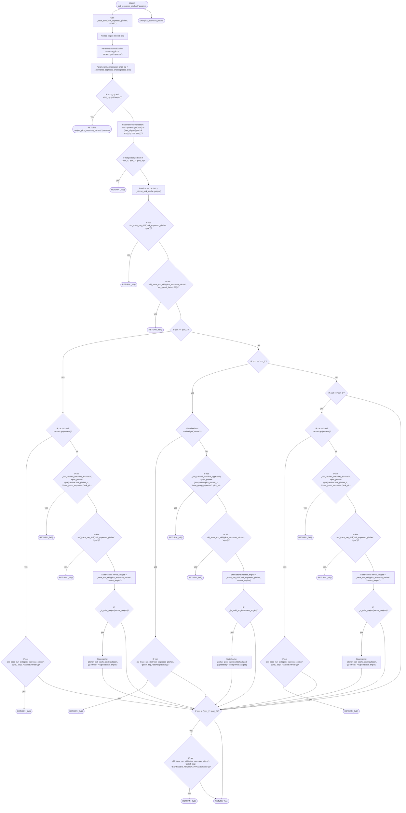

### `pour_espresso_pitcher_cup_station`

- **Mermaid file:** [../mermaid/espresso/pour_espresso_pitcher_cup_station.mmd](../mermaid/espresso/pour_espresso_pitcher_cup_station.mmd)
- **Parameter scenarios observed:** `position.cup_position / stage`
- **Branch/decision scenarios:**
  - `not ok(_trace_run_skill("pour_espresso_pitcher_cup_station", "gotoJ_deg", *ESPRESSO_PITCHER_FLOW_POSES['cup_station_entry']))`
  - `not ok(_trace_run_skill("pour_espresso_pitcher_cup_station", "gotoJ_deg", *ESPRESSO_PITCHER_PARAMS['inter']))`
  - `stage == 'stage_1'`
  - `not ok(_trace_run_skill("pour_espresso_pitcher_cup_station", "gotoJ_deg", *ESPRESSO_PITCHER_PARAMS['inter']))`
  - `not ok(_trace_run_skill("pour_espresso_pitcher_cup_station", "gotoJ_deg", *ESPRESSO_PITCHER_FLOW_POSES['cup_station_entry']))`
  - `not ok(_trace_run_skill("pour_espresso_pitcher_cup_station", "gotoJ_deg", *ESPRESSO_PITCHER_PARAMS['home']))`
  - `not ok(_trace_run_skill("pour_espresso_pitcher_cup_station", "gotoJ_deg", *ESPRESSO_PITCHER_PARAMS['pos1']))`
  - `not ok(_trace_run_skill("pour_espresso_pitcher_cup_station", "sync"))`
  - `not ok(_trace_run_skill("pour_espresso_pitcher_cup_station", "set_speed_factor", SPEED_SLOW_POURING))`
  - `not ok(_trace_run_skill("pour_espresso_pitcher_cup_station", "gotoJ_deg", *ESPRESSO_PITCHER_PARAMS['pour1.1']))`
  - `not ok(_trace_run_skill("pour_espresso_pitcher_cup_station", "gotoJ_deg", *ESPRESSO_PITCHER_PARAMS['pour1.2']))`
  - `not ok(_trace_run_skill("pour_espresso_pitcher_cup_station", "gotoJ_deg", *ESPRESSO_PITCHER_PARAMS['pour1.3']))`
  - `not ok(_trace_run_skill("pour_espresso_pitcher_cup_station", "sync"))`
  - `not ok(_trace_run_skill("pour_espresso_pitcher_cup_station", "set_speed_factor", 100))`
  - `not ok(_trace_run_skill("pour_espresso_pitcher_cup_station", "gotoJ_deg", *ESPRESSO_PITCHER_PARAMS['neutral1']))`
  - `stage == 'stage_2'`
  - `not ok(_trace_run_skill("pour_espresso_pitcher_cup_station", "gotoJ_deg", *ESPRESSO_PITCHER_PARAMS['pos2']))`
  - `not ok(_trace_run_skill("pour_espresso_pitcher_cup_station", "sync"))`
  - `not ok(_trace_run_skill("pour_espresso_pitcher_cup_station", "set_speed_factor", SPEED_SLOW_POURING))`
  - `not ok(_trace_run_skill("pour_espresso_pitcher_cup_station", "gotoJ_deg", *ESPRESSO_PITCHER_PARAMS['pour2.1']))`
  - `not ok(_trace_run_skill("pour_espresso_pitcher_cup_station", "gotoJ_deg", *ESPRESSO_PITCHER_PARAMS['pour2.2']))`
  - `not ok(_trace_run_skill("pour_espresso_pitcher_cup_station", "gotoJ_deg", *ESPRESSO_PITCHER_PARAMS['pour2.3']))`
  - `not ok(_trace_run_skill("pour_espresso_pitcher_cup_station", "sync"))`
  - `not ok(_trace_run_skill("pour_espresso_pitcher_cup_station", "set_speed_factor", 100))`
  - `not ok(_trace_run_skill("pour_espresso_pitcher_cup_station", "gotoJ_deg", *ESPRESSO_PITCHER_PARAMS['neutral2']))`
  - ... 19 more in source/chart

```mermaid
flowchart TD
  N0(["START pour_espresso_pitcher_cup_station(**params)"])
  N1["Nested helper defined: ok()"]
  N2["Parameter/normalization: cup_position = _extract_cup_position(params)"]
  N3{"IF not ok(_trace_run_skill('pour_espresso_pitcher_cup_station', 'gotoJ_deg', *ESPRESSO_PITCHER_FLOW_POSES('cup_statio..."}
  N4(["RETURN _fail()"])
  N5{"IF not ok(_trace_run_skill('pour_espresso_pitcher_cup_station', 'gotoJ_deg', *ESPRESSO_PITCHER_PARAMS('inter')))?"}
  N6(["RETURN _fail()"])
  N7{"IF stage == 'stage_1'?"}
  N8{"IF not ok(_trace_run_skill('pour_espresso_pitcher_cup_station', 'gotoJ_deg', *ESPRESSO_PITCHER_PARAMS('pos1')))?"}
  N9(["RETURN _fail()"])
  N10{"IF not ok(_trace_run_skill('pour_espresso_pitcher_cup_station', 'sync'))?"}
  N11(["RETURN _fail()"])
  N12{"IF not ok(_trace_run_skill('pour_espresso_pitcher_cup_station', 'set_speed_factor', SPEED_SLOW_POURING))?"}
  N13(["RETURN _fail()"])
  N14{"IF not ok(_trace_run_skill('pour_espresso_pitcher_cup_station', 'gotoJ_deg', *ESPRESSO_PITCHER_PARAMS('pour1.1')))?"}
  N15(["RETURN _fail()"])
  N16{"IF not ok(_trace_run_skill('pour_espresso_pitcher_cup_station', 'gotoJ_deg', *ESPRESSO_PITCHER_PARAMS('pour1.2')))?"}
  N17(["RETURN _fail()"])
  N18{"IF not ok(_trace_run_skill('pour_espresso_pitcher_cup_station', 'gotoJ_deg', *ESPRESSO_PITCHER_PARAMS('pour1.3')))?"}
  N19(["RETURN _fail()"])
  N20{"IF not ok(_trace_run_skill('pour_espresso_pitcher_cup_station', 'sync'))?"}
  N21(["RETURN _fail()"])
  N22{"IF not ok(_trace_run_skill('pour_espresso_pitcher_cup_station', 'set_speed_factor', 100))?"}
  N23(["RETURN _fail()"])
  N24{"IF not ok(_trace_run_skill('pour_espresso_pitcher_cup_station', 'gotoJ_deg', *ESPRESSO_PITCHER_PARAMS('neutral1')))?"}
  N25(["RETURN _fail()"])
  N26{"IF stage == 'stage_2'?"}
  N27{"IF not ok(_trace_run_skill('pour_espresso_pitcher_cup_station', 'gotoJ_deg', *ESPRESSO_PITCHER_PARAMS('pos2')))?"}
  N28(["RETURN _fail()"])
  N29{"IF not ok(_trace_run_skill('pour_espresso_pitcher_cup_station', 'sync'))?"}
  N30(["RETURN _fail()"])
  N31{"IF not ok(_trace_run_skill('pour_espresso_pitcher_cup_station', 'set_speed_factor', SPEED_SLOW_POURING))?"}
  N32(["RETURN _fail()"])
  N33{"IF not ok(_trace_run_skill('pour_espresso_pitcher_cup_station', 'gotoJ_deg', *ESPRESSO_PITCHER_PARAMS('pour2.1')))?"}
  N34(["RETURN _fail()"])
  N35{"IF not ok(_trace_run_skill('pour_espresso_pitcher_cup_station', 'gotoJ_deg', *ESPRESSO_PITCHER_PARAMS('pour2.2')))?"}
  N36(["RETURN _fail()"])
  N37{"IF not ok(_trace_run_skill('pour_espresso_pitcher_cup_station', 'gotoJ_deg', *ESPRESSO_PITCHER_PARAMS('pour2.3')))?"}
  N38(["RETURN _fail()"])
  N39{"IF not ok(_trace_run_skill('pour_espresso_pitcher_cup_station', 'sync'))?"}
  N40(["RETURN _fail()"])
  N41{"IF not ok(_trace_run_skill('pour_espresso_pitcher_cup_station', 'set_speed_factor', 100))?"}
  N42(["RETURN _fail()"])
  N43{"IF not ok(_trace_run_skill('pour_espresso_pitcher_cup_station', 'gotoJ_deg', *ESPRESSO_PITCHER_PARAMS('neutral2')))?"}
  N44(["RETURN _fail()"])
  N45{"IF stage == 'stage_3'?"}
  N46{"IF not ok(_trace_run_skill('pour_espresso_pitcher_cup_station', 'gotoJ_deg', *ESPRESSO_PITCHER_PARAMS('pos3')))?"}
  N47(["RETURN _fail()"])
  N48{"IF not ok(_trace_run_skill('pour_espresso_pitcher_cup_station', 'sync'))?"}
  N49(["RETURN _fail()"])
  N50{"IF not ok(_trace_run_skill('pour_espresso_pitcher_cup_station', 'set_speed_factor', SPEED_SLOW_POURING))?"}
  N51(["RETURN _fail()"])
  N52{"IF not ok(_trace_run_skill('pour_espresso_pitcher_cup_station', 'gotoJ_deg', *ESPRESSO_PITCHER_PARAMS('pour3.1')))?"}
  N53(["RETURN _fail()"])
  N54{"IF not ok(_trace_run_skill('pour_espresso_pitcher_cup_station', 'gotoJ_deg', *ESPRESSO_PITCHER_PARAMS('pour3.2')))?"}
  N55(["RETURN _fail()"])
  N56{"IF not ok(_trace_run_skill('pour_espresso_pitcher_cup_station', 'gotoJ_deg', *ESPRESSO_PITCHER_PARAMS('pour3.3')))?"}
  N57(["RETURN _fail()"])
  N58{"IF not ok(_trace_run_skill('pour_espresso_pitcher_cup_station', 'sync'))?"}
  N59(["RETURN _fail()"])
  N60{"IF not ok(_trace_run_skill('pour_espresso_pitcher_cup_station', 'set_speed_factor', 100))?"}
  N61(["RETURN _fail()"])
  N62{"IF not ok(_trace_run_skill('pour_espresso_pitcher_cup_station', 'gotoJ_deg', *ESPRESSO_PITCHER_PARAMS('neutral3')))?"}
  N63(["RETURN _fail()"])
  N64{"IF not ok(_trace_run_skill('pour_espresso_pitcher_cup_station', 'gotoJ_deg', *ESPRESSO_PITCHER_PARAMS('pos4')))?"}
  N65(["RETURN _fail()"])
  N66{"IF not ok(_trace_run_skill('pour_espresso_pitcher_cup_station', 'sync'))?"}
  N67(["RETURN _fail()"])
  N68{"IF not ok(_trace_run_skill('pour_espresso_pitcher_cup_station', 'set_speed_factor', SPEED_SLOW_POURING))?"}
  N69(["RETURN _fail()"])
  N70{"IF not ok(_trace_run_skill('pour_espresso_pitcher_cup_station', 'gotoJ_deg', *ESPRESSO_PITCHER_PARAMS('pour4.1')))?"}
  N71(["RETURN _fail()"])
  N72{"IF not ok(_trace_run_skill('pour_espresso_pitcher_cup_station', 'gotoJ_deg', *ESPRESSO_PITCHER_PARAMS('pour4.2')))?"}
  N73(["RETURN _fail()"])
  N74{"IF not ok(_trace_run_skill('pour_espresso_pitcher_cup_station', 'gotoJ_deg', *ESPRESSO_PITCHER_PARAMS('pour4.3')))?"}
  N75(["RETURN _fail()"])
  N76{"IF not ok(_trace_run_skill('pour_espresso_pitcher_cup_station', 'sync'))?"}
  N77(["RETURN _fail()"])
  N78{"IF not ok(_trace_run_skill('pour_espresso_pitcher_cup_station', 'set_speed_factor', 100))?"}
  N79(["RETURN _fail()"])
  N80{"IF not ok(_trace_run_skill('pour_espresso_pitcher_cup_station', 'gotoJ_deg', *ESPRESSO_PITCHER_PARAMS('neutral4')))?"}
  N81(["RETURN _fail()"])
  N82{"IF not ok(_trace_run_skill('pour_espresso_pitcher_cup_station', 'gotoJ_deg', *ESPRESSO_PITCHER_PARAMS('inter')))?"}
  N83(["RETURN _fail()"])
  N84{"IF not ok(_trace_run_skill('pour_espresso_pitcher_cup_station', 'gotoJ_deg', *ESPRESSO_PITCHER_FLOW_POSES('cup_statio..."}
  N85(["RETURN _fail()"])
  N86{"IF not ok(_trace_run_skill('pour_espresso_pitcher_cup_station', 'gotoJ_deg', *ESPRESSO_PITCHER_PARAMS('home')))?"}
  N87(["RETURN _fail()"])
  N88(["RETURN True"])
  N89(["END pour_espresso_pitcher_cup_station"])
  N0 --> N1
  N1 --> N2
  N2 --> N3
  N3 -- "yes" --> N4
  N3 --> N5
  N5 -- "yes" --> N6
  N5 --> N7
  N7 -- "yes" --> N8
  N8 -- "yes" --> N9
  N8 --> N10
  N10 -- "yes" --> N11
  N10 --> N12
  N12 -- "yes" --> N13
  N12 --> N14
  N14 -- "yes" --> N15
  N14 --> N16
  N16 -- "yes" --> N17
  N16 --> N18
  N18 -- "yes" --> N19
  N18 --> N20
  N20 -- "yes" --> N21
  N20 --> N22
  N22 -- "yes" --> N23
  N22 --> N24
  N24 -- "yes" --> N25
  N7 -- "no" --> N26
  N26 -- "yes" --> N27
  N27 -- "yes" --> N28
  N27 --> N29
  N29 -- "yes" --> N30
  N29 --> N31
  N31 -- "yes" --> N32
  N31 --> N33
  N33 -- "yes" --> N34
  N33 --> N35
  N35 -- "yes" --> N36
  N35 --> N37
  N37 -- "yes" --> N38
  N37 --> N39
  N39 -- "yes" --> N40
  N39 --> N41
  N41 -- "yes" --> N42
  N41 --> N43
  N43 -- "yes" --> N44
  N26 -- "no" --> N45
  N45 -- "yes" --> N46
  N46 -- "yes" --> N47
  N46 --> N48
  N48 -- "yes" --> N49
  N48 --> N50
  N50 -- "yes" --> N51
  N50 --> N52
  N52 -- "yes" --> N53
  N52 --> N54
  N54 -- "yes" --> N55
  N54 --> N56
  N56 -- "yes" --> N57
  N56 --> N58
  N58 -- "yes" --> N59
  N58 --> N60
  N60 -- "yes" --> N61
  N60 --> N62
  N62 -- "yes" --> N63
  N45 -- "no" --> N64
  N64 -- "yes" --> N65
  N64 --> N66
  N66 -- "yes" --> N67
  N66 --> N68
  N68 -- "yes" --> N69
  N68 --> N70
  N70 -- "yes" --> N71
  N70 --> N72
  N72 -- "yes" --> N73
  N72 --> N74
  N74 -- "yes" --> N75
  N74 --> N76
  N76 -- "yes" --> N77
  N76 --> N78
  N78 -- "yes" --> N79
  N78 --> N80
  N80 -- "yes" --> N81
  N24 --> N82
  N43 --> N82
  N62 --> N82
  N80 --> N82
  N82 -- "yes" --> N83
  N82 --> N84
  N84 -- "yes" --> N85
  N84 --> N86
  N86 -- "yes" --> N87
  N86 --> N88
  N0 --> N89
```

### `get_hot_water`

- **Mermaid file:** [../mermaid/espresso/get_hot_water.mmd](../mermaid/espresso/get_hot_water.mmd)
- **Parameter scenarios observed:** none directly read
- **Branch/decision scenarios:**
  - `not _run_cached_machine_approach( "get_hot_water:approach:hot_water", "three_group_espresso", "hot_water", )`
  - `not _run_cached_machine_mount( "get_hot_water:mount:hot_water", "three_group_espresso", "hot_water", )`
  - `not ok(_trace_run_skill("get_hot_water", "moveEE_movJ", *ESPRESSO_MOVEMENT_OFFSETS['hot_water_move']))`

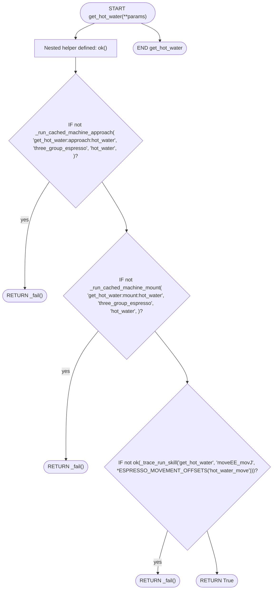

### `with_hot_water`

- **Mermaid file:** [../mermaid/espresso/with_hot_water.mmd](../mermaid/espresso/with_hot_water.mmd)
- **Parameter scenarios observed:** none directly read
- **Branch/decision scenarios:**
  - `not ok(_trace_run_skill("with_hot_water", "set_speed_factor", ESPRESSO_SPEEDS['hot_water_pour']))`
  - `not ok(_trace_run_skill("with_hot_water", "moveEE_movJ", *ESPRESSO_MOVEMENT_OFFSETS['hot_water_retreat']))`

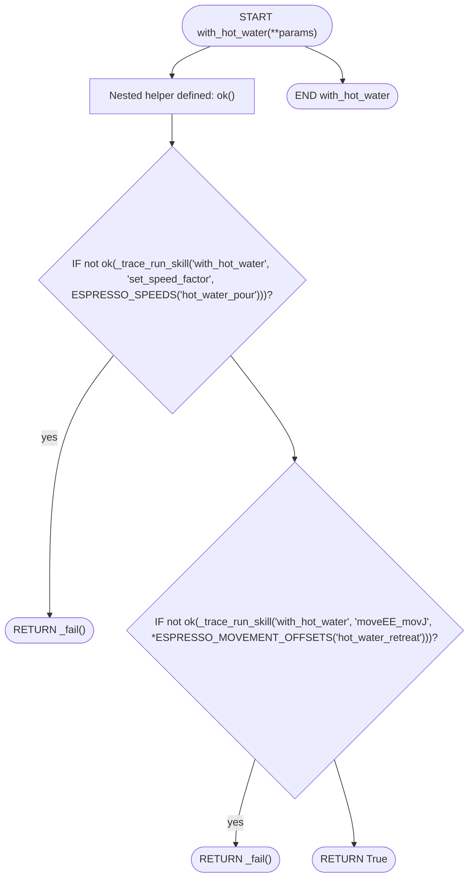

### `return_espresso_pitcher`

- **Mermaid file:** [../mermaid/espresso/return_espresso_pitcher.mmd](../mermaid/espresso/return_espresso_pitcher.mmd)
- **Parameter scenarios observed:** `espresso`, `port`
- **Branch/decision scenarios:**
  - `shot_cfg and shot_cfg.get("angled")`
  - `not port or port not in ('port_1', 'port_2', 'port_3')`
  - `port == 'port_1'`
  - `not _run_cached_machine_approach( f"return_pitcher:{port}:final_approach:pick_pitcher_2", "three_group_espresso", "pick_pitcher_2", )`
  - `not ok(_trace_run_skill("return_espresso_pitcher", "gotoJ_deg", *ESPRESSO_HOME))`
  - `cached and cached.get('approach')`
  - `cached and cached.get('mount')`
  - `not ok(_trace_run_skill("return_espresso_pitcher", "sync"))`
  - `not ok(_trace_run_skill("return_espresso_pitcher", "set_gripper_position", 35,0,255))`
  - `not ok(_trace_run_skill("return_espresso_pitcher", "sync"))`
  - `cached and cached.get('retreat')`
  - `port == 'port_2'`
  - `not ok(_trace_run_skill("return_espresso_pitcher", "gotoJ_deg", *cached['approach']))`
  - `not _run_cached_machine_approach( f"return_pitcher:{port}:approach:pick_pitcher_1", "three_group_espresso", "pick_pitcher_1", )`
  - `not ok(_trace_run_skill("return_espresso_pitcher", "sync"))`
  - `_is_valid_angles(approach_angles)`
  - `not ok(_trace_run_skill("return_espresso_pitcher", "gotoJ_deg", *cached['mount']))`
  - `not _run_cached_machine_mount( f"return_pitcher:{port}:mount:pick_pitcher_1", "three_group_espresso", "pick_pitcher_1", )`
  - `not ok(_trace_run_skill("return_espresso_pitcher", "sync"))`
  - `_is_valid_angles(mount_angles)`
  - `not ok(_trace_run_skill("return_espresso_pitcher", "gotoJ_deg", *cached['retreat']))`
  - `not _run_cached_machine_approach( f"return_pitcher:{port}:retreat:pick_pitcher_1", "three_group_espresso", "pick_pitcher_1", )`
  - `not ok(_trace_run_skill("return_espresso_pitcher", "sync"))`
  - `_is_valid_angles(retreat_angles)`
  - `cached and cached.get('mount')`
  - ... 26 more in source/chart

```mermaid
flowchart TD
  N0(["START return_espresso_pitcher(**params)"])
  N1["Nested helper defined: ok()"]
  N2["Parameter/normalization: espresso_dict = params.get('espresso')"]
  N3["Parameter/normalization: shot_cfg = _normalize_espresso_shot(espresso_dict)"]
  N4{"IF shot_cfg and shot_cfg.get('angled')?"}
  N5(["RETURN angled_return_espresso_pitcher(**params)"])
  N6["Parameter/normalization: port = params.get('port') or (shot_cfg.get('port') if shot_cfg else 'port_1')"]
  N7{"IF not port or port not in ('port_1', 'port_2', 'port_3')?"}
  N8(["RETURN _fail()"])
  N9["State/cache: cached = _pitcher_return_cache.get(port)"]
  N10{"IF port == 'port_1'?"}
  N11{"IF cached and cached.get('approach')?"}
  N12{"IF not ok(_trace_run_skill('return_espresso_pitcher', 'gotoJ_deg', *cached('approach')))?"}
  N13(["RETURN _fail()"])
  N14{"IF not _run_cached_machine_approach( f'return_pitcher:(port):approach:pick_pitcher_1', 'three_group_espresso', 'pick_..."}
  N15(["RETURN _fail()"])
  N16{"IF not ok(_trace_run_skill('return_espresso_pitcher', 'sync'))?"}
  N17(["RETURN _fail()"])
  N18["State/cache: approach_angles = _trace_run_skill('return_espresso_pitcher', 'current_angles')"]
  N19{"IF _is_valid_angles(approach_angles)?"}
  N20["State/cache: _pitcher_return_cache.setdefault(port, ())('approach') = tuple(approach_angles)"]
  N21{"IF cached and cached.get('mount')?"}
  N22{"IF not ok(_trace_run_skill('return_espresso_pitcher', 'gotoJ_deg', *cached('mount')))?"}
  N23(["RETURN _fail()"])
  N24{"IF not _run_cached_machine_mount( f'return_pitcher:(port):mount:pick_pitcher_1', 'three_group_espresso', 'pick_pitche..."}
  N25(["RETURN _fail()"])
  N26{"IF not ok(_trace_run_skill('return_espresso_pitcher', 'sync'))?"}
  N27(["RETURN _fail()"])
  N28["State/cache: mount_angles = _trace_run_skill('return_espresso_pitcher', 'current_angles')"]
  N29{"IF _is_valid_angles(mount_angles)?"}
  N30["State/cache: _pitcher_return_cache.setdefault(port, ())('mount') = tuple(mount_angles)"]
  N31{"IF not ok(_trace_run_skill('return_espresso_pitcher', 'sync'))?"}
  N32(["RETURN _fail()"])
  N33{"IF not ok(_trace_run_skill('return_espresso_pitcher', 'set_gripper_position', 35,0,255))?"}
  N34(["RETURN _fail()"])
  N35{"IF not ok(_trace_run_skill('return_espresso_pitcher', 'sync'))?"}
  N36(["RETURN _fail()"])
  N37{"IF cached and cached.get('retreat')?"}
  N38{"IF not ok(_trace_run_skill('return_espresso_pitcher', 'gotoJ_deg', *cached('retreat')))?"}
  N39(["RETURN _fail()"])
  N40{"IF not _run_cached_machine_approach( f'return_pitcher:(port):retreat:pick_pitcher_1', 'three_group_espresso', 'pick_p..."}
  N41(["RETURN _fail()"])
  N42{"IF not ok(_trace_run_skill('return_espresso_pitcher', 'sync'))?"}
  N43(["RETURN _fail()"])
  N44["State/cache: retreat_angles = _trace_run_skill('return_espresso_pitcher', 'current_angles')"]
  N45{"IF _is_valid_angles(retreat_angles)?"}
  N46["State/cache: _pitcher_return_cache.setdefault(port, ())('retreat') = tuple(retreat_angles)"]
  N47{"IF port == 'port_2'?"}
  N48{"IF cached and cached.get('mount')?"}
  N49{"IF not ok(_trace_run_skill('return_espresso_pitcher', 'gotoJ_deg', *cached('mount')))?"}
  N50(["RETURN _fail()"])
  N51{"IF not _run_cached_machine_mount( f'return_pitcher:(port):mount:pick_pitcher_2', 'three_group_espresso', 'pick_pitche..."}
  N52(["RETURN _fail()"])
  N53{"IF not ok(_trace_run_skill('return_espresso_pitcher', 'sync'))?"}
  N54(["RETURN _fail()"])
  N55["State/cache: mount_angles = _trace_run_skill('return_espresso_pitcher', 'current_angles')"]
  N56{"IF _is_valid_angles(mount_angles)?"}
  N57["State/cache: _pitcher_return_cache.setdefault(port, ())('mount') = tuple(mount_angles)"]
  N58{"IF not ok(_trace_run_skill('return_espresso_pitcher', 'sync'))?"}
  N59(["RETURN _fail()"])
  N60{"IF not ok(_trace_run_skill('return_espresso_pitcher', 'set_gripper_position', 35,0,255))?"}
  N61(["RETURN _fail()"])
  N62{"IF not ok(_trace_run_skill('return_espresso_pitcher', 'sync'))?"}
  N63(["RETURN _fail()"])
  N64{"IF port == 'port_3'?"}
  N65{"IF cached and cached.get('approach')?"}
  N66{"IF not ok(_trace_run_skill('return_espresso_pitcher', 'gotoJ_deg', *cached('approach')))?"}
  N67(["RETURN _fail()"])
  N68{"IF not _run_cached_machine_approach( f'return_pitcher:(port):approach:pick_pitcher_3', 'three_group_espresso', 'pick_..."}
  N69(["RETURN _fail()"])
  N70{"IF not ok(_trace_run_skill('return_espresso_pitcher', 'sync'))?"}
  N71(["RETURN _fail()"])
  N72["State/cache: approach_angles = _trace_run_skill('return_espresso_pitcher', 'current_angles')"]
  N73{"IF _is_valid_angles(approach_angles)?"}
  N74["State/cache: _pitcher_return_cache.setdefault(port, ())('approach') = tuple(approach_angles)"]
  N75{"IF cached and cached.get('mount')?"}
  N76{"IF not ok(_trace_run_skill('return_espresso_pitcher', 'gotoJ_deg', *cached('mount')))?"}
  N77(["RETURN _fail()"])
  N78{"IF not _run_cached_machine_mount( f'return_pitcher:(port):mount:pick_pitcher_3', 'three_group_espresso', 'pick_pitche..."}
  N79(["RETURN _fail()"])
  N80{"IF not ok(_trace_run_skill('return_espresso_pitcher', 'sync'))?"}
  N81(["RETURN _fail()"])
  N82["State/cache: mount_angles = _trace_run_skill('return_espresso_pitcher', 'current_angles')"]
  N83{"IF _is_valid_angles(mount_angles)?"}
  N84["State/cache: _pitcher_return_cache.setdefault(port, ())('mount') = tuple(mount_angles)"]
  N85{"IF not ok(_trace_run_skill('return_espresso_pitcher', 'sync'))?"}
  N86(["RETURN _fail()"])
  N87{"IF not ok(_trace_run_skill('return_espresso_pitcher', 'set_gripper_position', 35,0,255))?"}
  N88(["RETURN _fail()"])
  N89{"IF not ok(_trace_run_skill('return_espresso_pitcher', 'sync'))?"}
  N90["... diagram capped for readability; source has additional low-level steps"]
  N91["... diagram capped for readability; source has additional low-level steps"]
  N92["... diagram capped for readability; source has additional low-level steps"]
  N93(["END return_espresso_pitcher"])
  N0 --> N1
  N1 --> N2
  N2 --> N3
  N3 --> N4
  N4 -- "yes" --> N5
  N4 --> N6
  N6 --> N7
  N7 -- "yes" --> N8
  N7 --> N9
  N9 --> N10
  N10 -- "yes" --> N11
  N11 -- "yes" --> N12
  N12 -- "yes" --> N13
  N11 -- "no" --> N14
  N14 -- "yes" --> N15
  N14 --> N16
  N16 -- "yes" --> N17
  N16 --> N18
  N18 --> N19
  N19 -- "yes" --> N20
  N12 --> N21
  N20 --> N21
  N19 --> N21
  N21 -- "yes" --> N22
  N22 -- "yes" --> N23
  N21 -- "no" --> N24
  N24 -- "yes" --> N25
  N24 --> N26
  N26 -- "yes" --> N27
  N26 --> N28
  N28 --> N29
  N29 -- "yes" --> N30
  N22 --> N31
  N30 --> N31
  N29 --> N31
  N31 -- "yes" --> N32
  N31 --> N33
  N33 -- "yes" --> N34
  N33 --> N35
  N35 -- "yes" --> N36
  N35 --> N37
  N37 -- "yes" --> N38
  N38 -- "yes" --> N39
  N37 -- "no" --> N40
  N40 -- "yes" --> N41
  N40 --> N42
  N42 -- "yes" --> N43
  N42 --> N44
  N44 --> N45
  N45 -- "yes" --> N46
  N10 -- "no" --> N47
  N47 -- "yes" --> N48
  N48 -- "yes" --> N49
  N49 -- "yes" --> N50
  N48 -- "no" --> N51
  N51 -- "yes" --> N52
  N51 --> N53
  N53 -- "yes" --> N54
  N53 --> N55
  N55 --> N56
  N56 -- "yes" --> N57
  N49 --> N58
  N57 --> N58
  N56 --> N58
  N58 -- "yes" --> N59
  N58 --> N60
  N60 -- "yes" --> N61
  N60 --> N62
  N62 -- "yes" --> N63
  N47 -- "no" --> N64
  N64 -- "yes" --> N65
  N65 -- "yes" --> N66
  N66 -- "yes" --> N67
  N65 -- "no" --> N68
  N68 -- "yes" --> N69
  N68 --> N70
  N70 -- "yes" --> N71
  N70 --> N72
  N72 --> N73
  N73 -- "yes" --> N74
  N66 --> N75
  N74 --> N75
  N73 --> N75
  N75 -- "yes" --> N76
  N76 -- "yes" --> N77
  N75 -- "no" --> N78
  N78 -- "yes" --> N79
  N78 --> N80
  N80 -- "yes" --> N81
  N80 --> N82
  N82 --> N83
  N83 -- "yes" --> N84
  N76 --> N85
  N84 --> N85
  N83 --> N85
  N85 -- "yes" --> N86
  N85 --> N87
  N87 -- "yes" --> N88
  N87 --> N89
  N89 -- "yes" --> N90
  N90 --> N91
  N89 --> N91
  N38 --> N92
  N46 --> N92
  N45 --> N92
  N62 --> N92
  N91 --> N92
  N64 --> N92
  N92 --> N93
```

### `return_cleaned_espresso_pitcher`

- **Mermaid file:** [../mermaid/espresso/return_cleaned_espresso_pitcher.mmd](../mermaid/espresso/return_cleaned_espresso_pitcher.mmd)
- **Parameter scenarios observed:** `espresso`, `port`
- **Branch/decision scenarios:**
  - `shot_cfg and shot_cfg.get("angled")`
  - `not port or port not in ('port_1', 'port_2', 'port_3')`
  - `not ok(_trace_run_skill("return_cleaned_espresso_pitcher", "gotoJ_deg", *ESPRESSO_HOME))`
  - `not _run_cached_machine_approach( f"return_clean_pitcher:{port}:approach:pick_pitcher_2", "three_group_espresso", "pick_pitcher_2", )`
  - `port == 'port_1'`
  - `not _run_cached_machine_approach( f"return_clean_pitcher:{port}:final_approach:pick_pitcher_2", "three_group_espresso", "pick_pitcher_2", )`
  - `not ok(_trace_run_skill("return_cleaned_espresso_pitcher", "gotoJ_deg", *ESPRESSO_HOME))`
  - `not _run_cached_machine_approach( f"return_clean_pitcher:{port}:approach:pick_pitcher_1", "three_group_espresso", "pick_pitcher_1", )`
  - `not _run_cached_machine_mount( f"return_clean_pitcher:{port}:mount:pick_pitcher_1", "three_group_espresso", "pick_pitcher_1", )`
  - `not ok(_trace_run_skill("return_cleaned_espresso_pitcher", "sync"))`
  - `not ok(_trace_run_skill("return_cleaned_espresso_pitcher", "set_gripper_position", 255,115,255))`
  - `cached`
  - `not ok(_trace_run_skill("return_cleaned_espresso_pitcher", "sync"))`
  - `not ok(_trace_run_skill("return_cleaned_espresso_pitcher", "set_gripper_position", 35,0,255))`
  - `not _run_cached_machine_approach( f"return_clean_pitcher:{port}:final_approach:pick_pitcher_1", "three_group_espresso", "pick_pitcher_1", )`
  - `port == 'port_2'`
  - `not ok(_trace_run_skill("return_cleaned_espresso_pitcher", "moveEE_movJ", 0, 0, 20, 0, 0, 0))`
  - `not ok(_trace_run_skill("return_cleaned_espresso_pitcher", "moveJ_deg", 0, 0, 0, 0, 0, -170))`
  - `not ok(_trace_run_skill("return_cleaned_espresso_pitcher", "sync"))`
  - `not ok(_trace_run_skill("return_cleaned_espresso_pitcher", "moveJ_deg", 0, 0, 0, 0, 0, 170))`
  - `not ok(_trace_run_skill("return_cleaned_espresso_pitcher", "moveEE_movJ", 0, 0, -20, 0, 0, 0))`
  - `all(_is_valid_angles(w) for w in waypoints)`
  - `not _run_cached_machine_mount( f"return_clean_pitcher:{port}:mount:pick_pitcher_2", "three_group_espresso", "pick_pitcher_2", )`
  - `not ok(_trace_run_skill("return_cleaned_espresso_pitcher", "sync"))`
  - `not ok(_trace_run_skill("return_cleaned_espresso_pitcher", "set_gripper_position", 255,115,255))`
  - ... 28 more in source/chart

```mermaid
flowchart TD
  N0(["START return_cleaned_espresso_pitcher(**params)"])
  N1["Nested helper defined: ok()"]
  N2["Parameter/normalization: espresso_dict = params.get('espresso')"]
  N3["Parameter/normalization: shot_cfg = _normalize_espresso_shot(espresso_dict)"]
  N4{"IF shot_cfg and shot_cfg.get('angled')?"}
  N5(["RETURN angled_return_cleaned_espresso_pitcher(**params)"])
  N6["Parameter/normalization: port = params.get('port') or (shot_cfg.get('port') if shot_cfg else 'port_1')"]
  N7{"IF not port or port not in ('port_1', 'port_2', 'port_3')?"}
  N8(["RETURN _fail()"])
  N9{"IF not ok(_trace_run_skill('return_cleaned_espresso_pitcher', 'gotoJ_deg', *ESPRESSO_HOME))?"}
  N10(["RETURN _fail()"])
  N11{"IF not _run_cached_machine_approach( f'return_clean_pitcher:(port):approach:pick_pitcher_2', 'three_group_espresso', ..."}
  N12(["RETURN _fail()"])
  N13["State/cache: cached = _pitcher_clean_cache.get(port)"]
  N14{"IF port == 'port_1'?"}
  N15{"IF not _run_cached_machine_approach( f'return_clean_pitcher:(port):approach:pick_pitcher_1', 'three_group_espresso', ..."}
  N16(["RETURN _fail()"])
  N17{"IF not _run_cached_machine_mount( f'return_clean_pitcher:(port):mount:pick_pitcher_1', 'three_group_espresso', 'pick_..."}
  N18(["RETURN _fail()"])
  N19{"IF not ok(_trace_run_skill('return_cleaned_espresso_pitcher', 'sync'))?"}
  N20(["RETURN _fail()"])
  N21{"IF not ok(_trace_run_skill('return_cleaned_espresso_pitcher', 'set_gripper_position', 255,115,255))?"}
  N22(["RETURN _fail()"])
  N23{"IF cached?"}
  N24{"LOOP angles in cached"}
  N25{"IF not ok(_trace_run_skill('return_cleaned_espresso_pitcher', 'gotoJ_deg', *angles))?"}
  N26(["RETURN _fail()"])
  N27{"IF not ok(_trace_run_skill('return_cleaned_espresso_pitcher', 'moveEE_movJ', 0, 0, 20, 0, 0, 0))?"}
  N28(["RETURN _fail()"])
  N29["Robot call: waypoints.append(_trace_run_skill('return_cleaned_espresso_pitcher', 'current_angles'))"]
  N30{"IF not ok(_trace_run_skill('return_cleaned_espresso_pitcher', 'moveJ_deg', 0, 0, 0, 0, 0, -170))?"}
  N31(["RETURN _fail()"])
  N32{"IF not ok(_trace_run_skill('return_cleaned_espresso_pitcher', 'sync'))?"}
  N33(["RETURN _fail()"])
  N34["Robot call: waypoints.append(_trace_run_skill('return_cleaned_espresso_pitcher', 'current_angles'))"]
  N35{"IF not ok(_trace_run_skill('return_cleaned_espresso_pitcher', 'moveJ_deg', 0, 0, 0, 0, 0, 170))?"}
  N36(["RETURN _fail()"])
  N37["Robot call: _trace_run_skill('return_cleaned_espresso_pitcher', 'sync')"]
  N38["Robot call: waypoints.append(_trace_run_skill('return_cleaned_espresso_pitcher', 'current_angles'))"]
  N39{"IF not ok(_trace_run_skill('return_cleaned_espresso_pitcher', 'moveEE_movJ', 0, 0, -20, 0, 0, 0))?"}
  N40(["RETURN _fail()"])
  N41["Robot call: waypoints.append(_trace_run_skill('return_cleaned_espresso_pitcher', 'current_angles'))"]
  N42{"IF all(_is_valid_angles(w) for w in waypoints)?"}
  N43["State/cache: _pitcher_clean_cache(port) = (tuple(w) for w in waypoints)"]
  N44{"IF not ok(_trace_run_skill('return_cleaned_espresso_pitcher', 'sync'))?"}
  N45(["RETURN _fail()"])
  N46{"IF not ok(_trace_run_skill('return_cleaned_espresso_pitcher', 'set_gripper_position', 35,0,255))?"}
  N47(["RETURN _fail()"])
  N48{"IF not _run_cached_machine_approach( f'return_clean_pitcher:(port):final_approach:pick_pitcher_1', 'three_group_espre..."}
  N49(["RETURN _fail()"])
  N50{"IF port == 'port_2'?"}
  N51{"IF not _run_cached_machine_mount( f'return_clean_pitcher:(port):mount:pick_pitcher_2', 'three_group_espresso', 'pick_..."}
  N52(["RETURN _fail()"])
  N53{"IF not ok(_trace_run_skill('return_cleaned_espresso_pitcher', 'sync'))?"}
  N54(["RETURN _fail()"])
  N55{"IF not ok(_trace_run_skill('return_cleaned_espresso_pitcher', 'set_gripper_position', 255,115,255))?"}
  N56(["RETURN _fail()"])
  N57{"IF cached?"}
  N58{"LOOP angles in cached"}
  N59{"IF not ok(_trace_run_skill('return_cleaned_espresso_pitcher', 'gotoJ_deg', *angles))?"}
  N60(["RETURN _fail()"])
  N61{"IF not ok(_trace_run_skill('return_cleaned_espresso_pitcher', 'moveEE_movJ', 0, 0, 20, 0, 0, 0))?"}
  N62(["RETURN _fail()"])
  N63["Robot call: waypoints.append(_trace_run_skill('return_cleaned_espresso_pitcher', 'current_angles'))"]
  N64{"IF not ok(_trace_run_skill('return_cleaned_espresso_pitcher', 'moveJ_deg', 0, 0, 0, 0, 0, -170))?"}
  N65(["RETURN _fail()"])
  N66{"IF not ok(_trace_run_skill('return_cleaned_espresso_pitcher', 'sync'))?"}
  N67(["RETURN _fail()"])
  N68["Robot call: waypoints.append(_trace_run_skill('return_cleaned_espresso_pitcher', 'current_angles'))"]
  N69{"IF not ok(_trace_run_skill('return_cleaned_espresso_pitcher', 'moveJ_deg', 0, 0, 0, 0, 0, 170))?"}
  N70(["RETURN _fail()"])
  N71{"IF not ok(_trace_run_skill('return_cleaned_espresso_pitcher', 'sync'))?"}
  N72(["RETURN _fail()"])
  N73["Robot call: waypoints.append(_trace_run_skill('return_cleaned_espresso_pitcher', 'current_angles'))"]
  N74{"IF not ok(_trace_run_skill('return_cleaned_espresso_pitcher', 'moveEE_movJ', 0, 0, -20, 0, 0, 0))?"}
  N75(["RETURN _fail()"])
  N76["Robot call: waypoints.append(_trace_run_skill('return_cleaned_espresso_pitcher', 'current_angles'))"]
  N77{"IF all(_is_valid_angles(w) for w in waypoints)?"}
  N78["State/cache: _pitcher_clean_cache(port) = (tuple(w) for w in waypoints)"]
  N79{"IF not ok(_trace_run_skill('return_cleaned_espresso_pitcher', 'sync'))?"}
  N80(["RETURN _fail()"])
  N81{"IF not ok(_trace_run_skill('return_cleaned_espresso_pitcher', 'set_gripper_position', 35,0,255))?"}
  N82(["RETURN _fail()"])
  N83{"IF port == 'port_3'?"}
  N84{"IF not _run_cached_machine_approach( f'return_clean_pitcher:(port):approach:pick_pitcher_3', 'three_group_espresso', ..."}
  N85(["RETURN _fail()"])
  N86{"IF not _run_cached_machine_mount( f'return_clean_pitcher:(port):mount:pick_pitcher_3', 'three_group_espresso', 'pick_..."}
  N87(["RETURN _fail()"])
  N88{"IF not ok(_trace_run_skill('return_cleaned_espresso_pitcher', 'sync'))?"}
  N89(["RETURN _fail()"])
  N90["... diagram capped for readability; source has additional low-level steps"]
  N91["... diagram capped for readability; source has additional low-level steps"]
  N92(["END return_cleaned_espresso_pitcher"])
  N0 --> N1
  N1 --> N2
  N2 --> N3
  N3 --> N4
  N4 -- "yes" --> N5
  N4 --> N6
  N6 --> N7
  N7 -- "yes" --> N8
  N7 --> N9
  N9 -- "yes" --> N10
  N9 --> N11
  N11 -- "yes" --> N12
  N11 --> N13
  N13 --> N14
  N14 -- "yes" --> N15
  N15 -- "yes" --> N16
  N15 --> N17
  N17 -- "yes" --> N18
  N17 --> N19
  N19 -- "yes" --> N20
  N19 --> N21
  N21 -- "yes" --> N22
  N21 --> N23
  N23 -- "yes" --> N24
  N24 -- "iterate" --> N25
  N25 -- "yes" --> N26
  N25 -- "next/retry" --> N24
  N23 -- "no" --> N27
  N27 -- "yes" --> N28
  N27 --> N29
  N29 --> N30
  N30 -- "yes" --> N31
  N30 --> N32
  N32 -- "yes" --> N33
  N32 --> N34
  N34 --> N35
  N35 -- "yes" --> N36
  N35 --> N37
  N37 --> N38
  N38 --> N39
  N39 -- "yes" --> N40
  N39 --> N41
  N41 --> N42
  N42 -- "yes" --> N43
  N24 --> N44
  N43 --> N44
  N42 --> N44
  N44 -- "yes" --> N45
  N44 --> N46
  N46 -- "yes" --> N47
  N46 --> N48
  N48 -- "yes" --> N49
  N14 -- "no" --> N50
  N50 -- "yes" --> N51
  N51 -- "yes" --> N52
  N51 --> N53
  N53 -- "yes" --> N54
  N53 --> N55
  N55 -- "yes" --> N56
  N55 --> N57
  N57 -- "yes" --> N58
  N58 -- "iterate" --> N59
  N59 -- "yes" --> N60
  N59 -- "next/retry" --> N58
  N57 -- "no" --> N61
  N61 -- "yes" --> N62
  N61 --> N63
  N63 --> N64
  N64 -- "yes" --> N65
  N64 --> N66
  N66 -- "yes" --> N67
  N66 --> N68
  N68 --> N69
  N69 -- "yes" --> N70
  N69 --> N71
  N71 -- "yes" --> N72
  N71 --> N73
  N73 --> N74
  N74 -- "yes" --> N75
  N74 --> N76
  N76 --> N77
  N77 -- "yes" --> N78
  N58 --> N79
  N78 --> N79
  N77 --> N79
  N79 -- "yes" --> N80
  N79 --> N81
  N81 -- "yes" --> N82
  N50 -- "no" --> N83
  N83 -- "yes" --> N84
  N84 -- "yes" --> N85
  N84 --> N86
  N86 -- "yes" --> N87
  N86 --> N88
  N88 -- "yes" --> N89
  N88 --> N90
  N48 --> N91
  N81 --> N91
  N90 --> N91
  N83 --> N91
  N91 --> N92
```

### `tamper`

- **Mermaid file:** [../mermaid/espresso/tamper.mmd](../mermaid/espresso/tamper.mmd)
- **Parameter scenarios observed:** `espresso`, `portafilter_tool`
- **Branch/decision scenarios:**
  - `shot_cfg and shot_cfg.get("angled")`
  - `portafilter_tool not in ("single_portafilter", "double_portafilter")`
  - `not ok(_trace_run_skill("tamper", "gotoJ_deg", *ESPRESSO_GRINDER_HOME))`
  - `not _move_to_tool_pick_pose()`
  - `_is_valid_angles(post_grab_pose)`
  - `not _is_valid_angles(post_grab_pose)`
  - `not ok(_trace_run_skill("tamper", "moveEE", 0, 0, 40, 0, 0, 0))`
  - `not _run_cached_machine_mount( f"tamper:{portafilter_tool}:mount:grinder", "espresso_grinder", "grinder", )`
  - `not _run_cached_machine_approach( f"tamper:{portafilter_tool}:approach:grinder", "espresso_grinder", "grinder", )`
  - `not ok(_trace_run_skill("tamper", "gotoJ_deg", *ESPRESSO_GRINDER_HOME))`
  - `not success`
  - `_is_valid_angles(cached_tool_pick_pose)`
  - `not ok(_trace_run_skill("tamper._move_to_tool_pick_pose", "sync"))`
  - `not ok(_trace_run_skill( "tamper._move_to_tool_pick_pose", "move_to", portafilter_tool, 0.22, ))`
  - `not ok(_trace_run_skill("tamper._move_to_tool_pick_pose", "sync"))`
  - `not ok(_trace_run_skill( "tamper._move_to_tool_pick_pose", "approach_tool", portafilter_tool, ))`
  - `not ok(_trace_run_skill("tamper._grab_then_close_and_verify", "sync"))`
  - `not ok(_trace_run_skill( "tamper._grab_then_close_and_verify", "grab_tool", portafilter_tool, ))`
  - `not ok(_trace_run_skill("tamper._grab_then_close_and_verify", "sync"))`
  - `not ok(_trace_run_skill("tamper", "gotoJ_deg", *post_grab_pose))`
  - `not ok(_trace_run_skill("tamper", "sync"))`
  - `not gripped`
  - `not gripped`
  - `not _is_valid_angles(post_grab_angles)`
  - `not ok(_trace_run_skill( "tamper._move_to_tool_pick_pose", "gotoJ_deg", *cached_tool_pick_pose, ))`
  - ... 7 more in source/chart

```mermaid
flowchart TD
  N0(["START tamper(**params)"])
  N1["Nested helper defined: ok()"]
  N2["Parameter/normalization: espresso_dict = params.get('espresso')"]
  N3["Parameter/normalization: shot_cfg = _normalize_espresso_shot(espresso_dict)"]
  N4{"IF shot_cfg and shot_cfg.get('angled')?"}
  N5(["RETURN angled_tamper(**params)"])
  N6["Parameter/normalization: portafilter_tool = ( params.get('portafilter_tool') or (shot_cfg.get('portafilter_tool') if ..."]
  N7{"IF portafilter_tool not in ('single_portafilter', 'double_portafilter')?"}
  N8(["RETURN _fail()"])
  N9["Nested helper defined: _close_and_verify_grip()"]
  N10["Nested helper defined: _move_to_tool_pick_pose()"]
  N11["Nested helper defined: _grab_then_close_and_verify()"]
  N12{"IF not ok(_trace_run_skill('tamper', 'gotoJ_deg', *ESPRESSO_GRINDER_HOME))?"}
  N13(["RETURN _fail()"])
  N14{"IF not _move_to_tool_pick_pose()?"}
  N15(["RETURN _fail()"])
  N16["State/cache: post_grab_pose = _tamper_post_grab_joints_cache.get(portafilter_tool)"]
  N17{"IF _is_valid_angles(post_grab_pose)?"}
  N18{"IF not ok(_trace_run_skill('tamper', 'gotoJ_deg', *post_grab_pose))?"}
  N19(["RETURN _fail()"])
  N20{"IF not ok(_trace_run_skill('tamper', 'sync'))?"}
  N21(["RETURN _fail()"])
  N22["State/cache: gripped, pos = _close_and_verify_grip()"]
  N23{"IF not gripped?"}
  N24["Call: _gripper_log.warning( f'(TAMPER-GRIP) cached post-grab verification failed: ' f'tool=(portafilter_tool), pos=(p..."]
  N25["Call: _tamper_post_grab_joints_cache.pop(portafilter_tool, None)"]
  N26{"IF not ok(_trace_run_skill('tamper', 'set_gripper_position', 255, 0, 255))?"}
  N27(["RETURN _fail()"])
  N28{"IF not ok(_trace_run_skill('tamper', 'sync'))?"}
  N29(["RETURN _fail()"])
  N30{"IF not _is_valid_angles(post_grab_pose)?"}
  N31["State/cache: gripped = False"]
  N32{"LOOP attempt in range(1, TAMPER_GRIP_RETRIES + 1)"}
  N33{"IF attempt > 1?"}
  N34["Call: _gripper_log.warning( f'(TAMPER-GRIP) retry (attempt)/(TAMPER_GRIP_RETRIES): ' f'tool=(portafilter_tool), previ..."]
  N35{"IF not ok(_trace_run_skill('tamper', 'set_gripper_position', 255, 0, 255))?"}
  N36(["RETURN _fail()"])
  N37{"IF not ok(_trace_run_skill('tamper', 'sync'))?"}
  N38(["RETURN _fail()"])
  N39{"IF not _move_to_tool_pick_pose()?"}
  N40(["RETURN _fail()"])
  N41["State/cache: gripped, pos = _grab_then_close_and_verify()"]
  N42{"IF gripped?"}
  N43["BREAK"]
  N44{"IF not gripped?"}
  N45(["RETURN _fail()"])
  N46["State/cache: post_grab_angles = _trace_run_skill('tamper', 'current_angles')"]
  N47{"IF not _is_valid_angles(post_grab_angles)?"}
  N48(["RETURN _fail()"])
  N49["State/cache: _tamper_post_grab_joints_cache(portafilter_tool) = tuple(post_grab_angles)"]
  N50{"IF not ok(_trace_run_skill('tamper', 'moveEE', 0, 0, 40, 0, 0, 0))?"}
  N51(["RETURN _fail()"])
  N52{"IF not _run_cached_machine_mount( f'tamper:(portafilter_tool):mount:grinder', 'espresso_grinder', 'grinder', )?"}
  N53(["RETURN _fail()"])
  N54{"IF not _run_cached_machine_approach( f'tamper:(portafilter_tool):approach:grinder', 'espresso_grinder', 'grinder', )?"}
  N55(["RETURN _fail()"])
  N56{"IF not ok(_trace_run_skill('tamper', 'gotoJ_deg', *ESPRESSO_GRINDER_HOME))?"}
  N57(["RETURN _fail()"])
  N58(["RETURN True"])
  N59(["END tamper"])
  N0 --> N1
  N1 --> N2
  N2 --> N3
  N3 --> N4
  N4 -- "yes" --> N5
  N4 --> N6
  N6 --> N7
  N7 -- "yes" --> N8
  N7 --> N9
  N9 --> N10
  N10 --> N11
  N11 --> N12
  N12 -- "yes" --> N13
  N12 --> N14
  N14 -- "yes" --> N15
  N14 --> N16
  N16 --> N17
  N17 -- "yes" --> N18
  N18 -- "yes" --> N19
  N18 --> N20
  N20 -- "yes" --> N21
  N20 --> N22
  N22 --> N23
  N23 -- "yes" --> N24
  N24 --> N25
  N25 --> N26
  N26 -- "yes" --> N27
  N26 --> N28
  N28 -- "yes" --> N29
  N28 --> N30
  N23 --> N30
  N17 --> N30
  N30 -- "yes" --> N31
  N31 --> N32
  N32 -- "iterate" --> N33
  N33 -- "yes" --> N34
  N34 --> N35
  N35 -- "yes" --> N36
  N35 --> N37
  N37 -- "yes" --> N38
  N37 --> N39
  N39 -- "yes" --> N40
  N39 --> N41
  N33 --> N41
  N41 --> N42
  N42 -- "yes" --> N43
  N43 -- "next/retry" --> N32
  N42 -- "next/retry" --> N32
  N32 --> N44
  N44 -- "yes" --> N45
  N44 --> N46
  N46 --> N47
  N47 -- "yes" --> N48
  N47 --> N49
  N49 --> N50
  N30 --> N50
  N50 -- "yes" --> N51
  N50 --> N52
  N52 -- "yes" --> N53
  N52 --> N54
  N54 -- "yes" --> N55
  N54 --> N56
  N56 -- "yes" --> N57
  N56 --> N58
  N0 --> N59
```

### `single_tamper`

- **Mermaid file:** [../mermaid/espresso/single_tamper.mmd](../mermaid/espresso/single_tamper.mmd)
- **Parameter scenarios observed:** none directly read

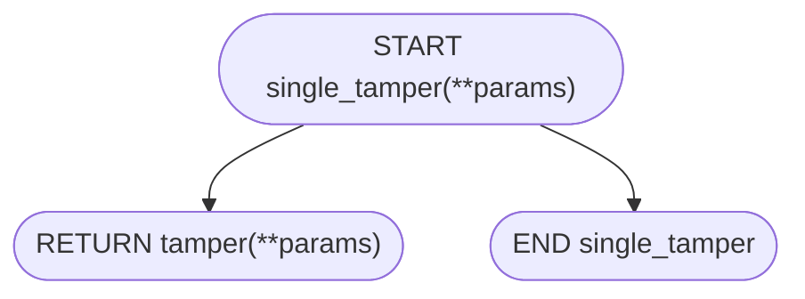

### `double_tamper`

- **Mermaid file:** [../mermaid/espresso/double_tamper.mmd](../mermaid/espresso/double_tamper.mmd)
- **Parameter scenarios observed:** `espresso`
- **Branch/decision scenarios:**
  - `shot_cfg and shot_cfg.get("angled")`

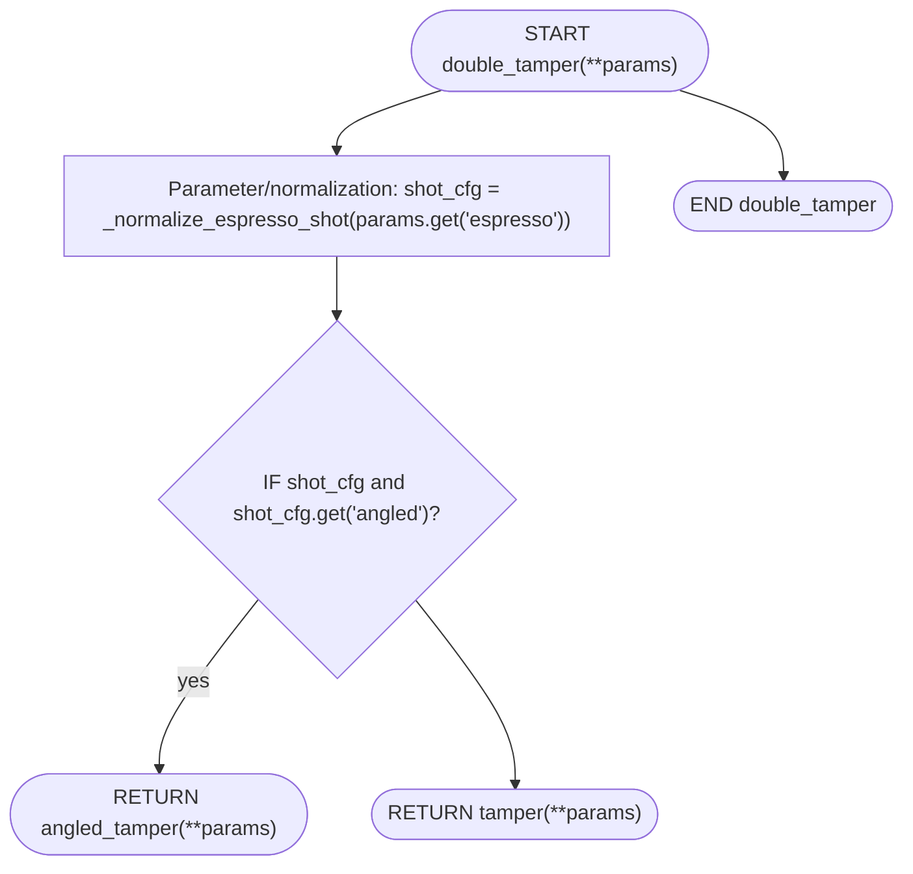

### `unmount_single`

- **Mermaid file:** [../mermaid/espresso/unmount_single.mmd](../mermaid/espresso/unmount_single.mmd)
- **Parameter scenarios observed:** none directly read

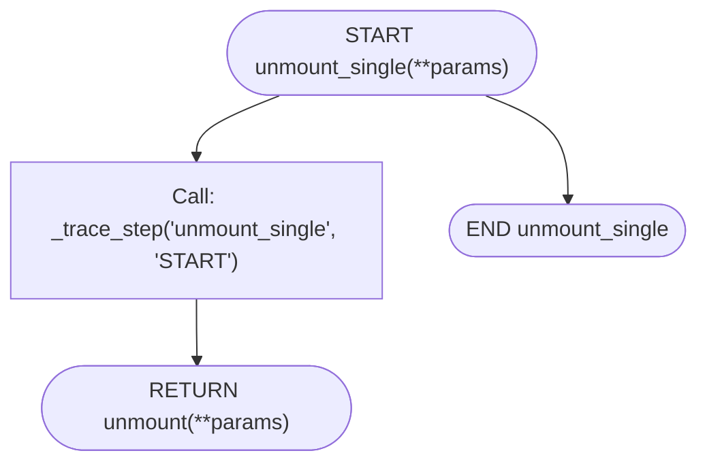

### `unmount_double`

- **Mermaid file:** [../mermaid/espresso/unmount_double.mmd](../mermaid/espresso/unmount_double.mmd)
- **Parameter scenarios observed:** `espresso`
- **Branch/decision scenarios:**
  - `shot_cfg and shot_cfg.get("angled")`

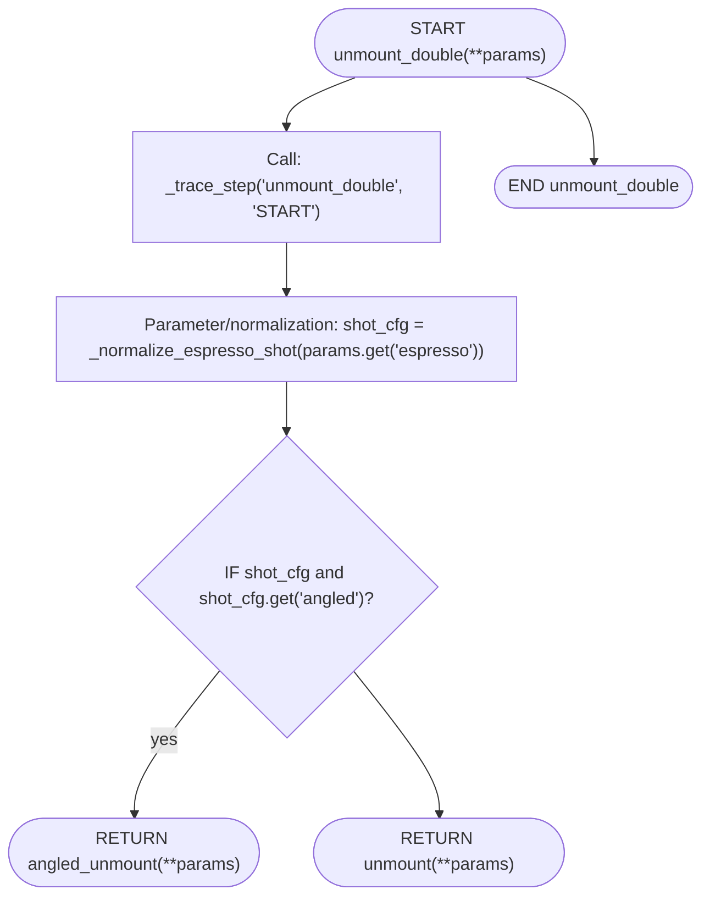

### `mount_single`

- **Mermaid file:** [../mermaid/espresso/mount_single.mmd](../mermaid/espresso/mount_single.mmd)
- **Parameter scenarios observed:** none directly read

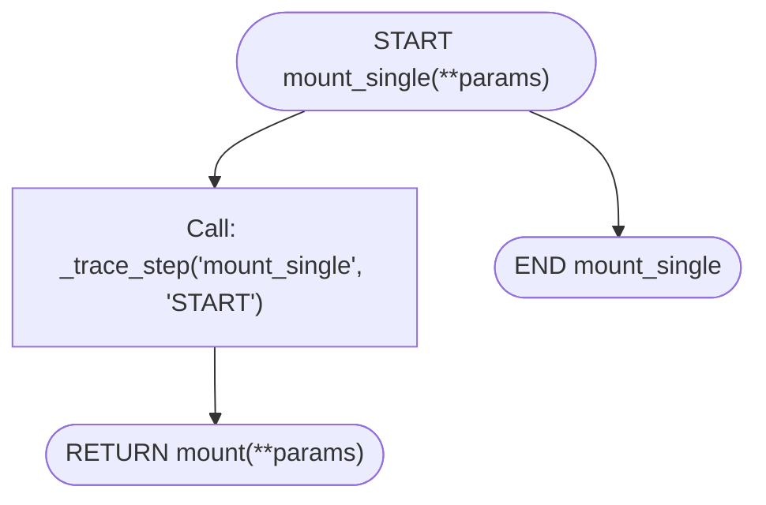

### `mount_double`

- **Mermaid file:** [../mermaid/espresso/mount_double.mmd](../mermaid/espresso/mount_double.mmd)
- **Parameter scenarios observed:** `espresso`
- **Branch/decision scenarios:**
  - `shot_cfg and shot_cfg.get("angled")`

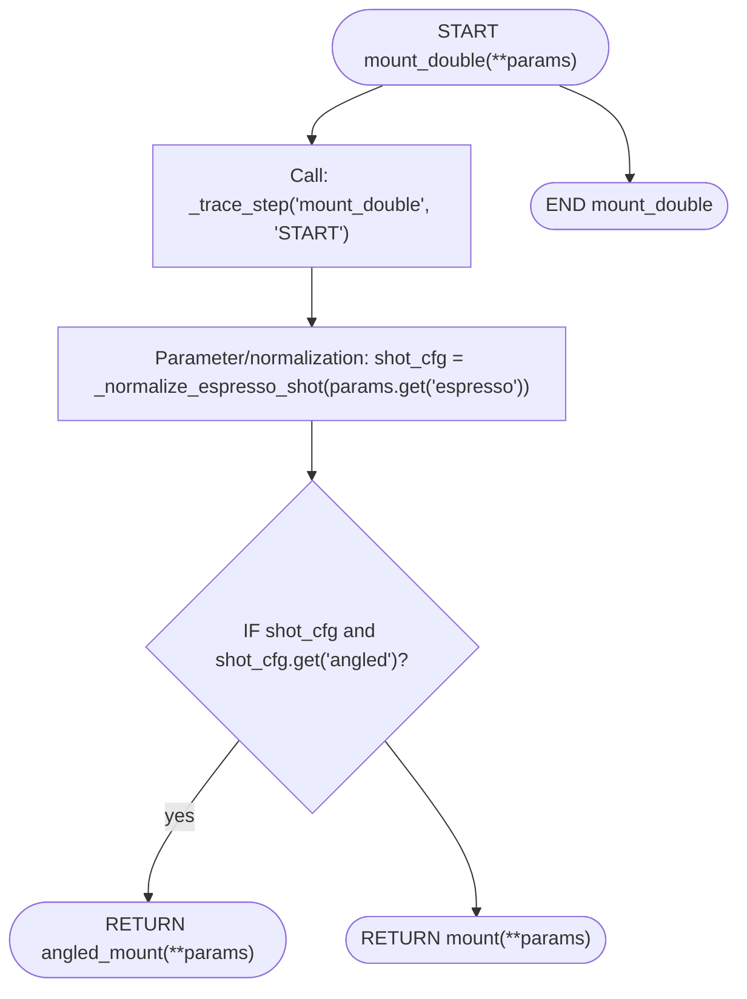

### `single_pick_espresso_pitcher`

- **Mermaid file:** [../mermaid/espresso/single_pick_espresso_pitcher.mmd](../mermaid/espresso/single_pick_espresso_pitcher.mmd)
- **Parameter scenarios observed:** none directly read

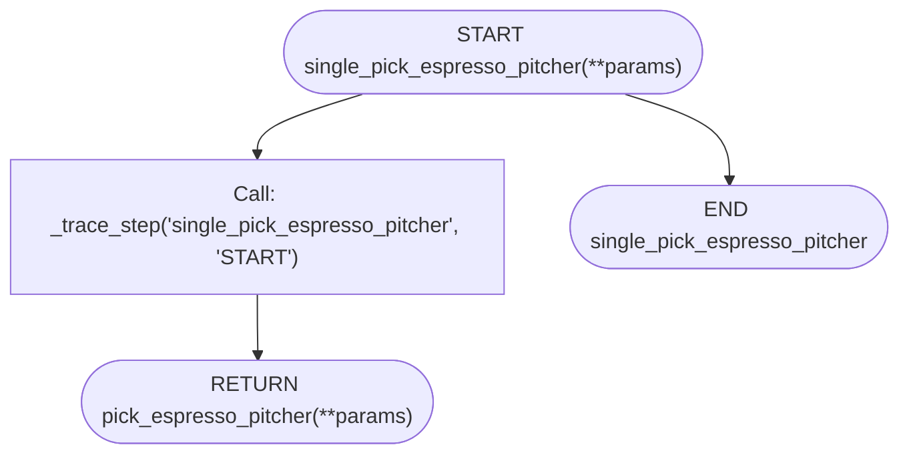

### `double_pick_espresso_pitcher`

- **Mermaid file:** [../mermaid/espresso/double_pick_espresso_pitcher.mmd](../mermaid/espresso/double_pick_espresso_pitcher.mmd)
- **Parameter scenarios observed:** `espresso`
- **Branch/decision scenarios:**
  - `shot_cfg and shot_cfg.get("angled")`

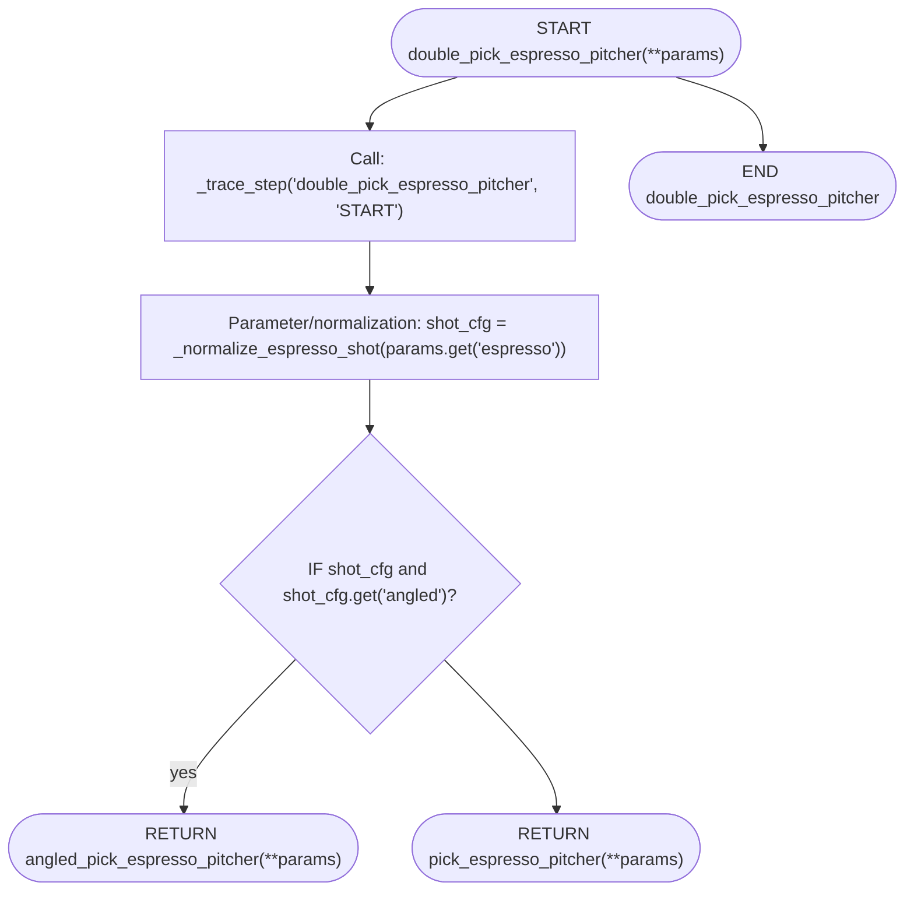

### `single_pour_espresso_pitcher_cup_station`

- **Mermaid file:** [../mermaid/espresso/single_pour_espresso_pitcher_cup_station.mmd](../mermaid/espresso/single_pour_espresso_pitcher_cup_station.mmd)
- **Parameter scenarios observed:** none directly read

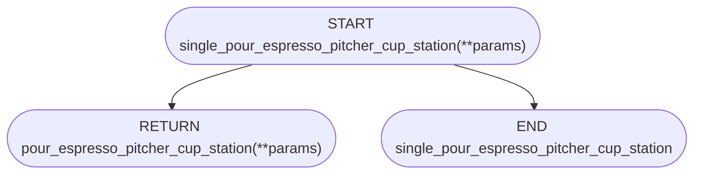

### `double_pour_espresso_pitcher_cup_station`

- **Mermaid file:** [../mermaid/espresso/double_pour_espresso_pitcher_cup_station.mmd](../mermaid/espresso/double_pour_espresso_pitcher_cup_station.mmd)
- **Parameter scenarios observed:** `espresso`
- **Branch/decision scenarios:**
  - `shot_cfg and shot_cfg.get("angled")`

```mermaid
flowchart TD
  N0(["START double_pour_espresso_pitcher_cup_station(**params)"])
  N1["Parameter/normalization: shot_cfg = _normalize_espresso_shot(params.get('espresso'))"]
  N2{"IF shot_cfg and shot_cfg.get('angled')?"}
  N3(["RETURN angled_pour_espresso_pitcher_cup_station(**params)"])
  N4(["RETURN pour_espresso_pitcher_cup_station(**params)"])
  N5(["END double_pour_espresso_pitcher_cup_station"])
  N0 --> N1
  N1 --> N2
  N2 -- "yes" --> N3
  N2 --> N4
  N0 --> N5
```

### `single_return_espresso_pitcher`

- **Mermaid file:** [../mermaid/espresso/single_return_espresso_pitcher.mmd](../mermaid/espresso/single_return_espresso_pitcher.mmd)
- **Parameter scenarios observed:** none directly read

```mermaid
flowchart TD
  N0(["START single_return_espresso_pitcher(**params)"])
  N1(["RETURN return_espresso_pitcher(**params)"])
  N2(["END single_return_espresso_pitcher"])
  N0 --> N1
  N0 --> N2
```

### `double_return_espresso_pitcher`

- **Mermaid file:** [../mermaid/espresso/double_return_espresso_pitcher.mmd](../mermaid/espresso/double_return_espresso_pitcher.mmd)
- **Parameter scenarios observed:** `espresso`
- **Branch/decision scenarios:**
  - `shot_cfg and shot_cfg.get("angled")`

```mermaid
flowchart TD
  N0(["START double_return_espresso_pitcher(**params)"])
  N1["Parameter/normalization: shot_cfg = _normalize_espresso_shot(params.get('espresso'))"]
  N2{"IF shot_cfg and shot_cfg.get('angled')?"}
  N3(["RETURN angled_return_espresso_pitcher(**params)"])
  N4(["RETURN return_espresso_pitcher(**params)"])
  N5(["END double_return_espresso_pitcher"])
  N0 --> N1
  N1 --> N2
  N2 -- "yes" --> N3
  N2 --> N4
  N0 --> N5
```

### `single_return_cleaned_espresso_pitcher`

- **Mermaid file:** [../mermaid/espresso/single_return_cleaned_espresso_pitcher.mmd](../mermaid/espresso/single_return_cleaned_espresso_pitcher.mmd)
- **Parameter scenarios observed:** none directly read

```mermaid
flowchart TD
  N0(["START single_return_cleaned_espresso_pitcher(**params)"])
  N1(["RETURN return_cleaned_espresso_pitcher(**params)"])
  N2(["END single_return_cleaned_espresso_pitcher"])
  N0 --> N1
  N0 --> N2
```

### `double_return_cleaned_espresso_pitcher`

- **Mermaid file:** [../mermaid/espresso/double_return_cleaned_espresso_pitcher.mmd](../mermaid/espresso/double_return_cleaned_espresso_pitcher.mmd)
- **Parameter scenarios observed:** `espresso`
- **Branch/decision scenarios:**
  - `shot_cfg and shot_cfg.get("angled")`

```mermaid
flowchart TD
  N0(["START double_return_cleaned_espresso_pitcher(**params)"])
  N1["Parameter/normalization: shot_cfg = _normalize_espresso_shot(params.get('espresso'))"]
  N2{"IF shot_cfg and shot_cfg.get('angled')?"}
  N3(["RETURN angled_return_cleaned_espresso_pitcher(**params)"])
  N4(["RETURN return_cleaned_espresso_pitcher(**params)"])
  N5(["END double_return_cleaned_espresso_pitcher"])
  N0 --> N1
  N1 --> N2
  N2 -- "yes" --> N3
  N2 --> N4
  N0 --> N5
```

### `single_grab_espresso_pitcher`

- **Mermaid file:** [../mermaid/espresso/single_grab_espresso_pitcher.mmd](../mermaid/espresso/single_grab_espresso_pitcher.mmd)
- **Parameter scenarios observed:** none directly read

```mermaid
flowchart TD
  N0(["START single_grab_espresso_pitcher(**params)"])
  N1(["RETURN grab_espresso_pitcher(**params)"])
  N2(["END single_grab_espresso_pitcher"])
  N0 --> N1
  N0 --> N2
```

### `double_grab_espresso_pitcher`

- **Mermaid file:** [../mermaid/espresso/double_grab_espresso_pitcher.mmd](../mermaid/espresso/double_grab_espresso_pitcher.mmd)
- **Parameter scenarios observed:** `espresso`
- **Branch/decision scenarios:**
  - `shot_cfg and shot_cfg.get("angled")`

```mermaid
flowchart TD
  N0(["START double_grab_espresso_pitcher(**params)"])
  N1["Parameter/normalization: shot_cfg = _normalize_espresso_shot(params.get('espresso'))"]
  N2{"IF shot_cfg and shot_cfg.get('angled')?"}
  N3(["RETURN angled_grab_espresso_pitcher(**params)"])
  N4(["RETURN grab_espresso_pitcher(**params)"])
  N5(["END double_grab_espresso_pitcher"])
  N0 --> N1
  N1 --> N2
  N2 -- "yes" --> N3
  N2 --> N4
  N0 --> N5
```

### `single_grinder`

- **Mermaid file:** [../mermaid/espresso/single_grinder.mmd](../mermaid/espresso/single_grinder.mmd)
- **Parameter scenarios observed:** none directly read

```mermaid
flowchart TD
  N0(["START single_grinder(**params)"])
  N1(["RETURN grinder(**params)"])
  N2(["END single_grinder"])
  N0 --> N1
  N0 --> N2
```

### `double_grinder`

- **Mermaid file:** [../mermaid/espresso/double_grinder.mmd](../mermaid/espresso/double_grinder.mmd)
- **Parameter scenarios observed:** none directly read

```mermaid
flowchart TD
  N0(["START double_grinder(**params)"])
  N1(["RETURN grinder(**params)"])
  N2(["END double_grinder"])
  N0 --> N1
  N0 --> N2
```

### `angled_single_grinder`

- **Mermaid file:** [../mermaid/espresso/angled_single_grinder.mmd](../mermaid/espresso/angled_single_grinder.mmd)
- **Parameter scenarios observed:** none directly read

```mermaid
flowchart TD
  N0(["START angled_single_grinder(**params)"])
  N1(["RETURN angled_grinder(**params)"])
  N2(["END angled_single_grinder"])
  N0 --> N1
  N0 --> N2
```

### `angled_double_grinder`

- **Mermaid file:** [../mermaid/espresso/angled_double_grinder.mmd](../mermaid/espresso/angled_double_grinder.mmd)
- **Parameter scenarios observed:** none directly read

```mermaid
flowchart TD
  N0(["START angled_double_grinder(**params)"])
  N1(["RETURN angled_grinder(**params)"])
  N2(["END angled_double_grinder"])
  N0 --> N1
  N0 --> N2
```

### `angled_single_tamper`

- **Mermaid file:** [../mermaid/espresso/angled_single_tamper.mmd](../mermaid/espresso/angled_single_tamper.mmd)
- **Parameter scenarios observed:** none directly read

```mermaid
flowchart TD
  N0(["START angled_single_tamper(**params)"])
  N1(["RETURN angled_tamper(**params)"])
  N2(["END angled_single_tamper"])
  N0 --> N1
  N0 --> N2
```

### `angled_double_tamper`

- **Mermaid file:** [../mermaid/espresso/angled_double_tamper.mmd](../mermaid/espresso/angled_double_tamper.mmd)
- **Parameter scenarios observed:** none directly read

```mermaid
flowchart TD
  N0(["START angled_double_tamper(**params)"])
  N1(["RETURN angled_tamper(**params)"])
  N2(["END angled_double_tamper"])
  N0 --> N1
  N0 --> N2
```

### `angled_mount_single`

- **Mermaid file:** [../mermaid/espresso/angled_mount_single.mmd](../mermaid/espresso/angled_mount_single.mmd)
- **Parameter scenarios observed:** none directly read

```mermaid
flowchart TD
  N0(["START angled_mount_single(**params)"])
  N1["Call: _trace_step('angled_mount_single', 'START')"]
  N2(["RETURN angled_mount(**params)"])
  N3(["END angled_mount_single"])
  N0 --> N1
  N1 --> N2
  N0 --> N3
```

### `angled_mount_double`

- **Mermaid file:** [../mermaid/espresso/angled_mount_double.mmd](../mermaid/espresso/angled_mount_double.mmd)
- **Parameter scenarios observed:** none directly read

```mermaid
flowchart TD
  N0(["START angled_mount_double(**params)"])
  N1["Call: _trace_step('angled_mount_double', 'START')"]
  N2(["RETURN angled_mount(**params)"])
  N3(["END angled_mount_double"])
  N0 --> N1
  N1 --> N2
  N0 --> N3
```

### `angled_unmount_single`

- **Mermaid file:** [../mermaid/espresso/angled_unmount_single.mmd](../mermaid/espresso/angled_unmount_single.mmd)
- **Parameter scenarios observed:** none directly read

```mermaid
flowchart TD
  N0(["START angled_unmount_single(**params)"])
  N1["Call: _trace_step('angled_unmount_single', 'START')"]
  N2(["RETURN angled_unmount(**params)"])
  N3(["END angled_unmount_single"])
  N0 --> N1
  N1 --> N2
  N0 --> N3
```

### `angled_unmount_double`

- **Mermaid file:** [../mermaid/espresso/angled_unmount_double.mmd](../mermaid/espresso/angled_unmount_double.mmd)
- **Parameter scenarios observed:** none directly read

```mermaid
flowchart TD
  N0(["START angled_unmount_double(**params)"])
  N1["Call: _trace_step('angled_unmount_double', 'START')"]
  N2(["RETURN angled_unmount(**params)"])
  N3(["END angled_unmount_double"])
  N0 --> N1
  N1 --> N2
  N0 --> N3
```

### `angled_single_grab_espresso_pitcher`

- **Mermaid file:** [../mermaid/espresso/angled_single_grab_espresso_pitcher.mmd](../mermaid/espresso/angled_single_grab_espresso_pitcher.mmd)
- **Parameter scenarios observed:** none directly read

```mermaid
flowchart TD
  N0(["START angled_single_grab_espresso_pitcher(**params)"])
  N1(["RETURN angled_grab_espresso_pitcher(**params)"])
  N2(["END angled_single_grab_espresso_pitcher"])
  N0 --> N1
  N0 --> N2
```

### `angled_double_grab_espresso_pitcher`

- **Mermaid file:** [../mermaid/espresso/angled_double_grab_espresso_pitcher.mmd](../mermaid/espresso/angled_double_grab_espresso_pitcher.mmd)
- **Parameter scenarios observed:** none directly read

```mermaid
flowchart TD
  N0(["START angled_double_grab_espresso_pitcher(**params)"])
  N1(["RETURN angled_grab_espresso_pitcher(**params)"])
  N2(["END angled_double_grab_espresso_pitcher"])
  N0 --> N1
  N0 --> N2
```

### `angled_single_pick_espresso_pitcher`

- **Mermaid file:** [../mermaid/espresso/angled_single_pick_espresso_pitcher.mmd](../mermaid/espresso/angled_single_pick_espresso_pitcher.mmd)
- **Parameter scenarios observed:** none directly read

```mermaid
flowchart TD
  N0(["START angled_single_pick_espresso_pitcher(**params)"])
  N1["Call: _trace_step('angled_single_pick_espresso_pitcher', 'START')"]
  N2(["RETURN angled_pick_espresso_pitcher(**params)"])
  N3(["END angled_single_pick_espresso_pitcher"])
  N0 --> N1
  N1 --> N2
  N0 --> N3
```

### `angled_double_pick_espresso_pitcher`

- **Mermaid file:** [../mermaid/espresso/angled_double_pick_espresso_pitcher.mmd](../mermaid/espresso/angled_double_pick_espresso_pitcher.mmd)
- **Parameter scenarios observed:** none directly read

```mermaid
flowchart TD
  N0(["START angled_double_pick_espresso_pitcher(**params)"])
  N1["Call: _trace_step('angled_double_pick_espresso_pitcher', 'START')"]
  N2(["RETURN angled_pick_espresso_pitcher(**params)"])
  N3(["END angled_double_pick_espresso_pitcher"])
  N0 --> N1
  N1 --> N2
  N0 --> N3
```

### `angled_single_pour_espresso_pitcher_cup_station`

- **Mermaid file:** [../mermaid/espresso/angled_single_pour_espresso_pitcher_cup_station.mmd](../mermaid/espresso/angled_single_pour_espresso_pitcher_cup_station.mmd)
- **Parameter scenarios observed:** none directly read

```mermaid
flowchart TD
  N0(["START angled_single_pour_espresso_pitcher_cup_station(**params)"])
  N1(["RETURN angled_pour_espresso_pitcher_cup_station(**params)"])
  N2(["END angled_single_pour_espresso_pitcher_cup_station"])
  N0 --> N1
  N0 --> N2
```

### `angled_double_pour_espresso_pitcher_cup_station`

- **Mermaid file:** [../mermaid/espresso/angled_double_pour_espresso_pitcher_cup_station.mmd](../mermaid/espresso/angled_double_pour_espresso_pitcher_cup_station.mmd)
- **Parameter scenarios observed:** none directly read

```mermaid
flowchart TD
  N0(["START angled_double_pour_espresso_pitcher_cup_station(**params)"])
  N1(["RETURN angled_pour_espresso_pitcher_cup_station(**params)"])
  N2(["END angled_double_pour_espresso_pitcher_cup_station"])
  N0 --> N1
  N0 --> N2
```

### `angled_single_return_espresso_pitcher`

- **Mermaid file:** [../mermaid/espresso/angled_single_return_espresso_pitcher.mmd](../mermaid/espresso/angled_single_return_espresso_pitcher.mmd)
- **Parameter scenarios observed:** none directly read

```mermaid
flowchart TD
  N0(["START angled_single_return_espresso_pitcher(**params)"])
  N1(["RETURN angled_return_espresso_pitcher(**params)"])
  N2(["END angled_single_return_espresso_pitcher"])
  N0 --> N1
  N0 --> N2
```

### `angled_double_return_espresso_pitcher`

- **Mermaid file:** [../mermaid/espresso/angled_double_return_espresso_pitcher.mmd](../mermaid/espresso/angled_double_return_espresso_pitcher.mmd)
- **Parameter scenarios observed:** none directly read

```mermaid
flowchart TD
  N0(["START angled_double_return_espresso_pitcher(**params)"])
  N1(["RETURN angled_return_espresso_pitcher(**params)"])
  N2(["END angled_double_return_espresso_pitcher"])
  N0 --> N1
  N0 --> N2
```

### `angled_single_return_cleaned_espresso_pitcher`

- **Mermaid file:** [../mermaid/espresso/angled_single_return_cleaned_espresso_pitcher.mmd](../mermaid/espresso/angled_single_return_cleaned_espresso_pitcher.mmd)
- **Parameter scenarios observed:** none directly read

```mermaid
flowchart TD
  N0(["START angled_single_return_cleaned_espresso_pitcher(**params)"])
  N1(["RETURN angled_return_cleaned_espresso_pitcher(**params)"])
  N2(["END angled_single_return_cleaned_espresso_pitcher"])
  N0 --> N1
  N0 --> N2
```

### `angled_double_return_cleaned_espresso_pitcher`

- **Mermaid file:** [../mermaid/espresso/angled_double_return_cleaned_espresso_pitcher.mmd](../mermaid/espresso/angled_double_return_cleaned_espresso_pitcher.mmd)
- **Parameter scenarios observed:** none directly read

```mermaid
flowchart TD
  N0(["START angled_double_return_cleaned_espresso_pitcher(**params)"])
  N1(["RETURN angled_return_cleaned_espresso_pitcher(**params)"])
  N2(["END angled_double_return_cleaned_espresso_pitcher"])
  N0 --> N1
  N0 --> N2
```

## Support/helper functions

### `_trace_run_skill`

Trace every run_skill call without changing its return value.

- **Mermaid file:** [../mermaid/espresso/_trace_run_skill.mmd](../mermaid/espresso/_trace_run_skill.mmd)
- **Parameter scenarios observed:** none directly read
- **Branch/decision scenarios:**
  - `globals().get("ESPRESSO_TRACE_DEBUG", True)`
  - `globals().get("ESPRESSO_TRACE_DEBUG", True)`

```mermaid
flowchart TD
  N0(["START _trace_run_skill(**params)"])
  N1{"IF globals().get('ESPRESSO_TRACE_DEBUG', True)?"}
  N2["Robot call: print(f'(TRACE:(scope)) run_skill('(skill_name)') START args=(args)', flush=True)"]
  N3["Robot call: result = run_skill(skill_name, *args)"]
  N4{"IF globals().get('ESPRESSO_TRACE_DEBUG', True)?"}
  N5["Robot call: print( f'(TRACE:(scope)) run_skill('(skill_name)') DONE result=(_trace_format_result(result))', flush=Tru..."]
  N6(["RETURN result"])
  N7(["END _trace_run_skill"])
  N0 --> N1
  N1 -- "yes" --> N2
  N2 --> N3
  N1 --> N3
  N3 --> N4
  N4 -- "yes" --> N5
  N5 --> N6
  N4 --> N6
  N0 --> N7
```

### `detect_cup_gripper`

Trace wrapper around detect_cup_gripper(...).

- **Mermaid file:** [../mermaid/espresso/detect_cup_gripper.mmd](../mermaid/espresso/detect_cup_gripper.mmd)
- **Parameter scenarios observed:** none directly read

```mermaid
flowchart TD
  N0(["START detect_cup_gripper(**params)"])
  N1["Call: _trace_step('PAPER-CUPS', f'detect_cup_gripper START args=(_trace_format_value(args)) kwargs=(_trace_format_val..."]
  N2["Call: result = _raw_detect_cup_gripper(*args, **kwargs)"]
  N3["Call: _trace_step('PAPER-CUPS', f'detect_cup_gripper DONE result=(_trace_format_value(result))')"]
  N4(["RETURN result"])
  N5(["END detect_cup_gripper"])
  N0 --> N1
  N1 --> N2
  N2 --> N3
  N3 --> N4
  N0 --> N5
```

### `_portafilter_clear_up_offset`

Use per-port learned Z from last live unmount, else params default.

- **Mermaid file:** [../mermaid/espresso/_portafilter_clear_up_offset.mmd](../mermaid/espresso/_portafilter_clear_up_offset.mmd)
- **Parameter scenarios observed:** none directly read
- **Branch/decision scenarios:**
  - `z is not None`

```mermaid
flowchart TD
  N0(["START _portafilter_clear_up_offset(**params)"])
  N1{"IF z is not None?"}
  N2(["RETURN (0.0, 0.0, float(z), 0.0, 0.0, 0.0)"])
  N3(["RETURN tuple(float(x) for x in base)"])
  N4(["END _portafilter_clear_up_offset"])
  N0 --> N1
  N1 -- "yes" --> N2
  N1 --> N3
  N0 --> N4
```

### `_portafilter_clear_up_angled_offset`

Angled mount clear-up: learned Z from last live angled unmount, else params default.

- **Mermaid file:** [../mermaid/espresso/_portafilter_clear_up_angled_offset.mmd](../mermaid/espresso/_portafilter_clear_up_angled_offset.mmd)
- **Parameter scenarios observed:** none directly read
- **Branch/decision scenarios:**
  - `z is not None`

```mermaid
flowchart TD
  N0(["START _portafilter_clear_up_angled_offset(**params)"])
  N1{"IF z is not None?"}
  N2(["RETURN (float(base(0)), float(base(1)), float(z), float(base(3)), float(base(4)), float(base(5)))"])
  N3(["RETURN tuple(float(x) for x in base)"])
  N4(["END _portafilter_clear_up_angled_offset"])
  N0 --> N1
  N1 -- "yes" --> N2
  N1 --> N3
  N0 --> N4
```

### `_angled_unmount_grab_tool_name`

Portafilter tool frame for angled unmount grab (per robot teach).

- **Mermaid file:** [../mermaid/espresso/_angled_unmount_grab_tool_name.mmd](../mermaid/espresso/_angled_unmount_grab_tool_name.mmd)
- **Parameter scenarios observed:** none directly read
- **Branch/decision scenarios:**
  - `str(port) == "angled_portafilter_2"`

```mermaid
flowchart TD
  N0(["START _angled_unmount_grab_tool_name(**params)"])
  N1["Call: _trace_step('_angled_unmount_grab_tool_name', 'START')"]
  N2{"IF str(port) == 'angled_portafilter_2'?"}
  N3(["RETURN 'single_portafilter_angled'"])
  N4(["RETURN 'double_portafilter_angled'"])
  N5(["END _angled_unmount_grab_tool_name"])
  N0 --> N1
  N1 --> N2
  N2 -- "yes" --> N3
  N2 --> N4
  N0 --> N5
```

### `_open_gripper_with_verify`

Send gripper-open (position 0) and verify it actually reached a low position. Retries up to _GRIPPER_OPEN_RETRIES times if the reported position is above _GRIPPER_OPEN_MAX_POS (gripper did not physically open).

- **Mermaid file:** [../mermaid/espresso/_open_gripper_with_verify.mmd](../mermaid/espresso/_open_gripper_with_verify.mmd)
- **Parameter scenarios observed:** none directly read
- **Branch/decision scenarios:**
  - `not success`
  - `actual_pos is not None and actual_pos <= _GRIPPER_OPEN_MAX_POS`

```mermaid
flowchart TD
  N0(["START _open_gripper_with_verify(**params)"])
  N1{"LOOP attempt in range(1, _GRIPPER_OPEN_RETRIES + 1)"}
  N2["Call: success, actual_pos = node.set_gripper_position(speed=speed, position=0, force=force)"]
  N3{"IF not success?"}
  N4["Call: _gripper_log.error(f'(GRIPPER-OPEN) command failed (attempt (attempt)/(_GRIPPER_OPEN_RETRIES))')"]
  N5["Call: time.sleep(0.3)"]
  N6["CONTINUE"]
  N7{"IF actual_pos is not None and actual_pos <= _GRIPPER_OPEN_MAX_POS?"}
  N8(["RETURN True"])
  N9["Call: _gripper_log.warning( f'(GRIPPER-OPEN) position (actual_pos) > (_GRIPPER_OPEN_MAX_POS), ' f'retrying (attempt (..."]
  N10["Call: time.sleep(0.3)"]
  N11["Call: _gripper_log.error(f'(GRIPPER-OPEN) failed to open after (_GRIPPER_OPEN_RETRIES) attempts')"]
  N12(["RETURN _fail()"])
  N13(["END _open_gripper_with_verify"])
  N0 --> N1
  N1 -- "iterate" --> N2
  N2 --> N3
  N3 -- "yes" --> N4
  N4 --> N5
  N5 --> N6
  N6 --> N7
  N3 --> N7
  N7 -- "yes" --> N8
  N7 --> N9
  N9 --> N10
  N10 -- "next/retry" --> N1
  N1 --> N11
  N11 --> N12
  N0 --> N13
```

### `invalidate_port_cache`

- **Mermaid file:** [../mermaid/espresso/invalidate_port_cache.mmd](../mermaid/espresso/invalidate_port_cache.mmd)
- **Parameter scenarios observed:** none directly read

```mermaid
flowchart TD
  N0(["START invalidate_port_cache(**params)"])
  N1["Call: _trace_step('invalidate_port_cache', 'START')"]
  N2["Call: _port_angle_cache.clear()"]
  N3["Call: _pitcher_clean_cache.clear()"]
  N4["Call: _pitcher_pick_cache.clear()"]
  N5["Call: _pitcher_return_cache.clear()"]
  N6["Call: _tool_pick_pose_cache.clear()"]
  N7["Call: _grinder_post_mount_cache.clear()"]
  N8["Call: _mount_runtime_cache.clear()"]
  N9["Call: _machine_approach_pose_cache.clear()"]
  N10["Call: _machine_mount_pose_cache.clear()"]
  N11["Call: _unmount_post_grab_joints_cache.clear()"]
  N12["Call: _tamper_post_grab_joints_cache.clear()"]
  N13["Call: _angled_tamper_post_grab_joints_cache.clear()"]
  N14["Call: _portafilter_mount_arc_cmd_by_port.clear()"]
  N15(["END invalidate_port_cache"])
  N0 --> N1
  N1 --> N2
  N2 --> N3
  N3 --> N4
  N4 --> N5
  N5 --> N6
  N6 --> N7
  N7 --> N8
  N8 --> N9
  N9 --> N10
  N10 --> N11
  N11 --> N12
  N12 --> N13
  N13 --> N14
  N14 --> N15
```

### `_is_valid_angles`

- **Mermaid file:** [../mermaid/espresso/_is_valid_angles.mmd](../mermaid/espresso/_is_valid_angles.mmd)
- **Parameter scenarios observed:** none directly read

```mermaid
flowchart TD
  N0(["START _is_valid_angles(**params)"])
  N1(["RETURN bool(angles) and isinstance(angles, (tuple, list)) and len(angles) == 6"])
  N2(["END _is_valid_angles"])
  N0 --> N1
  N0 --> N2
```

### `_run_cached_machine_approach`

Replay a cached pose captured immediately after a successful approach_machine(...). If no cache exists yet, run the live approach, sync, capture current_angles, and cache them.

- **Mermaid file:** [../mermaid/espresso/_run_cached_machine_approach.mmd](../mermaid/espresso/_run_cached_machine_approach.mmd)
- **Parameter scenarios observed:** none directly read
- **Branch/decision scenarios:**
  - `_is_valid_angles(cached_angles)`
  - `_trace_run_skill("_run_cached_machine_approach", "approach_machine", machine_name, target_name) in (False, None)`
  - `_trace_run_skill("_run_cached_machine_approach", "sync") in (False, None)`
  - `not _is_valid_angles(captured_angles)`
  - `_trace_run_skill("_run_cached_machine_approach", "gotoJ_deg", *cached_angles) in (False, None)`

```mermaid
flowchart TD
  N0(["START _run_cached_machine_approach(**params)"])
  N1["Call: _trace_step('_run_cached_machine_approach', 'START')"]
  N2["State/cache: cached_angles = _machine_approach_pose_cache.get(cache_key)"]
  N3{"IF _is_valid_angles(cached_angles)?"}
  N4["Call: _trace_step('_run_cached_machine_approach', f'cache HIT key=(cache_key)')"]
  N5{"IF _trace_run_skill('_run_cached_machine_approach', 'gotoJ_deg', *cached_angles) in (False, None)?"}
  N6(["RETURN _fail()"])
  N7(["RETURN True"])
  N8["Call: _trace_step('_run_cached_machine_approach', f'cache MISS key=(cache_key); live approach (machine_name)/(target_..."]
  N9{"IF _trace_run_skill('_run_cached_machine_approach', 'approach_machine', machine_name, target_name) in (False, None)?"}
  N10(["RETURN _fail()"])
  N11{"IF _trace_run_skill('_run_cached_machine_approach', 'sync') in (False, None)?"}
  N12(["RETURN _fail()"])
  N13["State/cache: captured_angles = _trace_run_skill('_run_cached_machine_approach', 'current_angles')"]
  N14{"IF not _is_valid_angles(captured_angles)?"}
  N15(["RETURN _fail()"])
  N16["State/cache: _machine_approach_pose_cache(cache_key) = tuple(captured_angles)"]
  N17(["RETURN True"])
  N18(["END _run_cached_machine_approach"])
  N0 --> N1
  N1 --> N2
  N2 --> N3
  N3 -- "yes" --> N4
  N4 --> N5
  N5 -- "yes" --> N6
  N5 --> N7
  N3 --> N8
  N8 --> N9
  N9 -- "yes" --> N10
  N9 --> N11
  N11 -- "yes" --> N12
  N11 --> N13
  N13 --> N14
  N14 -- "yes" --> N15
  N14 --> N16
  N16 --> N17
  N0 --> N18
```

### `_run_cached_machine_mount`

Replay a cached pose captured immediately after a successful mount_machine(...). If no cache exists yet, run the live mount, sync, capture current_angles, and cache them.

- **Mermaid file:** [../mermaid/espresso/_run_cached_machine_mount.mmd](../mermaid/espresso/_run_cached_machine_mount.mmd)
- **Parameter scenarios observed:** none directly read
- **Branch/decision scenarios:**
  - `_is_valid_angles(cached_angles)`
  - `_trace_run_skill("_run_cached_machine_mount", "mount_machine", machine_name, target_name) in (False, None)`
  - `_trace_run_skill("_run_cached_machine_mount", "sync") in (False, None)`
  - `not _is_valid_angles(captured_angles)`
  - `_trace_run_skill("_run_cached_machine_mount", "gotoJ_deg", *cached_angles) in (False, None)`

```mermaid
flowchart TD
  N0(["START _run_cached_machine_mount(**params)"])
  N1["Call: _trace_step('_run_cached_machine_mount', 'START')"]
  N2["State/cache: cached_angles = _machine_mount_pose_cache.get(cache_key)"]
  N3{"IF _is_valid_angles(cached_angles)?"}
  N4["Call: _trace_step('_run_cached_machine_mount', f'cache HIT key=(cache_key)')"]
  N5{"IF _trace_run_skill('_run_cached_machine_mount', 'gotoJ_deg', *cached_angles) in (False, None)?"}
  N6(["RETURN _fail()"])
  N7(["RETURN True"])
  N8["Call: _trace_step('_run_cached_machine_mount', f'cache MISS key=(cache_key); live mount (machine_name)/(target_name)')"]
  N9{"IF _trace_run_skill('_run_cached_machine_mount', 'mount_machine', machine_name, target_name) in (False, None)?"}
  N10(["RETURN _fail()"])
  N11{"IF _trace_run_skill('_run_cached_machine_mount', 'sync') in (False, None)?"}
  N12(["RETURN _fail()"])
  N13["State/cache: captured_angles = _trace_run_skill('_run_cached_machine_mount', 'current_angles')"]
  N14{"IF not _is_valid_angles(captured_angles)?"}
  N15(["RETURN _fail()"])
  N16["State/cache: _machine_mount_pose_cache(cache_key) = tuple(captured_angles)"]
  N17(["RETURN True"])
  N18(["END _run_cached_machine_mount"])
  N0 --> N1
  N1 --> N2
  N2 --> N3
  N3 -- "yes" --> N4
  N4 --> N5
  N5 -- "yes" --> N6
  N5 --> N7
  N3 --> N8
  N8 --> N9
  N9 -- "yes" --> N10
  N9 --> N11
  N11 -- "yes" --> N12
  N11 --> N13
  N13 --> N14
  N14 -- "yes" --> N15
  N14 --> N16
  N16 --> N17
  N0 --> N18
```

### `_normalize_espresso_shot`

- **Mermaid file:** [../mermaid/espresso/_normalize_espresso_shot.mmd](../mermaid/espresso/_normalize_espresso_shot.mmd)
- **Parameter scenarios observed:** `espresso`
- **Branch/decision scenarios:**
  - `not espresso_dict or not isinstance(espresso_dict, dict)`
  - `not espresso_key`
  - `'single' in espresso_key_lower`
  - `'double' in espresso_key_lower`
  - `value is not None and float(value) == 2.0`
  - `value is not None`
  - `shots <= 1.0`
  - `shots == 2.0`

```mermaid
flowchart TD
  N0(["START _normalize_espresso_shot(**params)"])
  N1(["RETURN None"])
  N2(["END _normalize_espresso_shot"])
  N0 --> N1
  N0 --> N2
```

### `angled_invalidate_port_cache`

- **Mermaid file:** [../mermaid/espresso/angled_invalidate_port_cache.mmd](../mermaid/espresso/angled_invalidate_port_cache.mmd)
- **Parameter scenarios observed:** none directly read
- **Branch/decision scenarios:**
  - `str(_k).startswith("angled_unmount:")`
  - `str(_k).startswith("angled_portafilter")`

```mermaid
flowchart TD
  N0(["START angled_invalidate_port_cache(**params)"])
  N1["Call: _trace_step('angled_invalidate_port_cache', 'START')"]
  N2["Call: angled__port_angle_cache.clear()"]
  N3["Call: angled__pitcher_clean_cache.clear()"]
  N4["Call: angled__pitcher_pick_cache.clear()"]
  N5["Call: angled__pitcher_return_cache.clear()"]
  N6["Call: angled__tool_pick_pose_cache.clear()"]
  N7["Call: angled__grinder_post_mount_cache.clear()"]
  N8["Call: angled__mount_runtime_cache.clear()"]
  N9["Call: _machine_approach_pose_cache.clear()"]
  N10["Call: _machine_mount_pose_cache.clear()"]
  N11["Call: _tamper_post_grab_joints_cache.clear()"]
  N12["Call: _angled_tamper_post_grab_joints_cache.clear()"]
  N13["Call: angled__portafilter_mount_arc_cmd_by_port.clear()"]
  N14{"LOOP _k in list(_unmount_post_grab_joints_cache.keys())"}
  N15{"IF str(_k).startswith('angled_unmount:')?"}
  N16{"LOOP _k in list(_portafilter_clear_up_z_mm_by_port.keys())"}
  N17{"IF str(_k).startswith('angled_portafilter')?"}
  N18(["END angled_invalidate_port_cache"])
  N0 --> N1
  N1 --> N2
  N2 --> N3
  N3 --> N4
  N4 --> N5
  N5 --> N6
  N6 --> N7
  N7 --> N8
  N8 --> N9
  N9 --> N10
  N10 --> N11
  N11 --> N12
  N12 --> N13
  N13 --> N14
  N14 -- "iterate" --> N15
  N15 -- "next/retry" --> N14
  N15 -- "next/retry" --> N14
  N14 --> N16
  N16 -- "iterate" --> N17
  N17 -- "next/retry" --> N16
  N17 -- "next/retry" --> N16
  N16 --> N18
```

### `angled__is_valid_angles`

- **Mermaid file:** [../mermaid/espresso/angled__is_valid_angles.mmd](../mermaid/espresso/angled__is_valid_angles.mmd)
- **Parameter scenarios observed:** none directly read

```mermaid
flowchart TD
  N0(["START angled__is_valid_angles(**params)"])
  N1(["RETURN bool(angles) and isinstance(angles, (tuple, list)) and len(angles) == 6"])
  N2(["END angled__is_valid_angles"])
  N0 --> N1
  N0 --> N2
```

### `angled__normalize_espresso_shot`

- **Mermaid file:** [../mermaid/espresso/angled__normalize_espresso_shot.mmd](../mermaid/espresso/angled__normalize_espresso_shot.mmd)
- **Parameter scenarios observed:** `espresso`
- **Branch/decision scenarios:**
  - `not espresso_dict or not isinstance(espresso_dict, dict)`
  - `not espresso_key`
  - `'single' in espresso_key_lower`
  - `'double' in espresso_key_lower`
  - `value is not None`
  - `shots <= 1.0`

```mermaid
flowchart TD
  N0(["START angled__normalize_espresso_shot(**params)"])
  N1(["RETURN None"])
  N2(["END angled__normalize_espresso_shot"])
  N0 --> N1
  N0 --> N2
```

### `angled_unmount`

- **Mermaid file:** [../mermaid/espresso/angled_unmount.mmd](../mermaid/espresso/angled_unmount.mmd)
- **Parameter scenarios observed:** `espresso`, `port`, `portafilter_tool`
- **Branch/decision scenarios:**
  - `not port`
  - `not port_params`
  - `not ok(_trace_run_skill("angled_unmount", "gotoJ_deg", *port_params['home']))`
  - `port == 'angled_portafilter_2'`
  - `_is_valid_angles(cached_grab_joints)`
  - `not ok(_trace_run_skill("angled_unmount", "sync"))`
  - `cached_port_angle`
  - `cached`
  - `not ok(_trace_run_skill("angled_unmount", "gotoJ_deg", *ESPRESSO_ANGLED_TRANSFER_POSES['machine_exit_1']))`
  - `not ok(_trace_run_skill("angled_unmount", "gotoJ_deg", *ESPRESSO_ANGLED_TRANSFER_POSES['machine_exit_2']))`
  - `not ok(_trace_run_skill("angled_unmount", "gotoJ_deg", *ESPRESSO_ANGLED_TRANSFER_POSES['grinder_entry']))`
  - `not ok(_trace_run_skill("angled_unmount", "gotoJ_deg", *ESPRESSO_GRINDER_PARAMS['nav1']))`
  - `not ok(_trace_run_skill("angled_unmount", "gotoJ_deg", *ESPRESSO_GRINDER_HOME))`
  - `not _run_cached_machine_approach( f"angled_unmount:{port}:approach:{port_params['portafilter_number']}", "three_group_espresso", port_params['portafilter_num...`
  - `not ok(_trace_run_skill("angled_unmount", "gotoJ_deg", *cached_grab_joints))`
  - `not ok(_trace_run_skill("angled_unmount", "sync"))`
  - `not ok(_trace_run_skill("angled_unmount", "set_gripper_position", 255, 255, 255))`
  - `not routine_success`
  - `not ok(_trace_run_skill("angled_unmount", "sync"))`
  - `arc_cmd_by_2 is None`
  - `not ok(_trace_run_skill("angled_unmount", "sync"))`
  - `not ok(pose_before_arc) or not isinstance(pose_before_arc, (tuple, list)) or len(pose_before_arc) < 6`
  - `not ok(_trace_run_skill("angled_unmount", "sync"))`
  - `not ok(_trace_run_skill("angled_unmount", "moveJ_deg", 0, 0, 0, 0, 0, 1))`
  - `not ok(_trace_run_skill("angled_unmount", "sync"))`
  - ... 39 more in source/chart

```mermaid
flowchart TD
  N0(["START angled_unmount(**params)"])
  N1["Nested helper defined: ok()"]
  N2["Parameter/normalization: espresso_dict = params.get('espresso')"]
  N3["Parameter/normalization: shot_cfg = angled__normalize_espresso_shot(espresso_dict)"]
  N4["Parameter/normalization: port = params.get('port') or (shot_cfg.get('port') if shot_cfg else 'angled_portafilter_2')"]
  N5["Parameter/normalization: grab_tool_name = ( params.get('portafilter_tool') or (shot_cfg.get('portafilter_tool') if sh..."]
  N6{"IF not port?"}
  N7(["RETURN _fail()"])
  N8{"IF not port_params?"}
  N9(["RETURN _fail()"])
  N10{"IF not ok(_trace_run_skill('angled_unmount', 'gotoJ_deg', *port_params('home')))?"}
  N11(["RETURN _fail()"])
  N12{"IF port == 'angled_portafilter_2'?"}
  N13{"IF not _run_cached_machine_approach( f'angled_unmount:(port):approach:(port_params('portafilter_number'))', 'three_gr..."}
  N14(["RETURN _fail()"])
  N15["State/cache: grab_cache_key = f'angled_unmount:post_grab:(port)'"]
  N16["State/cache: cached_grab_joints = _unmount_post_grab_joints_cache.get(grab_cache_key)"]
  N17{"IF _is_valid_angles(cached_grab_joints)?"}
  N18{"IF not ok(_trace_run_skill('angled_unmount', 'gotoJ_deg', *cached_grab_joints))?"}
  N19(["RETURN _fail()"])
  N20{"IF not ok(_trace_run_skill('angled_unmount', 'sync'))?"}
  N21(["RETURN _fail()"])
  N22{"IF not ok(_trace_run_skill('angled_unmount', 'set_gripper_position', 255, 255, 255))?"}
  N23(["RETURN _fail()"])
  N24["Nested helper defined: trace_grip()"]
  N25["Nested helper defined: _close_and_verify_grip_angled()"]
  N26["Nested helper defined: _grab_then_close_angled()"]
  N27["Nested helper defined: _rerun_approach_for_retry()"]
  N28{"LOOP attempt_idx in range(0, ANGLED_UNMOUNT_GRIP_RETRIES + 1)"}
  N29["State/cache: display_attempt = attempt_idx + 1"]
  N30["State/cache: total_attempts = ANGLED_UNMOUNT_GRIP_RETRIES + 1"]
  N31["Call: trace_grip( f'full routine attempt (display_attempt)/(total_attempts) START ' f'tool=(grab_tool_name), port=(po..."]
  N32{"IF attempt_idx > 0?"}
  N33{"IF not _rerun_approach_for_retry(display_attempt)?"}
  N34(["RETURN _fail()"])
  N35{"IF grab_tool_name == 'single_portafilter_angled'?"}
  N36["State/cache: this_num_samples = 9 + 3 * attempt_idx"]
  N37["Call: trace_grip( f'full routine attempt (display_attempt): grab_then_close START ' f'num_samples=(this_num_samples) ..."]
  N38["State/cache: gripped, pos = _grab_then_close_angled( num_samples=this_num_samples, max_wait=this_max_wait, )"]
  N39["Call: trace_grip( f'full routine attempt (display_attempt): grab_then_close RESULT ' f'gripped=(gripped), pos=(pos)' )"]
  N40{"IF not gripped?"}
  N41["Call: _gripper_log.warning( f'(ANGLED-PORTAFILTER-GRIP) full routine attempt ' f'(display_attempt)/(total_attempts) f..."]
  N42["CONTINUE"]
  N43["Call: trace_grip( f'full routine attempt (display_attempt): initial grip OK pos=(pos); ' f'release_tension START' )"]
  N44{"IF not ok(_trace_run_skill('angled_unmount', 'release_tension'))?"}
  N45["Call: trace_grip(f'full routine attempt (display_attempt): FAIL release_tension')"]
  N46(["RETURN _fail()"])
  N47{"IF not ok(_trace_run_skill('angled_unmount', 'sync'))?"}
  N48(["RETURN _fail()"])
  N49["Call: trace_grip(f'full routine attempt (display_attempt): release_tension DONE')"]
  N50["State/cache: pose_z = _trace_run_skill('angled_unmount', 'current_pose')"]
  N51{"IF not ok(pose_z) or not isinstance(pose_z, (tuple, list)) or len(pose_z) < 3?"}
  N52["Call: trace_grip(f'full routine attempt (display_attempt): FAIL current_pose for Z check')"]
  N53(["RETURN _fail()"])
  N54["Call: trace_grip( f'full routine attempt (display_attempt): Z check ' f'z=(z_mm:.2f), target=(z_tgt:.2f), range=((z_l..."]
  N55{"IF not (z_lo <= z_mm <= z_hi)?"}
  N56["Call: _gripper_log.warning( f'(ANGLED-UNMOUNT-Z) attempt=(display_attempt) ' f'after release_tension z=(z_mm:.2f) mm ..."]
  N57["Call: trace_grip( f'full routine attempt (display_attempt): Z correction START ' f'dx=(dx:.2f), dz=(dz:.2f)' )"]
  N58{"IF not ok(_trace_run_skill('angled_unmount', 'set_gripper_position', 25, 100, 25))?"}
  N59["Call: trace_grip(f'full routine attempt (display_attempt): FAIL loosen gripper before Z correction')"]
  N60(["RETURN _fail()"])
  N61{"IF not ok(_trace_run_skill('angled_unmount', 'moveEE_movJ', dx, 0, dz, 0, 0, 0))?"}
  N62["Call: trace_grip(f'full routine attempt (display_attempt): FAIL moveEE_movJ Z correction')"]
  N63(["RETURN _fail()"])
  N64{"IF not ok(_trace_run_skill('angled_unmount', 'set_gripper_position', 255, 255, 255))?"}
  N65["Call: trace_grip(f'full routine attempt (display_attempt): FAIL re-close gripper after Z correction')"]
  N66(["RETURN _fail()"])
  N67{"IF not ok(_trace_run_skill('angled_unmount', 'sync'))?"}
  N68(["RETURN _fail()"])
  N69{"IF not ok(_trace_run_skill('angled_unmount', 'release_tension'))?"}
  N70["Call: trace_grip(f'full routine attempt (display_attempt): FAIL release_tension after Z correction')"]
  N71(["RETURN _fail()"])
  N72{"IF not ok(_trace_run_skill('angled_unmount', 'sync'))?"}
  N73(["RETURN _fail()"])
  N74["Call: trace_grip(f'full routine attempt (display_attempt): Z correction DONE')"]
  N75["Call: trace_grip(f'full routine attempt (display_attempt): Z correction SKIPPED')"]
  N76["Call: trace_grip( f'full routine attempt (display_attempt): final post-release grip verify START' )"]
  N77["State/cache: final_gripped, final_pos = _close_and_verify_grip_angled()"]
  N78["Call: trace_grip( f'full routine attempt (display_attempt): final post-release grip verify RESULT ' f'gripped=(final_..."]
  N79{"IF not final_gripped?"}
  N80["Call: _gripper_log.warning( f'(ANGLED-PORTAFILTER-GRIP) full routine attempt ' f'(display_attempt)/(total_attempts) f..."]
  N81["CONTINUE"]
  N82["State/cache: angles = _trace_run_skill('angled_unmount', 'current_angles')"]
  N83{"IF not ok(angles) or not _is_valid_angles(angles)?"}
  N84["Call: trace_grip(f'full routine attempt (display_attempt): FAIL current_angles after final verify')"]
  N85(["RETURN _fail()"])
  N86["Call: trace_grip( f'full routine attempt (display_attempt): SUCCESS final_pos=(final_pos); ' f'ready to cache post-gr..."]
  N87["BREAK"]
  N88{"IF not routine_success?"}
  N89["Call: trace_grip( f'FINAL FAIL after (ANGLED_UNMOUNT_GRIP_RETRIES + 1) full routine attempts: ' f'tool=(grab_tool_nam..."]
  N90["... diagram capped for readability; source has additional low-level steps"]
  N91["... diagram capped for readability; source has additional low-level steps"]
  N92["... diagram capped for readability; source has additional low-level steps"]
  N93(["END angled_unmount"])
  N0 --> N1
  N1 --> N2
  N2 --> N3
  N3 --> N4
  N4 --> N5
  N5 --> N6
  N6 -- "yes" --> N7
  N6 --> N8
  N8 -- "yes" --> N9
  N8 --> N10
  N10 -- "yes" --> N11
  N10 --> N12
  N12 -- "yes" --> N13
  N13 -- "yes" --> N14
  N13 --> N15
  N12 --> N15
  N15 --> N16
  N16 --> N17
  N17 -- "yes" --> N18
  N18 -- "yes" --> N19
  N18 --> N20
  N20 -- "yes" --> N21
  N20 --> N22
  N22 -- "yes" --> N23
  N17 -- "no" --> N24
  N24 --> N25
  N25 --> N26
  N26 --> N27
  N27 --> N28
  N28 -- "iterate" --> N29
  N29 --> N30
  N30 --> N31
  N31 --> N32
  N32 -- "yes" --> N33
  N33 -- "yes" --> N34
  N33 --> N35
  N32 --> N35
  N35 -- "yes" --> N36
  N36 --> N37
  N35 --> N37
  N37 --> N38
  N38 --> N39
  N39 --> N40
  N40 -- "yes" --> N41
  N41 --> N42
  N42 --> N43
  N40 --> N43
  N43 --> N44
  N44 -- "yes" --> N45
  N45 --> N46
  N44 --> N47
  N47 -- "yes" --> N48
  N47 --> N49
  N49 --> N50
  N50 --> N51
  N51 -- "yes" --> N52
  N52 --> N53
  N51 --> N54
  N54 --> N55
  N55 -- "yes" --> N56
  N56 --> N57
  N57 --> N58
  N58 -- "yes" --> N59
  N59 --> N60
  N58 --> N61
  N61 -- "yes" --> N62
  N62 --> N63
  N61 --> N64
  N64 -- "yes" --> N65
  N65 --> N66
  N64 --> N67
  N67 -- "yes" --> N68
  N67 --> N69
  N69 -- "yes" --> N70
  N70 --> N71
  N69 --> N72
  N72 -- "yes" --> N73
  N72 --> N74
  N55 -- "no" --> N75
  N74 --> N76
  N75 --> N76
  N76 --> N77
  N77 --> N78
  N78 --> N79
  N79 -- "yes" --> N80
  N80 --> N81
  N81 --> N82
  N79 --> N82
  N82 --> N83
  N83 -- "yes" --> N84
  N84 --> N85
  N83 --> N86
  N86 --> N87
  N87 -- "next/retry" --> N28
  N28 --> N88
  N88 -- "yes" --> N89
  N89 --> N90
  N90 --> N91
  N88 --> N91
  N22 --> N92
  N91 --> N92
  N92 --> N93
```

### `angled_grinder`

- **Mermaid file:** [../mermaid/espresso/angled_grinder.mmd](../mermaid/espresso/angled_grinder.mmd)
- **Parameter scenarios observed:** `espresso`, `port`, `portafilter_tool`, `positioning_time`
- **Branch/decision scenarios:**
  - `positioning_time is None`
  - `not port or portafilter_tool not in ("double_portafilter_angled", "single_portafilter_angled")`
  - `port in ('port_1', 'angled_portafilter_1', 'angled_portafilter_2')`
  - `not _run_cached_machine_approach( f"angled_grinder:{port}:approach:grinder", "espresso_grinder", "angled_grinder", )`
  - `angled__is_valid_angles(cached_grinder_mount_pose)`
  - `not _run_cached_machine_approach( f"angled_grinder:{port}:approach:tamper", "espresso_grinder", "angled_tamper", )`
  - `not ok(_trace_run_skill("angled_grinder", "sync"))`
  - `not _run_cached_machine_mount( f"angled_grinder:{port}:mount:grinder:final", "espresso_grinder", "angled_grinder", )`
  - `not _run_cached_machine_mount( f"angled_grinder:{port}:mount:tamper", "espresso_grinder", "angled_tamper", )`
  - `not ok(_trace_run_skill("angled_grinder", "sync"))`
  - `not ok(_trace_run_skill("angled_grinder", "set_gripper_position", 255, 0, 255))`
  - `angled__is_valid_angles(cached_tool_pick_pose)`
  - `not ok(_trace_run_skill("angled_grinder", "gotoJ_deg", *ESPRESSO_GRINDER_HOME))`
  - `not ok(_trace_run_skill("angled_grinder", "gotoJ_deg", *ESPRESSO_GRINDER_HOME))`
  - `not ok(_trace_run_skill("angled_grinder", "gotoJ_deg", *cached_grinder_mount_pose))`
  - `not _run_cached_machine_mount( f"angled_grinder:{port}:mount:grinder", "espresso_grinder", "angled_grinder", )`
  - `not angled__is_valid_angles(grinder_mount_pose)`
  - `not ok(_trace_run_skill("angled_grinder", "gotoJ_deg", *cached_tool_pick_pose))`
  - `not ok(_trace_run_skill("angled_grinder", "moveEE_movJ", -50, 50, 50, 15, 0, 0))`
  - `not ok(_trace_run_skill("angled_grinder", "approach_tool", portafilter_tool))`
  - `not ok(_trace_run_skill("angled_grinder", "sync"))`
  - `not angled__is_valid_angles(tool_pick_pose)`

```mermaid
flowchart TD
  N0(["START angled_grinder(**params)"])
  N1["Nested helper defined: ok()"]
  N2["Parameter/normalization: espresso_dict = params.get('espresso')"]
  N3["Parameter/normalization: shot_cfg = angled__normalize_espresso_shot(espresso_dict)"]
  N4["Parameter/normalization: port = params.get('port') or (shot_cfg.get('port') if shot_cfg else 'angled_portafilter_2')"]
  N5["Parameter/normalization: positioning_time = params.get('positioning_time')"]
  N6{"IF positioning_time is None?"}
  N7["Parameter/normalization: portafilter_tool = params.get('portafilter_tool') or (shot_cfg.get('portafilter_tool') if sh..."]
  N8{"IF not port or portafilter_tool not in ('double_portafilter_angled', 'single_portafilter_angled')?"}
  N9(["RETURN _fail()"])
  N10{"IF port in ('port_1', 'angled_portafilter_1', 'angled_portafilter_2')?"}
  N11{"IF not ok(_trace_run_skill('angled_grinder', 'gotoJ_deg', *ESPRESSO_GRINDER_HOME))?"}
  N12(["RETURN _fail()"])
  N13{"IF not _run_cached_machine_approach( f'angled_grinder:(port):approach:grinder', 'espresso_grinder', 'angled_grinder', )?"}
  N14(["RETURN _fail()"])
  N15["State/cache: grinder_cache_key = f'(port)_angled_grinder_post_mount'"]
  N16["State/cache: cached_grinder_mount_pose = angled__grinder_post_mount_cache.get(grinder_cache_key)"]
  N17{"IF angled__is_valid_angles(cached_grinder_mount_pose)?"}
  N18{"IF not ok(_trace_run_skill('angled_grinder', 'gotoJ_deg', *cached_grinder_mount_pose))?"}
  N19(["RETURN _fail()"])
  N20{"IF not _run_cached_machine_mount( f'angled_grinder:(port):mount:grinder', 'espresso_grinder', 'angled_grinder', )?"}
  N21(["RETURN _fail()"])
  N22["State/cache: grinder_mount_pose = _trace_run_skill('angled_grinder', 'current_angles')"]
  N23{"IF not angled__is_valid_angles(grinder_mount_pose)?"}
  N24(["RETURN _fail()"])
  N25["State/cache: angled__grinder_post_mount_cache(grinder_cache_key) = tuple(grinder_mount_pose)"]
  N26{"IF not _run_cached_machine_approach( f'angled_grinder:(port):approach:tamper', 'espresso_grinder', 'angled_tamper', )?"}
  N27(["RETURN _fail()"])
  N28{"IF not ok(_trace_run_skill('angled_grinder', 'sync'))?"}
  N29(["RETURN _fail()"])
  N30["Call: time.sleep(positioning_time)"]
  N31{"IF not _run_cached_machine_mount( f'angled_grinder:(port):mount:grinder:final', 'espresso_grinder', 'angled_grinder', )?"}
  N32(["RETURN _fail()"])
  N33{"IF not _run_cached_machine_mount( f'angled_grinder:(port):mount:tamper', 'espresso_grinder', 'angled_tamper', )?"}
  N34(["RETURN _fail()"])
  N35{"IF not ok(_trace_run_skill('angled_grinder', 'sync'))?"}
  N36(["RETURN _fail()"])
  N37{"IF not ok(_trace_run_skill('angled_grinder', 'set_gripper_position', 255, 0, 255))?"}
  N38(["RETURN _fail()"])
  N39["State/cache: cached_tool_pick_pose = angled__tool_pick_pose_cache.get(portafilter_tool)"]
  N40{"IF angled__is_valid_angles(cached_tool_pick_pose)?"}
  N41{"IF not ok(_trace_run_skill('angled_grinder', 'gotoJ_deg', *cached_tool_pick_pose))?"}
  N42(["RETURN _fail()"])
  N43{"IF not ok(_trace_run_skill('angled_grinder', 'moveEE_movJ', -50, 50, 50, 15, 0, 0))?"}
  N44(["RETURN _fail()"])
  N45{"IF not ok(_trace_run_skill('angled_grinder', 'approach_tool', portafilter_tool))?"}
  N46(["RETURN _fail()"])
  N47{"IF not ok(_trace_run_skill('angled_grinder', 'sync'))?"}
  N48(["RETURN _fail()"])
  N49["State/cache: tool_pick_pose = _trace_run_skill('angled_grinder', 'current_angles')"]
  N50{"IF not angled__is_valid_angles(tool_pick_pose)?"}
  N51(["RETURN _fail()"])
  N52["State/cache: angled__tool_pick_pose_cache(portafilter_tool) = tuple(tool_pick_pose)"]
  N53{"IF not ok(_trace_run_skill('angled_grinder', 'gotoJ_deg', *ESPRESSO_GRINDER_HOME))?"}
  N54(["RETURN _fail()"])
  N55(["RETURN True"])
  N56(["END angled_grinder"])
  N0 --> N1
  N1 --> N2
  N2 --> N3
  N3 --> N4
  N4 --> N5
  N5 --> N6
  N6 --> N7
  N6 --> N7
  N7 --> N8
  N8 -- "yes" --> N9
  N8 --> N10
  N10 -- "yes" --> N11
  N11 -- "yes" --> N12
  N11 --> N13
  N10 --> N13
  N13 -- "yes" --> N14
  N13 --> N15
  N15 --> N16
  N16 --> N17
  N17 -- "yes" --> N18
  N18 -- "yes" --> N19
  N17 -- "no" --> N20
  N20 -- "yes" --> N21
  N20 --> N22
  N22 --> N23
  N23 -- "yes" --> N24
  N23 --> N25
  N18 --> N26
  N25 --> N26
  N26 -- "yes" --> N27
  N26 --> N28
  N28 -- "yes" --> N29
  N28 --> N30
  N30 --> N31
  N31 -- "yes" --> N32
  N31 --> N33
  N33 -- "yes" --> N34
  N33 --> N35
  N35 -- "yes" --> N36
  N35 --> N37
  N37 -- "yes" --> N38
  N37 --> N39
  N39 --> N40
  N40 -- "yes" --> N41
  N41 -- "yes" --> N42
  N40 -- "no" --> N43
  N43 -- "yes" --> N44
  N43 --> N45
  N45 -- "yes" --> N46
  N45 --> N47
  N47 -- "yes" --> N48
  N47 --> N49
  N49 --> N50
  N50 -- "yes" --> N51
  N50 --> N52
  N41 --> N53
  N52 --> N53
  N53 -- "yes" --> N54
  N53 --> N55
  N0 --> N56
```

### `angled_tamper`

- **Mermaid file:** [../mermaid/espresso/angled_tamper.mmd](../mermaid/espresso/angled_tamper.mmd)
- **Parameter scenarios observed:** `espresso`, `portafilter_tool`
- **Branch/decision scenarios:**
  - `portafilter_tool not in ("double_portafilter_angled", "single_portafilter_angled")`
  - `not ok(_trace_run_skill("angled_tamper", "gotoJ_deg", *ESPRESSO_GRINDER_HOME))`
  - `angled__is_valid_angles(cached_tool_pick_pose)`
  - `angled__is_valid_angles(post_grab_pose)`
  - `not ok(_trace_run_skill("angled_tamper", "moveEE", 0, 0, -2.5, 0, 0, 0))`
  - `not ok(_trace_run_skill("angled_tamper", "release_tension"))`
  - `used_uncached_post_grab`
  - `not ok(_trace_run_skill("angled_tamper", "moveEE", 0, 0, 40, 0, 0, 0))`
  - `not _run_cached_machine_mount( f"angled_tamper:{portafilter_tool}:mount:grinder", "espresso_grinder", "angled_grinder", )`
  - `not _run_cached_machine_approach( f"angled_tamper:{portafilter_tool}:approach:grinder", "espresso_grinder", "angled_grinder", )`
  - `not ok(_trace_run_skill("angled_tamper", "gotoJ_deg", *ESPRESSO_GRINDER_HOME))`
  - `not ok(_trace_run_skill("angled_tamper", "gotoJ_deg", *cached_tool_pick_pose))`
  - `not ok(_trace_run_skill("angled_tamper", "sync"))`
  - `not ok(_trace_run_skill("angled_tamper", "move_to", portafilter_tool, 0.22))`
  - `not ok(_trace_run_skill("angled_tamper", "sync"))`
  - `not ok(_trace_run_skill("angled_tamper", "approach_tool", portafilter_tool))`
  - `not success`
  - `not ok(_trace_run_skill("angled_tamper._grab_then_close_angled", "sync"))`
  - `not ok(_trace_run_skill("angled_tamper._grab_then_close_angled", "grab_tool", portafilter_tool))`
  - `not ok(_trace_run_skill("angled_tamper._grab_then_close_angled", "sync"))`
  - `not ok(_trace_run_skill("angled_tamper", "gotoJ_deg", *post_grab_pose))`
  - `not ok(_trace_run_skill("angled_tamper", "sync"))`
  - `not ok(_trace_run_skill("angled_tamper", "set_gripper_position", 255, 255, 255))`
  - `not ok(_trace_run_skill("angled_tamper", "sync"))`
  - `not gripped`
  - ... 14 more in source/chart

```mermaid
flowchart TD
  N0(["START angled_tamper(**params)"])
  N1["Nested helper defined: ok()"]
  N2["Parameter/normalization: espresso_dict = params.get('espresso')"]
  N3["Parameter/normalization: shot_cfg = angled__normalize_espresso_shot(espresso_dict)"]
  N4["Parameter/normalization: portafilter_tool = params.get('portafilter_tool') or ( shot_cfg.get('portafilter_tool') if s..."]
  N5{"IF portafilter_tool not in ('double_portafilter_angled', 'single_portafilter_angled')?"}
  N6(["RETURN _fail()"])
  N7{"IF not ok(_trace_run_skill('angled_tamper', 'gotoJ_deg', *ESPRESSO_GRINDER_HOME))?"}
  N8(["RETURN _fail()"])
  N9["State/cache: cached_tool_pick_pose = angled__tool_pick_pose_cache.get(portafilter_tool)"]
  N10{"IF angled__is_valid_angles(cached_tool_pick_pose)?"}
  N11{"IF not ok(_trace_run_skill('angled_tamper', 'gotoJ_deg', *cached_tool_pick_pose))?"}
  N12(["RETURN _fail()"])
  N13{"IF not ok(_trace_run_skill('angled_tamper', 'sync'))?"}
  N14(["RETURN _fail()"])
  N15{"IF not ok(_trace_run_skill('angled_tamper', 'move_to', portafilter_tool, 0.22))?"}
  N16(["RETURN _fail()"])
  N17{"IF not ok(_trace_run_skill('angled_tamper', 'sync'))?"}
  N18(["RETURN _fail()"])
  N19{"IF not ok(_trace_run_skill('angled_tamper', 'approach_tool', portafilter_tool))?"}
  N20(["RETURN _fail()"])
  N21["Nested helper defined: _close_and_verify_grip_angled()"]
  N22["Nested helper defined: _grab_then_close_angled()"]
  N23["State/cache: used_uncached_post_grab = False"]
  N24["State/cache: post_grab_pose = _angled_tamper_post_grab_joints_cache.get(portafilter_tool)"]
  N25{"IF angled__is_valid_angles(post_grab_pose)?"}
  N26{"IF not ok(_trace_run_skill('angled_tamper', 'gotoJ_deg', *post_grab_pose))?"}
  N27(["RETURN _fail()"])
  N28{"IF not ok(_trace_run_skill('angled_tamper', 'sync'))?"}
  N29(["RETURN _fail()"])
  N30{"IF not ok(_trace_run_skill('angled_tamper', 'set_gripper_position', 255, 255, 255))?"}
  N31(["RETURN _fail()"])
  N32{"IF not ok(_trace_run_skill('angled_tamper', 'sync'))?"}
  N33(["RETURN _fail()"])
  N34["State/cache: used_uncached_post_grab = True"]
  N35["State/cache: gripped, pos = _grab_then_close_angled()"]
  N36{"LOOP attempt in range(1, ANGLED_TAMPER_GRIP_RETRIES + 1)"}
  N37{"IF gripped?"}
  N38["BREAK"]
  N39["Call: _gripper_log.warning( f'(ANGLED-TAMPER-GRIP) attempt (attempt) pos=(pos) ' f'(want in ((ANGLED_TAMPER_GRIP_POS_..."]
  N40{"IF not ok(_trace_run_skill('angled_tamper', 'set_gripper_position', 255, 0, 255))?"}
  N41(["RETURN _fail()"])
  N42{"IF not ok(_trace_run_skill('angled_tamper', 'sync'))?"}
  N43(["RETURN _fail()"])
  N44["State/cache: retry_tool_pick_pose = angled__tool_pick_pose_cache.get(portafilter_tool)"]
  N45{"IF angled__is_valid_angles(retry_tool_pick_pose)?"}
  N46{"IF not ok(_trace_run_skill('angled_tamper', 'gotoJ_deg', *retry_tool_pick_pose))?"}
  N47(["RETURN _fail()"])
  N48{"IF not ok(_trace_run_skill('angled_tamper', 'sync'))?"}
  N49(["RETURN _fail()"])
  N50{"IF not ok(_trace_run_skill('angled_tamper', 'move_to', portafilter_tool, 0.22))?"}
  N51(["RETURN _fail()"])
  N52{"IF not ok(_trace_run_skill('angled_tamper', 'sync'))?"}
  N53(["RETURN _fail()"])
  N54{"IF not ok(_trace_run_skill('angled_tamper', 'approach_tool', portafilter_tool))?"}
  N55(["RETURN _fail()"])
  N56{"IF not ok(_trace_run_skill('angled_tamper', 'sync'))?"}
  N57(["RETURN _fail()"])
  N58["State/cache: gripped, pos = _grab_then_close_angled()"]
  N59{"IF not gripped?"}
  N60(["RETURN _fail()"])
  N61{"IF not ok(_trace_run_skill('angled_tamper', 'sync'))?"}
  N62(["RETURN _fail()"])
  N63["State/cache: post_grab_angles = _trace_run_skill('angled_tamper', 'current_angles')"]
  N64{"IF not angled__is_valid_angles(post_grab_angles)?"}
  N65(["RETURN _fail()"])
  N66["State/cache: _angled_tamper_post_grab_joints_cache(portafilter_tool) = tuple(post_grab_angles)"]
  N67{"IF not ok(_trace_run_skill('angled_tamper', 'moveEE', 0, 0, -2.5, 0, 0, 0))?"}
  N68(["RETURN _fail()"])
  N69{"IF not ok(_trace_run_skill('angled_tamper', 'release_tension'))?"}
  N70(["RETURN _fail()"])
  N71{"IF used_uncached_post_grab?"}
  N72["State/cache: gripped_after_tension, pos_after_tension = _close_and_verify_grip_angled()"]
  N73{"IF not gripped_after_tension?"}
  N74(["RETURN _fail()"])
  N75{"IF not ok(_trace_run_skill('angled_tamper', 'sync'))?"}
  N76(["RETURN _fail()"])
  N77{"IF not ok(_trace_run_skill('angled_tamper', 'moveEE', 0, 0, 40, 0, 0, 0))?"}
  N78(["RETURN _fail()"])
  N79{"IF not _run_cached_machine_mount( f'angled_tamper:(portafilter_tool):mount:grinder', 'espresso_grinder', 'angled_grin..."}
  N80(["RETURN _fail()"])
  N81{"IF not _run_cached_machine_approach( f'angled_tamper:(portafilter_tool):approach:grinder', 'espresso_grinder', 'angle..."}
  N82(["RETURN _fail()"])
  N83{"IF not ok(_trace_run_skill('angled_tamper', 'gotoJ_deg', *ESPRESSO_GRINDER_HOME))?"}
  N84(["RETURN _fail()"])
  N85(["RETURN True"])
  N86(["END angled_tamper"])
  N0 --> N1
  N1 --> N2
  N2 --> N3
  N3 --> N4
  N4 --> N5
  N5 -- "yes" --> N6
  N5 --> N7
  N7 -- "yes" --> N8
  N7 --> N9
  N9 --> N10
  N10 -- "yes" --> N11
  N11 -- "yes" --> N12
  N11 --> N13
  N13 -- "yes" --> N14
  N10 -- "no" --> N15
  N15 -- "yes" --> N16
  N15 --> N17
  N17 -- "yes" --> N18
  N17 --> N19
  N19 -- "yes" --> N20
  N13 --> N21
  N19 --> N21
  N21 --> N22
  N22 --> N23
  N23 --> N24
  N24 --> N25
  N25 -- "yes" --> N26
  N26 -- "yes" --> N27
  N26 --> N28
  N28 -- "yes" --> N29
  N28 --> N30
  N30 -- "yes" --> N31
  N30 --> N32
  N32 -- "yes" --> N33
  N25 -- "no" --> N34
  N34 --> N35
  N35 --> N36
  N36 -- "iterate" --> N37
  N37 -- "yes" --> N38
  N38 --> N39
  N37 --> N39
  N39 --> N40
  N40 -- "yes" --> N41
  N40 --> N42
  N42 -- "yes" --> N43
  N42 --> N44
  N44 --> N45
  N45 -- "yes" --> N46
  N46 -- "yes" --> N47
  N46 --> N48
  N48 -- "yes" --> N49
  N45 -- "no" --> N50
  N50 -- "yes" --> N51
  N50 --> N52
  N52 -- "yes" --> N53
  N48 --> N54
  N52 --> N54
  N54 -- "yes" --> N55
  N54 --> N56
  N56 -- "yes" --> N57
  N56 --> N58
  N58 -- "next/retry" --> N36
  N36 --> N59
  N59 -- "yes" --> N60
  N59 --> N61
  N61 -- "yes" --> N62
  N61 --> N63
  N63 --> N64
  N64 -- "yes" --> N65
  N64 --> N66
  N32 --> N67
  N66 --> N67
  N67 -- "yes" --> N68
  N67 --> N69
  N69 -- "yes" --> N70
  N69 --> N71
  N71 -- "yes" --> N72
  N72 --> N73
  N73 -- "yes" --> N74
  N73 --> N75
  N75 -- "yes" --> N76
  N75 --> N77
  N71 --> N77
  N77 -- "yes" --> N78
  N77 --> N79
  N79 -- "yes" --> N80
  N79 --> N81
  N81 -- "yes" --> N82
  N81 --> N83
  N83 -- "yes" --> N84
  N83 --> N85
  N0 --> N86
```

### `angled_mount`

- **Mermaid file:** [../mermaid/espresso/angled_mount.mmd](../mermaid/espresso/angled_mount.mmd)
- **Parameter scenarios observed:** `espresso`, `port`
- **Branch/decision scenarios:**
  - `not port`
  - `not port_params`
  - `not ok(_trace_run_skill("angled_mount", "gotoJ_deg", *ESPRESSO_GRINDER_HOME))`
  - `not ok(_trace_run_skill("angled_mount", "gotoJ_deg", *ESPRESSO_GRINDER_PARAMS['nav1']))`
  - `not ok(_trace_run_skill("angled_mount", "gotoJ_deg", *ESPRESSO_ANGLED_TRANSFER_POSES['grinder_entry']))`
  - `not ok(_trace_run_skill("angled_mount", "gotoJ_deg", *ESPRESSO_ANGLED_TRANSFER_POSES['machine_exit_2']))`
  - `not ok(_trace_run_skill("angled_mount", "gotoJ_deg", *ESPRESSO_ANGLED_TRANSFER_POSES['machine_exit_1']))`
  - `runtime_cached`
  - `not angled__is_valid_angles(below_pose)`
  - `not ok(_trace_run_skill("angled_mount", "gotoJ_deg", *below_pose))`
  - `not angled__is_valid_angles(mount_pose)`
  - `not ok(_trace_run_skill("angled_mount", "sync"))`
  - `not ok(_trace_run_skill("angled_mount", "set_speed_factor", 25))`
  - `not ok(_trace_run_skill("angled_mount", "gotoJ_deg", *mount_pose))`
  - `not ok(_trace_run_skill("angled_mount", "sync"))`
  - `not ok(_trace_run_skill("angled_mount", "set_speed_factor", 100))`
  - `arc_delta_mount is None`
  - `not ok(_trace_run_skill("angled_mount", "move_portafilter_arc_tool_angled", arc_delta_mount))`
  - `not ok(_trace_run_skill("angled_mount", "sync"))`
  - `not ok(_trace_run_skill("angled_mount", "release_tension"))`
  - `not ok(_trace_run_skill("angled_mount", "sync"))`
  - `not _open_gripper_with_verify()`
  - `not cup_detected`
  - `not ok(_trace_run_skill("angled_mount", "sync"))`
  - `port in ("angled_portafilter_2",)`
  - ... 3 more in source/chart

```mermaid
flowchart TD
  N0(["START angled_mount(**params)"])
  N1["Nested helper defined: ok()"]
  N2["Nested helper defined: trace()"]
  N3["Parameter/normalization: espresso_dict = params.get('espresso')"]
  N4["Parameter/normalization: shot_cfg = angled__normalize_espresso_shot(espresso_dict)"]
  N5["Parameter/normalization: port = params.get('port') or (shot_cfg.get('port') if shot_cfg else 'angled_portafilter_1')"]
  N6{"IF not port?"}
  N7(["RETURN _fail()"])
  N8{"IF not port_params?"}
  N9(["RETURN _fail()"])
  N10{"IF not ok(_trace_run_skill('angled_mount', 'gotoJ_deg', *ESPRESSO_GRINDER_HOME))?"}
  N11(["RETURN _fail()"])
  N12{"IF not ok(_trace_run_skill('angled_mount', 'gotoJ_deg', *ESPRESSO_GRINDER_PARAMS('nav1')))?"}
  N13(["RETURN _fail()"])
  N14{"IF not ok(_trace_run_skill('angled_mount', 'gotoJ_deg', *ESPRESSO_ANGLED_TRANSFER_POSES('grinder_entry')))?"}
  N15(["RETURN _fail()"])
  N16{"IF not ok(_trace_run_skill('angled_mount', 'gotoJ_deg', *ESPRESSO_ANGLED_TRANSFER_POSES('machine_exit_2')))?"}
  N17(["RETURN _fail()"])
  N18{"IF not ok(_trace_run_skill('angled_mount', 'gotoJ_deg', *ESPRESSO_ANGLED_TRANSFER_POSES('machine_exit_1')))?"}
  N19(["RETURN _fail()"])
  N20["Call: trace('checking angled__mount_runtime_cache')"]
  N21["State/cache: runtime_cached = angled__mount_runtime_cache.get(port)"]
  N22{"IF runtime_cached?"}
  N23["Call: trace('runtime cache FOUND')"]
  N24["State/cache: below_pose = runtime_cached.get('below')"]
  N25["State/cache: mount_pose = runtime_cached.get('angled_mount')"]
  N26["Call: trace('runtime cache MISSING; using global angled poses')"]
  N27{"IF not angled__is_valid_angles(below_pose)?"}
  N28(["RETURN _fail()"])
  N29{"IF not ok(_trace_run_skill('angled_mount', 'gotoJ_deg', *below_pose))?"}
  N30(["RETURN _fail()"])
  N31["Call: trace(f'mount_pose=(mount_pose)')"]
  N32["Call: trace(f'mount_pose valid=(angled__is_valid_angles(mount_pose))')"]
  N33{"IF not angled__is_valid_angles(mount_pose)?"}
  N34["Call: trace('FAIL: invalid mount_pose')"]
  N35(["RETURN _fail()"])
  N36["Call: trace('sync before slow mount START')"]
  N37{"IF not ok(_trace_run_skill('angled_mount', 'sync'))?"}
  N38(["RETURN _fail()"])
  N39["Call: trace('sync before slow mount DONE')"]
  N40{"IF not ok(_trace_run_skill('angled_mount', 'set_speed_factor', 25))?"}
  N41(["RETURN _fail()"])
  N42["Call: trace('goto mount_pose START')"]
  N43{"IF not ok(_trace_run_skill('angled_mount', 'gotoJ_deg', *mount_pose))?"}
  N44["Call: trace('FAIL: goto mount_pose')"]
  N45(["RETURN _fail()"])
  N46["Call: trace('goto mount_pose DONE')"]
  N47["Call: trace('sync after mount_pose START')"]
  N48{"IF not ok(_trace_run_skill('angled_mount', 'sync'))?"}
  N49(["RETURN _fail()"])
  N50["Call: trace('sync after mount_pose DONE')"]
  N51{"IF not ok(_trace_run_skill('angled_mount', 'set_speed_factor', 100))?"}
  N52(["RETURN _fail()"])
  N53["Call: arc_delta_mount = angled__portafilter_mount_arc_cmd_by_port.get(str(port))"]
  N54{"IF arc_delta_mount is None?"}
  N55(["RETURN _fail()"])
  N56{"IF not ok(_trace_run_skill('angled_mount', 'move_portafilter_arc_tool_angled', arc_delta_mount))?"}
  N57(["RETURN _fail()"])
  N58["Call: trace('sync after arc START')"]
  N59{"IF not ok(_trace_run_skill('angled_mount', 'sync'))?"}
  N60(["RETURN _fail()"])
  N61["Call: trace('sync after arc DONE')"]
  N62{"IF not ok(_trace_run_skill('angled_mount', 'release_tension'))?"}
  N63(["RETURN _fail()"])
  N64["Call: trace('sync after release_tension START')"]
  N65{"IF not ok(_trace_run_skill('angled_mount', 'sync'))?"}
  N66(["RETURN _fail()"])
  N67["Call: trace('sync after release_tension DONE')"]
  N68{"IF not _open_gripper_with_verify()?"}
  N69(["RETURN _fail()"])
  N70["State/cache: cup_detected = detect_cup_gripper()"]
  N71{"IF not cup_detected?"}
  N72(["RETURN _fail()"])
  N73["Call: trace('sync after gripper open START')"]
  N74{"IF not ok(_trace_run_skill('angled_mount', 'sync'))?"}
  N75(["RETURN _fail()"])
  N76["Call: trace('sync after gripper open DONE')"]
  N77{"IF port in ('angled_portafilter_2',)?"}
  N78{"IF not _run_cached_machine_approach( f'angled_unmount:(port):approach:(port_params('portafilter_number'))', 'three_gr..."}
  N79(["RETURN _fail()"])
  N80{"IF not ok(_trace_run_skill('angled_mount', 'gotoJ_deg', *port_params('home')))?"}
  N81(["RETURN _fail()"])
  N82(["RETURN True"])
  N83(["END angled_mount"])
  N0 --> N1
  N1 --> N2
  N2 --> N3
  N3 --> N4
  N4 --> N5
  N5 --> N6
  N6 -- "yes" --> N7
  N6 --> N8
  N8 -- "yes" --> N9
  N8 --> N10
  N10 -- "yes" --> N11
  N10 --> N12
  N12 -- "yes" --> N13
  N12 --> N14
  N14 -- "yes" --> N15
  N14 --> N16
  N16 -- "yes" --> N17
  N16 --> N18
  N18 -- "yes" --> N19
  N18 --> N20
  N20 --> N21
  N21 --> N22
  N22 -- "yes" --> N23
  N23 --> N24
  N24 --> N25
  N22 -- "no" --> N26
  N25 --> N27
  N26 --> N27
  N27 -- "yes" --> N28
  N27 --> N29
  N29 -- "yes" --> N30
  N29 --> N31
  N31 --> N32
  N32 --> N33
  N33 -- "yes" --> N34
  N34 --> N35
  N33 --> N36
  N36 --> N37
  N37 -- "yes" --> N38
  N37 --> N39
  N39 --> N40
  N40 -- "yes" --> N41
  N40 --> N42
  N42 --> N43
  N43 -- "yes" --> N44
  N44 --> N45
  N43 --> N46
  N46 --> N47
  N47 --> N48
  N48 -- "yes" --> N49
  N48 --> N50
  N50 --> N51
  N51 -- "yes" --> N52
  N51 --> N53
  N53 --> N54
  N54 -- "yes" --> N55
  N54 --> N56
  N56 -- "yes" --> N57
  N56 --> N58
  N58 --> N59
  N59 -- "yes" --> N60
  N59 --> N61
  N61 --> N62
  N62 -- "yes" --> N63
  N62 --> N64
  N64 --> N65
  N65 -- "yes" --> N66
  N65 --> N67
  N67 --> N68
  N68 -- "yes" --> N69
  N68 --> N70
  N70 --> N71
  N71 -- "yes" --> N72
  N71 --> N73
  N73 --> N74
  N74 -- "yes" --> N75
  N74 --> N76
  N76 --> N77
  N77 -- "yes" --> N78
  N78 -- "yes" --> N79
  N78 --> N80
  N77 --> N80
  N80 -- "yes" --> N81
  N80 --> N82
  N0 --> N83
```

### `angled_grab_espresso_pitcher`

Grab the espresso pitcher and stop right after closing the gripper.

- **Mermaid file:** [../mermaid/espresso/angled_grab_espresso_pitcher.mmd](../mermaid/espresso/angled_grab_espresso_pitcher.mmd)
- **Parameter scenarios observed:** `espresso`, `port`
- **Branch/decision scenarios:**
  - `not port or port not in ('port_1', 'port_2', 'port_3', 'angled_portafilter_1', 'angled_portafilter_2')`
  - `not ok(_trace_run_skill("angled_grab_espresso_pitcher", "gotoJ_deg", *ESPRESSO_HOME))`
  - `angled__is_valid_angles(pick2)`
  - `port in ('port_1', 'angled_portafilter_1')`
  - `not ok(_trace_run_skill("angled_grab_espresso_pitcher", "gotoJ_deg", *pick2))`
  - `not ok(_trace_run_skill("angled_grab_espresso_pitcher", "sync"))`
  - `not _run_cached_machine_approach( f"angled_grab_pitcher:{port}:approach:pick_pitcher_2", "three_group_espresso", "pick_pitcher_2", )`
  - `not ok(_trace_run_skill("angled_grab_espresso_pitcher", "sync"))`
  - `angled__is_valid_angles(pick2_angles)`
  - `cached and cached.get('approach') and cached.get('mount')`
  - `not ok(_trace_run_skill("angled_grab_espresso_pitcher", "sync"))`
  - `not ok(_trace_run_skill("angled_grab_espresso_pitcher", "set_gripper_position", 255, 115, 255))`
  - `port in ('port_2', 'angled_portafilter_2')`
  - `not ok(_trace_run_skill("angled_grab_espresso_pitcher", "gotoJ_deg", *cached['approach']))`
  - `not ok(_trace_run_skill("angled_grab_espresso_pitcher", "gotoJ_deg", *cached['mount']))`
  - `not _run_cached_machine_approach( f"angled_grab_pitcher:{port}:approach:pick_pitcher_1", "three_group_espresso", "pick_pitcher_1", )`
  - `not ok(_trace_run_skill("angled_grab_espresso_pitcher", "sync"))`
  - `angled__is_valid_angles(approach_angles)`
  - `not _run_cached_machine_mount( f"angled_grab_pitcher:{port}:mount:pick_pitcher_1", "three_group_espresso", "pick_pitcher_1", )`
  - `not ok(_trace_run_skill("angled_grab_espresso_pitcher", "sync"))`
  - `angled__is_valid_angles(mount_angles)`
  - `cached and cached.get('mount')`
  - `not ok(_trace_run_skill("angled_grab_espresso_pitcher", "sync"))`
  - `not ok(_trace_run_skill("angled_grab_espresso_pitcher", "set_gripper_position", 255, 115, 255))`
  - `port == 'port_3'`
  - ... 15 more in source/chart

```mermaid
flowchart TD
  N0(["START angled_grab_espresso_pitcher(**params)"])
  N1["Nested helper defined: ok()"]
  N2["Parameter/normalization: espresso_dict = params.get('espresso')"]
  N3["Parameter/normalization: shot_cfg = angled__normalize_espresso_shot(espresso_dict)"]
  N4["Parameter/normalization: port = params.get('port') or (shot_cfg.get('port') if shot_cfg else 'port_2')"]
  N5{"IF not port or port not in ('port_1', 'port_2', 'port_3', 'angled_portafilter_1', 'angled_portafilter_2')?"}
  N6(["RETURN _fail()"])
  N7{"IF not ok(_trace_run_skill('angled_grab_espresso_pitcher', 'gotoJ_deg', *ESPRESSO_HOME))?"}
  N8(["RETURN _fail()"])
  N9["State/cache: cached = angled__pitcher_pick_cache.get(port)"]
  N10["State/cache: pick2 = cached.get('pick2_approach') if cached else None"]
  N11{"IF angled__is_valid_angles(pick2)?"}
  N12{"IF not ok(_trace_run_skill('angled_grab_espresso_pitcher', 'gotoJ_deg', *pick2))?"}
  N13(["RETURN _fail()"])
  N14{"IF not ok(_trace_run_skill('angled_grab_espresso_pitcher', 'sync'))?"}
  N15(["RETURN _fail()"])
  N16{"IF not _run_cached_machine_approach( f'angled_grab_pitcher:(port):approach:pick_pitcher_2', 'three_group_espresso', '..."}
  N17(["RETURN _fail()"])
  N18{"IF not ok(_trace_run_skill('angled_grab_espresso_pitcher', 'sync'))?"}
  N19(["RETURN _fail()"])
  N20["State/cache: pick2_angles = _trace_run_skill('angled_grab_espresso_pitcher', 'current_angles')"]
  N21{"IF angled__is_valid_angles(pick2_angles)?"}
  N22["State/cache: angled__pitcher_pick_cache.setdefault(port, ())('pick2_approach') = tuple(pick2_angles)"]
  N23["State/cache: cached = angled__pitcher_pick_cache.get(port)"]
  N24{"IF port in ('port_1', 'angled_portafilter_1')?"}
  N25{"IF cached and cached.get('approach') and cached.get('mount')?"}
  N26{"IF not ok(_trace_run_skill('angled_grab_espresso_pitcher', 'gotoJ_deg', *cached('approach')))?"}
  N27(["RETURN _fail()"])
  N28{"IF not ok(_trace_run_skill('angled_grab_espresso_pitcher', 'gotoJ_deg', *cached('mount')))?"}
  N29(["RETURN _fail()"])
  N30{"IF not _run_cached_machine_approach( f'angled_grab_pitcher:(port):approach:pick_pitcher_1', 'three_group_espresso', '..."}
  N31(["RETURN _fail()"])
  N32{"IF not ok(_trace_run_skill('angled_grab_espresso_pitcher', 'sync'))?"}
  N33(["RETURN _fail()"])
  N34["State/cache: approach_angles = _trace_run_skill('angled_grab_espresso_pitcher', 'current_angles')"]
  N35{"IF angled__is_valid_angles(approach_angles)?"}
  N36["State/cache: angled__pitcher_pick_cache.setdefault(port, ())('approach') = tuple(approach_angles)"]
  N37{"IF not _run_cached_machine_mount( f'angled_grab_pitcher:(port):mount:pick_pitcher_1', 'three_group_espresso', 'pick_p..."}
  N38(["RETURN _fail()"])
  N39{"IF not ok(_trace_run_skill('angled_grab_espresso_pitcher', 'sync'))?"}
  N40(["RETURN _fail()"])
  N41["State/cache: mount_angles = _trace_run_skill('angled_grab_espresso_pitcher', 'current_angles')"]
  N42{"IF angled__is_valid_angles(mount_angles)?"}
  N43["State/cache: angled__pitcher_pick_cache.setdefault(port, ())('mount') = tuple(mount_angles)"]
  N44{"IF not ok(_trace_run_skill('angled_grab_espresso_pitcher', 'sync'))?"}
  N45(["RETURN _fail()"])
  N46{"IF not ok(_trace_run_skill('angled_grab_espresso_pitcher', 'set_gripper_position', 255, 115, 255))?"}
  N47(["RETURN _fail()"])
  N48{"IF port in ('port_2', 'angled_portafilter_2')?"}
  N49{"IF cached and cached.get('mount')?"}
  N50{"IF not ok(_trace_run_skill('angled_grab_espresso_pitcher', 'gotoJ_deg', *cached('mount')))?"}
  N51(["RETURN _fail()"])
  N52{"IF not _run_cached_machine_mount( f'angled_grab_pitcher:(port):mount:pick_pitcher_2', 'three_group_espresso', 'pick_p..."}
  N53(["RETURN _fail()"])
  N54{"IF not ok(_trace_run_skill('angled_grab_espresso_pitcher', 'sync'))?"}
  N55(["RETURN _fail()"])
  N56["State/cache: mount_angles = _trace_run_skill('angled_grab_espresso_pitcher', 'current_angles')"]
  N57{"IF angled__is_valid_angles(mount_angles)?"}
  N58["State/cache: angled__pitcher_pick_cache.setdefault(port, ())('mount') = tuple(mount_angles)"]
  N59{"IF not ok(_trace_run_skill('angled_grab_espresso_pitcher', 'sync'))?"}
  N60(["RETURN _fail()"])
  N61{"IF not ok(_trace_run_skill('angled_grab_espresso_pitcher', 'set_gripper_position', 255, 115, 255))?"}
  N62(["RETURN _fail()"])
  N63{"IF port == 'port_3'?"}
  N64{"IF cached and cached.get('approach') and cached.get('mount')?"}
  N65{"IF not ok(_trace_run_skill('angled_grab_espresso_pitcher', 'gotoJ_deg', *cached('approach')))?"}
  N66(["RETURN _fail()"])
  N67{"IF not ok(_trace_run_skill('angled_grab_espresso_pitcher', 'gotoJ_deg', *cached('mount')))?"}
  N68(["RETURN _fail()"])
  N69{"IF not _run_cached_machine_approach( f'angled_grab_pitcher:(port):approach:pick_pitcher_3', 'three_group_espresso', '..."}
  N70(["RETURN _fail()"])
  N71{"IF not ok(_trace_run_skill('angled_grab_espresso_pitcher', 'sync'))?"}
  N72(["RETURN _fail()"])
  N73["State/cache: approach_angles = _trace_run_skill('angled_grab_espresso_pitcher', 'current_angles')"]
  N74{"IF angled__is_valid_angles(approach_angles)?"}
  N75["State/cache: angled__pitcher_pick_cache.setdefault(port, ())('approach') = tuple(approach_angles)"]
  N76{"IF not _run_cached_machine_mount( f'angled_grab_pitcher:(port):mount:pick_pitcher_3', 'three_group_espresso', 'pick_p..."}
  N77(["RETURN _fail()"])
  N78{"IF not ok(_trace_run_skill('angled_grab_espresso_pitcher', 'sync'))?"}
  N79(["RETURN _fail()"])
  N80["State/cache: mount_angles = _trace_run_skill('angled_grab_espresso_pitcher', 'current_angles')"]
  N81{"IF angled__is_valid_angles(mount_angles)?"}
  N82["State/cache: angled__pitcher_pick_cache.setdefault(port, ())('mount') = tuple(mount_angles)"]
  N83{"IF not ok(_trace_run_skill('angled_grab_espresso_pitcher', 'sync'))?"}
  N84(["RETURN _fail()"])
  N85{"IF not ok(_trace_run_skill('angled_grab_espresso_pitcher', 'set_gripper_position', 255, 115, 255))?"}
  N86(["RETURN _fail()"])
  N87(["RETURN _fail()"])
  N88(["RETURN True"])
  N89(["END angled_grab_espresso_pitcher"])
  N0 --> N1
  N1 --> N2
  N2 --> N3
  N3 --> N4
  N4 --> N5
  N5 -- "yes" --> N6
  N5 --> N7
  N7 -- "yes" --> N8
  N7 --> N9
  N9 --> N10
  N10 --> N11
  N11 -- "yes" --> N12
  N12 -- "yes" --> N13
  N12 --> N14
  N14 -- "yes" --> N15
  N11 -- "no" --> N16
  N16 -- "yes" --> N17
  N16 --> N18
  N18 -- "yes" --> N19
  N18 --> N20
  N20 --> N21
  N21 -- "yes" --> N22
  N14 --> N23
  N22 --> N23
  N21 --> N23
  N23 --> N24
  N24 -- "yes" --> N25
  N25 -- "yes" --> N26
  N26 -- "yes" --> N27
  N26 --> N28
  N28 -- "yes" --> N29
  N25 -- "no" --> N30
  N30 -- "yes" --> N31
  N30 --> N32
  N32 -- "yes" --> N33
  N32 --> N34
  N34 --> N35
  N35 -- "yes" --> N36
  N36 --> N37
  N35 --> N37
  N37 -- "yes" --> N38
  N37 --> N39
  N39 -- "yes" --> N40
  N39 --> N41
  N41 --> N42
  N42 -- "yes" --> N43
  N28 --> N44
  N43 --> N44
  N42 --> N44
  N44 -- "yes" --> N45
  N44 --> N46
  N46 -- "yes" --> N47
  N24 -- "no" --> N48
  N48 -- "yes" --> N49
  N49 -- "yes" --> N50
  N50 -- "yes" --> N51
  N49 -- "no" --> N52
  N52 -- "yes" --> N53
  N52 --> N54
  N54 -- "yes" --> N55
  N54 --> N56
  N56 --> N57
  N57 -- "yes" --> N58
  N50 --> N59
  N58 --> N59
  N57 --> N59
  N59 -- "yes" --> N60
  N59 --> N61
  N61 -- "yes" --> N62
  N48 -- "no" --> N63
  N63 -- "yes" --> N64
  N64 -- "yes" --> N65
  N65 -- "yes" --> N66
  N65 --> N67
  N67 -- "yes" --> N68
  N64 -- "no" --> N69
  N69 -- "yes" --> N70
  N69 --> N71
  N71 -- "yes" --> N72
  N71 --> N73
  N73 --> N74
  N74 -- "yes" --> N75
  N75 --> N76
  N74 --> N76
  N76 -- "yes" --> N77
  N76 --> N78
  N78 -- "yes" --> N79
  N78 --> N80
  N80 --> N81
  N81 -- "yes" --> N82
  N67 --> N83
  N82 --> N83
  N81 --> N83
  N83 -- "yes" --> N84
  N83 --> N85
  N85 -- "yes" --> N86
  N63 -- "no" --> N87
  N46 --> N88
  N61 --> N88
  N85 --> N88
  N0 --> N89
```

### `angled_pick_espresso_pitcher`

Complete pitcher pickup after angled_grab_espresso_pitcher().

- **Mermaid file:** [../mermaid/espresso/angled_pick_espresso_pitcher.mmd](../mermaid/espresso/angled_pick_espresso_pitcher.mmd)
- **Parameter scenarios observed:** `espresso`, `port`
- **Branch/decision scenarios:**
  - `not port or port not in ('port_1', 'port_2', 'port_3', 'angled_portafilter_1', 'angled_portafilter_2')`
  - `not ok(_trace_run_skill("angled_pick_espresso_pitcher", "sync"))`
  - `not ok(_trace_run_skill("angled_pick_espresso_pitcher", "set_speed_factor", ESPRESSO_SPEEDS['pitcher_handling']))`
  - `port in ('port_1', 'angled_portafilter_1')`
  - `port in ('port_1', 'angled_portafilter_1', 'port_2', 'angled_portafilter_2')`
  - `cached and cached.get('retreat')`
  - `port in ('port_2', 'angled_portafilter_2')`
  - `not ok(_trace_run_skill("angled_pick_espresso_pitcher", "gotoJ_deg", *ESPRESSO_PITCHER_PARAMS['home']))`
  - `not ok(_trace_run_skill("angled_pick_espresso_pitcher", "gotoJ_deg", *cached['retreat']))`
  - `not _run_cached_machine_approach( f"angled_pick_pitcher:{port}:retreat:pick_pitcher_1", "three_group_espresso", "pick_pitcher_1", )`
  - `not ok(_trace_run_skill("angled_pick_espresso_pitcher", "sync"))`
  - `angled__is_valid_angles(retreat_angles)`
  - `cached and cached.get('retreat')`
  - `port == 'port_3'`
  - `not ok(_trace_run_skill("angled_pick_espresso_pitcher", "gotoJ_deg", *cached['retreat']))`
  - `not _run_cached_machine_approach( f"angled_pick_pitcher:{port}:retreat:pick_pitcher_2", "three_group_espresso", "pick_pitcher_2", )`
  - `not ok(_trace_run_skill("angled_pick_espresso_pitcher", "sync"))`
  - `angled__is_valid_angles(retreat_angles)`
  - `cached and cached.get('retreat')`
  - `not ok(_trace_run_skill("angled_pick_espresso_pitcher", "gotoJ_deg", *cached['retreat']))`
  - `not _run_cached_machine_approach( f"angled_pick_pitcher:{port}:retreat:pick_pitcher_3", "three_group_espresso", "pick_pitcher_3", )`
  - `not ok(_trace_run_skill("angled_pick_espresso_pitcher", "sync"))`
  - `angled__is_valid_angles(retreat_angles)`

```mermaid
flowchart TD
  N0(["START angled_pick_espresso_pitcher(**params)"])
  N1["Call: _trace_step('angled_pick_espresso_pitcher', 'START')"]
  N2["Nested helper defined: ok()"]
  N3["Parameter/normalization: espresso_dict = params.get('espresso')"]
  N4["Parameter/normalization: shot_cfg = angled__normalize_espresso_shot(espresso_dict)"]
  N5["Parameter/normalization: port = params.get('port') or (shot_cfg.get('port') if shot_cfg else 'port_2')"]
  N6{"IF not port or port not in ('port_1', 'port_2', 'port_3', 'angled_portafilter_1', 'angled_portafilter_2')?"}
  N7(["RETURN _fail()"])
  N8["State/cache: cached = angled__pitcher_pick_cache.get(port)"]
  N9{"IF not ok(_trace_run_skill('angled_pick_espresso_pitcher', 'sync'))?"}
  N10(["RETURN _fail()"])
  N11{"IF not ok(_trace_run_skill('angled_pick_espresso_pitcher', 'set_speed_factor', ESPRESSO_SPEEDS('pitcher_handling')))?"}
  N12(["RETURN _fail()"])
  N13{"IF port in ('port_1', 'angled_portafilter_1')?"}
  N14{"IF cached and cached.get('retreat')?"}
  N15{"IF not ok(_trace_run_skill('angled_pick_espresso_pitcher', 'gotoJ_deg', *cached('retreat')))?"}
  N16(["RETURN _fail()"])
  N17{"IF not _run_cached_machine_approach( f'angled_pick_pitcher:(port):retreat:pick_pitcher_1', 'three_group_espresso', 'p..."}
  N18(["RETURN _fail()"])
  N19{"IF not ok(_trace_run_skill('angled_pick_espresso_pitcher', 'sync'))?"}
  N20(["RETURN _fail()"])
  N21["State/cache: retreat_angles = _trace_run_skill('angled_pick_espresso_pitcher', 'current_angles')"]
  N22{"IF angled__is_valid_angles(retreat_angles)?"}
  N23["State/cache: angled__pitcher_pick_cache.setdefault(port, ())('retreat') = tuple(retreat_angles)"]
  N24{"IF port in ('port_2', 'angled_portafilter_2')?"}
  N25{"IF cached and cached.get('retreat')?"}
  N26{"IF not ok(_trace_run_skill('angled_pick_espresso_pitcher', 'gotoJ_deg', *cached('retreat')))?"}
  N27(["RETURN _fail()"])
  N28{"IF not _run_cached_machine_approach( f'angled_pick_pitcher:(port):retreat:pick_pitcher_2', 'three_group_espresso', 'p..."}
  N29(["RETURN _fail()"])
  N30{"IF not ok(_trace_run_skill('angled_pick_espresso_pitcher', 'sync'))?"}
  N31(["RETURN _fail()"])
  N32["State/cache: retreat_angles = _trace_run_skill('angled_pick_espresso_pitcher', 'current_angles')"]
  N33{"IF angled__is_valid_angles(retreat_angles)?"}
  N34["State/cache: angled__pitcher_pick_cache.setdefault(port, ())('retreat') = tuple(retreat_angles)"]
  N35{"IF port == 'port_3'?"}
  N36{"IF cached and cached.get('retreat')?"}
  N37{"IF not ok(_trace_run_skill('angled_pick_espresso_pitcher', 'gotoJ_deg', *cached('retreat')))?"}
  N38(["RETURN _fail()"])
  N39{"IF not _run_cached_machine_approach( f'angled_pick_pitcher:(port):retreat:pick_pitcher_3', 'three_group_espresso', 'p..."}
  N40(["RETURN _fail()"])
  N41{"IF not ok(_trace_run_skill('angled_pick_espresso_pitcher', 'sync'))?"}
  N42(["RETURN _fail()"])
  N43["State/cache: retreat_angles = _trace_run_skill('angled_pick_espresso_pitcher', 'current_angles')"]
  N44{"IF angled__is_valid_angles(retreat_angles)?"}
  N45["State/cache: angled__pitcher_pick_cache.setdefault(port, ())('retreat') = tuple(retreat_angles)"]
  N46{"IF port in ('port_1', 'angled_portafilter_1', 'port_2', 'angled_portafilter_2')?"}
  N47{"IF not ok(_trace_run_skill('angled_pick_espresso_pitcher', 'gotoJ_deg', *ESPRESSO_PITCHER_PARAMS('home')))?"}
  N48(["RETURN _fail()"])
  N49(["RETURN True"])
  N50(["END angled_pick_espresso_pitcher"])
  N0 --> N1
  N1 --> N2
  N2 --> N3
  N3 --> N4
  N4 --> N5
  N5 --> N6
  N6 -- "yes" --> N7
  N6 --> N8
  N8 --> N9
  N9 -- "yes" --> N10
  N9 --> N11
  N11 -- "yes" --> N12
  N11 --> N13
  N13 -- "yes" --> N14
  N14 -- "yes" --> N15
  N15 -- "yes" --> N16
  N14 -- "no" --> N17
  N17 -- "yes" --> N18
  N17 --> N19
  N19 -- "yes" --> N20
  N19 --> N21
  N21 --> N22
  N22 -- "yes" --> N23
  N13 -- "no" --> N24
  N24 -- "yes" --> N25
  N25 -- "yes" --> N26
  N26 -- "yes" --> N27
  N25 -- "no" --> N28
  N28 -- "yes" --> N29
  N28 --> N30
  N30 -- "yes" --> N31
  N30 --> N32
  N32 --> N33
  N33 -- "yes" --> N34
  N24 -- "no" --> N35
  N35 -- "yes" --> N36
  N36 -- "yes" --> N37
  N37 -- "yes" --> N38
  N36 -- "no" --> N39
  N39 -- "yes" --> N40
  N39 --> N41
  N41 -- "yes" --> N42
  N41 --> N43
  N43 --> N44
  N44 -- "yes" --> N45
  N15 --> N46
  N23 --> N46
  N22 --> N46
  N26 --> N46
  N34 --> N46
  N33 --> N46
  N37 --> N46
  N45 --> N46
  N44 --> N46
  N35 --> N46
  N46 -- "yes" --> N47
  N47 -- "yes" --> N48
  N47 --> N49
  N46 --> N49
  N0 --> N50
```

### `angled_pour_espresso_pitcher_cup_station`

- **Mermaid file:** [../mermaid/espresso/angled_pour_espresso_pitcher_cup_station.mmd](../mermaid/espresso/angled_pour_espresso_pitcher_cup_station.mmd)
- **Parameter scenarios observed:** `position.cup_position / stage`
- **Branch/decision scenarios:**
  - `not ok(_trace_run_skill("angled_pour_espresso_pitcher_cup_station", "gotoJ_deg", *ESPRESSO_PITCHER_FLOW_POSES['cup_station_entry']))`
  - `not ok(_trace_run_skill("angled_pour_espresso_pitcher_cup_station", "gotoJ_deg", *ESPRESSO_PITCHER_PARAMS['inter']))`
  - `stage == 'stage_1'`
  - `not ok(_trace_run_skill("angled_pour_espresso_pitcher_cup_station", "gotoJ_deg", *ESPRESSO_PITCHER_PARAMS['inter']))`
  - `not ok(_trace_run_skill("angled_pour_espresso_pitcher_cup_station", "gotoJ_deg", *ESPRESSO_PITCHER_FLOW_POSES['cup_station_entry']))`
  - `not ok(_trace_run_skill("angled_pour_espresso_pitcher_cup_station", "gotoJ_deg", *ESPRESSO_PITCHER_PARAMS['home']))`
  - `not ok(_trace_run_skill("angled_pour_espresso_pitcher_cup_station", "gotoJ_deg", *ESPRESSO_PITCHER_PARAMS['pos1']))`
  - `not ok(_trace_run_skill("angled_pour_espresso_pitcher_cup_station", "sync"))`
  - `not ok(_trace_run_skill("angled_pour_espresso_pitcher_cup_station", "set_speed_factor", SPEED_SLOW_POURING))`
  - `not ok(_trace_run_skill("angled_pour_espresso_pitcher_cup_station", "gotoJ_deg", *ESPRESSO_PITCHER_PARAMS['pour1.1']))`
  - `not ok(_trace_run_skill("angled_pour_espresso_pitcher_cup_station", "gotoJ_deg", *ESPRESSO_PITCHER_PARAMS['pour1.2']))`
  - `not ok(_trace_run_skill("angled_pour_espresso_pitcher_cup_station", "gotoJ_deg", *ESPRESSO_PITCHER_PARAMS['pour1.3']))`
  - `not ok(_trace_run_skill("angled_pour_espresso_pitcher_cup_station", "sync"))`
  - `not ok(_trace_run_skill("angled_pour_espresso_pitcher_cup_station", "set_speed_factor", 100))`
  - `not ok(_trace_run_skill("angled_pour_espresso_pitcher_cup_station", "gotoJ_deg", *ESPRESSO_PITCHER_PARAMS['neutral1']))`
  - `stage == 'stage_2'`
  - `not ok(_trace_run_skill("angled_pour_espresso_pitcher_cup_station", "gotoJ_deg", *ESPRESSO_PITCHER_PARAMS['pos2']))`
  - `not ok(_trace_run_skill("angled_pour_espresso_pitcher_cup_station", "sync"))`
  - `not ok(_trace_run_skill("angled_pour_espresso_pitcher_cup_station", "set_speed_factor", SPEED_SLOW_POURING))`
  - `not ok(_trace_run_skill("angled_pour_espresso_pitcher_cup_station", "gotoJ_deg", *ESPRESSO_PITCHER_PARAMS['pour2.1']))`
  - `not ok(_trace_run_skill("angled_pour_espresso_pitcher_cup_station", "gotoJ_deg", *ESPRESSO_PITCHER_PARAMS['pour2.2']))`
  - `not ok(_trace_run_skill("angled_pour_espresso_pitcher_cup_station", "gotoJ_deg", *ESPRESSO_PITCHER_PARAMS['pour2.3']))`
  - `not ok(_trace_run_skill("angled_pour_espresso_pitcher_cup_station", "sync"))`
  - `not ok(_trace_run_skill("angled_pour_espresso_pitcher_cup_station", "set_speed_factor", 100))`
  - `not ok(_trace_run_skill("angled_pour_espresso_pitcher_cup_station", "gotoJ_deg", *ESPRESSO_PITCHER_PARAMS['neutral2']))`
  - ... 19 more in source/chart

```mermaid
flowchart TD
  N0(["START angled_pour_espresso_pitcher_cup_station(**params)"])
  N1["Nested helper defined: ok()"]
  N2["Parameter/normalization: cup_position = _extract_cup_position(params)"]
  N3{"IF not ok(_trace_run_skill('angled_pour_espresso_pitcher_cup_station', 'gotoJ_deg', *ESPRESSO_PITCHER_FLOW_POSES('cup..."}
  N4(["RETURN _fail()"])
  N5{"IF not ok(_trace_run_skill('angled_pour_espresso_pitcher_cup_station', 'gotoJ_deg', *ESPRESSO_PITCHER_PARAMS('inter')))?"}
  N6(["RETURN _fail()"])
  N7{"IF stage == 'stage_1'?"}
  N8{"IF not ok(_trace_run_skill('angled_pour_espresso_pitcher_cup_station', 'gotoJ_deg', *ESPRESSO_PITCHER_PARAMS('pos1')))?"}
  N9(["RETURN _fail()"])
  N10{"IF not ok(_trace_run_skill('angled_pour_espresso_pitcher_cup_station', 'sync'))?"}
  N11(["RETURN _fail()"])
  N12{"IF not ok(_trace_run_skill('angled_pour_espresso_pitcher_cup_station', 'set_speed_factor', SPEED_SLOW_POURING))?"}
  N13(["RETURN _fail()"])
  N14{"IF not ok(_trace_run_skill('angled_pour_espresso_pitcher_cup_station', 'gotoJ_deg', *ESPRESSO_PITCHER_PARAMS('pour1.1..."}
  N15(["RETURN _fail()"])
  N16{"IF not ok(_trace_run_skill('angled_pour_espresso_pitcher_cup_station', 'gotoJ_deg', *ESPRESSO_PITCHER_PARAMS('pour1.2..."}
  N17(["RETURN _fail()"])
  N18{"IF not ok(_trace_run_skill('angled_pour_espresso_pitcher_cup_station', 'gotoJ_deg', *ESPRESSO_PITCHER_PARAMS('pour1.3..."}
  N19(["RETURN _fail()"])
  N20{"IF not ok(_trace_run_skill('angled_pour_espresso_pitcher_cup_station', 'sync'))?"}
  N21(["RETURN _fail()"])
  N22{"IF not ok(_trace_run_skill('angled_pour_espresso_pitcher_cup_station', 'set_speed_factor', 100))?"}
  N23(["RETURN _fail()"])
  N24{"IF not ok(_trace_run_skill('angled_pour_espresso_pitcher_cup_station', 'gotoJ_deg', *ESPRESSO_PITCHER_PARAMS('neutral..."}
  N25(["RETURN _fail()"])
  N26{"IF stage == 'stage_2'?"}
  N27{"IF not ok(_trace_run_skill('angled_pour_espresso_pitcher_cup_station', 'gotoJ_deg', *ESPRESSO_PITCHER_PARAMS('pos2')))?"}
  N28(["RETURN _fail()"])
  N29{"IF not ok(_trace_run_skill('angled_pour_espresso_pitcher_cup_station', 'sync'))?"}
  N30(["RETURN _fail()"])
  N31{"IF not ok(_trace_run_skill('angled_pour_espresso_pitcher_cup_station', 'set_speed_factor', SPEED_SLOW_POURING))?"}
  N32(["RETURN _fail()"])
  N33{"IF not ok(_trace_run_skill('angled_pour_espresso_pitcher_cup_station', 'gotoJ_deg', *ESPRESSO_PITCHER_PARAMS('pour2.1..."}
  N34(["RETURN _fail()"])
  N35{"IF not ok(_trace_run_skill('angled_pour_espresso_pitcher_cup_station', 'gotoJ_deg', *ESPRESSO_PITCHER_PARAMS('pour2.2..."}
  N36(["RETURN _fail()"])
  N37{"IF not ok(_trace_run_skill('angled_pour_espresso_pitcher_cup_station', 'gotoJ_deg', *ESPRESSO_PITCHER_PARAMS('pour2.3..."}
  N38(["RETURN _fail()"])
  N39{"IF not ok(_trace_run_skill('angled_pour_espresso_pitcher_cup_station', 'sync'))?"}
  N40(["RETURN _fail()"])
  N41{"IF not ok(_trace_run_skill('angled_pour_espresso_pitcher_cup_station', 'set_speed_factor', 100))?"}
  N42(["RETURN _fail()"])
  N43{"IF not ok(_trace_run_skill('angled_pour_espresso_pitcher_cup_station', 'gotoJ_deg', *ESPRESSO_PITCHER_PARAMS('neutral..."}
  N44(["RETURN _fail()"])
  N45{"IF stage == 'stage_3'?"}
  N46{"IF not ok(_trace_run_skill('angled_pour_espresso_pitcher_cup_station', 'gotoJ_deg', *ESPRESSO_PITCHER_PARAMS('pos3')))?"}
  N47(["RETURN _fail()"])
  N48{"IF not ok(_trace_run_skill('angled_pour_espresso_pitcher_cup_station', 'sync'))?"}
  N49(["RETURN _fail()"])
  N50{"IF not ok(_trace_run_skill('angled_pour_espresso_pitcher_cup_station', 'set_speed_factor', SPEED_SLOW_POURING))?"}
  N51(["RETURN _fail()"])
  N52{"IF not ok(_trace_run_skill('angled_pour_espresso_pitcher_cup_station', 'gotoJ_deg', *ESPRESSO_PITCHER_PARAMS('pour3.1..."}
  N53(["RETURN _fail()"])
  N54{"IF not ok(_trace_run_skill('angled_pour_espresso_pitcher_cup_station', 'gotoJ_deg', *ESPRESSO_PITCHER_PARAMS('pour3.2..."}
  N55(["RETURN _fail()"])
  N56{"IF not ok(_trace_run_skill('angled_pour_espresso_pitcher_cup_station', 'gotoJ_deg', *ESPRESSO_PITCHER_PARAMS('pour3.3..."}
  N57(["RETURN _fail()"])
  N58{"IF not ok(_trace_run_skill('angled_pour_espresso_pitcher_cup_station', 'sync'))?"}
  N59(["RETURN _fail()"])
  N60{"IF not ok(_trace_run_skill('angled_pour_espresso_pitcher_cup_station', 'set_speed_factor', 100))?"}
  N61(["RETURN _fail()"])
  N62{"IF not ok(_trace_run_skill('angled_pour_espresso_pitcher_cup_station', 'gotoJ_deg', *ESPRESSO_PITCHER_PARAMS('neutral..."}
  N63(["RETURN _fail()"])
  N64{"IF not ok(_trace_run_skill('angled_pour_espresso_pitcher_cup_station', 'gotoJ_deg', *ESPRESSO_PITCHER_PARAMS('pos4')))?"}
  N65(["RETURN _fail()"])
  N66{"IF not ok(_trace_run_skill('angled_pour_espresso_pitcher_cup_station', 'sync'))?"}
  N67(["RETURN _fail()"])
  N68{"IF not ok(_trace_run_skill('angled_pour_espresso_pitcher_cup_station', 'set_speed_factor', SPEED_SLOW_POURING))?"}
  N69(["RETURN _fail()"])
  N70{"IF not ok(_trace_run_skill('angled_pour_espresso_pitcher_cup_station', 'gotoJ_deg', *ESPRESSO_PITCHER_PARAMS('pour4.1..."}
  N71(["RETURN _fail()"])
  N72{"IF not ok(_trace_run_skill('angled_pour_espresso_pitcher_cup_station', 'gotoJ_deg', *ESPRESSO_PITCHER_PARAMS('pour4.2..."}
  N73(["RETURN _fail()"])
  N74{"IF not ok(_trace_run_skill('angled_pour_espresso_pitcher_cup_station', 'gotoJ_deg', *ESPRESSO_PITCHER_PARAMS('pour4.3..."}
  N75(["RETURN _fail()"])
  N76{"IF not ok(_trace_run_skill('angled_pour_espresso_pitcher_cup_station', 'sync'))?"}
  N77(["RETURN _fail()"])
  N78{"IF not ok(_trace_run_skill('angled_pour_espresso_pitcher_cup_station', 'set_speed_factor', 100))?"}
  N79(["RETURN _fail()"])
  N80{"IF not ok(_trace_run_skill('angled_pour_espresso_pitcher_cup_station', 'gotoJ_deg', *ESPRESSO_PITCHER_PARAMS('neutral..."}
  N81(["RETURN _fail()"])
  N82{"IF not ok(_trace_run_skill('angled_pour_espresso_pitcher_cup_station', 'gotoJ_deg', *ESPRESSO_PITCHER_PARAMS('inter')))?"}
  N83(["RETURN _fail()"])
  N84{"IF not ok(_trace_run_skill('angled_pour_espresso_pitcher_cup_station', 'gotoJ_deg', *ESPRESSO_PITCHER_FLOW_POSES('cup..."}
  N85(["RETURN _fail()"])
  N86{"IF not ok(_trace_run_skill('angled_pour_espresso_pitcher_cup_station', 'gotoJ_deg', *ESPRESSO_PITCHER_PARAMS('home')))?"}
  N87(["RETURN _fail()"])
  N88(["RETURN True"])
  N89(["END angled_pour_espresso_pitcher_cup_station"])
  N0 --> N1
  N1 --> N2
  N2 --> N3
  N3 -- "yes" --> N4
  N3 --> N5
  N5 -- "yes" --> N6
  N5 --> N7
  N7 -- "yes" --> N8
  N8 -- "yes" --> N9
  N8 --> N10
  N10 -- "yes" --> N11
  N10 --> N12
  N12 -- "yes" --> N13
  N12 --> N14
  N14 -- "yes" --> N15
  N14 --> N16
  N16 -- "yes" --> N17
  N16 --> N18
  N18 -- "yes" --> N19
  N18 --> N20
  N20 -- "yes" --> N21
  N20 --> N22
  N22 -- "yes" --> N23
  N22 --> N24
  N24 -- "yes" --> N25
  N7 -- "no" --> N26
  N26 -- "yes" --> N27
  N27 -- "yes" --> N28
  N27 --> N29
  N29 -- "yes" --> N30
  N29 --> N31
  N31 -- "yes" --> N32
  N31 --> N33
  N33 -- "yes" --> N34
  N33 --> N35
  N35 -- "yes" --> N36
  N35 --> N37
  N37 -- "yes" --> N38
  N37 --> N39
  N39 -- "yes" --> N40
  N39 --> N41
  N41 -- "yes" --> N42
  N41 --> N43
  N43 -- "yes" --> N44
  N26 -- "no" --> N45
  N45 -- "yes" --> N46
  N46 -- "yes" --> N47
  N46 --> N48
  N48 -- "yes" --> N49
  N48 --> N50
  N50 -- "yes" --> N51
  N50 --> N52
  N52 -- "yes" --> N53
  N52 --> N54
  N54 -- "yes" --> N55
  N54 --> N56
  N56 -- "yes" --> N57
  N56 --> N58
  N58 -- "yes" --> N59
  N58 --> N60
  N60 -- "yes" --> N61
  N60 --> N62
  N62 -- "yes" --> N63
  N45 -- "no" --> N64
  N64 -- "yes" --> N65
  N64 --> N66
  N66 -- "yes" --> N67
  N66 --> N68
  N68 -- "yes" --> N69
  N68 --> N70
  N70 -- "yes" --> N71
  N70 --> N72
  N72 -- "yes" --> N73
  N72 --> N74
  N74 -- "yes" --> N75
  N74 --> N76
  N76 -- "yes" --> N77
  N76 --> N78
  N78 -- "yes" --> N79
  N78 --> N80
  N80 -- "yes" --> N81
  N24 --> N82
  N43 --> N82
  N62 --> N82
  N80 --> N82
  N82 -- "yes" --> N83
  N82 --> N84
  N84 -- "yes" --> N85
  N84 --> N86
  N86 -- "yes" --> N87
  N86 --> N88
  N0 --> N89
```

### `angled_get_hot_water`

- **Mermaid file:** [../mermaid/espresso/angled_get_hot_water.mmd](../mermaid/espresso/angled_get_hot_water.mmd)
- **Parameter scenarios observed:** none directly read
- **Branch/decision scenarios:**
  - `not _run_cached_machine_approach( "angled_get_hot_water:approach:hot_water", "three_group_espresso", "hot_water", )`
  - `not _run_cached_machine_mount( "angled_get_hot_water:mount:hot_water", "three_group_espresso", "hot_water", )`
  - `not ok(_trace_run_skill("angled_get_hot_water", "moveEE_movJ", *ESPRESSO_MOVEMENT_OFFSETS['hot_water_move']))`

```mermaid
flowchart TD
  N0(["START angled_get_hot_water(**params)"])
  N1["Nested helper defined: ok()"]
  N2{"IF not _run_cached_machine_approach( 'angled_get_hot_water:approach:hot_water', 'three_group_espresso', 'hot_water', )?"}
  N3(["RETURN _fail()"])
  N4{"IF not _run_cached_machine_mount( 'angled_get_hot_water:mount:hot_water', 'three_group_espresso', 'hot_water', )?"}
  N5(["RETURN _fail()"])
  N6{"IF not ok(_trace_run_skill('angled_get_hot_water', 'moveEE_movJ', *ESPRESSO_MOVEMENT_OFFSETS('hot_water_move')))?"}
  N7(["RETURN _fail()"])
  N8(["RETURN True"])
  N9(["END angled_get_hot_water"])
  N0 --> N1
  N1 --> N2
  N2 -- "yes" --> N3
  N2 --> N4
  N4 -- "yes" --> N5
  N4 --> N6
  N6 -- "yes" --> N7
  N6 --> N8
  N0 --> N9
```

### `angled_with_hot_water`

- **Mermaid file:** [../mermaid/espresso/angled_with_hot_water.mmd](../mermaid/espresso/angled_with_hot_water.mmd)
- **Parameter scenarios observed:** none directly read
- **Branch/decision scenarios:**
  - `not ok(_trace_run_skill("angled_with_hot_water", "set_speed_factor", ESPRESSO_SPEEDS['hot_water_pour']))`
  - `not ok(_trace_run_skill("angled_with_hot_water", "moveEE_movJ", *ESPRESSO_MOVEMENT_OFFSETS['hot_water_retreat']))`

```mermaid
flowchart TD
  N0(["START angled_with_hot_water(**params)"])
  N1["Nested helper defined: ok()"]
  N2{"IF not ok(_trace_run_skill('angled_with_hot_water', 'set_speed_factor', ESPRESSO_SPEEDS('hot_water_pour')))?"}
  N3(["RETURN _fail()"])
  N4{"IF not ok(_trace_run_skill('angled_with_hot_water', 'moveEE_movJ', *ESPRESSO_MOVEMENT_OFFSETS('hot_water_retreat')))?"}
  N5(["RETURN _fail()"])
  N6(["RETURN True"])
  N7(["END angled_with_hot_water"])
  N0 --> N1
  N1 --> N2
  N2 -- "yes" --> N3
  N2 --> N4
  N4 -- "yes" --> N5
  N4 --> N6
  N0 --> N7
```

### `angled_return_espresso_pitcher`

- **Mermaid file:** [../mermaid/espresso/angled_return_espresso_pitcher.mmd](../mermaid/espresso/angled_return_espresso_pitcher.mmd)
- **Parameter scenarios observed:** `espresso`, `port`
- **Branch/decision scenarios:**
  - `not port or port not in ('port_1', 'port_2', 'port_3', 'angled_portafilter_1', 'angled_portafilter_2')`
  - `port in ('port_1', 'angled_portafilter_1')`
  - `not _run_cached_machine_approach( f"angled_return_pitcher:{port}:final_approach:pick_pitcher_2", "three_group_espresso", "pick_pitcher_2", )`
  - `not ok(_trace_run_skill("angled_return_espresso_pitcher", "gotoJ_deg", *ESPRESSO_HOME))`
  - `cached and cached.get('approach')`
  - `cached and cached.get('mount')`
  - `not ok(_trace_run_skill("angled_return_espresso_pitcher", "sync"))`
  - `not ok(_trace_run_skill("angled_return_espresso_pitcher", "set_gripper_position", 35,0,255))`
  - `cached and cached.get('retreat')`
  - `port in ('port_2', 'angled_portafilter_2')`
  - `not ok(_trace_run_skill("angled_return_espresso_pitcher", "gotoJ_deg", *cached['approach']))`
  - `not _run_cached_machine_approach( f"angled_return_pitcher:{port}:approach:pick_pitcher_1", "three_group_espresso", "pick_pitcher_1", )`
  - `not ok(_trace_run_skill("angled_return_espresso_pitcher", "sync"))`
  - `angled__is_valid_angles(approach_angles)`
  - `not ok(_trace_run_skill("angled_return_espresso_pitcher", "gotoJ_deg", *cached['mount']))`
  - `not _run_cached_machine_mount( f"angled_return_pitcher:{port}:mount:pick_pitcher_1", "three_group_espresso", "pick_pitcher_1", )`
  - `not ok(_trace_run_skill("angled_return_espresso_pitcher", "sync"))`
  - `angled__is_valid_angles(mount_angles)`
  - `not ok(_trace_run_skill("angled_return_espresso_pitcher", "gotoJ_deg", *cached['retreat']))`
  - `not _run_cached_machine_approach( f"angled_return_pitcher:{port}:retreat:pick_pitcher_1", "three_group_espresso", "pick_pitcher_1", )`
  - `not ok(_trace_run_skill("angled_return_espresso_pitcher", "sync"))`
  - `angled__is_valid_angles(retreat_angles)`
  - `cached and cached.get('mount')`
  - `not ok(_trace_run_skill("angled_return_espresso_pitcher", "sync"))`
  - `not ok(_trace_run_skill("angled_return_espresso_pitcher", "set_gripper_position", 35,0,255))`
  - ... 26 more in source/chart

```mermaid
flowchart TD
  N0(["START angled_return_espresso_pitcher(**params)"])
  N1["Nested helper defined: ok()"]
  N2["Parameter/normalization: espresso_dict = params.get('espresso')"]
  N3["Parameter/normalization: shot_cfg = angled__normalize_espresso_shot(espresso_dict)"]
  N4["Parameter/normalization: port = params.get('port') or (shot_cfg.get('port') if shot_cfg else 'port_2')"]
  N5{"IF not port or port not in ('port_1', 'port_2', 'port_3', 'angled_portafilter_1', 'angled_portafilter_2')?"}
  N6(["RETURN _fail()"])
  N7["State/cache: cached = angled__pitcher_return_cache.get(port)"]
  N8{"IF port in ('port_1', 'angled_portafilter_1')?"}
  N9{"IF cached and cached.get('approach')?"}
  N10{"IF not ok(_trace_run_skill('angled_return_espresso_pitcher', 'gotoJ_deg', *cached('approach')))?"}
  N11(["RETURN _fail()"])
  N12{"IF not _run_cached_machine_approach( f'angled_return_pitcher:(port):approach:pick_pitcher_1', 'three_group_espresso',..."}
  N13(["RETURN _fail()"])
  N14{"IF not ok(_trace_run_skill('angled_return_espresso_pitcher', 'sync'))?"}
  N15(["RETURN _fail()"])
  N16["State/cache: approach_angles = _trace_run_skill('angled_return_espresso_pitcher', 'current_angles')"]
  N17{"IF angled__is_valid_angles(approach_angles)?"}
  N18["State/cache: angled__pitcher_return_cache.setdefault(port, ())('approach') = tuple(approach_angles)"]
  N19{"IF cached and cached.get('mount')?"}
  N20{"IF not ok(_trace_run_skill('angled_return_espresso_pitcher', 'gotoJ_deg', *cached('mount')))?"}
  N21(["RETURN _fail()"])
  N22{"IF not _run_cached_machine_mount( f'angled_return_pitcher:(port):mount:pick_pitcher_1', 'three_group_espresso', 'pick..."}
  N23(["RETURN _fail()"])
  N24{"IF not ok(_trace_run_skill('angled_return_espresso_pitcher', 'sync'))?"}
  N25(["RETURN _fail()"])
  N26["State/cache: mount_angles = _trace_run_skill('angled_return_espresso_pitcher', 'current_angles')"]
  N27{"IF angled__is_valid_angles(mount_angles)?"}
  N28["State/cache: angled__pitcher_return_cache.setdefault(port, ())('mount') = tuple(mount_angles)"]
  N29{"IF not ok(_trace_run_skill('angled_return_espresso_pitcher', 'sync'))?"}
  N30(["RETURN _fail()"])
  N31{"IF not ok(_trace_run_skill('angled_return_espresso_pitcher', 'set_gripper_position', 35,0,255))?"}
  N32(["RETURN _fail()"])
  N33{"IF cached and cached.get('retreat')?"}
  N34{"IF not ok(_trace_run_skill('angled_return_espresso_pitcher', 'gotoJ_deg', *cached('retreat')))?"}
  N35(["RETURN _fail()"])
  N36{"IF not _run_cached_machine_approach( f'angled_return_pitcher:(port):retreat:pick_pitcher_1', 'three_group_espresso', ..."}
  N37(["RETURN _fail()"])
  N38{"IF not ok(_trace_run_skill('angled_return_espresso_pitcher', 'sync'))?"}
  N39(["RETURN _fail()"])
  N40["State/cache: retreat_angles = _trace_run_skill('angled_return_espresso_pitcher', 'current_angles')"]
  N41{"IF angled__is_valid_angles(retreat_angles)?"}
  N42["State/cache: angled__pitcher_return_cache.setdefault(port, ())('retreat') = tuple(retreat_angles)"]
  N43{"IF port in ('port_2', 'angled_portafilter_2')?"}
  N44{"IF cached and cached.get('mount')?"}
  N45["State/cache: pick_cached = angled__pitcher_pick_cache.get(port)"]
  N46["State/cache: pick_retreat = pick_cached.get('retreat') if pick_cached else None"]
  N47{"IF not angled__is_valid_angles(pick_retreat)?"}
  N48(["RETURN _fail()"])
  N49{"IF not ok(_trace_run_skill('angled_return_espresso_pitcher', 'gotoJ_deg', *pick_retreat))?"}
  N50(["RETURN _fail()"])
  N51{"IF not ok(_trace_run_skill('angled_return_espresso_pitcher', 'gotoJ_deg', *cached('mount')))?"}
  N52(["RETURN _fail()"])
  N53["State/cache: pick_cached = angled__pitcher_pick_cache.get(port)"]
  N54["State/cache: pick_retreat = pick_cached.get('retreat') if pick_cached else None"]
  N55{"IF not angled__is_valid_angles(pick_retreat)?"}
  N56(["RETURN _fail()"])
  N57{"IF not ok(_trace_run_skill('angled_return_espresso_pitcher', 'gotoJ_deg', *pick_retreat))?"}
  N58(["RETURN _fail()"])
  N59{"IF not _run_cached_machine_mount( f'angled_return_pitcher:(port):mount:pick_pitcher_2', 'three_group_espresso', 'pick..."}
  N60(["RETURN _fail()"])
  N61{"IF not ok(_trace_run_skill('angled_return_espresso_pitcher', 'sync'))?"}
  N62(["RETURN _fail()"])
  N63["State/cache: mount_angles = _trace_run_skill('angled_return_espresso_pitcher', 'current_angles')"]
  N64{"IF angled__is_valid_angles(mount_angles)?"}
  N65["State/cache: angled__pitcher_return_cache.setdefault(port, ())('mount') = tuple(mount_angles)"]
  N66{"IF not ok(_trace_run_skill('angled_return_espresso_pitcher', 'sync'))?"}
  N67(["RETURN _fail()"])
  N68{"IF not ok(_trace_run_skill('angled_return_espresso_pitcher', 'set_gripper_position', 35,0,255))?"}
  N69(["RETURN _fail()"])
  N70{"IF port == 'port_3'?"}
  N71{"IF cached and cached.get('approach')?"}
  N72{"IF not ok(_trace_run_skill('angled_return_espresso_pitcher', 'gotoJ_deg', *cached('approach')))?"}
  N73(["RETURN _fail()"])
  N74{"IF not _run_cached_machine_approach( f'angled_return_pitcher:(port):approach:pick_pitcher_3', 'three_group_espresso',..."}
  N75(["RETURN _fail()"])
  N76{"IF not ok(_trace_run_skill('angled_return_espresso_pitcher', 'sync'))?"}
  N77(["RETURN _fail()"])
  N78["State/cache: approach_angles = _trace_run_skill('angled_return_espresso_pitcher', 'current_angles')"]
  N79{"IF angled__is_valid_angles(approach_angles)?"}
  N80["State/cache: angled__pitcher_return_cache.setdefault(port, ())('approach') = tuple(approach_angles)"]
  N81{"IF cached and cached.get('mount')?"}
  N82{"IF not ok(_trace_run_skill('angled_return_espresso_pitcher', 'gotoJ_deg', *cached('mount')))?"}
  N83(["RETURN _fail()"])
  N84{"IF not _run_cached_machine_mount( f'angled_return_pitcher:(port):mount:pick_pitcher_3', 'three_group_espresso', 'pick..."}
  N85(["RETURN _fail()"])
  N86{"IF not ok(_trace_run_skill('angled_return_espresso_pitcher', 'sync'))?"}
  N87(["RETURN _fail()"])
  N88["State/cache: mount_angles = _trace_run_skill('angled_return_espresso_pitcher', 'current_angles')"]
  N89{"IF angled__is_valid_angles(mount_angles)?"}
  N90["... diagram capped for readability; source has additional low-level steps"]
  N91["... diagram capped for readability; source has additional low-level steps"]
  N92["... diagram capped for readability; source has additional low-level steps"]
  N93(["END angled_return_espresso_pitcher"])
  N0 --> N1
  N1 --> N2
  N2 --> N3
  N3 --> N4
  N4 --> N5
  N5 -- "yes" --> N6
  N5 --> N7
  N7 --> N8
  N8 -- "yes" --> N9
  N9 -- "yes" --> N10
  N10 -- "yes" --> N11
  N9 -- "no" --> N12
  N12 -- "yes" --> N13
  N12 --> N14
  N14 -- "yes" --> N15
  N14 --> N16
  N16 --> N17
  N17 -- "yes" --> N18
  N10 --> N19
  N18 --> N19
  N17 --> N19
  N19 -- "yes" --> N20
  N20 -- "yes" --> N21
  N19 -- "no" --> N22
  N22 -- "yes" --> N23
  N22 --> N24
  N24 -- "yes" --> N25
  N24 --> N26
  N26 --> N27
  N27 -- "yes" --> N28
  N20 --> N29
  N28 --> N29
  N27 --> N29
  N29 -- "yes" --> N30
  N29 --> N31
  N31 -- "yes" --> N32
  N31 --> N33
  N33 -- "yes" --> N34
  N34 -- "yes" --> N35
  N33 -- "no" --> N36
  N36 -- "yes" --> N37
  N36 --> N38
  N38 -- "yes" --> N39
  N38 --> N40
  N40 --> N41
  N41 -- "yes" --> N42
  N8 -- "no" --> N43
  N43 -- "yes" --> N44
  N44 -- "yes" --> N45
  N45 --> N46
  N46 --> N47
  N47 -- "yes" --> N48
  N47 --> N49
  N49 -- "yes" --> N50
  N49 --> N51
  N51 -- "yes" --> N52
  N44 -- "no" --> N53
  N53 --> N54
  N54 --> N55
  N55 -- "yes" --> N56
  N55 --> N57
  N57 -- "yes" --> N58
  N57 --> N59
  N59 -- "yes" --> N60
  N59 --> N61
  N61 -- "yes" --> N62
  N61 --> N63
  N63 --> N64
  N64 -- "yes" --> N65
  N51 --> N66
  N65 --> N66
  N64 --> N66
  N66 -- "yes" --> N67
  N66 --> N68
  N68 -- "yes" --> N69
  N43 -- "no" --> N70
  N70 -- "yes" --> N71
  N71 -- "yes" --> N72
  N72 -- "yes" --> N73
  N71 -- "no" --> N74
  N74 -- "yes" --> N75
  N74 --> N76
  N76 -- "yes" --> N77
  N76 --> N78
  N78 --> N79
  N79 -- "yes" --> N80
  N72 --> N81
  N80 --> N81
  N79 --> N81
  N81 -- "yes" --> N82
  N82 -- "yes" --> N83
  N81 -- "no" --> N84
  N84 -- "yes" --> N85
  N84 --> N86
  N86 -- "yes" --> N87
  N86 --> N88
  N88 --> N89
  N89 -- "yes" --> N90
  N82 --> N91
  N90 --> N91
  N89 --> N91
  N34 --> N92
  N42 --> N92
  N41 --> N92
  N68 --> N92
  N91 --> N92
  N70 --> N92
  N92 --> N93
```

### `angled_return_cleaned_espresso_pitcher`

- **Mermaid file:** [../mermaid/espresso/angled_return_cleaned_espresso_pitcher.mmd](../mermaid/espresso/angled_return_cleaned_espresso_pitcher.mmd)
- **Parameter scenarios observed:** `espresso`, `port`
- **Branch/decision scenarios:**
  - `not port or port not in ('port_1', 'port_2', 'port_3', 'angled_portafilter_1', 'angled_portafilter_2')`
  - `not ok(_trace_run_skill("angled_return_cleaned_espresso_pitcher", "gotoJ_deg", *ESPRESSO_HOME))`
  - `not _run_cached_machine_approach( f"angled_return_clean_pitcher:{port}:approach:pick_pitcher_2", "three_group_espresso", "pick_pitcher_2", )`
  - `port in ('port_1', 'angled_portafilter_1')`
  - `not _run_cached_machine_approach( f"angled_return_clean_pitcher:{port}:final_approach:pick_pitcher_2", "three_group_espresso", "pick_pitcher_2", )`
  - `not ok(_trace_run_skill("angled_return_cleaned_espresso_pitcher", "gotoJ_deg", *ESPRESSO_HOME))`
  - `not _run_cached_machine_approach( f"angled_return_clean_pitcher:{port}:approach:pick_pitcher_1", "three_group_espresso", "pick_pitcher_1", )`
  - `not _run_cached_machine_mount( f"angled_return_clean_pitcher:{port}:mount:pick_pitcher_1", "three_group_espresso", "pick_pitcher_1", )`
  - `not ok(_trace_run_skill("angled_return_cleaned_espresso_pitcher", "sync"))`
  - `not ok(_trace_run_skill("angled_return_cleaned_espresso_pitcher", "set_gripper_position", 255,115,255))`
  - `cached`
  - `not ok(_trace_run_skill("angled_return_cleaned_espresso_pitcher", "sync"))`
  - `not ok(_trace_run_skill("angled_return_cleaned_espresso_pitcher", "set_gripper_position", 35,0,255))`
  - `not _run_cached_machine_approach( f"angled_return_clean_pitcher:{port}:final_approach:pick_pitcher_1", "three_group_espresso", "pick_pitcher_1", )`
  - `port in ('port_2', 'angled_portafilter_2')`
  - `not ok(_trace_run_skill("angled_return_cleaned_espresso_pitcher", "moveEE_movJ", 0, 0, 20, 0, 0, 0))`
  - `not ok(_trace_run_skill("angled_return_cleaned_espresso_pitcher", "moveJ_deg", 0, 0, 0, 0, 0, -170))`
  - `not ok(_trace_run_skill("angled_return_cleaned_espresso_pitcher", "moveJ_deg", 0, 0, 0, 0, 0, 170))`
  - `not ok(_trace_run_skill("angled_return_cleaned_espresso_pitcher", "moveEE_movJ", 0, 0, -20, 0, 0, 0))`
  - `all(angled__is_valid_angles(w) for w in waypoints)`
  - `not _run_cached_machine_mount( f"angled_return_clean_pitcher:{port}:mount:pick_pitcher_2", "three_group_espresso", "pick_pitcher_2", )`
  - `not ok(_trace_run_skill("angled_return_cleaned_espresso_pitcher", "sync"))`
  - `not ok(_trace_run_skill("angled_return_cleaned_espresso_pitcher", "set_gripper_position", 255,115,255))`
  - `cached`
  - `not ok(_trace_run_skill("angled_return_cleaned_espresso_pitcher", "sync"))`
  - ... 25 more in source/chart

```mermaid
flowchart TD
  N0(["START angled_return_cleaned_espresso_pitcher(**params)"])
  N1["Nested helper defined: ok()"]
  N2["Parameter/normalization: espresso_dict = params.get('espresso')"]
  N3["Parameter/normalization: shot_cfg = angled__normalize_espresso_shot(espresso_dict)"]
  N4["Parameter/normalization: port = params.get('port') or (shot_cfg.get('port') if shot_cfg else 'port_2')"]
  N5{"IF not port or port not in ('port_1', 'port_2', 'port_3', 'angled_portafilter_1', 'angled_portafilter_2')?"}
  N6(["RETURN _fail()"])
  N7{"IF not ok(_trace_run_skill('angled_return_cleaned_espresso_pitcher', 'gotoJ_deg', *ESPRESSO_HOME))?"}
  N8(["RETURN _fail()"])
  N9{"IF not _run_cached_machine_approach( f'angled_return_clean_pitcher:(port):approach:pick_pitcher_2', 'three_group_espr..."}
  N10(["RETURN _fail()"])
  N11["State/cache: cached = angled__pitcher_clean_cache.get(port)"]
  N12{"IF port in ('port_1', 'angled_portafilter_1')?"}
  N13{"IF not _run_cached_machine_approach( f'angled_return_clean_pitcher:(port):approach:pick_pitcher_1', 'three_group_espr..."}
  N14(["RETURN _fail()"])
  N15{"IF not _run_cached_machine_mount( f'angled_return_clean_pitcher:(port):mount:pick_pitcher_1', 'three_group_espresso',..."}
  N16(["RETURN _fail()"])
  N17{"IF not ok(_trace_run_skill('angled_return_cleaned_espresso_pitcher', 'sync'))?"}
  N18(["RETURN _fail()"])
  N19{"IF not ok(_trace_run_skill('angled_return_cleaned_espresso_pitcher', 'set_gripper_position', 255,115,255))?"}
  N20(["RETURN _fail()"])
  N21{"IF cached?"}
  N22{"LOOP angles in cached"}
  N23{"IF not ok(_trace_run_skill('angled_return_cleaned_espresso_pitcher', 'gotoJ_deg', *angles))?"}
  N24(["RETURN _fail()"])
  N25{"IF not ok(_trace_run_skill('angled_return_cleaned_espresso_pitcher', 'moveEE_movJ', 0, 0, 20, 0, 0, 0))?"}
  N26(["RETURN _fail()"])
  N27["Robot call: waypoints.append(_trace_run_skill('angled_return_cleaned_espresso_pitcher', 'current_angles'))"]
  N28{"IF not ok(_trace_run_skill('angled_return_cleaned_espresso_pitcher', 'moveJ_deg', 0, 0, 0, 0, 0, -170))?"}
  N29(["RETURN _fail()"])
  N30["Robot call: _trace_run_skill('angled_return_cleaned_espresso_pitcher', 'sync')"]
  N31["Robot call: waypoints.append(_trace_run_skill('angled_return_cleaned_espresso_pitcher', 'current_angles'))"]
  N32{"IF not ok(_trace_run_skill('angled_return_cleaned_espresso_pitcher', 'moveJ_deg', 0, 0, 0, 0, 0, 170))?"}
  N33(["RETURN _fail()"])
  N34["Robot call: _trace_run_skill('angled_return_cleaned_espresso_pitcher', 'sync')"]
  N35["Robot call: waypoints.append(_trace_run_skill('angled_return_cleaned_espresso_pitcher', 'current_angles'))"]
  N36{"IF not ok(_trace_run_skill('angled_return_cleaned_espresso_pitcher', 'moveEE_movJ', 0, 0, -20, 0, 0, 0))?"}
  N37(["RETURN _fail()"])
  N38["Robot call: waypoints.append(_trace_run_skill('angled_return_cleaned_espresso_pitcher', 'current_angles'))"]
  N39{"IF all(angled__is_valid_angles(w) for w in waypoints)?"}
  N40["State/cache: angled__pitcher_clean_cache(port) = (tuple(w) for w in waypoints)"]
  N41{"IF not ok(_trace_run_skill('angled_return_cleaned_espresso_pitcher', 'sync'))?"}
  N42(["RETURN _fail()"])
  N43{"IF not ok(_trace_run_skill('angled_return_cleaned_espresso_pitcher', 'set_gripper_position', 35,0,255))?"}
  N44(["RETURN _fail()"])
  N45{"IF not _run_cached_machine_approach( f'angled_return_clean_pitcher:(port):final_approach:pick_pitcher_1', 'three_grou..."}
  N46(["RETURN _fail()"])
  N47{"IF port in ('port_2', 'angled_portafilter_2')?"}
  N48{"IF not _run_cached_machine_mount( f'angled_return_clean_pitcher:(port):mount:pick_pitcher_2', 'three_group_espresso',..."}
  N49(["RETURN _fail()"])
  N50{"IF not ok(_trace_run_skill('angled_return_cleaned_espresso_pitcher', 'sync'))?"}
  N51(["RETURN _fail()"])
  N52{"IF not ok(_trace_run_skill('angled_return_cleaned_espresso_pitcher', 'set_gripper_position', 255,115,255))?"}
  N53(["RETURN _fail()"])
  N54{"IF cached?"}
  N55{"LOOP angles in cached"}
  N56{"IF not ok(_trace_run_skill('angled_return_cleaned_espresso_pitcher', 'gotoJ_deg', *angles))?"}
  N57(["RETURN _fail()"])
  N58{"IF not ok(_trace_run_skill('angled_return_cleaned_espresso_pitcher', 'moveEE_movJ', 0, 0, 20, 0, 0, 0))?"}
  N59(["RETURN _fail()"])
  N60["Robot call: waypoints.append(_trace_run_skill('angled_return_cleaned_espresso_pitcher', 'current_angles'))"]
  N61{"IF not ok(_trace_run_skill('angled_return_cleaned_espresso_pitcher', 'moveJ_deg', 0, 0, 0, 0, 0, -170))?"}
  N62(["RETURN _fail()"])
  N63["Robot call: _trace_run_skill('angled_return_cleaned_espresso_pitcher', 'sync')"]
  N64["Robot call: waypoints.append(_trace_run_skill('angled_return_cleaned_espresso_pitcher', 'current_angles'))"]
  N65{"IF not ok(_trace_run_skill('angled_return_cleaned_espresso_pitcher', 'moveJ_deg', 0, 0, 0, 0, 0, 170))?"}
  N66(["RETURN _fail()"])
  N67["Robot call: _trace_run_skill('angled_return_cleaned_espresso_pitcher', 'sync')"]
  N68["Robot call: waypoints.append(_trace_run_skill('angled_return_cleaned_espresso_pitcher', 'current_angles'))"]
  N69{"IF not ok(_trace_run_skill('angled_return_cleaned_espresso_pitcher', 'moveEE_movJ', 0, 0, -20, 0, 0, 0))?"}
  N70(["RETURN _fail()"])
  N71["Robot call: waypoints.append(_trace_run_skill('angled_return_cleaned_espresso_pitcher', 'current_angles'))"]
  N72{"IF all(angled__is_valid_angles(w) for w in waypoints)?"}
  N73["State/cache: angled__pitcher_clean_cache(port) = (tuple(w) for w in waypoints)"]
  N74{"IF not ok(_trace_run_skill('angled_return_cleaned_espresso_pitcher', 'sync'))?"}
  N75(["RETURN _fail()"])
  N76{"IF not ok(_trace_run_skill('angled_return_cleaned_espresso_pitcher', 'set_gripper_position', 35,0,255))?"}
  N77(["RETURN _fail()"])
  N78{"IF port == 'port_3'?"}
  N79{"IF not _run_cached_machine_approach( f'angled_return_clean_pitcher:(port):approach:pick_pitcher_3', 'three_group_espr..."}
  N80(["RETURN _fail()"])
  N81{"IF not _run_cached_machine_mount( f'angled_return_clean_pitcher:(port):mount:pick_pitcher_3', 'three_group_espresso',..."}
  N82(["RETURN _fail()"])
  N83{"IF not ok(_trace_run_skill('angled_return_cleaned_espresso_pitcher', 'sync'))?"}
  N84(["RETURN _fail()"])
  N85{"IF not ok(_trace_run_skill('angled_return_cleaned_espresso_pitcher', 'set_gripper_position', 255,115,255))?"}
  N86(["RETURN _fail()"])
  N87{"IF cached?"}
  N88{"LOOP angles in cached"}
  N89{"IF not ok(_trace_run_skill('angled_return_cleaned_espresso_pitcher', 'gotoJ_deg', *angles))?"}
  N90["... diagram capped for readability; source has additional low-level steps"]
  N91["... diagram capped for readability; source has additional low-level steps"]
  N92["... diagram capped for readability; source has additional low-level steps"]
  N93["... diagram capped for readability; source has additional low-level steps"]
  N94(["END angled_return_cleaned_espresso_pitcher"])
  N0 --> N1
  N1 --> N2
  N2 --> N3
  N3 --> N4
  N4 --> N5
  N5 -- "yes" --> N6
  N5 --> N7
  N7 -- "yes" --> N8
  N7 --> N9
  N9 -- "yes" --> N10
  N9 --> N11
  N11 --> N12
  N12 -- "yes" --> N13
  N13 -- "yes" --> N14
  N13 --> N15
  N15 -- "yes" --> N16
  N15 --> N17
  N17 -- "yes" --> N18
  N17 --> N19
  N19 -- "yes" --> N20
  N19 --> N21
  N21 -- "yes" --> N22
  N22 -- "iterate" --> N23
  N23 -- "yes" --> N24
  N23 -- "next/retry" --> N22
  N21 -- "no" --> N25
  N25 -- "yes" --> N26
  N25 --> N27
  N27 --> N28
  N28 -- "yes" --> N29
  N28 --> N30
  N30 --> N31
  N31 --> N32
  N32 -- "yes" --> N33
  N32 --> N34
  N34 --> N35
  N35 --> N36
  N36 -- "yes" --> N37
  N36 --> N38
  N38 --> N39
  N39 -- "yes" --> N40
  N22 --> N41
  N40 --> N41
  N39 --> N41
  N41 -- "yes" --> N42
  N41 --> N43
  N43 -- "yes" --> N44
  N43 --> N45
  N45 -- "yes" --> N46
  N12 -- "no" --> N47
  N47 -- "yes" --> N48
  N48 -- "yes" --> N49
  N48 --> N50
  N50 -- "yes" --> N51
  N50 --> N52
  N52 -- "yes" --> N53
  N52 --> N54
  N54 -- "yes" --> N55
  N55 -- "iterate" --> N56
  N56 -- "yes" --> N57
  N56 -- "next/retry" --> N55
  N54 -- "no" --> N58
  N58 -- "yes" --> N59
  N58 --> N60
  N60 --> N61
  N61 -- "yes" --> N62
  N61 --> N63
  N63 --> N64
  N64 --> N65
  N65 -- "yes" --> N66
  N65 --> N67
  N67 --> N68
  N68 --> N69
  N69 -- "yes" --> N70
  N69 --> N71
  N71 --> N72
  N72 -- "yes" --> N73
  N55 --> N74
  N73 --> N74
  N72 --> N74
  N74 -- "yes" --> N75
  N74 --> N76
  N76 -- "yes" --> N77
  N47 -- "no" --> N78
  N78 -- "yes" --> N79
  N79 -- "yes" --> N80
  N79 --> N81
  N81 -- "yes" --> N82
  N81 --> N83
  N83 -- "yes" --> N84
  N83 --> N85
  N85 -- "yes" --> N86
  N85 --> N87
  N87 -- "yes" --> N88
  N88 -- "iterate" --> N89
  N89 -- "yes" --> N90
  N90 -- "next/retry" --> N88
  N89 -- "next/retry" --> N88
  N87 -- "no" --> N91
  N88 --> N92
  N91 --> N92
  N45 --> N93
  N76 --> N93
  N92 --> N93
  N78 --> N93
  N93 --> N94
```
