# `home.py` flowcharts

- Sequence/exported functions: 10
- Support/helper functions: 5

## Sequence/exported functions

### `home`

Move robot to a predefined home position.

- **Mermaid file:** [../mermaid/home/home.mmd](../mermaid/home/home.mmd)
- **Parameter scenarios observed:** `position`
- **Branch/decision scenarios:**
  - `not position`
  - `not angles`
  - `not ok(run_skill("gotoJ_deg", *angles))`

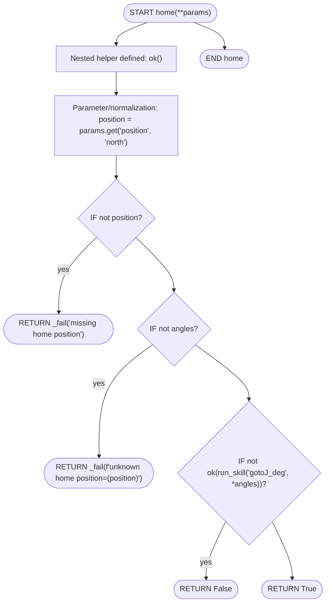

### `return_back_to_home`

Return the robot to a safe home position based on current angle.

- **Mermaid file:** [../mermaid/home/return_back_to_home.mmd](../mermaid/home/return_back_to_home.mmd)
- **Parameter scenarios observed:** none directly read
- **Branch/decision scenarios:**
  - `not ok(release_result)`
  - `not ok(angles) or len(angles) < 6`
  - `-22.49 <= a1 <= 22.49`
  - `j1_val is None`
  - `not ok(run_skill("gotoJ_deg", j1_val, *home_j2_j6))`
  - `not ok(run_skill("toggle_drag_mode"))`
  - `22.51 <= a1 <= 67.49`
  - `67.51 <= a1 <= 112.49`
  - `112.51 <= a1 <= 157.49`
  - `157.51 <= a1 <= 202.49`
  - `202.51 <= a1 <= 247.49`
  - `247.51 <= a1 <= 292.49`
  - `292.51 <= a1 <= 337.49`
  - `337.51 <= a1 <= 360.0`
  - `-67.49 <= a1 <= -22.51`
  - `-112.49 <= a1 <= -67.51`
  - `-157.49 <= a1 <= -112.51`
  - `-202.49 <= a1 <= -157.51`
  - `-247.49 <= a1 <= -202.51`
  - `-292.49 <= a1 <= -247.51`
  - `-337.49 <= a1 <= -292.51`
  - `-360.0 <= a1 <= -337.51`

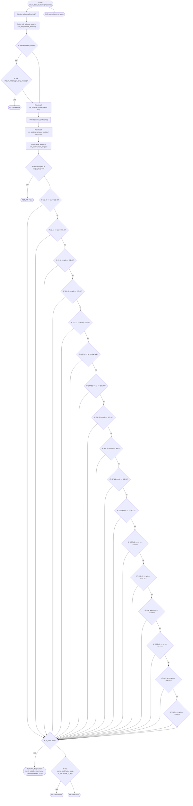

### `get_machine_position`

Calibrate and record machine positions for all coffee equipment.

- **Mermaid file:** [../mermaid/home/get_machine_position.mmd](../mermaid/home/get_machine_position.mmd)
- **Parameter scenarios observed:** none directly read
- **Branch/decision scenarios:**
  - `not return_back_to_home()`
  - `not _calibrate_marker("portafilter_cleaner", _prep_cleaner, ok)`
  - `not _calibrate_marker("espresso_grinder", _prep_grinder, ok)`
  - `not _calibrate_marker("three_group_espresso", _prep_espresso, ok)`
  - `not ok(run_skill("gotoJ_deg", *ESPRESSO_HOME))`
  - `not ok(run_skill("gotoJ_deg", *HOME_CALIBRATION_PARAMS['portafilter_cleaner']['prep_position']))`
  - `not ok(run_skill("gotoJ_deg", *HOME_CALIBRATION_PARAMS['espresso_grinder_calibration']['prep1']))`
  - `not ok(run_skill("gotoJ_deg", *HOME_CALIBRATION_PARAMS['espresso_grinder_calibration']['prep2']))`
  - `not ok(run_skill("gotoJ_deg", *HOME_CALIBRATION_PARAMS['three_group_espresso_calibration']['prep1']))`
  - `not ok(run_skill("moveJ_deg", 35, 0, 0, 0, 0, 0))`
  - `not ok(run_skill("move_to", "portafilter_cleaner", 0.22))`
  - `not ok(run_skill("move_to", "espresso_grinder", 0.22))`
  - `not ok(run_skill("move_to", "three_group_espresso", 0.22))`

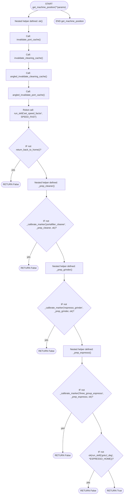

### `check_saved_data`

Check and display currently saved machine position data.

- **Mermaid file:** [../mermaid/home/check_saved_data.mmd](../mermaid/home/check_saved_data.mmd)
- **Parameter scenarios observed:** none directly read
- **Branch/decision scenarios:**
  - `not os.path.exists(mem_path)`

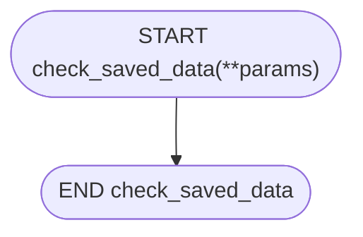

### `check_aruco_status`

Check current ArUco marker detection status and help diagnose calibration issues.

- **Mermaid file:** [../mermaid/home/check_aruco_status.mmd](../mermaid/home/check_aruco_status.mmd)
- **Parameter scenarios observed:** none directly read

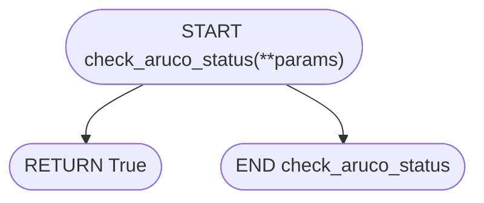

### `open_gripper`

- **Mermaid file:** [../mermaid/home/open_gripper.mmd](../mermaid/home/open_gripper.mmd)
- **Parameter scenarios observed:** none directly read

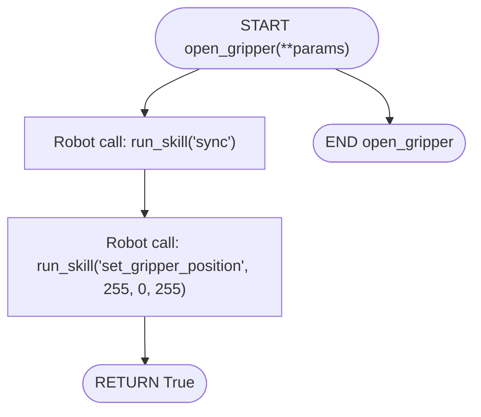

### `close_gripper`

- **Mermaid file:** [../mermaid/home/close_gripper.mmd](../mermaid/home/close_gripper.mmd)
- **Parameter scenarios observed:** none directly read

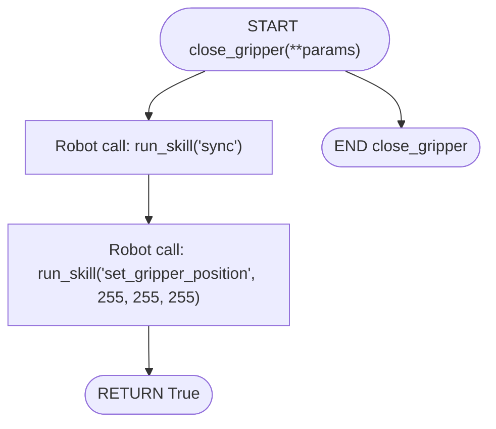

### `toggle_drag_mode`

- **Mermaid file:** [../mermaid/home/toggle_drag_mode.mmd](../mermaid/home/toggle_drag_mode.mmd)
- **Parameter scenarios observed:** none directly read

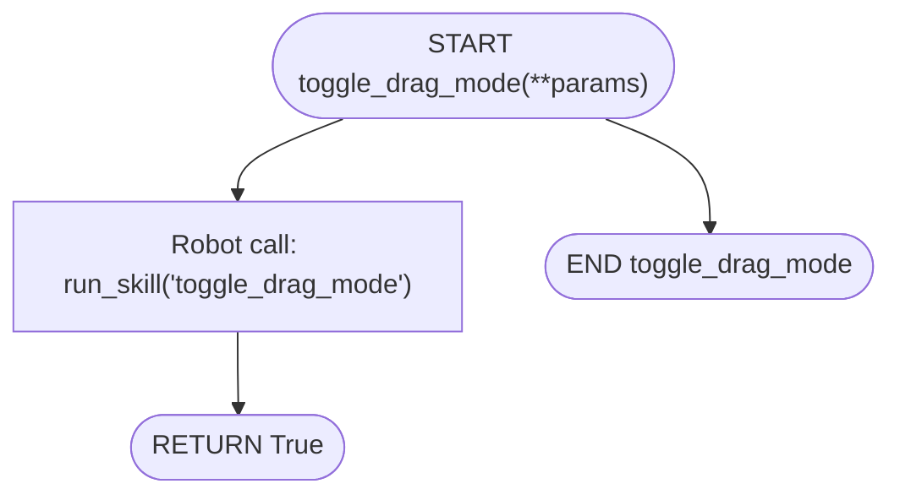

### `reset_robot1`

Restart robot1 deployment via kubectl on NUC (qss@192.168.200.254).

- **Mermaid file:** [../mermaid/home/reset_robot1.mmd](../mermaid/home/reset_robot1.mmd)
- **Parameter scenarios observed:** none directly read

### `reset_robot2`

Restart robot2 deployment via kubectl on NUC (qss@192.168.200.254).

- **Mermaid file:** [../mermaid/home/reset_robot2.mmd](../mermaid/home/reset_robot2.mmd)
- **Parameter scenarios observed:** none directly read

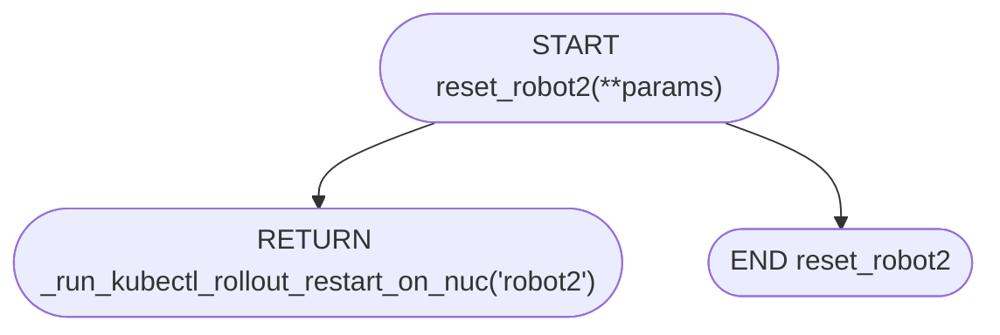

## Support/helper functions

### `run_skill`

- **Mermaid file:** [../mermaid/home/run_skill.mmd](../mermaid/home/run_skill.mmd)
- **Parameter scenarios observed:** none directly read

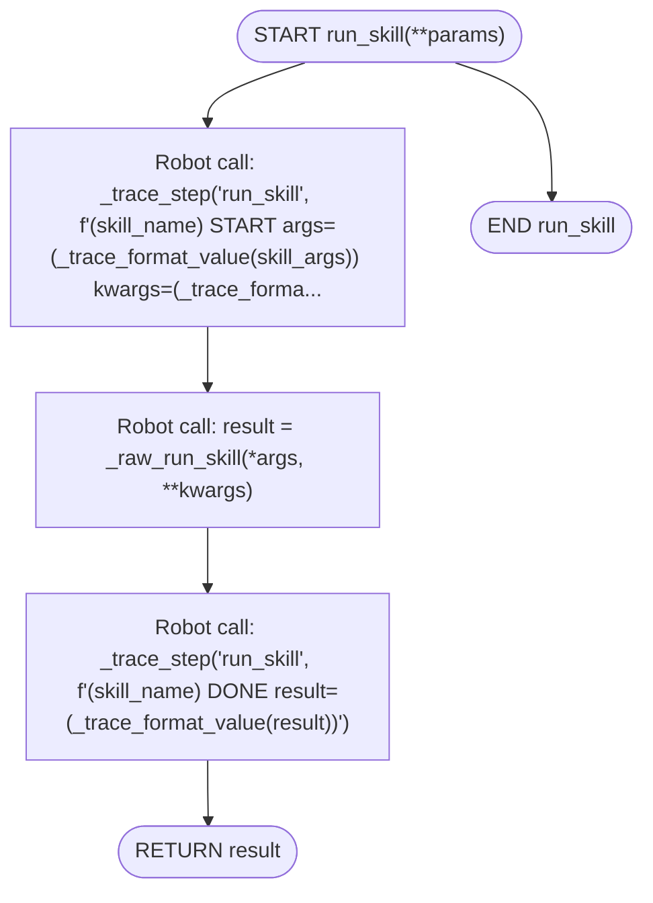

### `_calibrate_marker`

Retry a single marker calibration up to MAX_CALIBRATION_RETRIES times. prep_fn must move the arm into the correct approach pose and call sync. Returns True on the first successful get_machine_position, False if all attempts are exhausted.

- **Mermaid file:** [../mermaid/home/_calibrate_marker.mmd](../mermaid/home/_calibrate_marker.mmd)
- **Parameter scenarios observed:** none directly read
- **Branch/decision scenarios:**
  - `not prep_fn()`
  - `ok(result)`

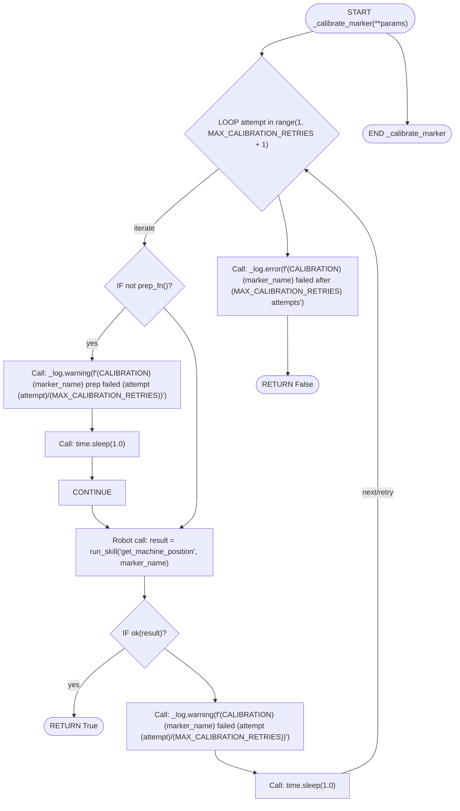

### `solution`

Convert joint values to cartesian, apply offsets, and convert back to joints.

- **Mermaid file:** [../mermaid/home/solution.mmd](../mermaid/home/solution.mmd)
- **Parameter scenarios observed:** none directly read
- **Branch/decision scenarios:**
  - `not pos_result or not hasattr(pos_result, 'pose')`
  - `inv_result and hasattr(inv_result, 'angle')`

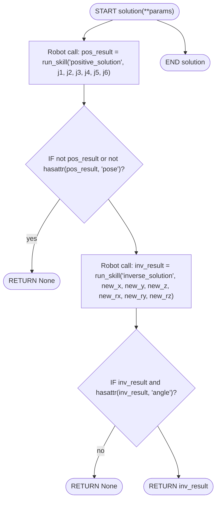

### `solution_interactive`

Interactive wrapper for solution function that prompts for input.

- **Mermaid file:** [../mermaid/home/solution_interactive.mmd](../mermaid/home/solution_interactive.mmd)
- **Parameter scenarios observed:** none directly read

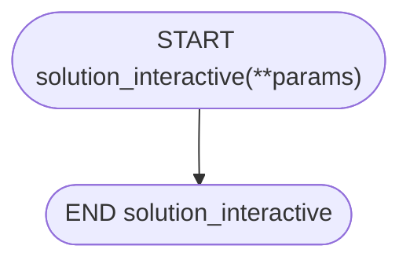

### `_run_kubectl_rollout_restart_on_nuc`

Run kubectl rollout restart on the NUC via SSH. Returns True on success.

- **Mermaid file:** [../mermaid/home/_run_kubectl_rollout_restart_on_nuc.mmd](../mermaid/home/_run_kubectl_rollout_restart_on_nuc.mmd)
- **Parameter scenarios observed:** none directly read
- **Branch/decision scenarios:**
  - `result.returncode == 0`

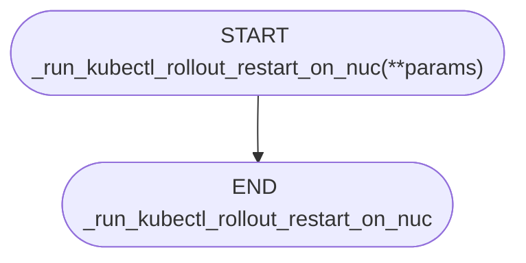
