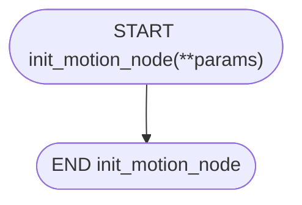
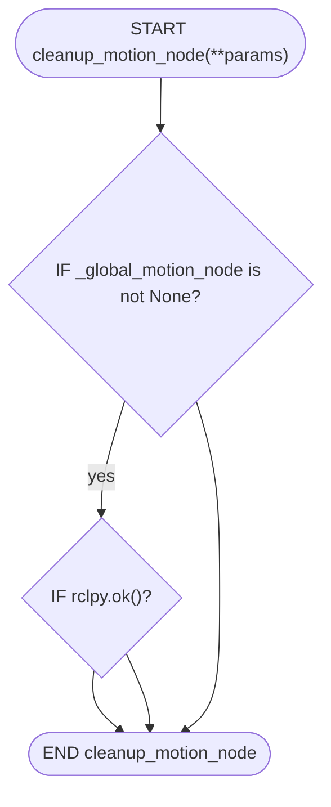
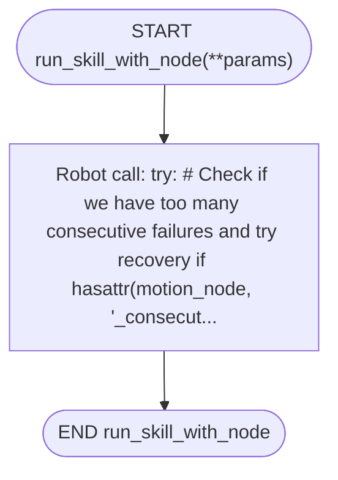
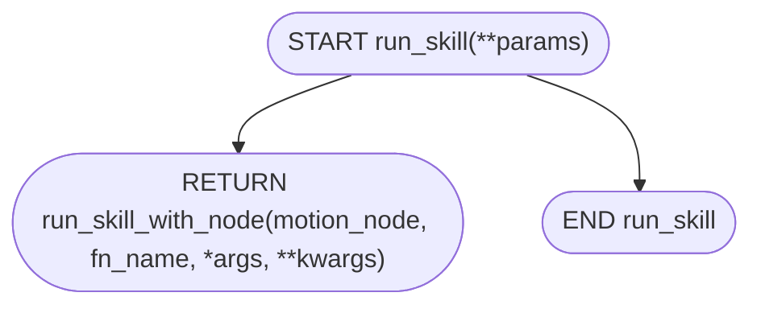
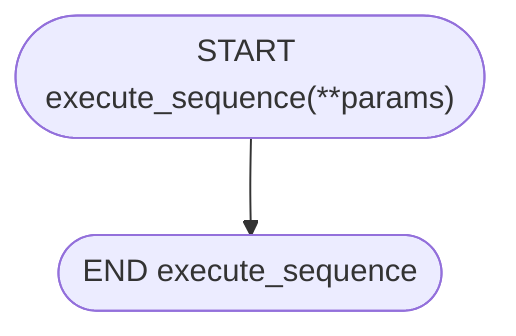
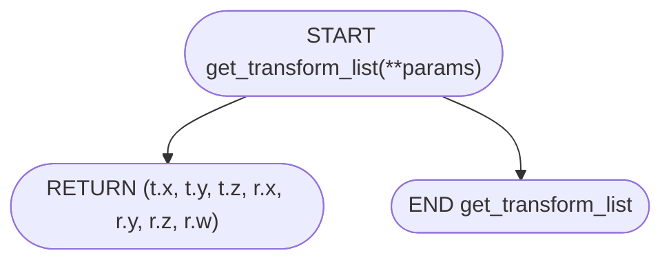

# `manipulate_node.py` flowcharts

- Sequence/exported functions: 5
- Support/helper functions: 1

## Sequence/exported functions

### `init_motion_node`

Initialize the global motion node for sequence execution.

- **Mermaid file:** [../mermaid/manipulate_node/init_motion_node.mmd](../mermaid/manipulate_node/init_motion_node.mmd)
- **Parameter scenarios observed:** none directly read
- **Branch/decision scenarios:**
  - `_global_motion_node is None`
  - `not rclpy.ok()`

### `cleanup_motion_node`

Cleanup the global motion node.

- **Mermaid file:** [../mermaid/manipulate_node/cleanup_motion_node.mmd](../mermaid/manipulate_node/cleanup_motion_node.mmd)
- **Parameter scenarios observed:** none directly read
- **Branch/decision scenarios:**
  - `_global_motion_node is not None`
  - `rclpy.ok()`

### `run_skill_with_node`

Execute a robot skill using the provided motion_node instance. This function calls a method on the motion_node and handles different return types. If the operation fails, it logs an error and returns False. Args: motion_node: The robot_motion instance to use fn_name: Name of the method to call on motion_node *args: Arguments to pass to the method Returns: bool or tuple: For most operations, returns True if operation succeeded, False otherwise. For special data-returning functions like current...

- **Mermaid file:** [../mermaid/manipulate_node/run_skill_with_node.mmd](../mermaid/manipulate_node/run_skill_with_node.mmd)
- **Parameter scenarios observed:** none directly read
- **Branch/decision scenarios:**
  - `hasattr(motion_node, '_consecutive_failures') and motion_node._consecutive_failures >= motion_node._max_consecutive_failures`
  - `fn_name in ("set_speed_factor", "gotoJ_deg", "sync") and hasattr(motion_node, 'health_check')`
  - `hasattr(motion_node, '_last_successful_operation')`
  - `fn_name in ("current_angles", "current_pose", "get_machine_position")`
  - `isinstance(result, tuple)`
  - `not ok`
  - `not motion_node.reset_robot_connection()`
  - `hasattr(motion_node, 'is_robot_likely_responsive') and motion_node.is_robot_likely_responsive()`
  - `hasattr(motion_node, '_consecutive_failures')`
  - `hasattr(motion_node, '_consecutive_failures')`
  - `not motion_node.health_check()`
  - `motion_node.reset_robot_connection()`

### `run_skill`

Execute a robot skill using the global motion node (for backward compatibility). This function automatically manages the motion node lifecycle and provides the same interface as before while being more efficient for sequence execution. Args: fn_name: Name of the method to call on motion_node *args: Arguments to pass to the method Returns: bool or tuple: For most operations, returns True if operation succeeded, False otherwise. For special data-returning functions like current_angles, returns ...

- **Mermaid file:** [../mermaid/manipulate_node/run_skill.mmd](../mermaid/manipulate_node/run_skill.mmd)
- **Parameter scenarios observed:** none directly read

### `execute_sequence`

Execute a sequence function with proper motion node management. This function creates a motion node, executes the sequence, and cleans up properly. Args: sequence_func: The sequence function to execute **params: Parameters to pass to the sequence function Returns: bool: True if sequence completed successfully, False otherwise

- **Mermaid file:** [../mermaid/manipulate_node/execute_sequence.mmd](../mermaid/manipulate_node/execute_sequence.mmd)
- **Parameter scenarios observed:** none directly read
- **Branch/decision scenarios:**
  - `motion_node`
  - `motion_node`
  - `motion_node`

## Support/helper functions

### `get_transform_list`

Converts a geometry_msgs TransformStamped message into a list: [tx, ty, tz, qx, qy, qz, qw].

- **Mermaid file:** [../mermaid/manipulate_node/get_transform_list.mmd](../mermaid/manipulate_node/get_transform_list.mmd)
- **Parameter scenarios observed:** none directly read

