# `milk_frothing.py` flowcharts

- Sequence/exported functions: 10
- Support/helper functions: 6

## Sequence/exported functions

### `get_frother_position`

Calibrate and record the milk frother position for future operations. After first successful calibration, skip re-reading machine position on later runs.

- **Mermaid file:** [../mermaid/milk_frothing/get_frother_position.mmd](../mermaid/milk_frothing/get_frother_position.mmd)
- **Parameter scenarios observed:** none directly read
- **Branch/decision scenarios:**
  - `not return_back_to_home()`
  - `not home(position="north_east")`
  - `not _get_frother_position_done`
  - `not home(position="north_east")`
  - `not ok(run_skill("gotoJ_deg", *MILK_FROTHING_EXTRA_POSES['frother_calibration_transition']))`
  - `not _milk_frother_position_done`
  - `not home(position="north")`
  - `not steam_calibrated`
  - `not frother_calibrated`
  - `not prep_ok`
  - `ok(run_skill("get_machine_position", "left_steam_wand"))`
  - `not prep_ok`
  - `ok(run_skill("get_machine_position", "milk_frother_2"))`
  - `not ok(run_skill("move_to", "left_steam_wand", 0.29))`
  - `not ok(run_skill("move_to", "milk_frother_2", 0.29))`

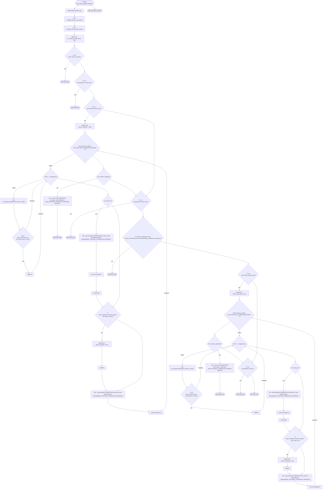

### `pick_frother`

Pick up the milk frother for milk frothing operations. Live/no-cache pickup verification: - After the secure gripper close, the reported gripper position must be within PICK_FROTHER_GRIP_VERIFY_TARGET +/- PICK_FROTHER_GRIP_VERIFY_TOLERANCE. - If verification fails, reverse back to the pickup area, refresh only the milk_frother_2 machine position, and retry the whole live pickup routine. Important: do NOT call the full get_frother_position() inside this recovery. That function runs home/return...

- **Mermaid file:** [../mermaid/milk_frothing/pick_frother.mmd](../mermaid/milk_frothing/pick_frother.mmd)
- **Parameter scenarios observed:** none directly read
- **Branch/decision scenarios:**
  - `not success`
  - `not frother_calibrated`
  - `not ok(run_skill("mount_machine", 'milk_frother_2', 'milk_frother_1'))`
  - `not ok(run_skill( "set_gripper_position", GRIPPER_FULL, MILK_FROTHER_GRIPPER_POSITIONS['pickup_initial'], ))`
  - `not ok(run_skill("approach_machine", 'milk_frother_2', 'milk_frother_1'))`
  - `not ok(run_skill("gotoJ_deg", *MILK_FROTHING_PARAMS['pickup']['area']))`
  - `not _refresh_milk_frother_position_only(attempt_idx)`
  - `not ok(run_skill("gotoJ_deg", *MILK_FROTHING_PARAMS['pickup']['area']))`
  - `not ok(run_skill("approach_machine", 'milk_frother_2', 'milk_frother_1'))`
  - `not ok(run_skill( "set_gripper_position", GRIPPER_FULL, MILK_FROTHER_GRIPPER_POSITIONS['pickup_initial'], ))`
  - `not ok(run_skill("mount_machine", 'milk_frother_2', 'milk_frother_1'))`
  - `gripper_verified`
  - `attempt_idx >= total_attempts`
  - `not _reverse_to_pickup_area_and_recalibrate(attempt_idx)`
  - `not prep_ok`
  - `ok(run_skill("get_machine_position", "milk_frother_2"))`
  - `not ok(run_skill("move_to", "milk_frother_2", 0.29))`

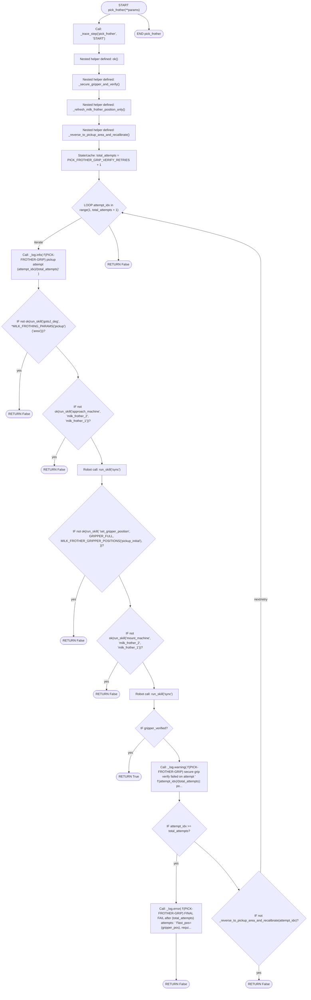

### `unmount_and_swirl_milk`

Swirl frothed milk in a circular motion for latte art preparation.

- **Mermaid file:** [../mermaid/milk_frothing/unmount_and_swirl_milk.mmd](../mermaid/milk_frothing/unmount_and_swirl_milk.mmd)
- **Parameter scenarios observed:** none directly read
- **Branch/decision scenarios:**
  - `not ok(run_skill("gotoJ_deg", *MILK_FROTHING_EXTRA_POSES['deep_froth_approach']))`
  - `not ok(run_skill("gotoJ_deg", *MILK_FROTHING_PARAMS['swirling']['intermediate1']))`
  - `not ok(run_skill("gotoJ_deg", *MILK_FROTHING_PARAMS['swirling']['swirl_pos']))`

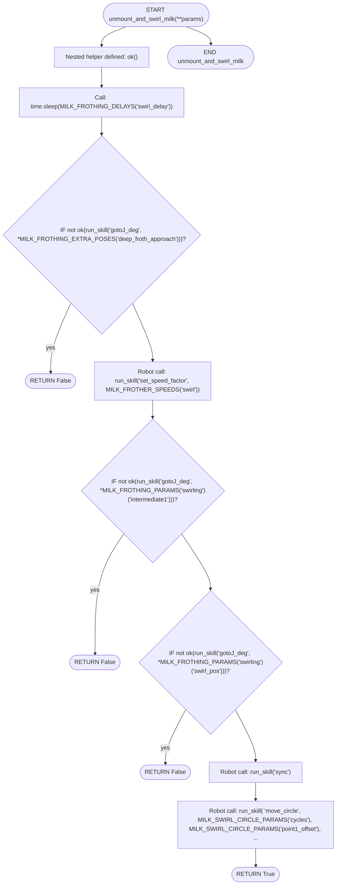

### `pour_milk_cup_station`

- **Mermaid file:** [../mermaid/milk_frothing/pour_milk_cup_station.mmd](../mermaid/milk_frothing/pour_milk_cup_station.mmd)
- **Parameter scenarios observed:** `position.cup_position / stage`
- **Branch/decision scenarios:**
  - `not ok(run_skill("gotoJ_deg", *stage_cfg['position']))`
  - `not ok(run_skill("gotoJ_deg", *stage_cfg['adjust1']))`
  - `_is_valid_angles(stage_cache.get('forward'))`
  - `_is_valid_angles(stage_cache.get('up'))`
  - `not ok(run_skill("gotoJ_deg", *stage_cfg['position']))`
  - `not ok(run_skill("gotoJ_deg", *stage_cache['forward']))`
  - `not ok(run_skill("moveEE_movJ", *stage_offsets['move_forward']))`
  - `not _is_valid_angles(forward_pose)`
  - `not ok(run_skill("gotoJ_deg", *stage_cache['up']))`
  - `not ok(run_skill("moveEE_movJ", *stage_offsets['move_up']))`
  - `not _is_valid_angles(up_pose)`

```mermaid
flowchart TD
  N0(["START pour_milk_cup_station(**params)"])
  N1["Nested helper defined: ok()"]
  N2["Parameter/normalization: cup_position = _extract_cup_position(params)"]
  N3["State/cache: stage_cache = _pour_milk_cup_station_cache.setdefault(stage, ())"]
  N4["Robot call: run_skill('set_speed_factor', MILK_FROTHER_SPEEDS('pour_approach'))"]
  N5{"IF not ok(run_skill('gotoJ_deg', *stage_cfg('position')))?"}
  N6(["RETURN False"])
  N7["Robot call: run_skill('sync')"]
  N8["Robot call: run_skill('set_speed_factor', MILK_FROTHER_SPEEDS('pour'))"]
  N9{"IF not ok(run_skill('gotoJ_deg', *stage_cfg('adjust1')))?"}
  N10(["RETURN False"])
  N11{"IF _is_valid_angles(stage_cache.get('forward'))?"}
  N12{"IF not ok(run_skill('gotoJ_deg', *stage_cache('forward')))?"}
  N13(["RETURN False"])
  N14["Robot call: run_skill('sync')"]
  N15{"IF not ok(run_skill('moveEE_movJ', *stage_offsets('move_forward')))?"}
  N16(["RETURN False"])
  N17["State/cache: forward_pose = _capture_current_angles()"]
  N18{"IF not _is_valid_angles(forward_pose)?"}
  N19(["RETURN False"])
  N20["State/cache: stage_cache('forward') = forward_pose"]
  N21{"IF _is_valid_angles(stage_cache.get('up'))?"}
  N22{"IF not ok(run_skill('gotoJ_deg', *stage_cache('up')))?"}
  N23(["RETURN False"])
  N24{"IF not ok(run_skill('moveEE_movJ', *stage_offsets('move_up')))?"}
  N25(["RETURN False"])
  N26["State/cache: up_pose = _capture_current_angles()"]
  N27{"IF not _is_valid_angles(up_pose)?"}
  N28(["RETURN False"])
  N29["State/cache: stage_cache('up') = up_pose"]
  N30{"IF not ok(run_skill('gotoJ_deg', *stage_cfg('position')))?"}
  N31(["RETURN False"])
  N32["Robot call: run_skill('set_speed_factor', MILK_FROTHER_SPEEDS('return'))"]
  N33(["RETURN True"])
  N34(["END pour_milk_cup_station"])
  N0 --> N1
  N1 --> N2
  N2 --> N3
  N3 --> N4
  N4 --> N5
  N5 -- "yes" --> N6
  N5 --> N7
  N7 --> N8
  N8 --> N9
  N9 -- "yes" --> N10
  N9 --> N11
  N11 -- "yes" --> N12
  N12 -- "yes" --> N13
  N12 --> N14
  N11 -- "no" --> N15
  N15 -- "yes" --> N16
  N15 --> N17
  N17 --> N18
  N18 -- "yes" --> N19
  N18 --> N20
  N14 --> N21
  N20 --> N21
  N21 -- "yes" --> N22
  N22 -- "yes" --> N23
  N21 -- "no" --> N24
  N24 -- "yes" --> N25
  N24 --> N26
  N26 --> N27
  N27 -- "yes" --> N28
  N27 --> N29
  N22 --> N30
  N29 --> N30
  N30 -- "yes" --> N31
  N30 --> N32
  N32 --> N33
  N0 --> N34
```

### `mount_frother`

Mount the milk frother to the steam wand for frothing preparation. Applies a Z adjustment based on milk volume and cup size.

- **Mermaid file:** [../mermaid/milk_frothing/mount_frother.mmd](../mermaid/milk_frothing/mount_frother.mmd)
- **Parameter scenarios observed:** `ingredients`, `ingredients.cups / cups / size / cup_size`, `milk`
- **Branch/decision scenarios:**
  - `not ok(run_skill("approach_machine", "left_steam_wand", "deep_froth"))`
  - `not ok(run_skill("mount_machine", "left_steam_wand", "deep_froth"))`
  - `not cup_size`
  - `not cup_size`
  - `not ok(run_skill("moveEE_movJ", 12.5, 12.5, -z_adjustment, 7.5, 0, 0))`

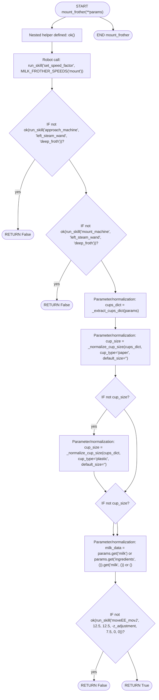

### `clean_milk_pitcher`

- **Mermaid file:** [../mermaid/milk_frothing/clean_milk_pitcher.mmd](../mermaid/milk_frothing/clean_milk_pitcher.mmd)
- **Parameter scenarios observed:** none directly read
- **Branch/decision scenarios:**
  - `not ok(run_skill("gotoJ_deg", *MILK_FROTHING_PARAMS['cleaning']['pose1']))`
  - `not ok(run_skill("gotoJ_deg", *MILK_FROTHING_PARAMS['cleaning']['pose2']))`
  - `not ok(run_skill("gotoJ_deg", *MILK_FROTHING_PARAMS['cleaning']['pose3']))`
  - `_is_valid_angles(_clean_milk_pitcher_cache)`
  - `not ok(run_skill("gotoJ_deg", *_clean_milk_pitcher_cache))`
  - `not ok(run_skill("moveEE_movJ", *MILK_FROTHER_MOVEMENT_OFFSETS['cleaning_motion']))`
  - `not _is_valid_angles(clean_pose)`

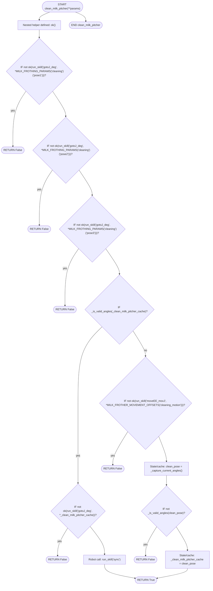

### `return_frother`

Return the frother to its original location using recorded approach/grab angles.

- **Mermaid file:** [../mermaid/milk_frothing/return_frother.mmd](../mermaid/milk_frothing/return_frother.mmd)
- **Parameter scenarios observed:** none directly read
- **Branch/decision scenarios:**
  - `not ok(run_skill("gotoJ_deg", *MILK_FROTHING_PARAMS['return']['pre_return1']))`
  - `not ok(run_skill("gotoJ_deg", *MILK_FROTHING_PARAMS['return']['pre_return2']))`
  - `not ok(run_skill("gotoJ_deg", *MILK_FROTHING_PARAMS['return']['pre_return3']))`
  - `not ok(run_skill("gotoJ_deg", *MILK_FROTHING_PARAMS['return']['pre_return4']))`
  - `not _is_valid_position(cached_lift)`
  - `not ok(run_skill("gotoEE", *cached_lift))`
  - `not ok(run_skill("moveEE", 0, 0, -145, 0, 0, 0))`
  - `not ok(run_skill("set_gripper_position", 75, 165, 255))`
  - `not ok(run_skill("moveEE", *MILK_FROTHER_MOVEMENT_OFFSETS['final_approach']))`
  - `not ok(run_skill("approach_machine", "milk_frother_2", "milk_frother_1"))`
  - `not ok(home(position="north"))`
  - `not ok(run_skill("set_gripper_position", GRIPPER_FULL, MILK_FROTHER_GRIPPER_POSITIONS['open']))`

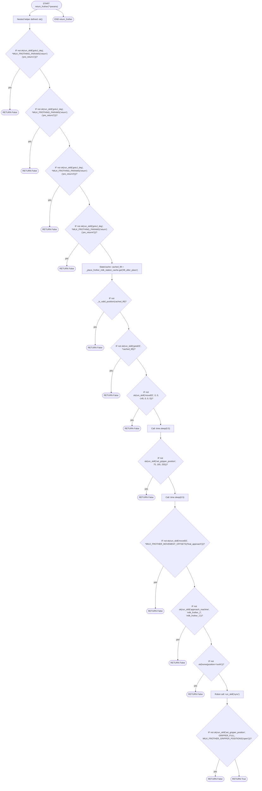

### `place_frother_milk_station`

- **Mermaid file:** [../mermaid/milk_frothing/place_frother_milk_station.mmd](../mermaid/milk_frothing/place_frother_milk_station.mmd)
- **Parameter scenarios observed:** none directly read
- **Branch/decision scenarios:**
  - `_is_valid_position(cached_lift)`
  - `not ok(run_skill("gotoJ_deg", *MILK_FROTHING_PARAMS['milk_station']['place_pre1']))`
  - `not ok(run_skill("gotoJ_deg", *MILK_FROTHING_PARAMS['milk_station']['place_pre2']))`
  - `not ok(run_skill("gotoJ_deg", *MILK_FROTHING_PARAMS['milk_station']['place_approach']))`
  - `not ok(run_skill("gotoJ_deg", *MILK_FROTHING_PARAMS['milk_station']['place_final']))`
  - `_is_valid_angles(cached_nudge)`
  - `not ok(run_skill("set_gripper_position", 25, 220, 255))`
  - `not ok(run_skill("gotoEE", *cached_lift))`
  - `not ok(run_skill("moveEE", *MILK_FROTHER_MOVEMENT_OFFSETS['lift_after_place']))`
  - `not _is_valid_position(lift_pose)`
  - `not ok(run_skill("gotoJ_deg", *cached_nudge))`
  - `not ok(run_skill("moveEE_movJ", 5, 0, 0, 0, 0, 0))`
  - `not _is_valid_angles(nudge_pose)`

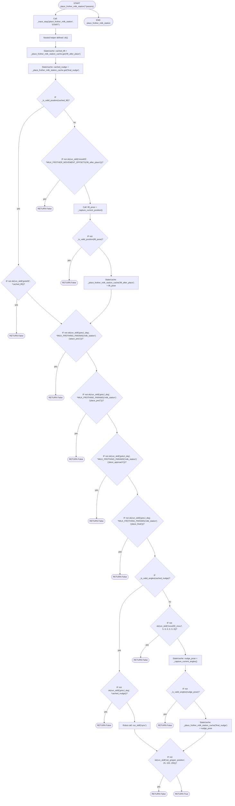

### `pick_frother_milk_station`

- **Mermaid file:** [../mermaid/milk_frothing/pick_frother_milk_station.mmd](../mermaid/milk_frothing/pick_frother_milk_station.mmd)
- **Parameter scenarios observed:** none directly read
- **Branch/decision scenarios:**
  - `not ok(run_skill("set_gripper_position", 255, 255, 255))`
  - `_is_valid_angles(_pick_frother_milk_station_cache)`
  - `not ok(run_skill("gotoJ_deg", *MILK_FROTHING_PARAMS['milk_station']['pick_retreat1']))`
  - `not ok(run_skill("gotoJ_deg", *MILK_FROTHING_PARAMS['milk_station']['pick_retreat2']))`
  - `not ok(run_skill("gotoJ_deg", *_pick_frother_milk_station_cache))`
  - `not ok(run_skill("moveEE_movJ", *MILK_FROTHER_MOVEMENT_OFFSETS['lift_after_pick']))`
  - `not _is_valid_angles(lift_pose)`

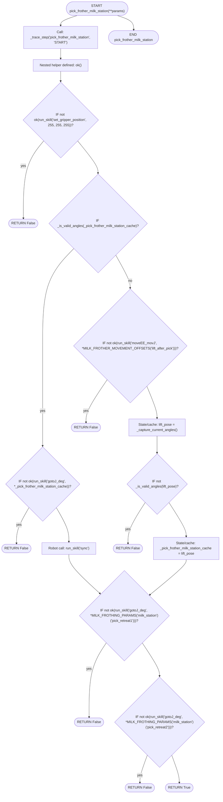

### `invalidate_milk_frothing_cache`

- **Mermaid file:** [../mermaid/milk_frothing/invalidate_milk_frothing_cache.mmd](../mermaid/milk_frothing/invalidate_milk_frothing_cache.mmd)
- **Parameter scenarios observed:** none directly read

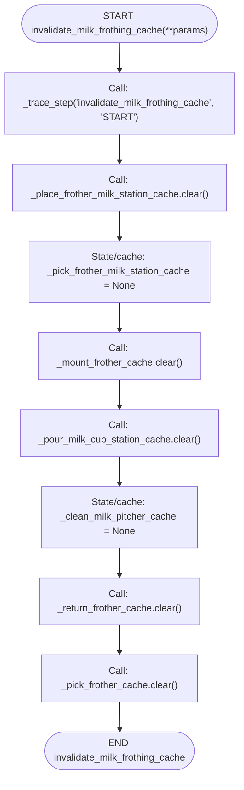

## Support/helper functions

### `run_skill`

Trace wrapper around manipulate_node.run_skill.

- **Mermaid file:** [../mermaid/milk_frothing/run_skill.mmd](../mermaid/milk_frothing/run_skill.mmd)
- **Parameter scenarios observed:** none directly read

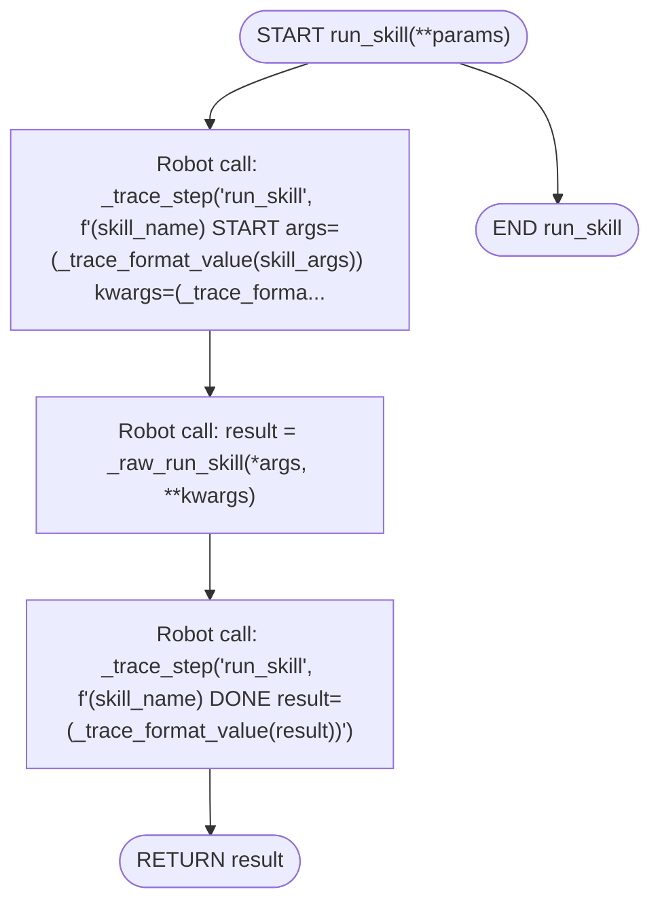

### `_is_valid_angles`

- **Mermaid file:** [../mermaid/milk_frothing/_is_valid_angles.mmd](../mermaid/milk_frothing/_is_valid_angles.mmd)
- **Parameter scenarios observed:** none directly read

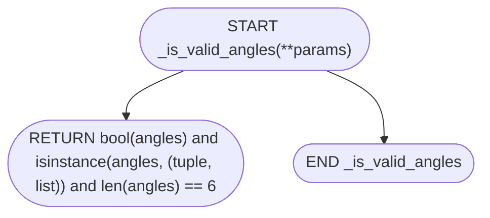

### `_capture_current_angles`

- **Mermaid file:** [../mermaid/milk_frothing/_capture_current_angles.mmd](../mermaid/milk_frothing/_capture_current_angles.mmd)
- **Parameter scenarios observed:** none directly read
- **Branch/decision scenarios:**
  - `not _is_valid_angles(angles)`

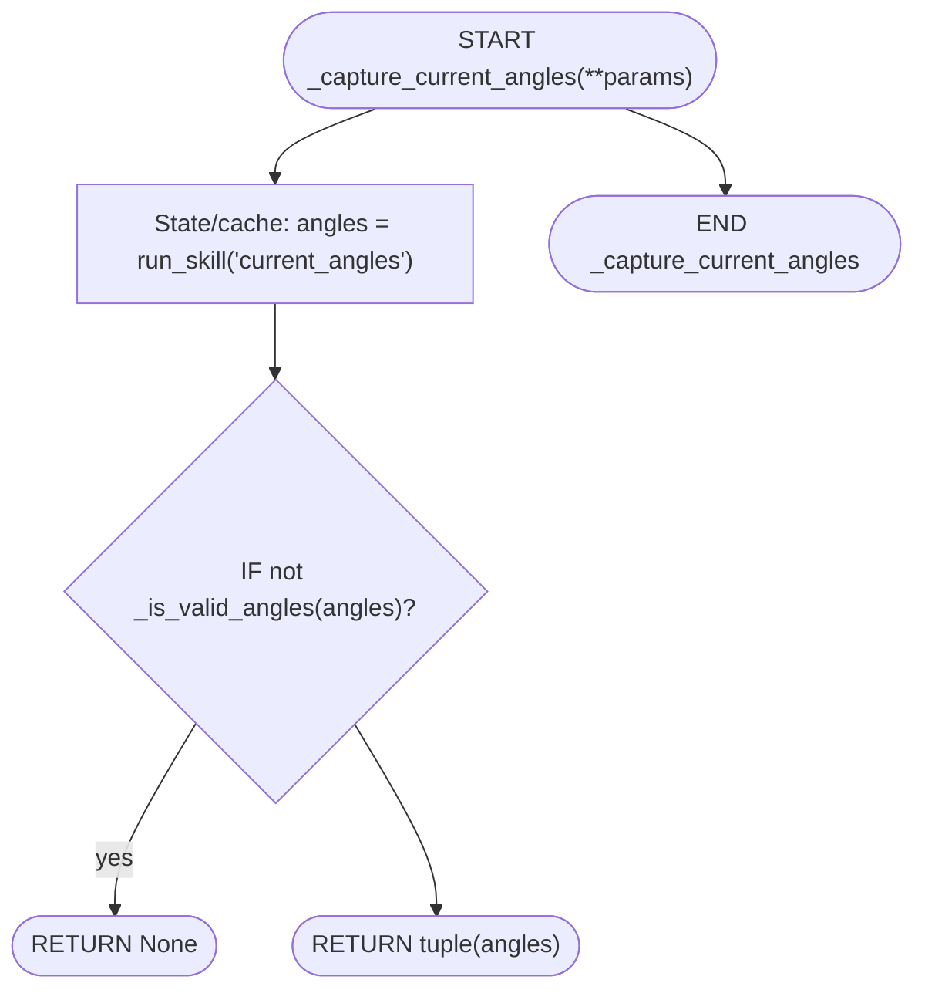

### `_capture_current_position`

- **Mermaid file:** [../mermaid/milk_frothing/_capture_current_position.mmd](../mermaid/milk_frothing/_capture_current_position.mmd)
- **Parameter scenarios observed:** none directly read
- **Branch/decision scenarios:**
  - `not _is_valid_position(position)`

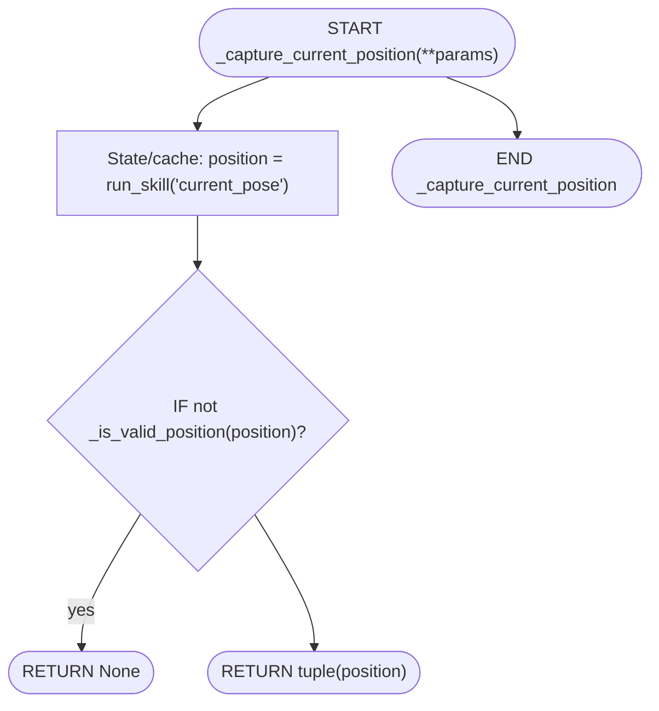

### `_is_valid_position`

- **Mermaid file:** [../mermaid/milk_frothing/_is_valid_position.mmd](../mermaid/milk_frothing/_is_valid_position.mmd)
- **Parameter scenarios observed:** none directly read

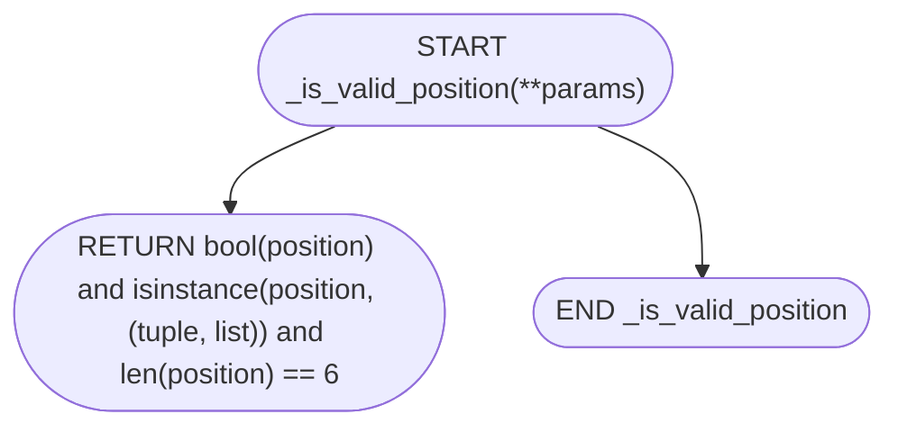

### `_cache_key_from_z_adjustment`

- **Mermaid file:** [../mermaid/milk_frothing/_cache_key_from_z_adjustment.mmd](../mermaid/milk_frothing/_cache_key_from_z_adjustment.mmd)
- **Parameter scenarios observed:** none directly read

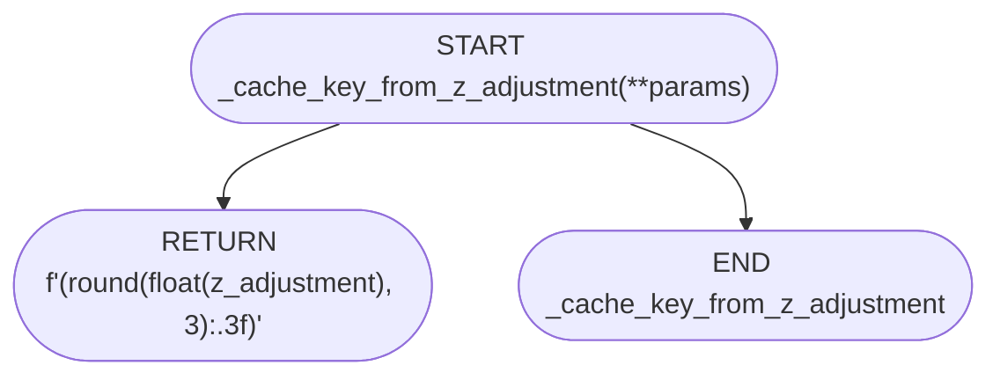
