# `paper_cups.py` flowcharts

- Sequence/exported functions: 17
- Support/helper functions: 5

## Sequence/exported functions

### `grab_paper_cup`

Grab a paper cup of specified size from the paper cup dispenser.

- **Mermaid file:** [../mermaid/paper_cups/grab_paper_cup.mmd](../mermaid/paper_cups/grab_paper_cup.mmd)
- **Parameter scenarios observed:** `ingredients.cups / cups / size / cup_size`
- **Branch/decision scenarios:**
  - `not size`
  - `not cup_params`
  - `not ok(run_skill("gotoJ_deg", *ESPRESSO_HOME))`
  - `not ok(run_skill("gotoJ_deg", *PAPER_CUPS_NAVIGATION_PARAMS['espresso_avoid']))`
  - `not ok(run_skill("gotoJ_deg", *PAPER_CUPS_NAVIGATION_PARAMS['dispenser_area']))`
  - `not cup_params`
  - `size == "7oz"`
  - `'approach' in cup_params`
  - `'grip_width' not in cup_params`
  - `not ok(run_skill("set_gripper_position", GRIPPER_FULL, cup_params['grip_width'], verify_position=True))`
  - `'retreat' in cup_params`
  - `cup_detected`
  - `not ok(run_skill("sync"))`
  - `not ok(run_skill("set_gripper_position", GRIPPER_FULL, GRIPPER_OPEN, verify_position=True))`
  - `attempt_count == 15`
  - `not ok(run_skill("gotoJ_deg", *PAPER_CUPS_NAVIGATION_PARAMS['twist_7oz']))`
  - `size == "9oz"`
  - `not ok(run_skill("moveEE", *cup_params['approach']))`
  - `not ok(run_skill("moveEE", *cup_params['retreat']))`
  - `not ok(run_skill("gotoJ_deg", *PAPER_CUPS_NAVIGATION_PARAMS['twist_9oz']))`
  - `size == "12oz"`
  - `not ok(run_skill("gotoJ_deg", *PAPER_CUPS_NAVIGATION_PARAMS['twist_12oz']))`

```mermaid
flowchart TD
  N0(["START grab_paper_cup(**params)"])
  N1["Nested helper defined: ok()"]
  N2["Parameter/normalization: cups_dict = _extract_cups_dict(params)"]
  N3["Parameter/normalization: size = _normalize_paper_cup_size(cups_dict if cups_dict else '7oz')"]
  N4{"IF not size?"}
  N5(["RETURN _fail()"])
  N6{"IF not cup_params?"}
  N7{"IF not cup_params?"}
  N8(["RETURN _fail()"])
  N9{"IF not ok(run_skill('gotoJ_deg', *ESPRESSO_HOME))?"}
  N10(["RETURN _fail()"])
  N11{"IF not ok(run_skill('gotoJ_deg', *PAPER_CUPS_NAVIGATION_PARAMS('espresso_avoid')))?"}
  N12(["RETURN _fail()"])
  N13{"IF not ok(run_skill('gotoJ_deg', *PAPER_CUPS_NAVIGATION_PARAMS('dispenser_area')))?"}
  N14(["RETURN _fail()"])
  N15["State/cache: attempt_count = 0"]
  N16{"WHILE attempt_count < 15?"}
  N17{"IF size == '7oz'?"}
  N18{"IF not ok(run_skill('gotoJ_deg', *PAPER_CUPS_NAVIGATION_PARAMS('twist_7oz')))?"}
  N19(["RETURN _fail()"])
  N20{"IF size == '9oz'?"}
  N21{"IF not ok(run_skill('gotoJ_deg', *PAPER_CUPS_NAVIGATION_PARAMS('twist_9oz')))?"}
  N22(["RETURN _fail()"])
  N23{"IF size == '12oz'?"}
  N24{"IF not ok(run_skill('gotoJ_deg', *PAPER_CUPS_NAVIGATION_PARAMS('twist_12oz')))?"}
  N25(["RETURN _fail()"])
  N26(["RETURN _fail()"])
  N27{"IF 'approach' in cup_params?"}
  N28{"IF not ok(run_skill('moveEE', *cup_params('approach')))?"}
  N29(["RETURN _fail()"])
  N30{"IF 'grip_width' not in cup_params?"}
  N31(["RETURN _fail()"])
  N32{"IF not ok(run_skill('set_gripper_position', GRIPPER_FULL, cup_params('grip_width'), verify_position=True))?"}
  N33(["RETURN _fail()"])
  N34{"IF 'retreat' in cup_params?"}
  N35{"IF not ok(run_skill('moveEE', *cup_params('retreat')))?"}
  N36(["RETURN _fail()"])
  N37["State/cache: cup_detected = detect_cup_gripper()"]
  N38{"IF cup_detected?"}
  N39["BREAK"]
  N40["State/cache: attempt_count += 1"]
  N41{"IF not ok(run_skill('sync'))?"}
  N42(["RETURN _fail()"])
  N43{"IF not ok(run_skill('set_gripper_position', GRIPPER_FULL, GRIPPER_OPEN, verify_position=True))?"}
  N44(["RETURN _fail()"])
  N45{"IF attempt_count == 15?"}
  N46(["RETURN _fail()"])
  N47(["RETURN True"])
  N48(["END grab_paper_cup"])
  N0 --> N1
  N1 --> N2
  N2 --> N3
  N3 --> N4
  N4 -- "yes" --> N5
  N4 --> N6
  N6 -- "yes" --> N7
  N7 -- "yes" --> N8
  N7 --> N9
  N6 --> N9
  N9 -- "yes" --> N10
  N9 --> N11
  N11 -- "yes" --> N12
  N11 --> N13
  N13 -- "yes" --> N14
  N13 --> N15
  N15 --> N16
  N16 -- "iterate" --> N17
  N17 -- "yes" --> N18
  N18 -- "yes" --> N19
  N17 -- "no" --> N20
  N20 -- "yes" --> N21
  N21 -- "yes" --> N22
  N20 -- "no" --> N23
  N23 -- "yes" --> N24
  N24 -- "yes" --> N25
  N23 -- "no" --> N26
  N18 --> N27
  N21 --> N27
  N24 --> N27
  N27 -- "yes" --> N28
  N28 -- "yes" --> N29
  N28 --> N30
  N27 --> N30
  N30 -- "yes" --> N31
  N30 --> N32
  N32 -- "yes" --> N33
  N32 --> N34
  N34 -- "yes" --> N35
  N35 -- "yes" --> N36
  N35 --> N37
  N34 --> N37
  N37 --> N38
  N38 -- "yes" --> N39
  N39 --> N40
  N38 --> N40
  N40 --> N41
  N41 -- "yes" --> N42
  N41 --> N43
  N43 -- "yes" --> N44
  N43 --> N45
  N45 -- "yes" --> N46
  N45 -- "next/retry" --> N16
  N16 --> N47
  N0 --> N48
```

### `place_paper_cup`

Place a paper cup at the specified staging area.

- **Mermaid file:** [../mermaid/paper_cups/place_paper_cup.mmd](../mermaid/paper_cups/place_paper_cup.mmd)
- **Parameter scenarios observed:** `position.cup_position / stage`
- **Branch/decision scenarios:**
  - `not stage_params`
  - `not ok(run_skill("gotoJ_deg", *PAPER_CUPS_NAVIGATION_PARAMS['intermediate']))`
  - `'twist' in stage_params`
  - `'pose' not in stage_params`
  - `not ok(run_skill("gotoJ_deg", *stage_params['pose']))`
  - `not ok(run_skill("sync"))`
  - `not ok(run_skill("set_gripper_position", 25, 100, 255, verify_position=True))`
  - `not ok(run_skill("set_gripper_position", 255, 0, 255, verify_position=True))`
  - `not ok(run_skill("moveEE", *PAPER_CUP_MOVEMENT_OFFSETS['place_up']))`
  - `'stage_home' in stage_params`
  - `'twist_back' in stage_params`
  - `not ok(run_skill("moveJ_deg", *stage_params['twist']))`
  - `not ok(run_skill("gotoJ_deg", *stage_params['stage_home']))`
  - `not ok(run_skill("gotoJ_deg", *PAPER_CUPS_NAVIGATION_PARAMS['twist_back_machine']))`

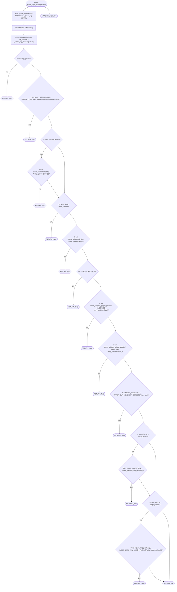

### `dispense_paper_cup_station`

Dispense a paper cup by grabbing it from the dispenser and placing it at the requested stage.

- **Mermaid file:** [../mermaid/paper_cups/dispense_paper_cup_station.mmd](../mermaid/paper_cups/dispense_paper_cup_station.mmd)
- **Parameter scenarios observed:** none directly read
- **Branch/decision scenarios:**
  - `not grab_paper_cup(**params)`
  - `not place_paper_cup(**params)`

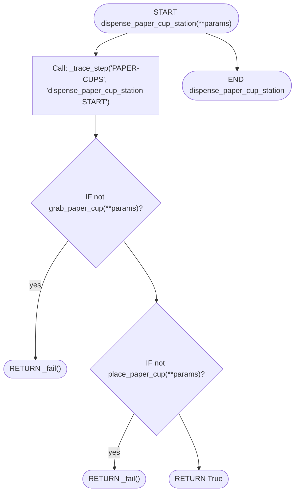

### `pick_paper_cup_station`

Pick up a paper cup from a specific stage.

- **Mermaid file:** [../mermaid/paper_cups/pick_paper_cup_station.mmd](../mermaid/paper_cups/pick_paper_cup_station.mmd)
- **Parameter scenarios observed:** `ingredients.cups / cups / size / cup_size`, `position.cup_position / stage`
- **Branch/decision scenarios:**
  - `not cups_dict`
  - `stage not in valid_stages or size_mapped not in valid_sizes`
  - `not home(position="east")`
  - `stage in ("3", "4")`
  - `not ok(run_skill("gotoJ_deg", *stage_positions[stage]))`
  - `not ok(run_skill("moveEE", *PAPER_CUP_MOVEMENT_OFFSETS['pickup_down']))`
  - `not ok(run_skill("set_gripper_position", GRIPPER_FULL, gripper_positions[size_mapped]))`
  - `not ok(run_skill("moveEE_movJ", *PAPER_CUP_MOVEMENT_OFFSETS['pickup_up']))`
  - `not home(position="east")`
  - `not home(position="north_east")`
  - `not home(position="south_east")`

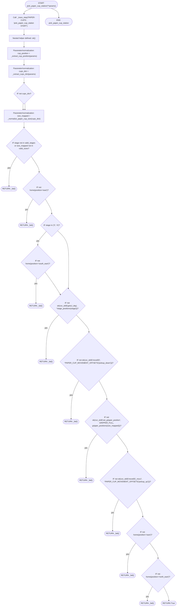

### `place_paper_cup_station`

Place a paper cup at specified staging area.

- **Mermaid file:** [../mermaid/paper_cups/place_paper_cup_station.mmd](../mermaid/paper_cups/place_paper_cup_station.mmd)
- **Parameter scenarios observed:** `position.cup_position / stage`
- **Branch/decision scenarios:**
  - `not home(position="north_east")`
  - `not home(position="east")`
  - `stage in ("3", "4")`
  - `not ok(run_skill("gotoJ_deg", *stage_positions[stage]))`
  - `not ok(run_skill("sync"))`
  - `not ok(run_skill("set_gripper_position", GRIPPER_RELEASE, GRIPPER_OPEN))`
  - `not ok(run_skill("moveEE", *PAPER_CUP_MOVEMENT_OFFSETS['place_return_up']))`
  - `not home(position="east")`
  - `not home(position="south_east")`

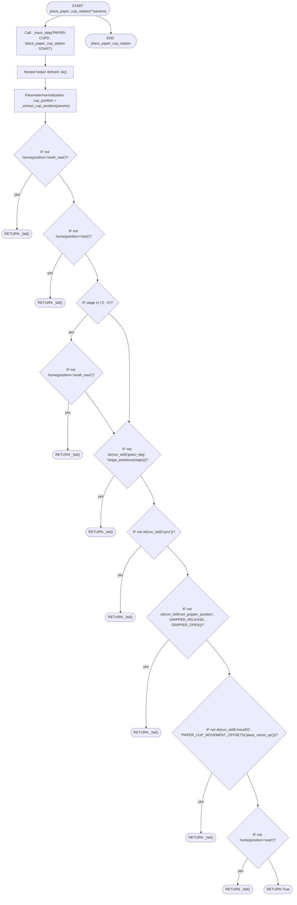

### `place_paper_cup_sauces`

Place the paper cup at the sauces station.

- **Mermaid file:** [../mermaid/paper_cups/place_paper_cup_sauces.mmd](../mermaid/paper_cups/place_paper_cup_sauces.mmd)
- **Parameter scenarios observed:** none directly read
- **Branch/decision scenarios:**
  - `not ok(run_skill("gotoJ_deg", *PAPER_CUPS_STATION_PARAMS['sauces_station']['position1']))`
  - `not ok(run_skill("gotoJ_deg", *PAPER_CUPS_STATION_PARAMS['sauces_station']['position2']))`
  - `not ok(run_skill("gotoJ_deg", *PAPER_CUPS_STATION_PARAMS['sauces_station']['position3']))`
  - `not ok(run_skill("sync"))`
  - `not ok(run_skill("set_gripper_position", 255, 75, 255, verify_position=True))`
  - `not cup_detected`

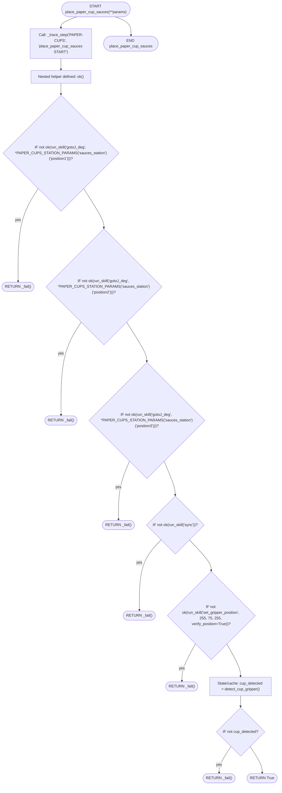

### `pick_paper_cup_sauces`

Pick the paper cup from the sauces station.

- **Mermaid file:** [../mermaid/paper_cups/pick_paper_cup_sauces.mmd](../mermaid/paper_cups/pick_paper_cup_sauces.mmd)
- **Parameter scenarios observed:** `ingredients.cups / cups / size / cup_size`
- **Branch/decision scenarios:**
  - `not cups_dict`
  - `cup_size not in valid_sizes`
  - `not cup_detected`
  - `not ok(run_skill("moveEE", -1,0,0,0,0,0))`
  - `not ok(run_skill("set_gripper_position", GRIPPER_FULL, gripper_positions[cup_size]))`
  - `not ok(run_skill("gotoJ_deg", *PAPER_CUPS_STATION_PARAMS['sauces_station']['position2']))`
  - `not ok(run_skill("gotoJ_deg", *PAPER_CUPS_STATION_PARAMS['sauces_station']['position1']))`

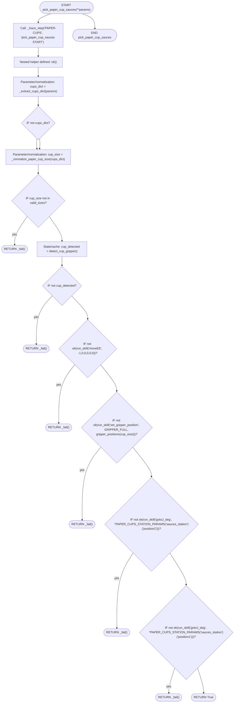

### `place_paper_cup_milk`

Place the paper cup at the milk station.

- **Mermaid file:** [../mermaid/paper_cups/place_paper_cup_milk.mmd](../mermaid/paper_cups/place_paper_cup_milk.mmd)
- **Parameter scenarios observed:** none directly read
- **Branch/decision scenarios:**
  - `not ok(run_skill("gotoJ_deg", *PAPER_CUPS_STATION_PARAMS['milk_station']['position1']))`
  - `not ok(run_skill("gotoJ_deg", *PAPER_CUPS_STATION_PARAMS['milk_station']['position3']))`
  - `not ok(run_skill("sync"))`
  - `not ok(run_skill("set_gripper_position", 255, 75, 255, verify_position=True))`
  - `not cup_detected`

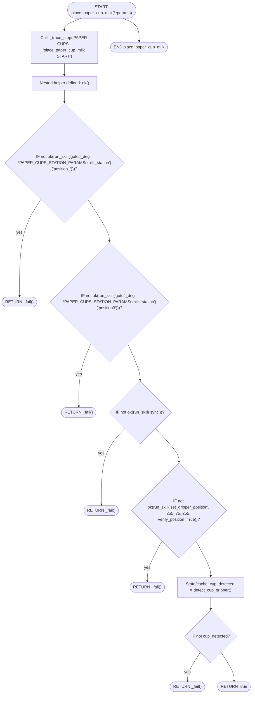

### `pick_paper_cup_milk`

Pick the paper cup from the milk station.

- **Mermaid file:** [../mermaid/paper_cups/pick_paper_cup_milk.mmd](../mermaid/paper_cups/pick_paper_cup_milk.mmd)
- **Parameter scenarios observed:** `ingredients.cups / cups / size / cup_size`
- **Branch/decision scenarios:**
  - `not cups_dict`
  - `cup_size not in valid_sizes`
  - `not cup_detected`
  - `not ok(run_skill("moveEE", -1,0,-5,0,0,0))`
  - `not ok(run_skill("set_gripper_position", GRIPPER_FULL, gripper_positions[cup_size], verify_position=True))`
  - `not ok(run_skill("gotoJ_deg", *PAPER_CUPS_STATION_PARAMS['milk_station']['position1']))`

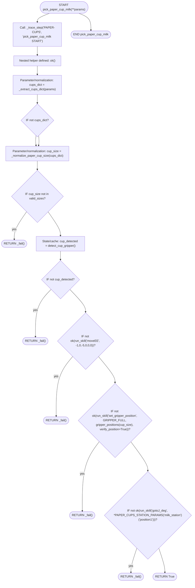

### `pick_cup_for_hot_water`

Pick up a paper cup from a specific stage for hot water.

- **Mermaid file:** [../mermaid/paper_cups/pick_cup_for_hot_water.mmd](../mermaid/paper_cups/pick_cup_for_hot_water.mmd)
- **Parameter scenarios observed:** `ingredients.cups / cups / size / cup_size`, `position.cup_position / stage`
- **Branch/decision scenarios:**
  - `not cups_dict`
  - `stage not in valid_stages or size_mapped not in valid_sizes`
  - `not home(position="south_west")`
  - `stage in ("3", "4")`
  - `not ok(run_skill("gotoJ_deg", *stage_positions[stage]))`
  - `not ok(run_skill("moveEE", *PAPER_CUP_MOVEMENT_OFFSETS['pickup_hot_water_down']))`
  - `size_mapped == '12oz'`
  - `not ok(run_skill("sync"))`
  - `not ok(run_skill("set_speed_factor", 75))`
  - `not ok(run_skill("moveEE_movJ", *PAPER_CUP_MOVEMENT_OFFSETS['pickup_up']))`
  - `not home(position="west")`
  - `not ok(run_skill("approach_machine", "three_group_espresso", "hot_water"))`
  - `not ok(run_skill("mount_machine", "three_group_espresso", "hot_water"))`
  - `not ok(run_skill("sync"))`
  - `not home(position="south")`
  - `not ok(run_skill("set_gripper_position", 255,120,255, verify_position=True))`
  - `not ok(run_skill("set_gripper_position", 255,130,255, verify_position=True))`

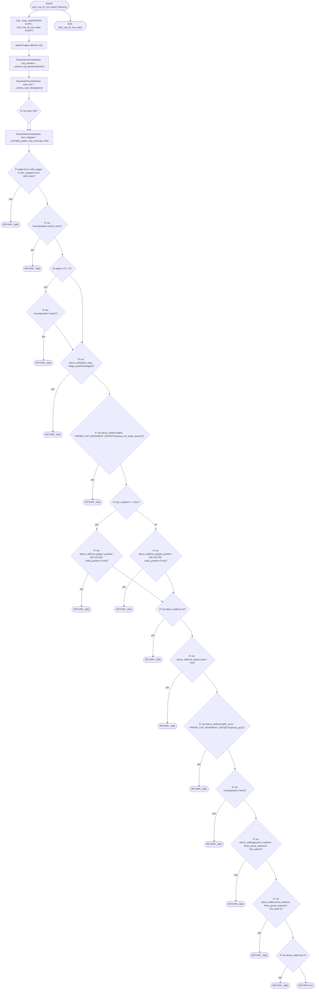

### `return_cup_with_hot_water`

Complete hot water dispensing sequence and return to holding position.

- **Mermaid file:** [../mermaid/paper_cups/return_cup_with_hot_water.mmd](../mermaid/paper_cups/return_cup_with_hot_water.mmd)
- **Parameter scenarios observed:** `ingredients.cups / cups / size / cup_size`, `position.cup_position / stage`
- **Branch/decision scenarios:**
  - `not cups_dict`
  - `stage not in valid_stages or size_mapped not in valid_sizes`
  - `not ok(run_skill("set_speed_factor",25))`
  - `not ok(run_skill("moveEE", *ESPRESSO_MOVEMENT_OFFSETS['hot_water_retreat']))`
  - `stage in ("1")`
  - `stage in ("2","3", "4")`
  - `stage in ("3", "4")`
  - `'pose' not in stage_params`
  - `not ok(run_skill("gotoJ_deg", *stage_params['pose']))`
  - `not ok(run_skill("sync"))`
  - `not ok(run_skill("set_gripper_position", GRIPPER_RELEASE, GRIPPER_OPEN, verify_position=True))`
  - `not ok(run_skill("moveEE", *PAPER_CUP_MOVEMENT_OFFSETS['place_up']))`
  - `not ok(run_skill("set_speed_factor", 100))`
  - `'stage_home' in stage_params`
  - `'twist_back' in stage_params`
  - `not run_skill("gotoJ_deg", *PAPER_CUP_ARM1_NAVIGATION_POSES['stage_1_entry'])`
  - `not home(position="south_west")`
  - `not home(position="south")`
  - `not ok(run_skill("gotoJ_deg", *stage_params['stage_home']))`
  - `not ok(run_skill("gotoJ_deg", *PAPER_CUPS_NAVIGATION_PARAMS['twist_back_machine']))`

```mermaid
flowchart TD
  N0(["START return_cup_with_hot_water(**params)"])
  N1["Nested helper defined: ok()"]
  N2["Parameter/normalization: cup_position = _extract_cup_position(params)"]
  N3["Parameter/normalization: cups_dict = _extract_cups_dict(params)"]
  N4{"IF not cups_dict?"}
  N5["Parameter/normalization: size_mapped = _normalize_paper_cup_size(cups_dict)"]
  N6{"IF stage not in valid_stages or size_mapped not in valid_sizes?"}
  N7(["RETURN _fail()"])
  N8{"IF not ok(run_skill('set_speed_factor',25))?"}
  N9(["RETURN _fail()"])
  N10{"IF not ok(run_skill('moveEE', *ESPRESSO_MOVEMENT_OFFSETS('hot_water_retreat')))?"}
  N11(["RETURN _fail()"])
  N12{"IF stage in ('1')?"}
  N13{"IF not run_skill('gotoJ_deg', *PAPER_CUP_ARM1_NAVIGATION_POSES('stage_1_entry'))?"}
  N14(["RETURN _fail()"])
  N15{"IF stage in ('2','3', '4')?"}
  N16{"IF not home(position='south_west')?"}
  N17(["RETURN _fail()"])
  N18{"IF stage in ('3', '4')?"}
  N19{"IF not home(position='south')?"}
  N20(["RETURN _fail()"])
  N21{"IF 'pose' not in stage_params?"}
  N22(["RETURN _fail()"])
  N23{"IF not ok(run_skill('gotoJ_deg', *stage_params('pose')))?"}
  N24(["RETURN _fail()"])
  N25{"IF not ok(run_skill('sync'))?"}
  N26(["RETURN _fail()"])
  N27{"IF not ok(run_skill('set_gripper_position', GRIPPER_RELEASE, GRIPPER_OPEN, verify_position=True))?"}
  N28(["RETURN _fail()"])
  N29{"IF not ok(run_skill('moveEE', *PAPER_CUP_MOVEMENT_OFFSETS('place_up')))?"}
  N30(["RETURN _fail()"])
  N31{"IF not ok(run_skill('set_speed_factor', 100))?"}
  N32(["RETURN _fail()"])
  N33{"IF 'stage_home' in stage_params?"}
  N34{"IF not ok(run_skill('gotoJ_deg', *stage_params('stage_home')))?"}
  N35(["RETURN _fail()"])
  N36{"IF 'twist_back' in stage_params?"}
  N37{"IF not ok(run_skill('gotoJ_deg', *PAPER_CUPS_NAVIGATION_PARAMS('twist_back_machine')))?"}
  N38(["RETURN _fail()"])
  N39(["RETURN True"])
  N40(["END return_cup_with_hot_water"])
  N0 --> N1
  N1 --> N2
  N2 --> N3
  N3 --> N4
  N4 --> N5
  N4 --> N5
  N5 --> N6
  N6 -- "yes" --> N7
  N6 --> N8
  N8 -- "yes" --> N9
  N8 --> N10
  N10 -- "yes" --> N11
  N10 --> N12
  N12 -- "yes" --> N13
  N13 -- "yes" --> N14
  N13 --> N15
  N12 --> N15
  N15 -- "yes" --> N16
  N16 -- "yes" --> N17
  N16 --> N18
  N15 --> N18
  N18 -- "yes" --> N19
  N19 -- "yes" --> N20
  N19 --> N21
  N18 --> N21
  N21 -- "yes" --> N22
  N21 --> N23
  N23 -- "yes" --> N24
  N23 --> N25
  N25 -- "yes" --> N26
  N25 --> N27
  N27 -- "yes" --> N28
  N27 --> N29
  N29 -- "yes" --> N30
  N29 --> N31
  N31 -- "yes" --> N32
  N31 --> N33
  N33 -- "yes" --> N34
  N34 -- "yes" --> N35
  N34 --> N36
  N33 --> N36
  N36 -- "yes" --> N37
  N37 -- "yes" --> N38
  N37 --> N39
  N36 --> N39
  N0 --> N40
```

### `dispense_paper_arm1_cup_station`

Dispense a paper cup by grabbing it from the dispenser and placing it at the requested stage.

- **Mermaid file:** [../mermaid/paper_cups/dispense_paper_arm1_cup_station.mmd](../mermaid/paper_cups/dispense_paper_arm1_cup_station.mmd)
- **Parameter scenarios observed:** none directly read
- **Branch/decision scenarios:**
  - `not grab_paper_cup_arm1(**params)`
  - `not place_paper_cup_arm1(**params)`

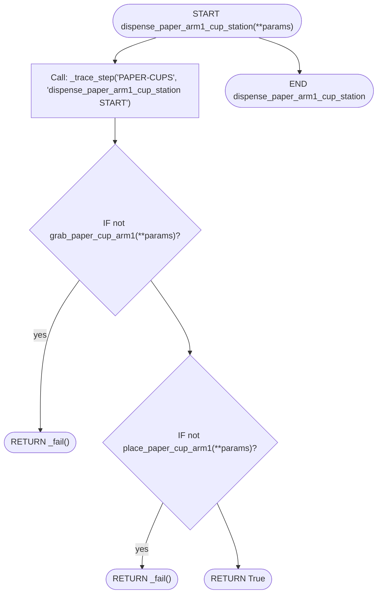

### `dispense_paper_arm2_cup_station`

Dispense a paper cup by grabbing it from the dispenser and placing it at the requested stage.

- **Mermaid file:** [../mermaid/paper_cups/dispense_paper_arm2_cup_station.mmd](../mermaid/paper_cups/dispense_paper_arm2_cup_station.mmd)
- **Parameter scenarios observed:** none directly read
- **Branch/decision scenarios:**
  - `not grab_paper_arm2_cup_station(**params)`
  - `not place_paper_arm2_cup_station(**params)`

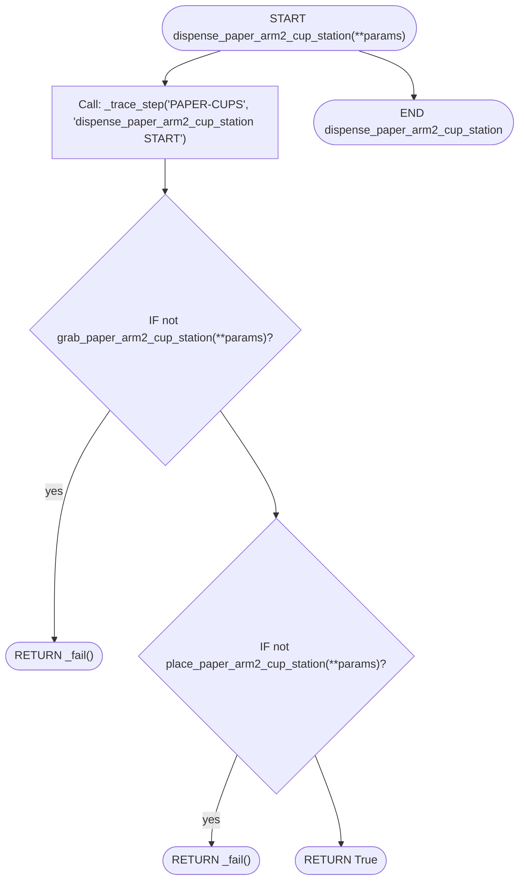

### `grab_paper_cup_arm1`

Grab a paper cup of specified size from the paper cup dispenser. First attempt does the full size-specific approach. If detection fails, retries only: 1) open gripper 2) move back up 3) close gripper with size-specific width 4) move back down

- **Mermaid file:** [../mermaid/paper_cups/grab_paper_cup_arm1.mmd](../mermaid/paper_cups/grab_paper_cup_arm1.mmd)
- **Parameter scenarios observed:** `ingredients.cups / cups / size / cup_size`
- **Branch/decision scenarios:**
  - `not size`
  - `not cfg`
  - `not ok(home(position=cfg["home"]))`
  - `not ok(run_skill("gotoJ_deg", *cfg["pose1"]))`
  - `not ok(run_skill("gotoJ_deg", *cfg["pose2"]))`
  - `not ok(run_skill("sync"))`
  - `not ok(home(position=cfg["home"]))`
  - `attempt_count > 0`
  - `not ok(run_skill("set_gripper_position", 255, cfg["grip"], 255, verify_position=True))`
  - `not ok(run_skill("moveEE_movJ", 0, 0, -cfg["up_down_z"], 0, 0, 0))`
  - `cup_detected`
  - `not ok(run_skill("sync"))`
  - `attempt_count == 15`
  - `not ok(run_skill("set_gripper_position", 255, 0, 255, verify_position=True))`
  - `not ok(run_skill("moveEE_movJ", 0, 0, cfg["up_down_z"], 0, 0, 0))`

```mermaid
flowchart TD
  N0(["START grab_paper_cup_arm1(**params)"])
  N1["Nested helper defined: ok()"]
  N2["Parameter/normalization: cups_dict = _extract_cups_dict(params)"]
  N3["Parameter/normalization: size = _normalize_paper_cup_size(cups_dict if cups_dict else '7oz')"]
  N4{"IF not size?"}
  N5(["RETURN _fail()"])
  N6{"IF not cfg?"}
  N7(["RETURN _fail()"])
  N8{"IF not ok(home(position=cfg('home')))?"}
  N9(["RETURN _fail()"])
  N10{"IF not ok(run_skill('gotoJ_deg', *cfg('pose1')))?"}
  N11(["RETURN _fail()"])
  N12{"IF not ok(run_skill('gotoJ_deg', *cfg('pose2')))?"}
  N13(["RETURN _fail()"])
  N14{"IF not ok(run_skill('sync'))?"}
  N15(["RETURN _fail()"])
  N16["State/cache: attempt_count = 0"]
  N17{"WHILE attempt_count < 15?"}
  N18["Call: _trace_step('PAPER-CUPS', f'grab_paper_cup_arm1 attempt=(attempt_count + 1)/15 size=(size)')"]
  N19{"IF attempt_count > 0?"}
  N20{"IF not ok(run_skill('set_gripper_position', 255, 0, 255, verify_position=True))?"}
  N21(["RETURN _fail()"])
  N22{"IF not ok(run_skill('moveEE_movJ', 0, 0, cfg('up_down_z'), 0, 0, 0))?"}
  N23(["RETURN _fail()"])
  N24{"IF not ok(run_skill('set_gripper_position', 255, cfg('grip'), 255, verify_position=True))?"}
  N25(["RETURN _fail()"])
  N26{"IF not ok(run_skill('moveEE_movJ', 0, 0, -cfg('up_down_z'), 0, 0, 0))?"}
  N27(["RETURN _fail()"])
  N28["State/cache: cup_detected = detect_cup_gripper()"]
  N29{"IF cup_detected?"}
  N30["BREAK"]
  N31["State/cache: attempt_count += 1"]
  N32{"IF not ok(run_skill('sync'))?"}
  N33(["RETURN _fail()"])
  N34{"IF attempt_count == 15?"}
  N35(["RETURN _fail()"])
  N36{"IF not ok(home(position=cfg('home')))?"}
  N37(["RETURN _fail()"])
  N38(["RETURN True"])
  N39(["END grab_paper_cup_arm1"])
  N0 --> N1
  N1 --> N2
  N2 --> N3
  N3 --> N4
  N4 -- "yes" --> N5
  N4 --> N6
  N6 -- "yes" --> N7
  N6 --> N8
  N8 -- "yes" --> N9
  N8 --> N10
  N10 -- "yes" --> N11
  N10 --> N12
  N12 -- "yes" --> N13
  N12 --> N14
  N14 -- "yes" --> N15
  N14 --> N16
  N16 --> N17
  N17 -- "iterate" --> N18
  N18 --> N19
  N19 -- "yes" --> N20
  N20 -- "yes" --> N21
  N20 --> N22
  N22 -- "yes" --> N23
  N22 --> N24
  N19 --> N24
  N24 -- "yes" --> N25
  N24 --> N26
  N26 -- "yes" --> N27
  N26 --> N28
  N28 --> N29
  N29 -- "yes" --> N30
  N30 --> N31
  N29 --> N31
  N31 --> N32
  N32 -- "yes" --> N33
  N32 --> N34
  N34 -- "yes" --> N35
  N34 -- "next/retry" --> N17
  N17 --> N36
  N36 -- "yes" --> N37
  N36 --> N38
  N0 --> N39
```

### `place_paper_cup_arm1`

Place a paper cup at the specified staging area.

- **Mermaid file:** [../mermaid/paper_cups/place_paper_cup_arm1.mmd](../mermaid/paper_cups/place_paper_cup_arm1.mmd)
- **Parameter scenarios observed:** `ingredients.cups / cups / size / cup_size`, `position.cup_position / stage`
- **Branch/decision scenarios:**
  - `not cups_dict`
  - `stage not in valid_stages or size_mapped not in valid_sizes`
  - `stage == "1"`
  - `'pose' not in stage_params`
  - `not ok(run_skill("gotoJ_deg", *stage_params['pose']))`
  - `not ok(run_skill("sync"))`
  - `not ok(run_skill("set_gripper_position", 25, 100, 255, verify_position=True))`
  - `not ok(run_skill("set_gripper_position", 255, 0, 255, verify_position=True))`
  - `not ok(run_skill("moveEE", *PAPER_CUP_MOVEMENT_OFFSETS['place_up']))`
  - `not ok(run_skill("set_speed_factor", 100))`
  - `'stage_home' in stage_params`
  - `not ok(run_skill("gotoJ_deg", *PAPER_CUP_ARM1_NAVIGATION_POSES['stage_1_entry']))`
  - `stage == "2"`
  - `not ok(run_skill("gotoJ_deg", *stage_params['stage_home']))`
  - `not ok(home(position="south_west"))`
  - `stage == "4"`
  - `not ok(home(position="south"))`
  - `stage == "3"`
  - `not ok(home(position="south_west"))`

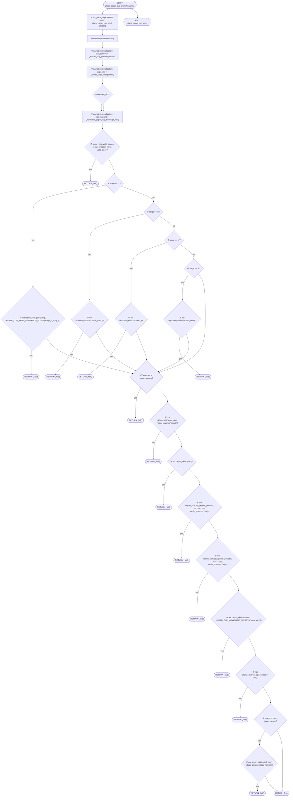

### `grab_paper_arm2_cup_station`

Grab a paper cup of specified size from the paper cup dispenser. First attempt does the full size-specific approach. If detection fails, retries only: 1) open gripper 2) move back up 3) close gripper with size-specific width 4) move back down

- **Mermaid file:** [../mermaid/paper_cups/grab_paper_arm2_cup_station.mmd](../mermaid/paper_cups/grab_paper_arm2_cup_station.mmd)
- **Parameter scenarios observed:** `ingredients.cups / cups / size / cup_size`
- **Branch/decision scenarios:**
  - `not size`
  - `not cfg`
  - `not ok(home(position=cfg["home"]))`
  - `not ok(run_skill("gotoJ_deg", *cfg["pose1"]))`
  - `not ok(run_skill("gotoJ_deg", *cfg["pose2"]))`
  - `not ok(run_skill("sync"))`
  - `not ok(home(position=cfg["home"]))`
  - `not ok(home(position="north_east"))`
  - `attempt_count > 0`
  - `not ok(run_skill("set_gripper_position", 255, cfg["grip"], 255, verify_position=True))`
  - `not ok(run_skill("moveEE_movJ", 0, 0, -cfg["up_down_z"], 0, 0, 0))`
  - `cup_detected`
  - `not ok(run_skill("sync"))`
  - `attempt_count == 15`
  - `not ok(run_skill("set_gripper_position", 255, 0, 255, verify_position=True))`
  - `not ok(run_skill("moveEE_movJ", 0, 0, cfg["up_down_z"], 0, 0, 0))`

```mermaid
flowchart TD
  N0(["START grab_paper_arm2_cup_station(**params)"])
  N1["Nested helper defined: ok()"]
  N2["Parameter/normalization: cups_dict = _extract_cups_dict(params)"]
  N3["Parameter/normalization: size = _normalize_paper_cup_size(cups_dict if cups_dict else '7oz')"]
  N4{"IF not size?"}
  N5(["RETURN _fail()"])
  N6{"IF not cfg?"}
  N7(["RETURN _fail()"])
  N8{"IF not ok(home(position=cfg('home')))?"}
  N9(["RETURN _fail()"])
  N10{"IF not ok(run_skill('gotoJ_deg', *cfg('pose1')))?"}
  N11(["RETURN _fail()"])
  N12{"IF not ok(run_skill('gotoJ_deg', *cfg('pose2')))?"}
  N13(["RETURN _fail()"])
  N14{"IF not ok(run_skill('sync'))?"}
  N15(["RETURN _fail()"])
  N16["State/cache: attempt_count = 0"]
  N17{"WHILE attempt_count < 15?"}
  N18["Call: _trace_step('PAPER-CUPS', f'grab_paper_cup_arm1 attempt=(attempt_count + 1)/15 size=(size)')"]
  N19{"IF attempt_count > 0?"}
  N20{"IF not ok(run_skill('set_gripper_position', 255, 0, 255, verify_position=True))?"}
  N21(["RETURN _fail()"])
  N22{"IF not ok(run_skill('moveEE_movJ', 0, 0, cfg('up_down_z'), 0, 0, 0))?"}
  N23(["RETURN _fail()"])
  N24{"IF not ok(run_skill('set_gripper_position', 255, cfg('grip'), 255, verify_position=True))?"}
  N25(["RETURN _fail()"])
  N26{"IF not ok(run_skill('moveEE_movJ', 0, 0, -cfg('up_down_z'), 0, 0, 0))?"}
  N27(["RETURN _fail()"])
  N28["State/cache: cup_detected = detect_cup_gripper()"]
  N29{"IF cup_detected?"}
  N30["BREAK"]
  N31["State/cache: attempt_count += 1"]
  N32{"IF not ok(run_skill('sync'))?"}
  N33(["RETURN _fail()"])
  N34{"IF attempt_count == 15?"}
  N35(["RETURN _fail()"])
  N36{"IF not ok(home(position=cfg('home')))?"}
  N37(["RETURN _fail()"])
  N38{"IF not ok(home(position='north_east'))?"}
  N39(["RETURN _fail()"])
  N40(["RETURN True"])
  N41(["END grab_paper_arm2_cup_station"])
  N0 --> N1
  N1 --> N2
  N2 --> N3
  N3 --> N4
  N4 -- "yes" --> N5
  N4 --> N6
  N6 -- "yes" --> N7
  N6 --> N8
  N8 -- "yes" --> N9
  N8 --> N10
  N10 -- "yes" --> N11
  N10 --> N12
  N12 -- "yes" --> N13
  N12 --> N14
  N14 -- "yes" --> N15
  N14 --> N16
  N16 --> N17
  N17 -- "iterate" --> N18
  N18 --> N19
  N19 -- "yes" --> N20
  N20 -- "yes" --> N21
  N20 --> N22
  N22 -- "yes" --> N23
  N22 --> N24
  N19 --> N24
  N24 -- "yes" --> N25
  N24 --> N26
  N26 -- "yes" --> N27
  N26 --> N28
  N28 --> N29
  N29 -- "yes" --> N30
  N30 --> N31
  N29 --> N31
  N31 --> N32
  N32 -- "yes" --> N33
  N32 --> N34
  N34 -- "yes" --> N35
  N34 -- "next/retry" --> N17
  N17 --> N36
  N36 -- "yes" --> N37
  N36 --> N38
  N38 -- "yes" --> N39
  N38 --> N40
  N0 --> N41
```

### `place_paper_arm2_cup_station`

Place a paper cup at specified staging area.

- **Mermaid file:** [../mermaid/paper_cups/place_paper_arm2_cup_station.mmd](../mermaid/paper_cups/place_paper_arm2_cup_station.mmd)
- **Parameter scenarios observed:** `position.cup_position / stage`
- **Branch/decision scenarios:**
  - `stage not in valid_stages`
  - `stage in ("1", "2")`
  - `stage in ("3", "4")`
  - `not ok(run_skill("gotoJ_deg", *stage_positions[stage]))`
  - `not ok(run_skill("sync"))`
  - `not ok(run_skill("set_gripper_position", 25, 100, 255, verify_position=True))`
  - `not ok(run_skill("set_gripper_position", 255, 0, 255, verify_position=True))`
  - `not ok(run_skill("moveEE", *PAPER_CUP_MOVEMENT_OFFSETS["place_up"]))`
  - `not ok(run_skill("set_speed_factor", 100))`
  - `not ok(home(position=stage_home_map[stage]))`
  - `not ok(home(position="east"))`
  - `not ok(home(position="south_east"))`

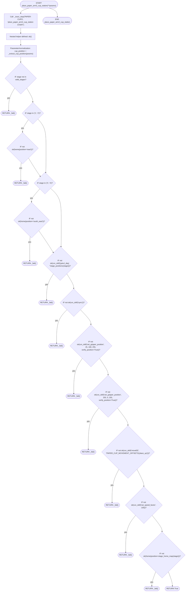

## Support/helper functions

### `run_skill`

Trace wrapper around manipulate_node.run_skill.

- **Mermaid file:** [../mermaid/paper_cups/run_skill.mmd](../mermaid/paper_cups/run_skill.mmd)
- **Parameter scenarios observed:** none directly read

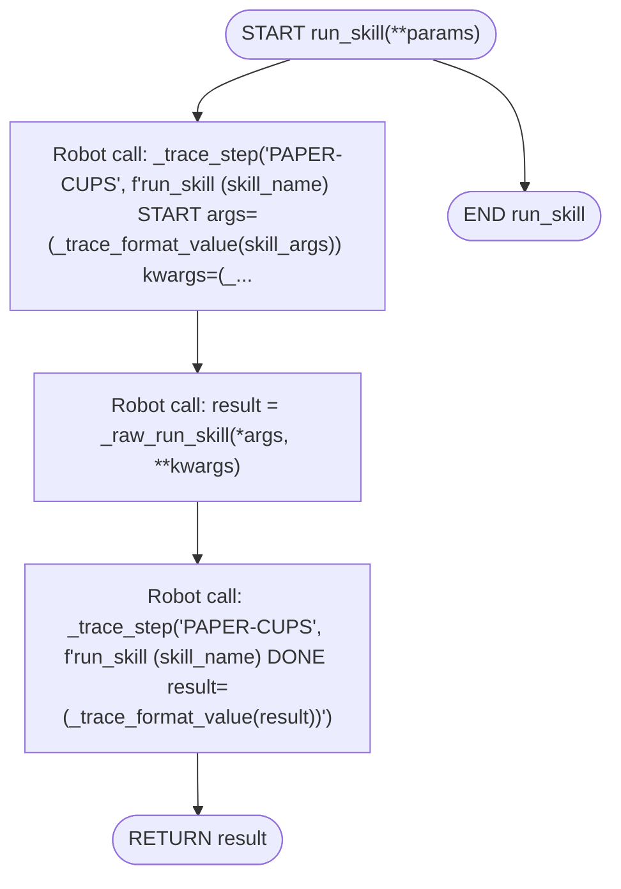

### `home`

Trace wrapper around home(...).

- **Mermaid file:** [../mermaid/paper_cups/home.mmd](../mermaid/paper_cups/home.mmd)
- **Parameter scenarios observed:** none directly read

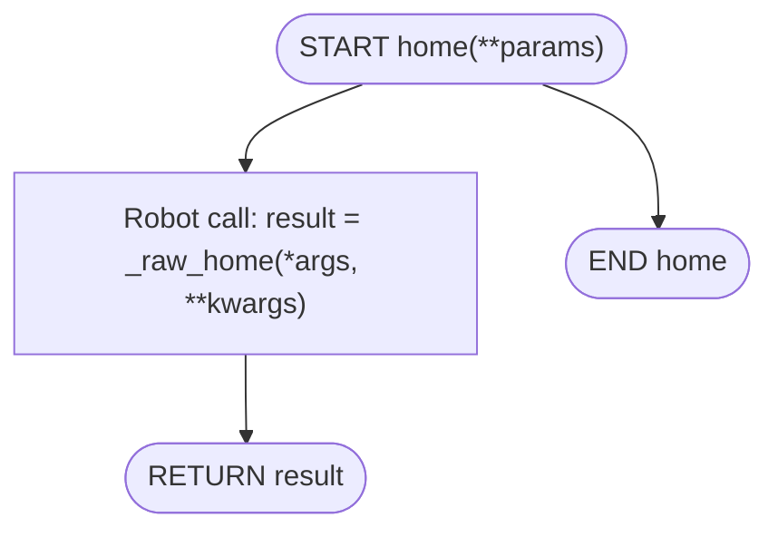

### `return_back_to_home`

Trace wrapper around return_back_to_home(...).

- **Mermaid file:** [../mermaid/paper_cups/return_back_to_home.mmd](../mermaid/paper_cups/return_back_to_home.mmd)
- **Parameter scenarios observed:** none directly read

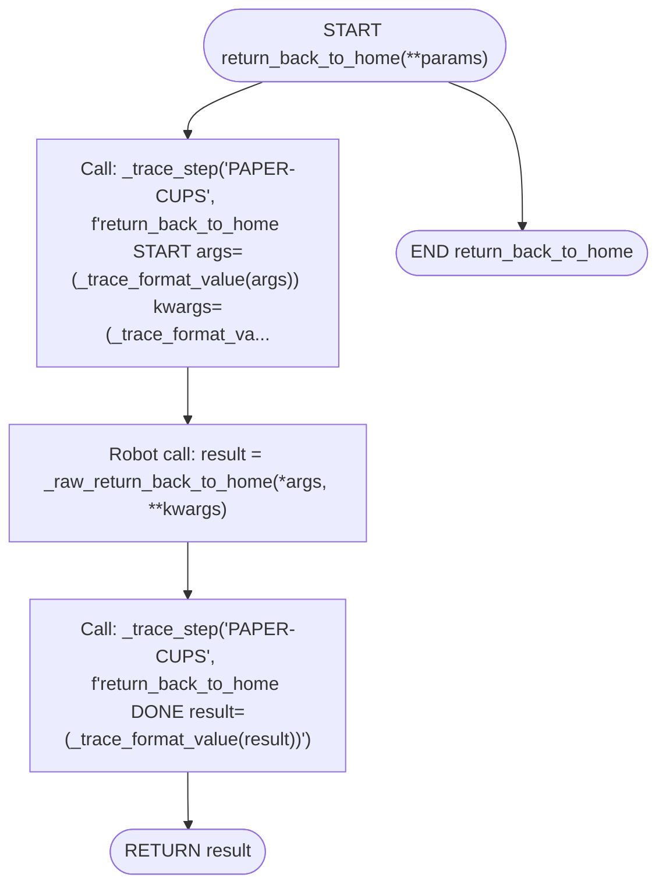

### `detect_cup_gripper`

Trace wrapper around detect_cup_gripper(...).

- **Mermaid file:** [../mermaid/paper_cups/detect_cup_gripper.mmd](../mermaid/paper_cups/detect_cup_gripper.mmd)
- **Parameter scenarios observed:** none directly read

```mermaid
flowchart TD
  N0(["START detect_cup_gripper(**params)"])
  N1["Call: _trace_step('PAPER-CUPS', f'detect_cup_gripper START args=(_trace_format_value(args)) kwargs=(_trace_format_val..."]
  N2["Call: result = _raw_detect_cup_gripper(*args, **kwargs)"]
  N3["Call: _trace_step('PAPER-CUPS', f'detect_cup_gripper DONE result=(_trace_format_value(result))')"]
  N4(["RETURN result"])
  N5(["END detect_cup_gripper"])
  N0 --> N1
  N1 --> N2
  N2 --> N3
  N3 --> N4
  N0 --> N5
```

### `_normalize_paper_cup_size`

Universal cup size normalizer for paper cup operations. Accepts BOTH H-codes AND C-codes regardless of prefix. Extracts the numeric size and returns standardized format. Args: cups_dict: Dictionary containing cup information, or a simple string/value Returns: str: Normalized cup size (e.g., '7oz', '9oz', '12oz') Examples: cup_H9 → '9oz' cup_C9 → '9oz' cup_h12 → '12oz' cup_c7 → '7oz'

- **Mermaid file:** [../mermaid/paper_cups/_normalize_paper_cup_size.mmd](../mermaid/paper_cups/_normalize_paper_cup_size.mmd)
- **Parameter scenarios observed:** none directly read
- **Branch/decision scenarios:**
  - `not cups_dict`
  - `isinstance(cups_dict, dict)`
  - `result and result != ''`
  - `result and result != '' and result in ('7oz', '9oz', '12oz')`
  - `cup_key`
  - `'CUP_' in cup_key_str`
  - `cup_code and len(cup_code) >= 2`
  - `cup_code[0] in ('H', 'C')`
  - `size_num in ('7', '9', '12')`

```mermaid
flowchart TD
  N0(["START _normalize_paper_cup_size(**params)"])
  N1{"IF not cups_dict?"}
  N2(["RETURN DEFAULT_PAPER_CUP_SIZE"])
  N3{"IF isinstance(cups_dict, dict)?"}
  N4{"IF cup_key?"}
  N5{"IF 'CUP_' in cup_key_str?"}
  N6{"IF cup_code and len(cup_code) >= 2?"}
  N7{"IF cup_code(0) in ('H', 'C')?"}
  N8{"IF size_num in ('7', '9', '12')?"}
  N9(["RETURN f'(size_num)oz'"])
  N10["Parameter/normalization: result = _normalize_cup_size(cups_dict, cup_type='paper', default_size='')"]
  N11{"IF result and result != ''?"}
  N12(["RETURN result"])
  N13["Parameter/normalization: result = _normalize_cup_size(cups_dict, cup_type='plastic', default_size='')"]
  N14{"IF result and result != '' and result in ('7oz', '9oz', '12oz')?"}
  N15(["RETURN result"])
  N16(["RETURN DEFAULT_PAPER_CUP_SIZE"])
  N17(["END _normalize_paper_cup_size"])
  N0 --> N1
  N1 -- "yes" --> N2
  N1 --> N3
  N3 -- "yes" --> N4
  N4 -- "yes" --> N5
  N5 --> N6
  N5 --> N6
  N6 -- "yes" --> N7
  N7 --> N8
  N7 --> N8
  N8 -- "yes" --> N9
  N8 --> N10
  N6 --> N10
  N4 --> N10
  N3 --> N10
  N10 --> N11
  N11 -- "yes" --> N12
  N11 --> N13
  N13 --> N14
  N14 -- "yes" --> N15
  N14 --> N16
  N0 --> N17
```
