# `plastic_cups.py` flowcharts

- Sequence/exported functions: 10
- Support/helper functions: 7

## Sequence/exported functions

### `dispense_plastic_cup`

- **Mermaid file:** [../mermaid/plastic_cups/dispense_plastic_cup.mmd](../mermaid/plastic_cups/dispense_plastic_cup.mmd)
- **Parameter scenarios observed:** `ingredients.cups / cups / size / cup_size`
- **Branch/decision scenarios:**
  - `not cup_size or not validate_cup_size(cup_size)`
  - `cup_size not in CUP_CONFIG`
  - `cup_detected`
  - `attempt_count == 15`

```mermaid
flowchart TD
  N0(["START dispense_plastic_cup(**params)"])
  N1["Call: _trace_step('dispense_plastic_cup', 'START')"]
  N2["Parameter/normalization: cups_dict = _extract_cups_dict(params)"]
  N3["Parameter/normalization: cup_size = _normalize_plastic_cup_size(cups_dict if cups_dict else DEFAULT_PLASTIC_CUP_SIZE)"]
  N4{"IF not cup_size or not validate_cup_size(cup_size)?"}
  N5(["RETURN False"])
  N6{"IF cup_size not in CUP_CONFIG?"}
  N7(["RETURN False"])
  N8["State/cache: attempt_count = 0"]
  N9{"WHILE attempt_count < 15?"}
  N10["Call: _trace_step('dispense_plastic_cup', f'attempt=(attempt_count + 1)/15 size=(cup_size) home=(config('home'))')"]
  N11["Robot call: home(position=config('home'))"]
  N12["Robot call: run_skill('set_gripper_position', 255, 0, 255, verify_position=True)"]
  N13["Robot call: run_skill('gotoJ_deg', *config('coords'))"]
  N14["Robot call: run_skill('moveEE', 0.0, 328.0, 10.0, 0, 0, 0)"]
  N15["Robot call: run_skill('set_gripper_position', 255, dp('gripper_pos'), 255, verify_position=True)"]
  N16["Robot call: run_skill('sync')"]
  N17["Robot call: run_skill('set_DO', dp('do_index'), 1)"]
  N18["Call: time.sleep(1.5)"]
  N19["Robot call: run_skill('set_DO', dp('do_index'), 0)"]
  N20["Robot call: run_skill('moveEE', 0, 0, -150, 0, 0, 0)"]
  N21["Robot call: run_skill('moveEE', 0, -328.0, 0, 0, 0, 0)"]
  N22["Robot call: run_skill('gotoJ_deg', *config('coords'))"]
  N23["Robot call: home(position=config('home'))"]
  N24["Robot call: home(position='north')"]
  N25["Robot call: run_skill('sync')"]
  N26["State/cache: cup_detected = detect_cup_gripper()"]
  N27["Call: _trace_step('dispense_plastic_cup', f'cup detection result=(cup_detected)')"]
  N28{"IF cup_detected?"}
  N29["BREAK"]
  N30["State/cache: attempt_count += 1"]
  N31{"IF attempt_count == 15?"}
  N32(["RETURN False"])
  N33(["RETURN True"])
  N34(["END dispense_plastic_cup"])
  N0 --> N1
  N1 --> N2
  N2 --> N3
  N3 --> N4
  N4 -- "yes" --> N5
  N4 --> N6
  N6 -- "yes" --> N7
  N6 --> N8
  N8 --> N9
  N9 -- "iterate" --> N10
  N10 --> N11
  N11 --> N12
  N12 --> N13
  N13 --> N14
  N14 --> N15
  N15 --> N16
  N16 --> N17
  N17 --> N18
  N18 --> N19
  N19 --> N20
  N20 --> N21
  N21 --> N22
  N22 --> N23
  N23 --> N24
  N24 --> N25
  N25 --> N26
  N26 --> N27
  N27 --> N28
  N28 -- "yes" --> N29
  N29 --> N30
  N28 --> N30
  N30 --> N31
  N31 -- "yes" --> N32
  N31 -- "next/retry" --> N9
  N9 --> N33
  N0 --> N34
```

### `go_to_ice`

- **Mermaid file:** [../mermaid/plastic_cups/go_to_ice.mmd](../mermaid/plastic_cups/go_to_ice.mmd)
- **Parameter scenarios observed:** `ingredients.cups / cups / size / cup_size`
- **Branch/decision scenarios:**
  - `not cup_size`
  - `cup_size not in ('16oz', '12oz', '9oz', '7oz')`
  - `not ok(run_skill("gotoJ_deg", *PLASTIC_CUPS_PARAMS['ice_positions']['position1']))`
  - `not ok(run_skill("gotoJ_deg", *PLASTIC_CUPS_PARAMS['ice_positions']['position2']))`
  - `not ok(run_skill("set_gripper_position", GRIPPER_RELEASE_GENTLE, GRIPPER_HOLD_LOOSE, verify_position=True))`

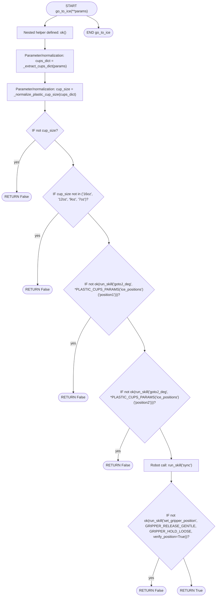

### `go_home_with_ice`

- **Mermaid file:** [../mermaid/plastic_cups/go_home_with_ice.mmd](../mermaid/plastic_cups/go_home_with_ice.mmd)
- **Parameter scenarios observed:** `ingredients.cups / cups / size / cup_size`
- **Branch/decision scenarios:**
  - `not cup_size or not validate_cup_size(cup_size)`
  - `_is_valid_angles(cached_retreat)`
  - `gripper_position is None`
  - `not ok(run_skill("set_gripper_position", GRIPPER_FULL, gripper_position, verify_position=True))`
  - `not ok(run_skill("gotoJ_deg", *PLASTIC_CUPS_PARAMS['ice_positions']['position3']))`
  - `not ok(run_skill("gotoJ_deg", *PLASTIC_CUPS_PARAMS['ice_positions']['position1']))`
  - `not home(position="north")`
  - `not ok(run_skill("gotoJ_deg", *cached_retreat))`
  - `not ok(run_skill("moveEE_movJ", -10, 0, 0, 0, 0, 0))`
  - `not _is_valid_angles(retreat_pose)`

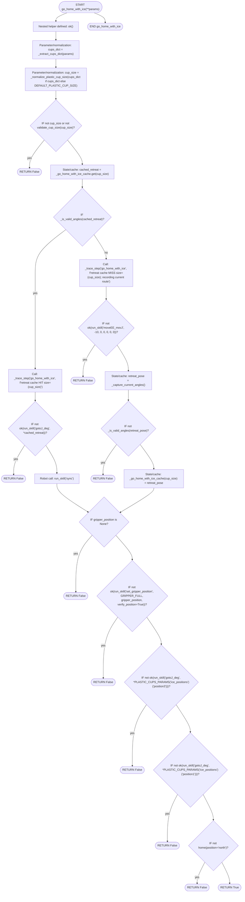

### `place_plastic_cup_station`

- **Mermaid file:** [../mermaid/plastic_cups/place_plastic_cup_station.mmd](../mermaid/plastic_cups/place_plastic_cup_station.mmd)
- **Parameter scenarios observed:** `ingredients.cups / cups / size / cup_size`, `position.cup_position / stage`
- **Branch/decision scenarios:**
  - `not cup_size or cup_size not in ('7oz', '9oz', '12oz', '16oz')`
  - `not home(position="north_east")`
  - `not home(position="east")`
  - `stage == "1"`
  - `not ok(stage_result)`
  - `not ok(run_skill("set_gripper_position", 25, 100, 25, verify_position=True))`
  - `not ok(run_skill("set_gripper_position", 255, 0, 255, verify_position=True))`
  - `_is_valid_angles(cached_up)`
  - `not home(position="east")`
  - `stage == "2"`
  - `not ok(run_skill("gotoJ_deg", *cached_up))`
  - `not ok(run_skill("moveEE", *PLASTIC_CUP_MOVEMENT_OFFSETS['place_return_up']))`
  - `not _is_valid_angles(up_pose)`
  - `stage == "3"`
  - `stage == "4"`

```mermaid
flowchart TD
  N0(["START place_plastic_cup_station(**params)"])
  N1["Call: _trace_step('place_plastic_cup_station', 'START')"]
  N2["Nested helper defined: ok()"]
  N3["Parameter/normalization: cup_position = _extract_cup_position(params)"]
  N4["Parameter/normalization: cups_dict = _extract_cups_dict(params)"]
  N5["Parameter/normalization: cup_size = _normalize_plastic_cup_size(cups_dict)"]
  N6{"IF not cup_size or cup_size not in ('7oz', '9oz', '12oz', '16oz')?"}
  N7(["RETURN False"])
  N8["Robot call: run_skill('set_speed_factor', SPEED_NORMAL)"]
  N9{"IF not home(position='north_east')?"}
  N10(["RETURN False"])
  N11{"IF not home(position='east')?"}
  N12(["RETURN False"])
  N13{"IF stage == '1'?"}
  N14["Robot call: stage_result = run_skill('gotoJ_deg', *PLASTIC_CUPS_PARAMS('staging')('place_1'))"]
  N15{"IF stage == '2'?"}
  N16["Robot call: stage_result = run_skill('gotoJ_deg', *PLASTIC_CUPS_PARAMS('staging')('place_2'))"]
  N17{"IF stage == '3'?"}
  N18["Robot call: home(position='south_east')"]
  N19["Robot call: stage_result = run_skill('gotoJ_deg', *PLASTIC_CUPS_PARAMS('staging')('place_3'))"]
  N20{"IF stage == '4'?"}
  N21["Robot call: home(position='south_east')"]
  N22["Robot call: stage_result = run_skill('gotoJ_deg', *PLASTIC_CUPS_PARAMS('staging')('place_4'))"]
  N23(["RETURN False"])
  N24{"IF not ok(stage_result)?"}
  N25(["RETURN False"])
  N26["Robot call: run_skill('sync')"]
  N27{"IF not ok(run_skill('set_gripper_position', 25, 100, 25, verify_position=True))?"}
  N28(["RETURN False"])
  N29{"IF not ok(run_skill('set_gripper_position', 255, 0, 255, verify_position=True))?"}
  N30(["RETURN False"])
  N31["Robot call: run_skill('set_speed_factor', SPEED_FAST)"]
  N32["State/cache: cached_up = _place_plastic_cup_station_cache.get(stage)"]
  N33{"IF _is_valid_angles(cached_up)?"}
  N34["Call: _trace_step('place_plastic_cup_station', f'return-up cache HIT stage=(stage)')"]
  N35{"IF not ok(run_skill('gotoJ_deg', *cached_up))?"}
  N36(["RETURN False"])
  N37["Call: _trace_step('place_plastic_cup_station', f'return-up cache MISS stage=(stage); recording pose')"]
  N38{"IF not ok(run_skill('moveEE', *PLASTIC_CUP_MOVEMENT_OFFSETS('place_return_up')))?"}
  N39(["RETURN False"])
  N40["State/cache: up_pose = _capture_current_angles()"]
  N41{"IF not _is_valid_angles(up_pose)?"}
  N42(["RETURN False"])
  N43["State/cache: _place_plastic_cup_station_cache(stage) = up_pose"]
  N44{"IF not home(position='east')?"}
  N45(["RETURN False"])
  N46(["RETURN True"])
  N47(["END place_plastic_cup_station"])
  N0 --> N1
  N1 --> N2
  N2 --> N3
  N3 --> N4
  N4 --> N5
  N5 --> N6
  N6 -- "yes" --> N7
  N6 --> N8
  N8 --> N9
  N9 -- "yes" --> N10
  N9 --> N11
  N11 -- "yes" --> N12
  N11 --> N13
  N13 -- "yes" --> N14
  N13 -- "no" --> N15
  N15 -- "yes" --> N16
  N15 -- "no" --> N17
  N17 -- "yes" --> N18
  N18 --> N19
  N17 -- "no" --> N20
  N20 -- "yes" --> N21
  N21 --> N22
  N20 -- "no" --> N23
  N14 --> N24
  N16 --> N24
  N19 --> N24
  N22 --> N24
  N24 -- "yes" --> N25
  N24 --> N26
  N26 --> N27
  N27 -- "yes" --> N28
  N27 --> N29
  N29 -- "yes" --> N30
  N29 --> N31
  N31 --> N32
  N32 --> N33
  N33 -- "yes" --> N34
  N34 --> N35
  N35 -- "yes" --> N36
  N33 -- "no" --> N37
  N37 --> N38
  N38 -- "yes" --> N39
  N38 --> N40
  N40 --> N41
  N41 -- "yes" --> N42
  N41 --> N43
  N35 --> N44
  N43 --> N44
  N44 -- "yes" --> N45
  N44 --> N46
  N0 --> N47
```

### `pick_plastic_cup_station`

- **Mermaid file:** [../mermaid/plastic_cups/pick_plastic_cup_station.mmd](../mermaid/plastic_cups/pick_plastic_cup_station.mmd)
- **Parameter scenarios observed:** `ingredients.cups / cups / size / cup_size`, `position.cup_position / stage`
- **Branch/decision scenarios:**
  - `not cup_size or cup_size not in ('7oz', '9oz', '12oz', '16oz')`
  - `not home(position="north_east")`
  - `not home(position="east")`
  - `stage in ("3", "4")`
  - `not ok(run_skill("gotoJ_deg", *stage_positions[stage]))`
  - `_is_valid_angles(cached_down)`
  - `not ok(run_skill("set_gripper_position", GRIPPER_FULL, gripper_positions[cup_size], verify_position=True))`
  - `cup_position in (3, 4)`
  - `not home(position="east")`
  - `not home(position="north_east")`
  - `not home(position="south_east")`
  - `not ok(run_skill("gotoJ_deg", *cached_down))`
  - `not ok(run_skill("moveEE", *PLASTIC_CUP_MOVEMENT_OFFSETS['pickup_down']))`
  - `not _is_valid_angles(down_pose)`
  - `not home(position="south_east")`

```mermaid
flowchart TD
  N0(["START pick_plastic_cup_station(**params)"])
  N1["Call: _trace_step('pick_plastic_cup_station', 'START')"]
  N2["Nested helper defined: ok()"]
  N3["Parameter/normalization: cup_position = _extract_cup_position(params)"]
  N4["Parameter/normalization: cups_dict = _extract_cups_dict(params)"]
  N5["Parameter/normalization: cup_size = _normalize_plastic_cup_size(cups_dict)"]
  N6{"IF not cup_size or cup_size not in ('7oz', '9oz', '12oz', '16oz')?"}
  N7(["RETURN False"])
  N8{"IF not home(position='north_east')?"}
  N9(["RETURN False"])
  N10{"IF not home(position='east')?"}
  N11(["RETURN False"])
  N12{"IF stage in ('3', '4')?"}
  N13{"IF not home(position='south_east')?"}
  N14(["RETURN False"])
  N15{"IF not ok(run_skill('gotoJ_deg', *stage_positions(stage)))?"}
  N16(["RETURN False"])
  N17["Robot call: run_skill('sync')"]
  N18["State/cache: cache_key = (stage, cup_size)"]
  N19["State/cache: cached_down = _pick_plastic_cup_station_cache.get(cache_key)"]
  N20{"IF _is_valid_angles(cached_down)?"}
  N21["Call: _trace_step('pick_plastic_cup_station', f'pickup-down cache HIT stage=(stage) size=(cup_size)')"]
  N22{"IF not ok(run_skill('gotoJ_deg', *cached_down))?"}
  N23(["RETURN False"])
  N24["Robot call: run_skill('sync')"]
  N25["Call: _trace_step('pick_plastic_cup_station', f'pickup-down cache MISS stage=(stage) size=(cup_size); recording pose')"]
  N26{"IF not ok(run_skill('moveEE', *PLASTIC_CUP_MOVEMENT_OFFSETS('pickup_down')))?"}
  N27(["RETURN False"])
  N28["State/cache: down_pose = _capture_current_angles()"]
  N29{"IF not _is_valid_angles(down_pose)?"}
  N30(["RETURN False"])
  N31["State/cache: _pick_plastic_cup_station_cache(cache_key) = down_pose"]
  N32["Robot call: run_skill('sync')"]
  N33{"IF not ok(run_skill('set_gripper_position', GRIPPER_FULL, gripper_positions(cup_size), verify_position=True))?"}
  N34(["RETURN False"])
  N35["Robot call: run_skill('set_speed_factor', SPEED_NORMAL)"]
  N36["Robot call: run_skill('sync')"]
  N37{"IF cup_position in (3, 4)?"}
  N38{"IF not home(position='south_east')?"}
  N39(["RETURN False"])
  N40{"IF not home(position='east')?"}
  N41(["RETURN False"])
  N42{"IF not home(position='north_east')?"}
  N43(["RETURN False"])
  N44(["RETURN True"])
  N45(["END pick_plastic_cup_station"])
  N0 --> N1
  N1 --> N2
  N2 --> N3
  N3 --> N4
  N4 --> N5
  N5 --> N6
  N6 -- "yes" --> N7
  N6 --> N8
  N8 -- "yes" --> N9
  N8 --> N10
  N10 -- "yes" --> N11
  N10 --> N12
  N12 -- "yes" --> N13
  N13 -- "yes" --> N14
  N13 --> N15
  N12 --> N15
  N15 -- "yes" --> N16
  N15 --> N17
  N17 --> N18
  N18 --> N19
  N19 --> N20
  N20 -- "yes" --> N21
  N21 --> N22
  N22 -- "yes" --> N23
  N22 --> N24
  N20 -- "no" --> N25
  N25 --> N26
  N26 -- "yes" --> N27
  N26 --> N28
  N28 --> N29
  N29 -- "yes" --> N30
  N29 --> N31
  N24 --> N32
  N31 --> N32
  N32 --> N33
  N33 -- "yes" --> N34
  N33 --> N35
  N35 --> N36
  N36 --> N37
  N37 -- "yes" --> N38
  N38 -- "yes" --> N39
  N38 --> N40
  N37 --> N40
  N40 -- "yes" --> N41
  N40 --> N42
  N42 -- "yes" --> N43
  N42 --> N44
  N0 --> N45
```

### `place_plastic_cup_sauces`

- **Mermaid file:** [../mermaid/plastic_cups/place_plastic_cup_sauces.mmd](../mermaid/plastic_cups/place_plastic_cup_sauces.mmd)
- **Parameter scenarios observed:** `ingredients.cups / cups / size / cup_size`
- **Branch/decision scenarios:**
  - `not cup_size or cup_size not in ("7oz", "9oz", "12oz", "16oz")`
  - `not after_dispense`
  - `not ok(run_skill("gotoJ_deg", *PLASTIC_CUPS_PARAMS['sauces_station']['position1']))`
  - `not ok(run_skill("gotoJ_deg", *PLASTIC_CUPS_PARAMS['sauces_station']['position2']))`
  - `_is_valid_angles(_place_plastic_cup_sauces_cache)`
  - `not ok(run_skill("set_gripper_position", GRIPPER_RELEASE_GENTLE, GRIPPER_HOLD_LOOSE, verify_position=True))`
  - `not cup_detected`
  - `not ok(run_skill("gotoJ_deg", *_place_plastic_cup_sauces_cache))`
  - `not ok(run_skill("moveEE", -5, 0, 0, 0, 0, 0))`
  - `not _is_valid_angles(nudge_pose)`

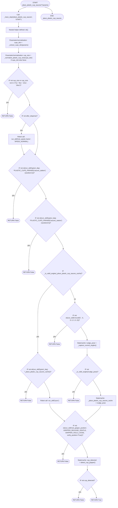

### `pick_plastic_cup_sauces`

- **Mermaid file:** [../mermaid/plastic_cups/pick_plastic_cup_sauces.mmd](../mermaid/plastic_cups/pick_plastic_cup_sauces.mmd)
- **Parameter scenarios observed:** `ingredients.cups / cups / size / cup_size`
- **Branch/decision scenarios:**
  - `not cup_size or cup_size not in ("7oz", "9oz", "12oz", "16oz")`
  - `not detect_cup_gripper()`
  - `_is_valid_angles(cached_lift)`
  - `not ok(run_skill("set_gripper_position", GRIPPER_FULL, gripper_positions[cup_size], verify_position=True))`
  - `not ok(run_skill("gotoJ_deg", *PLASTIC_CUPS_PARAMS['sauces_station']['position1']))`
  - `not ok(run_skill("gotoJ_deg", *cached_lift))`
  - `not ok(run_skill("moveEE", 0, 0, 1, 0, 0, 0))`
  - `not _is_valid_angles(lift_pose)`

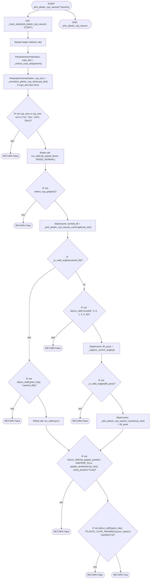

### `place_plastic_cup_milk`

- **Mermaid file:** [../mermaid/plastic_cups/place_plastic_cup_milk.mmd](../mermaid/plastic_cups/place_plastic_cup_milk.mmd)
- **Parameter scenarios observed:** `ingredients.cups / cups / size / cup_size`
- **Branch/decision scenarios:**
  - `not cup_size or cup_size not in ("7oz", "9oz", "12oz", "16oz")`
  - `not after_dispense`
  - `not ok(run_skill("gotoJ_deg", *PLASTIC_CUPS_PARAMS['milk_station']['position1']))`
  - `not ok(run_skill("gotoJ_deg", *PLASTIC_CUPS_PARAMS['milk_station']['position2']))`
  - `not ok(run_skill("set_gripper_position", GRIPPER_RELEASE_GENTLE, GRIPPER_HOLD_LOOSE, verify_position=True))`
  - `not detect_cup_gripper()`

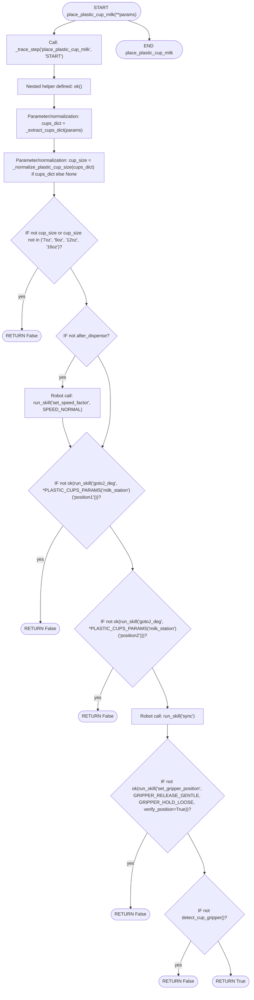

### `pick_plastic_cup_milk`

- **Mermaid file:** [../mermaid/plastic_cups/pick_plastic_cup_milk.mmd](../mermaid/plastic_cups/pick_plastic_cup_milk.mmd)
- **Parameter scenarios observed:** `ingredients.cups / cups / size / cup_size`
- **Branch/decision scenarios:**
  - `not cup_size or cup_size not in ("7oz", "9oz", "12oz", "16oz")`
  - `not detect_cup_gripper()`
  - `_is_valid_angles(cached_lift)`
  - `not ok(run_skill("set_gripper_position", GRIPPER_FULL, gripper_positions[cup_size], verify_position=True))`
  - `not ok(run_skill("gotoJ_deg", *PLASTIC_CUPS_PARAMS['milk_station']['position1']))`
  - `not ok(run_skill("gotoJ_deg", *cached_lift))`
  - `not ok(run_skill("moveEE", -5, 0, 1, 0, 0, 0))`
  - `not _is_valid_angles(lift_pose)`

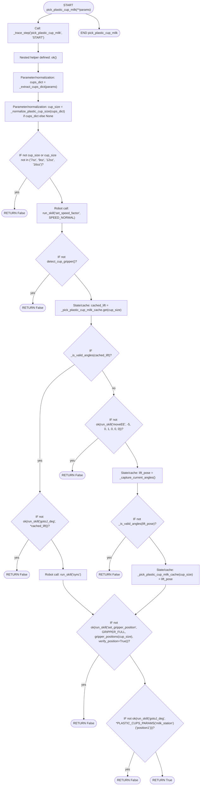

### `invalidate_plastic_cup_cache`

- **Mermaid file:** [../mermaid/plastic_cups/invalidate_plastic_cup_cache.mmd](../mermaid/plastic_cups/invalidate_plastic_cup_cache.mmd)
- **Parameter scenarios observed:** none directly read

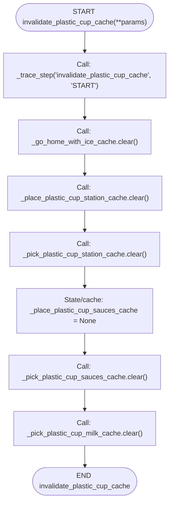

## Support/helper functions

### `run_skill`

- **Mermaid file:** [../mermaid/plastic_cups/run_skill.mmd](../mermaid/plastic_cups/run_skill.mmd)
- **Parameter scenarios observed:** none directly read

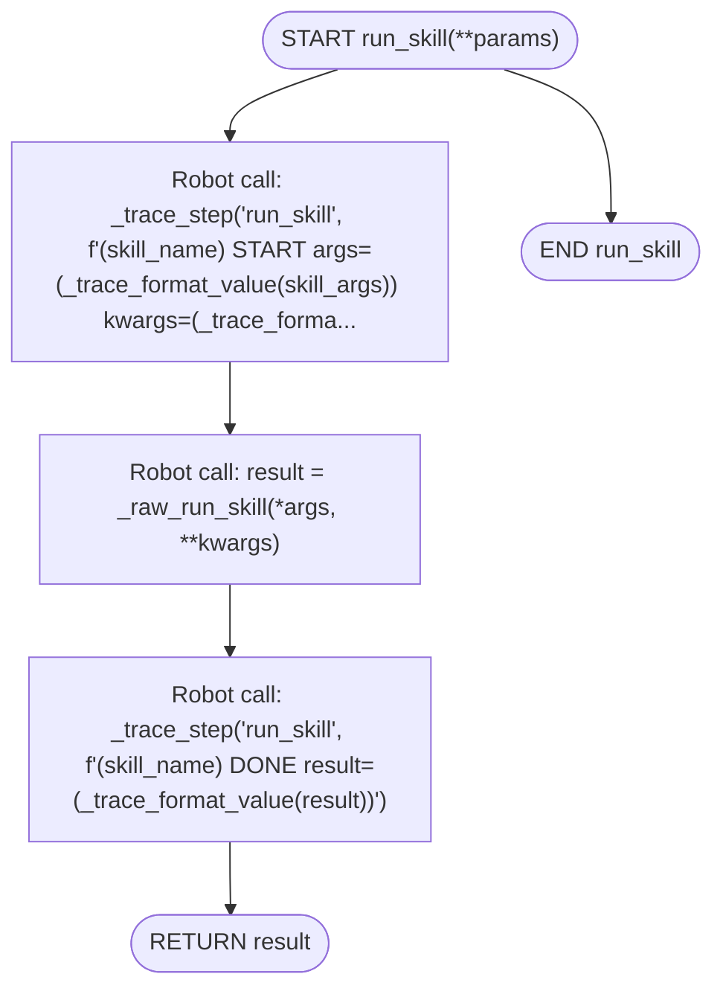

### `home`

- **Mermaid file:** [../mermaid/plastic_cups/home.mmd](../mermaid/plastic_cups/home.mmd)
- **Parameter scenarios observed:** none directly read

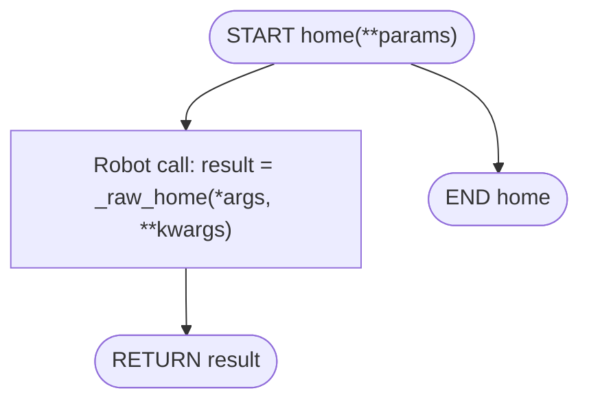

### `return_back_to_home`

- **Mermaid file:** [../mermaid/plastic_cups/return_back_to_home.mmd](../mermaid/plastic_cups/return_back_to_home.mmd)
- **Parameter scenarios observed:** none directly read

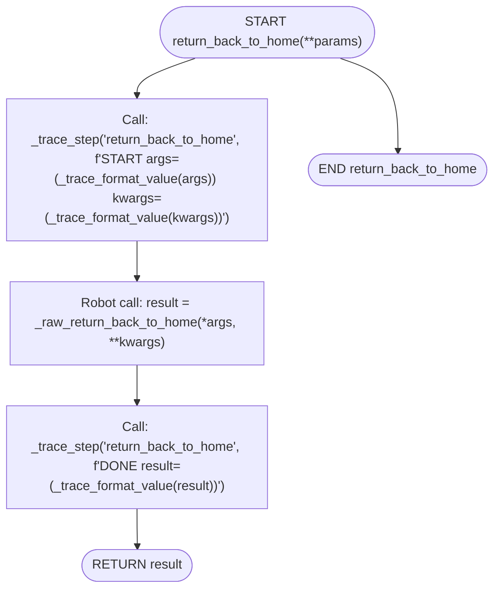

### `detect_cup_gripper`

- **Mermaid file:** [../mermaid/plastic_cups/detect_cup_gripper.mmd](../mermaid/plastic_cups/detect_cup_gripper.mmd)
- **Parameter scenarios observed:** none directly read

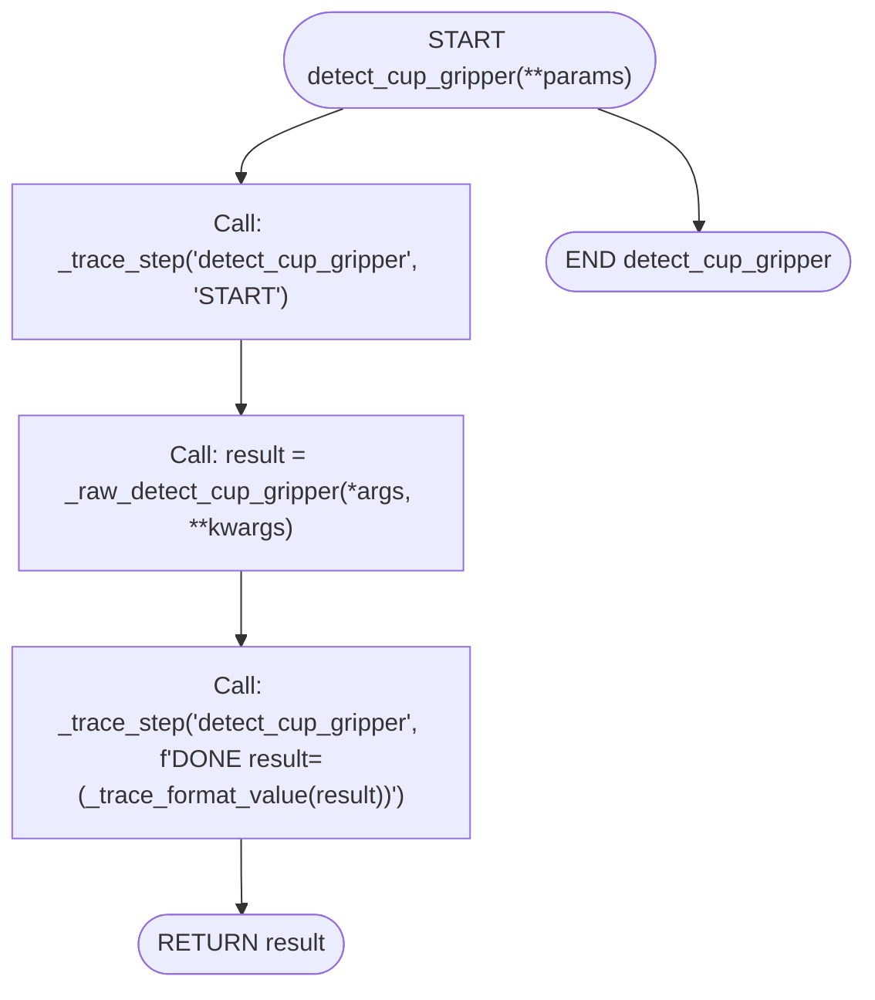

### `_is_valid_angles`

- **Mermaid file:** [../mermaid/plastic_cups/_is_valid_angles.mmd](../mermaid/plastic_cups/_is_valid_angles.mmd)
- **Parameter scenarios observed:** none directly read

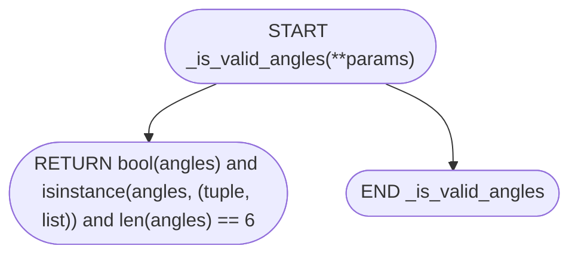

### `_capture_current_angles`

- **Mermaid file:** [../mermaid/plastic_cups/_capture_current_angles.mmd](../mermaid/plastic_cups/_capture_current_angles.mmd)
- **Parameter scenarios observed:** none directly read
- **Branch/decision scenarios:**
  - `not _is_valid_angles(angles)`

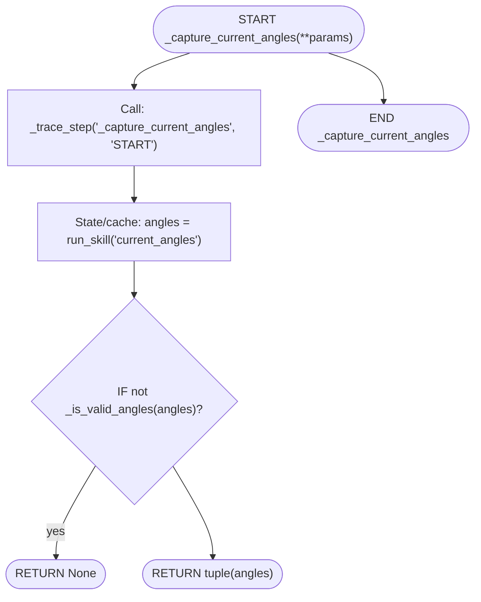

### `_normalize_plastic_cup_size`

- **Mermaid file:** [../mermaid/plastic_cups/_normalize_plastic_cup_size.mmd](../mermaid/plastic_cups/_normalize_plastic_cup_size.mmd)
- **Parameter scenarios observed:** none directly read
- **Branch/decision scenarios:**
  - `not cups_dict`
  - `isinstance(cups_dict, dict)`
  - `result and result != ''`
  - `result and result != ''`
  - `cup_key`
  - `'CUP_' in cup_key_str`
  - `cup_code and len(cup_code) >= 2`
  - `cup_code[0] in ('H', 'C')`
  - `size_num in ('7', '9', '12', '16')`

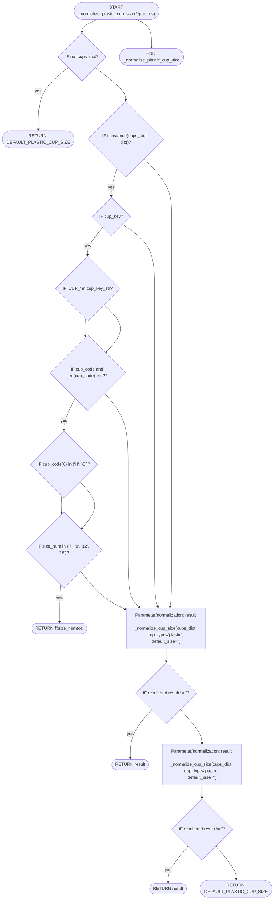
