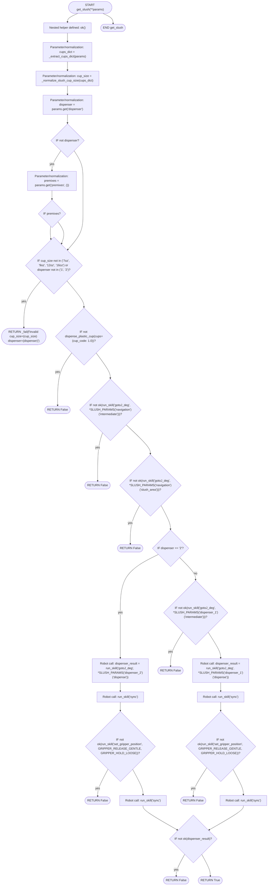
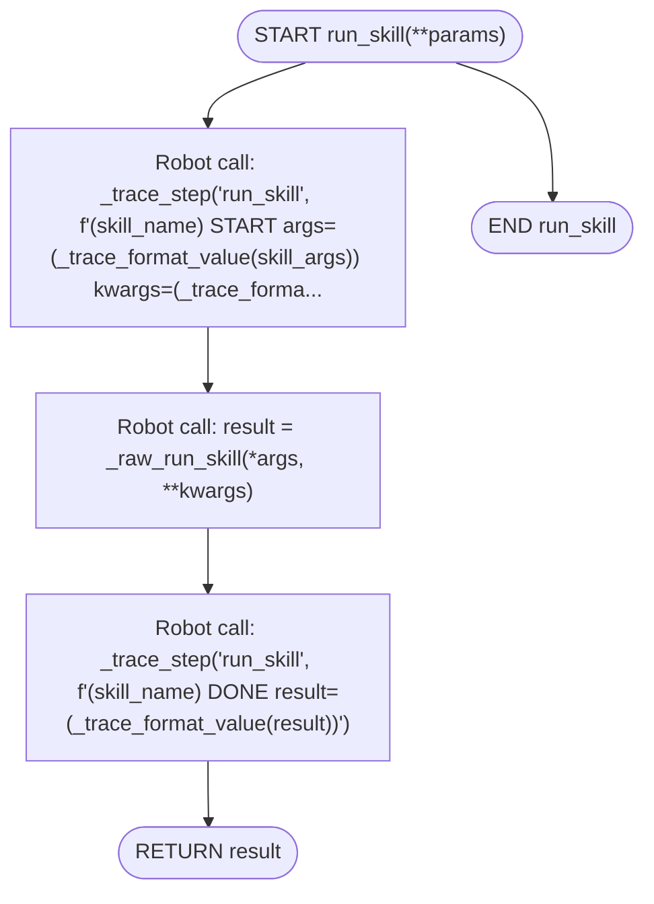
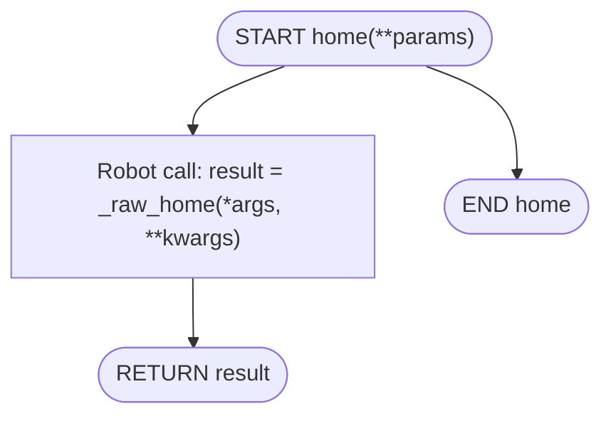
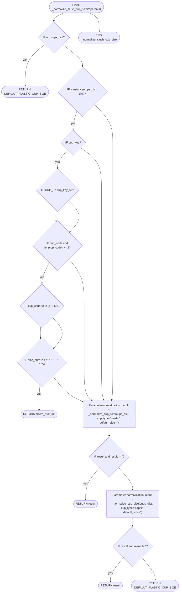

# `slush.py` flowcharts

- Sequence/exported functions: 2
- Support/helper functions: 3

## Sequence/exported functions

### `get_slush`

- **Mermaid file:** [../mermaid/slush/get_slush.mmd](../mermaid/slush/get_slush.mmd)
- **Parameter scenarios observed:** `dispenser`, `ingredients.cups / cups / size / cup_size`, `premixes`
- **Branch/decision scenarios:**
  - `not dispenser`
  - `cup_size not in ("7oz", "9oz", "12oz", "16oz") or dispenser not in ("1", "2")`
  - `not dispense_plastic_cup(cups={cup_code: 1.0})`
  - `not ok(run_skill("gotoJ_deg", *SLUSH_PARAMS['navigation']['intermediate']))`
  - `not ok(run_skill("gotoJ_deg", *SLUSH_PARAMS['navigation']['slush_area']))`
  - `dispenser == "2"`
  - `not ok(dispenser_result)`
  - `premixes`
  - `not ok(run_skill("set_gripper_position", GRIPPER_RELEASE_GENTLE, GRIPPER_HOLD_LOOSE))`
  - `not ok(run_skill("gotoJ_deg", *SLUSH_PARAMS['dispenser_1']['intermediate']))`
  - `not ok(run_skill("set_gripper_position", GRIPPER_RELEASE_GENTLE, GRIPPER_HOLD_LOOSE))`

### `place_slush`

- **Mermaid file:** [../mermaid/slush/place_slush.mmd](../mermaid/slush/place_slush.mmd)
- **Parameter scenarios observed:** `dispenser`, `ingredients.cups / cups / size / cup_size`, `position.cup_position / stage`, `premixes`
- **Branch/decision scenarios:**
  - `not dispenser`
  - `cup_size not in ("7oz", "9oz", "12oz", "16oz") or dispenser not in ("1", "2")`
  - `not ok(run_skill("set_gripper_position", GRIPPER_RELEASE_GENTLE, gripper_positions[cup_size]))`
  - `dispenser == "2"`
  - `not ok(retreat_result)`
  - `not home(position="north")`
  - `not place_plastic_cup_station(position={'cup_position': int(stage)}, cups={cup_code: 1.0})`
  - `premixes`
  - `not ok(run_skill("gotoJ_deg", *SLUSH_PARAMS['dispenser_1']['intermediate']))`
  - `not ok(run_skill("gotoJ_deg", *SLUSH_PARAMS['navigation']['slush_area']))`

```mermaid
flowchart TD
  N0(["START place_slush(**params)"])
  N1["Call: _trace_step('place_slush', 'START')"]
  N2["Nested helper defined: ok()"]
  N3["Parameter/normalization: cup_position = _extract_cup_position(params)"]
  N4["Parameter/normalization: cups_dict = _extract_cups_dict(params)"]
  N5["Parameter/normalization: cup_size = _normalize_slush_cup_size(cups_dict)"]
  N6["Parameter/normalization: dispenser = params.get('dispenser')"]
  N7{"IF not dispenser?"}
  N8["Call: _trace_step('place_slush', 'no dispenser provided; deriving from premix')"]
  N9["Parameter/normalization: premixes = params.get('premixes', ())"]
  N10{"IF premixes?"}
  N11{"IF cup_size not in ('7oz', '9oz', '12oz', '16oz') or dispenser not in ('1', '2')?"}
  N12(["RETURN _fail(f'invalid cup_size=(cup_size) dispenser=(dispenser)')"])
  N13["Robot call: run_skill('set_speed_factor', SPEED_NORMAL)"]
  N14{"IF not ok(run_skill('set_gripper_position', GRIPPER_RELEASE_GENTLE, gripper_positions(cup_size)))?"}
  N15(["RETURN False"])
  N16["Robot call: run_skill('sync')"]
  N17{"IF dispenser == '2'?"}
  N18["Robot call: retreat_result = run_skill('gotoJ_deg', *SLUSH_PARAMS('dispenser_2')('retreat'))"]
  N19["Robot call: retreat_result = run_skill('gotoJ_deg', *SLUSH_PARAMS('dispenser_1')('retreat'))"]
  N20{"IF not ok(run_skill('gotoJ_deg', *SLUSH_PARAMS('dispenser_1')('intermediate')))?"}
  N21(["RETURN False"])
  N22{"IF not ok(run_skill('gotoJ_deg', *SLUSH_PARAMS('navigation')('slush_area')))?"}
  N23(["RETURN False"])
  N24{"IF not ok(retreat_result)?"}
  N25(["RETURN False"])
  N26{"IF not home(position='north')?"}
  N27(["RETURN False"])
  N28{"IF not place_plastic_cup_station(position=('cup_position': int(stage)), cups=(cup_code: 1.0))?"}
  N29(["RETURN False"])
  N30(["RETURN True"])
  N31(["END place_slush"])
  N0 --> N1
  N1 --> N2
  N2 --> N3
  N3 --> N4
  N4 --> N5
  N5 --> N6
  N6 --> N7
  N7 -- "yes" --> N8
  N8 --> N9
  N9 --> N10
  N10 --> N11
  N10 --> N11
  N7 --> N11
  N11 -- "yes" --> N12
  N11 --> N13
  N13 --> N14
  N14 -- "yes" --> N15
  N14 --> N16
  N16 --> N17
  N17 -- "yes" --> N18
  N17 -- "no" --> N19
  N19 --> N20
  N20 -- "yes" --> N21
  N20 --> N22
  N22 -- "yes" --> N23
  N18 --> N24
  N22 --> N24
  N24 -- "yes" --> N25
  N24 --> N26
  N26 -- "yes" --> N27
  N26 --> N28
  N28 -- "yes" --> N29
  N28 --> N30
  N0 --> N31
```

## Support/helper functions

### `run_skill`

- **Mermaid file:** [../mermaid/slush/run_skill.mmd](../mermaid/slush/run_skill.mmd)
- **Parameter scenarios observed:** none directly read

### `home`

- **Mermaid file:** [../mermaid/slush/home.mmd](../mermaid/slush/home.mmd)
- **Parameter scenarios observed:** none directly read

### `_normalize_slush_cup_size`

- **Mermaid file:** [../mermaid/slush/_normalize_slush_cup_size.mmd](../mermaid/slush/_normalize_slush_cup_size.mmd)
- **Parameter scenarios observed:** none directly read
- **Branch/decision scenarios:**
  - `not cups_dict`
  - `isinstance(cups_dict, dict)`
  - `result and result != ''`
  - `result and result != ''`
  - `cup_key`
  - `'CUP_' in cup_key_str`
  - `cup_code and len(cup_code) >= 2`
  - `cup_code[0] in ('H', 'C')`
  - `size_num in ('7', '9', '12', '16')`

